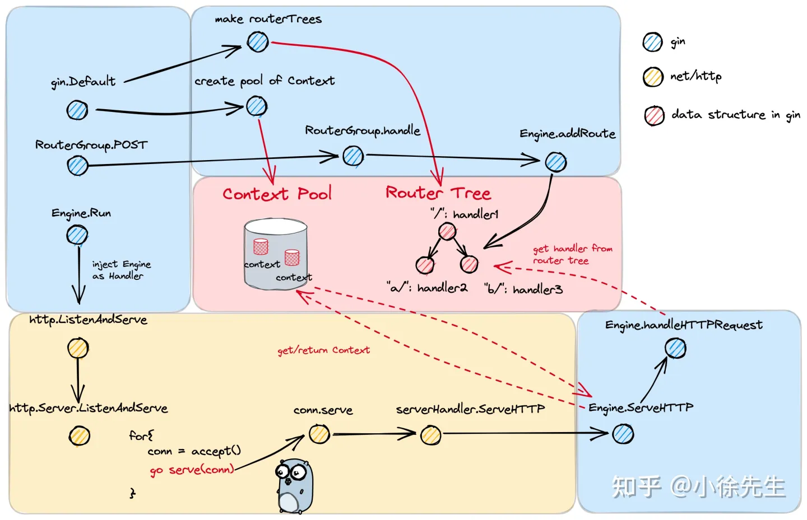
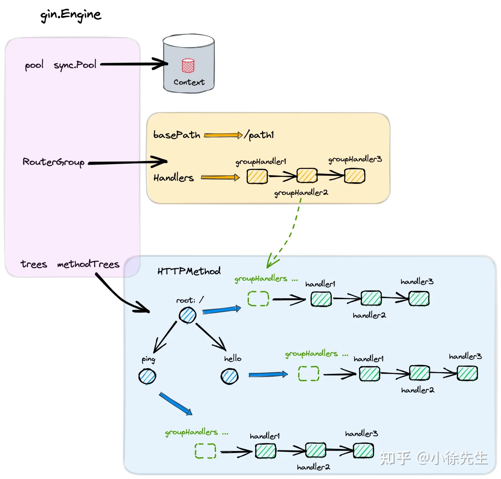
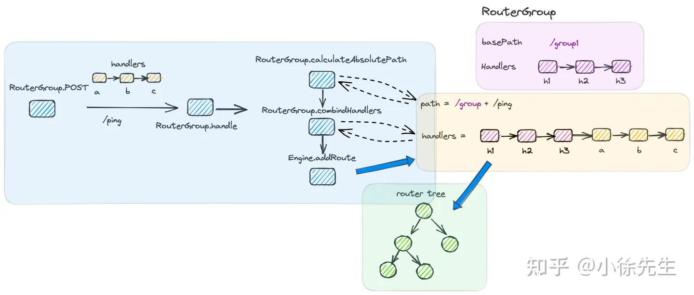
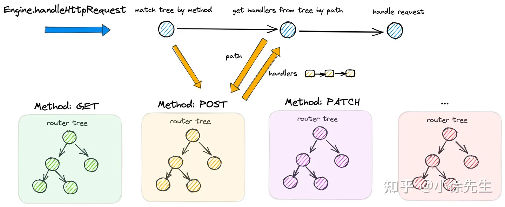
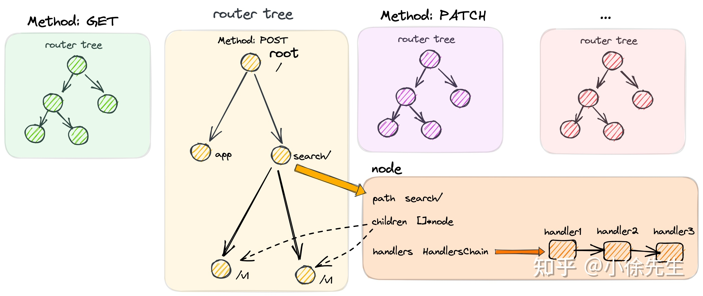
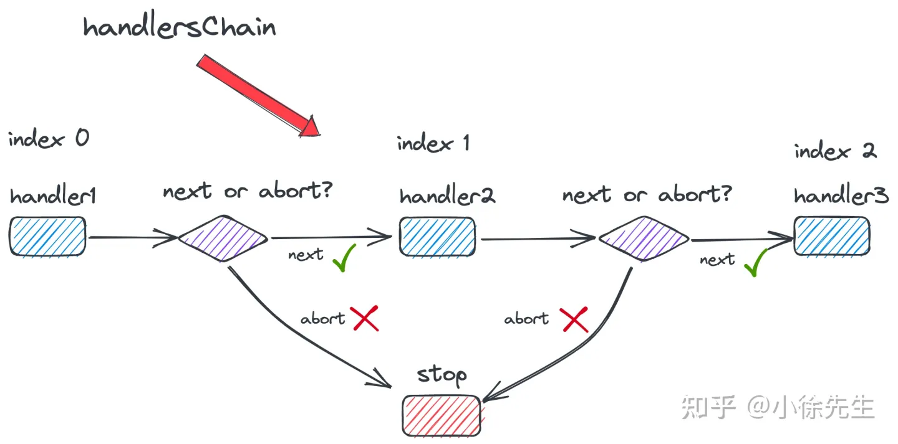
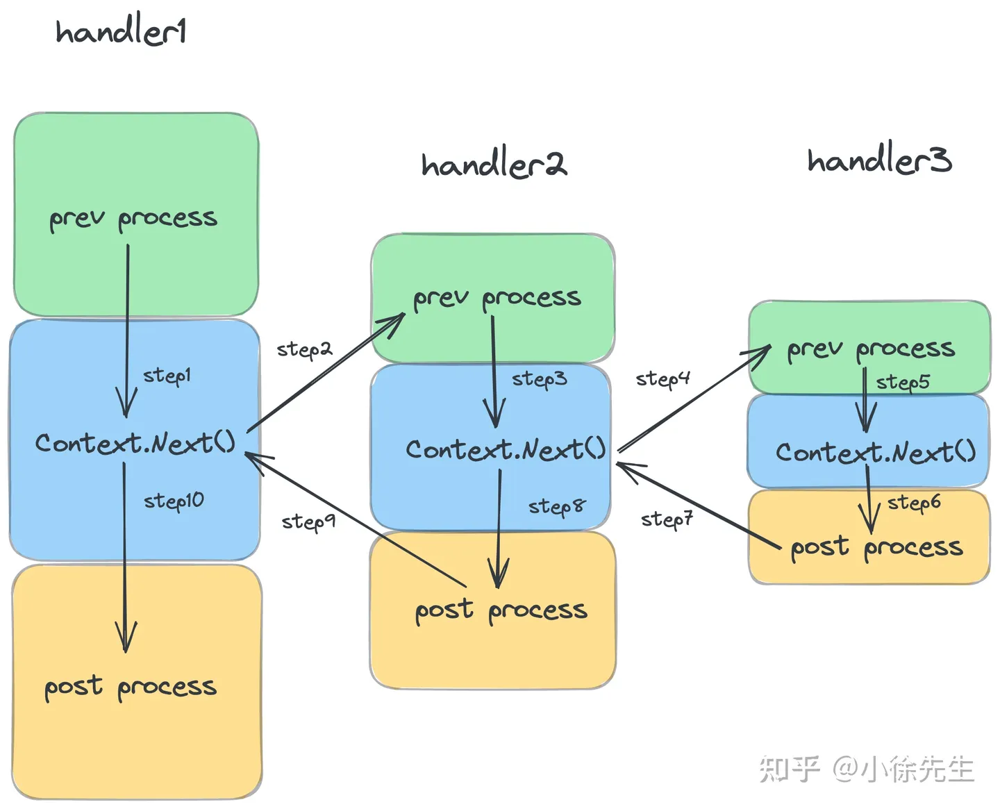

# gin
PS:前缀树代码还未全部理解
## 框架
### 和net的关系
可以看出，在 net/http 的既定框架下，gin 所做的是提供了一个 gin.Engine 对象作为 Handler 注入其中，从而实现路由注册/匹配、请求处理链路的优化.

### 核心数据结构


Engine 为 Gin 中构建的 HTTP Handler，其实现了 net/http 包下 Handler interface 的抽象方法： Handler.ServeHTTP，因此可以作为 Handler 注入到 net/http 的 Server 当中.
```Go
type Engine struct {
    // 路由组
	RouterGroup
	RedirectTrailingSlash bool
	RedirectFixedPath bool
	HandleMethodNotAllowed bool
	ForwardedByClientIP bool
	AppEngine bool
	UseRawPath bool
	UnescapePathValues bool
	RemoveExtraSlash bool
	RemoteIPHeaders []string
	TrustedPlatform string
	MaxMultipartMemory int64
	UseH2C bool
	ContextWithFallback bool
	delims           render.Delims
	secureJSONPrefix string
	HTMLRender       render.HTMLRender
	FuncMap          template.FuncMap
	allNoRoute       HandlersChain
	allNoMethod      HandlersChain
	noRoute          HandlersChain
	noMethod         HandlersChain
    //context 对象池
	pool             sync.Pool
    // 方法路由树
	trees            methodTrees
	maxParams        uint16
	maxSections      uint16
	trustedProxies   []string
	trustedCIDRs     []*net.IPNet
}

type RouterGroup struct {
	Handlers HandlersChain
	basePath string
	engine   *Engine
	root     bool
}
type HandlersChain []HandlerFunc

// net/http 包下的 Handler interface
type Handler interface {
    ServeHTTP(ResponseWriter, *Request)
}
type HandlerFunc func(*Context)


func (engine *Engine) ServeHTTP(w http.ResponseWriter, req *http.Request) {
    ...
}
```
RouterGroup 是路由组的概念，其中的配置将被从属于该路由组的所有路由复用：

    Handlers：路由组共同的 handler 处理函数链. 组下的节点将拼接 RouterGroup 的公用 handlers 和自己的 handlers，组成最终使用的 handlers 链
    basePath：路由组的基础路径. 组下的节点将拼接 RouterGroup 的 basePath 和自己的 path，组成最终使用的 absolutePath
    engine：指向路由组从属的 Engine
    root：标识路由组是否位于 Engine 的根节点. 当用户基于 RouterGroup.Group 方法创建子路由组后，该标识为 false

HandlersChain 是由多个路由处理函数 HandlerFunc 构成的处理函数链. 在使用的时候，会按照索引的先后顺序依次调用 HandlerFunc.

## 初始化engine
```Go
func New() *Engine {
	debugPrintWARNINGNew()
	engine := &Engine{
		RouterGroup: RouterGroup{
			Handlers: nil,
			basePath: "/",
			root:     true,//根路由
		},
		FuncMap:                template.FuncMap{},
		RedirectTrailingSlash:  true,
		RedirectFixedPath:      false,
		HandleMethodNotAllowed: false,
		ForwardedByClientIP:    true,
		RemoteIPHeaders:        []string{"X-Forwarded-For", "X-Real-IP"},
		TrustedPlatform:        defaultPlatform,
		UseRawPath:             false,
		RemoveExtraSlash:       false,
		UnescapePathValues:     true,
		MaxMultipartMemory:     defaultMultipartMemory,
        //9种method路由树
		trees:                  make(methodTrees, 0, 9),
		delims:                 render.Delims{Left: "{{", Right: "}}"},
		secureJSONPrefix:       "while(1);",
		trustedProxies:         []string{"0.0.0.0/0", "::/0"},
		trustedCIDRs:           defaultTrustedCIDRs,
	}
	engine.RouterGroup.engine = engine
    //默认的gin.Context的构造方法,对象吃pool中没有context实例会使用该构造函数构造
	engine.pool.New = func() any {
		return engine.allocateContext(engine.maxParams)
	}
	return engine
}
```
## 中间件注册
```Go
func (engine *Engine) Use(middleware ...HandlerFunc) IRoutes {
	engine.RouterGroup.Use(middleware...)
	engine.rebuild404Handlers()
	engine.rebuild405Handlers()
	return engine
}
// Use adds middleware to the group, see example code in GitHub.
func (group *RouterGroup) Use(middleware ...HandlerFunc) IRoutes {
	group.Handlers = append(group.Handlers, middleware...)
	return group.returnObj()
}

func (engine *Engine) rebuild404Handlers() {
	engine.allNoRoute = engine.combineHandlers(engine.noRoute)
}

func (engine *Engine) rebuild405Handlers() {
	engine.allNoMethod = engine.combineHandlers(engine.noMethod)
}
```
## handler注册

```Go
func (group *RouterGroup) POST(relativePath string, handlers ...HandlerFunc) IRoutes {
	return group.handle(http.MethodPost, relativePath, handlers)
}
func (group *RouterGroup) handle(httpMethod, relativePath string, handlers HandlersChain) IRoutes {
	//计算绝对路径
	absolutePath := group.calculateAbsolutePath(relativePath)
	//获取中间件,拼接上所要注册的handler,获取完整的处理链
	handlers = group.combineHandlers(handlers)
	//注册
	group.engine.addRoute(httpMethod, absolutePath, handlers)
	return group.returnObj()
}
func (group *RouterGroup) calculateAbsolutePath(relativePath string) string {
	return joinPaths(group.basePath, relativePath)
}
func joinPaths(absolutePath, relativePath string) string {
	if relativePath == "" {
		return absolutePath
	}

	finalPath := path.Join(absolutePath, relativePath)
	if lastChar(relativePath) == '/' && lastChar(finalPath) != '/' {
		return finalPath + "/"
	}
	return finalPath
}
func (group *RouterGroup) combineHandlers(handlers HandlersChain) HandlersChain {
	finalSize := len(group.Handlers) + len(handlers)
	assert1(finalSize < int(abortIndex), "too many handlers")
	mergedHandlers := make(HandlersChain, finalSize)
	copy(mergedHandlers, group.Handlers)
	copy(mergedHandlers[len(group.Handlers):], handlers)
	return mergedHandlers
}
const abortIndex int8 = math.MaxInt8 >> 1
```

## 服务启动
```Go
func (engine *Engine) Run(addr ...string) (err error) {
	defer func() { debugPrintError(err) }()

	if engine.isUnsafeTrustedProxies() {
		debugPrint("[WARNING] You trusted all proxies, this is NOT safe. We recommend you to set a value.\n" +
			"Please check https://pkg.go.dev/github.com/gin-gonic/gin#readme-don-t-trust-all-proxies for details.")
	}

	address := resolveAddress(addr)
	debugPrint("Listening and serving HTTP on %s\n", address)
	//直接调用http的ListenAndServer发法,基于IO多路复用和主动轮询,阻塞
	err = http.ListenAndServe(address, engine.Handler())
	return
}

//最终执行
func (srv *Server) Serve(l net.Listener) error {
	...
	ctx := context.WithValue(baseCtx, ServerContextKey, srv)
	for {
		rw, err := l.Accept()
		...
		connCtx := ctx
		...
		c := srv.newConn(rw)
		c.setState(c.rwc, StateNew, runHooks) // before Serve can return
		go c.serve(connCtx)
	}
}

func (c *conn) serve(ctx context.Context) {
	...
	serverHandler{c.server}.ServeHTTP(w, w.req)
	...
}

func (sh serverHandler) ServeHTTP(rw ResponseWriter, req *Request) {
	handler := sh.srv.Handler
	//提供了handler,因此不会采用默认的DefaultServeMux
	if handler == nil {
		handler = DefaultServeMux
	}
	if req.RequestURI == "*" && req.Method == "OPTIONS" {
		handler = globalOptionsHandler{}
	}

	....
	handler.ServeHTTP(rw, req)//最终执行gin的handler的ServerHTTP方法
}
```
## 处理请求
```Go
func (engine *Engine) ServeHTTP(w http.ResponseWriter, req *http.Request) {
	//从engine的对象池中获取一个上下文
	c := engine.pool.Get().(*Context)
	//重置,初始化
	c.writermem.reset(w)
	c.Request = req
	c.reset()
	//处理
	engine.handleHTTPRequest(c)
	//context放回
	engine.pool.Put(c)
}
func (w *responseWriter) reset(writer http.ResponseWriter) {
	w.ResponseWriter = writer
	w.size = noWritten
	w.status = defaultStatus
}
const (
	noWritten     = -1
	defaultStatus = http.StatusOK
)
func (engine *Engine) handleHTTPRequest(c *Context) {
	httpMethod := c.Request.Method
	rPath := c.Request.URL.Path
	unescape := false
	if engine.UseRawPath && len(c.Request.URL.RawPath) > 0 {
		rPath = c.Request.URL.RawPath
		unescape = engine.UnescapePathValues
	}

	if engine.RemoveExtraSlash {
		rPath = cleanPath(rPath)
	}

	// Find root of the tree for the given HTTP method
	t := engine.trees
	for i, tl := 0, len(t); i < tl; i++ {
		if t[i].method != httpMethod {
			continue
		}
		root := t[i].root
		// Find route in tree
		value := root.getValue(rPath, c.params, c.skippedNodes, unescape)
		if value.params != nil {
			c.Params = *value.params
		}
		if value.handlers != nil {
			//将查找出的处理链handler挂载到c的handlers,value也是
			c.handlers = value.handlers
			c.fullPath = value.fullPath
			//便利执行handler chain
			c.Next()
			c.writermem.WriteHeaderNow()
			return
		}
		if httpMethod != http.MethodConnect && rPath != "/" {
			if value.tsr && engine.RedirectTrailingSlash {
				redirectTrailingSlash(c)
				return
			}
			if engine.RedirectFixedPath && redirectFixedPath(c, root, engine.RedirectFixedPath) {
				return
			}
		}
		break
	}

	if engine.HandleMethodNotAllowed {
		for _, tree := range engine.trees {
			if tree.method == httpMethod {
				continue
			}
			if value := tree.root.getValue(rPath, nil, c.skippedNodes, unescape); value.handlers != nil {
				c.handlers = engine.allNoMethod
				serveError(c, http.StatusMethodNotAllowed, default405Body)
				return
			}
		}
	}
	c.handlers = engine.allNoRoute
	serveError(c, http.StatusNotFound, default404Body)
}
```


	根据 http method 取得对应的 methodTree
	根据 path 从 methodTree 中找到对应的 handlers 链
	将 handlers 链注入到 gin.Context 中，通过 Context.Next 方法按照顺序遍历调用 handler

## 路由

### 压缩前缀树
前缀树又称 trie 树，是一种基于字符串公共前缀构建索引的树状结构，核心点包括：

	除根节点之外，每个节点对应一个字符
	从根节点到某一节点，路径上经过的字符串联起来，即为该节点对应的字符串
	尽可能复用公共前缀，如无必要不分配新的节点

压缩前缀树又称基数树或 radix 树，是对前缀树的改良版本，优化点主要在于空间的节省，核心策略体现在：

	倘若某个节点是其父节点的唯一孩子，且没有以父节点结尾的单词
	则合并子节点和父节点

### 为什么不使用map

与压缩前缀树相对的就是使用 hashmap，以 path 为 key，handlers 为 value 进行映射关联，这里选择了前者的原因在于：

	path 匹配时不是完全精确匹配，比如末尾 ‘/’ 符号的增减、全匹配符号 '*' 的处理等，map 无法胜任（模糊匹配部分的代码于本文中并未体现，大家可以深入源码中加以佐证）
		'/ping'和'/ping/'其实是一致的
	路由的数量相对有限，对应数量级下 map 的性能优势体现不明显，在小数据量的前提下，map 性能甚至要弱于前缀树
	path 串通常存在基于分组分类的公共前缀，适合使用前缀树进行管理，可以节省存储空间
### 数据结构
在 Gin 路由树中还使用一种补偿策略，在组装路由树时，会将注册路由句柄数量更多的 child node 摆放在 children 数组更靠前的位置.

这是因为某个链路注册的 handlers 句柄数量越多，一次匹配操作所需要话费的时间就越长，被匹配命中的概率就越大，因此应该被优先处理.

```Go
type engine struct{
	...
	trees methodTrees
	...
}
//实际的节点
type node struct {
	//节点的相对路径，拼接上 RouterGroup 中的 basePath 作为前缀后才能拿到完整的路由 path
	path      string
	//由各个子节点 path 首字母组成的字符串，子节点顺序会按照途径的路由数量 priority进行排序
	indices   string
	wildChild bool
	nType     nodeType
	//途径本节点的路由数量，反映出本节点在父节点中被检索的优先
	priority  uint32
	children  []*node // child nodes, at most 1 :param style node at the end of the array
	handlers  HandlersChain
	fullPath  string
}

type methodTree struct {
	method string
	root   *node
}

type methodTrees []methodTree
```
### 路由插入
https://zhuanlan.zhihu.com/p/611116090

### 路由检索
https://zhuanlan.zhihu.com/p/611116090

## gin.Context
并发安全
```Go
type Context struct {
	writermem responseWriter
	Request   *http.Request
	Writer    ResponseWriter
	Params   Params
	handlers HandlersChain
	index    int8
	fullPath string
	engine       *Engine
	params       *Params
	skippedNodes *[]skippedNode
	// This mutex protects Keys map.
	mu sync.RWMutex
	// Keys is a key/value pair exclusively for the context of each request.
	Keys map[string]any
	// Errors is a list of errors attached to all the handlers/middlewares who used this context.
	Errors errorMsgs
	// Accepted defines a list of manually accepted formats for content negotiation.
	Accepted []string
	// queryCache caches the query result from c.Request.URL.Query().
	queryCache url.Values
	// formCache caches c.Request.PostForm, which contains the parsed form data from POST, PATCH,
	// or PUT body parameters.
	formCache url.Values
	// SameSite allows a server to define a cookie attribute making it impossible for
	// the browser to send this cookie along with cross-site requests.
	sameSite http.SameSite
}

```
	Request/Writer：http 请求和响应的 reader、writer 入口
	handlers：本次 http 请求对应的处理函数链
```Go
	//将查找出的处理链handler挂载到c的handlers,value也是
	c.handlers = value.handlers
	c.fullPath = value.fullPath
	//便利执行handler chain
	c.Next()	
	...
	return
```
	index：当前的处理进度，即处理链路处于函数链的索引位置
	engine：Engine 的指针
	mu：用于保护 map 的读写互斥锁
	Keys：缓存 handlers 链上共享数据的 map


gin 中采用对象池 sync.Pool 进行 Context 的缓存复用，处理流程如下：

	http 请求到达时，从 pool 中获取 Context，倘若池子已空，通过 pool.New 方法构造新的 Context 补上空缺
	http 请求处理完成后，将 Context 放回 pool 中，用以后续复用
	sync.Pool 并不是真正意义上的缓存，将其称为回收站或许更加合适，放入其中的数据在逻辑意义上都是已经被删除的，但在物理意义上数据是仍然存在的，这些数据可以存活两轮 GC 的时间，在此期间倘若有被获取的需求，则可以被重新复用.

```Go

func (engine *Engine) allocateContext(maxParams uint16) *Context {
	v := make(Params, 0, maxParams)
	skippedNodes := make([]skippedNode, 0, engine.maxSections)
	return &Context{engine: engine, params: &v, skippedNodes: &skippedNodes}
}
```
gin.Context 分配与回收的时机是在 gin.Engine 处理 http 请求的前后，位于 Engine.ServeHTTP 方法当中：

	从池中获取 Context
	重置 Context 的内容，使其成为一个空白的上下文
	调用 Engine.handleHTTPRequest 方法处理 http 请求
	请求处理完成后，将 Context 放回池中

```Go
func (engine *Engine) ServeHTTP(w http.ResponseWriter, req *http.Request) {
    // 从对象池中获取一个 context
    c := engine.pool.Get().(*Context)
    // 重置/初始化 context
    c.writermem.reset(w)
    c.Request = req
    c.reset()
    // 处理 http 请求
    engine.handleHTTPRequest(c)
    
    // 把 context 放回对象池
    engine.pool.Put(c)
}
```

## 调用链
使用Abort主动终止

在中间件函数中没有主动调用Next方法,则会顺序执行
一旦主动调用,会产生压栈的效果,如下图:


```Go
func (c *Context) Next() {
	c.index++//初始化为-1
	for c.index < int8(len(c.handlers)) {
		c.handlers[c.index](c)
		c.index++
	}
const abortIndex int8 = math.MaxInt8 >> 1

func (c *Context) Abort() {
	c.index = abortIndex
}
```