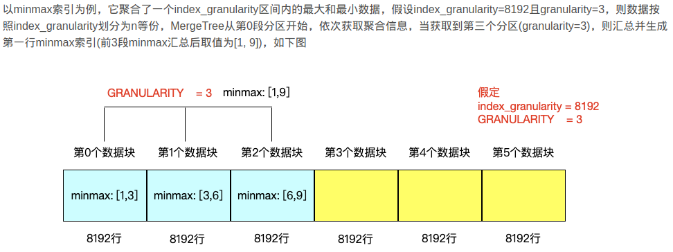

# ClickHouse
https://www.cnblogs.com/dataleaner/p/17801527.html
https://www.cnblogs.com/wan-ming-zhu/p/18093267
https://cloud.tencent.com/developer/article/1987040
https://www.cnblogs.com/wlstudy09/p/17479229.html

## docker
docker run -d --name clickhouse --ulimit nofile=262144:262144 -p 8123:8123 -p 9000:9000 -p 9009:9009  -v /home/hydra/Project/ClickHouseConfig/users.xml:/etc/clickhouse-server/users.xml -v /home/hydra/Project/ClickHouseConfig/config.xml:/etc/clickhouse-sesrver/config.xml  yandex/clickhouse-server
## 架构
## 集群安装

## 数据类型
### 整型号
int8 int16 int32 int64
uint8 uint16 uint32 uint64
### 浮点型
float32 float64
### 布尔
可以用uint8 0,1表示
### Decimal
保证精度

Decimal32(s) 一共9位,s表示小数位数
Decimal64(s) 一共18位,s表示小数位数
Decimal128(s) 一共38位,s表示小数位数

### 字符串
FixedString(N) 固定长度
String 
### 枚举
Enum8
Enum16
```SQL
CREATE TABLE T_ENU
(
    x Enum8('hello'=1,'world'=2)
)
ENGINE=TinyLog
INSERT INTO T_ENU VALUES ('hello', 'world');
SELECT * FROM T_ENU;
SELECT CAST(x,'Int8') FROM T_ENU;
```
### 时间
不建议保存为字符串
Date
Datetime
Datetime64
### 数组
Array(T) T为任意类型
不建议多维度数组,如在MergeTree中存储多维数组
```SQL
SELECT array(1,2,3) AS x, toTypeName(x);--将array(1,2,3)定义为x,查询其类型
SELECT [1,2,3] AS x, toTypeName(x);--将array(1,2,3)定义为x,查询其类型
```
### NULL
不建议使用空值,对性能产生影响
```SQL
CREATE TABLE T_NULL
(
    x Int8
    y Nullable(Int8)
)
ENGINE=TinyLog
Insert Into T_NULL VALUES(1,NULL);
```
## 表引擎
引擎名词大小写敏感
### TinyLog
不常用
列文件
持久化到磁盘
不支持索引
没有并发控制
用于保存少量数据 
### Memory
不常用
数据未压缩
保存在内存
性能高
数据量不能太大
不支持索引
### MergeTree
常用
支持索引
支持分区
采用了类似LSM Tree 的结构

```SQL
CREATE TABLE T
(
    id UInt32,
    uname String,
    create_time DateTime
)
ENGINE=MergeTree
PARTITION BY toYYYYMMDD(create_time) --可选
PRIMARY KEY id --可选 
ORDER BY (id, uname) --必须
```

### ReplaceMergeTree
存储特性完全继承MergeTree 
根据order by 字段去重
在合并阶段进行,后台运行时候的去重时机未知
去重只发生在分区内部,不能跨分区去重
```SQL
CREATE TABLE T
(
    id UInt32,
    uname String,
    create_time DateTime
)
ENGINE=ReplacingMergeTree(create_time)
PARTITION BY toYYYYMMDD(create_time) --可选
PRIMARY KEY id --可选 
ORDER BY (id, uname) --必须
```
通过传入字段作为版本字段,在ORDER BY 的参数相同时候(数据重复),保留版本最大的字段对应的数据,如果版本字段一致,则保留最后插入的数据,如果不传该版本字段,则按照插入顺序,保留最后插入的数据
### SummingMergeTree
分区内聚合
合并阶段进行聚合
聚合字段必须是数字,且不能是ORDER BY 字段
```SQL
CREATE TABLE T
(
    id UInt32,
    uname String,
    value UInt32,
    create_time DateTime
)
ENGINE=SummingMergeTree(value)
PARTITION BY toYYYYMMDD(create_time) --可选
PRIMARY KEY id --可选 
ORDER BY (id, uname) --必须
```
在同一个分区内,根据ORDER BY的字段进行分组,再聚合,除了聚合字段以及ORDER BY字段,其他字段都取的是最先插入的数据的字段
如:

    id uname value info create_time
    1  1     100   1    2022-03-02 10:00:00
    1  1     100   2    2022-03-02 11:00:00
    1  1     300   3    2022-03-03 13:00:00

    聚合后的结果为:
    id uname value info create_time
    1  1     200   1    2022-03-02 10:00:00

    1  1     300   3    2022-03-03 13:00:00

## order by
mergeTree索引中的必填项
比primary key还要重要
决定了分区内数据排序规则

## primary key
存在于mergeTree系列引擎
生成的数据存放于primary.idx

    primary.idx内的数据常驻于内存,取用速度非常快
非必填
决定了一级索引的生成
不要求一级索引字段全局唯一,这个也是和MYSQL的最大的区别
主键一定要是order by的前缀字段
如:

    order by 为 id,name
    则主键为 id 或者id,name 不能间隔
### 一级索引(主键)
稀疏索引

    相比于稠密索引,每个索引标记对应于一段数据

通过 index granularity 指定索引粒度,默认值为8192
一级索引（primary key index）是MergeTree数据存储底层的默认索引。
它由数据表中定义的主键字段构成，通常是一个或多个列的组合

    如果是多个列作为索引,则将多个列按照index granularity的间隔取出作为索引,且按照顺序紧密排列,写入primary.idx
一级索引的主要作用是支持MergeTree表的数据切分（data sharding）
ClickHouse根据不同的一级索引值将数据分布到不同的分区，并在查询时优化数据访问，减少不必要的磁盘读取。
标记文件中保存了 data.bin 文件中数据的偏移量信息，并且标记文件（或者说偏移量）与稀疏索引对齐，因此想要通过索引找到具体的数据还需要借助 data.mrk3 中的偏移量。

## 二级索引
跳数索引
默认关闭,使用的时候需要手动声明

|关键字                     |说明|
|--------------------------|---|
|index name                |索引别名|
|Index expression          |索引源字段|
|Type                      |minmax, set, bloom filter,map|
|GRANULARITY               |索引粒度 ，如ClickHouse 默认稀疏索引默认是8192 我理解 8192*GRANULARITY就是 skip_index.mrk 的block 大小|
|skpidx{index_name}.idx    |which contains the ordered expression values|
|skpidx{index_name}.mrk2   |which contains the corresponding offsets into the associated data column files.|
```SQL
CREATE TABLE T
(
    id UInt32,
    name string,
    create_time DateTime
    INDEX date_idx create_time TYPE bloom_filter GRANULARITY 64 
)
ENGINE=MergeTree
PARTITION BY toYYYYMMDD(create_time) --可选
PRIMARY KEY id --可选 
ORDER BY (id, name) --必须
```
申明后会产生额外的生成索引与标记文件

    skip_idx_xxx.idx
    skip_idx_xxx.mrk

ClickHouse的MergeTree中:

    一级索引主要用于数据的物理排序和数据切分，支持范围查询和按顺序读取数据
    二级索引主要用于查询优化，提供额外的查询功能和过滤条件。
ClickHouse可以同时使用多个二级索引，但是每个MergeTree表只能有一个一级索引。
二级索引（secondary index）是一种辅助索引，可以提供额外的查询优化和过滤功能。
二级索引并不影响数据的物理排序。

由数据按索引粒度分割后的每部分在指定表达式上的汇总信息组成，这些汇总信息有助于用where条件过滤时跳过不满足的数据，从而减少select查询从磁盘读取的数据量以及数据扫描的范围。

二级索引生成规则按照index_granularity粒度间隔将数据划分为n段，总共有[0, n-1]个区间(n = total_rows / index_granularity，向上取整)。根据索引定义声明，从0区间开始，一次按照index_granularity粒度从数据中获取聚合信息，每次向前移动1步(n + 1)，聚合信息逐步累加。这些区间每隔granularity生成一行跳数索引数据。
### 二级索引举例

对存量数据创建索引:

    ALTER TABLE table_name ADD INDEX index_name xxx TYPE tokenbf_v1(30720, 2, 0) GRANULARITY 1;
存量数据生效，需要执行物化操作：

    ALTER TABLE table_name MATERIALIZE INDEX index_name;

创建索引本身是一个轻量级操作，但物化操作是一个比较重的操作，虽然sql执行立即就结束了，但实际还在后台执行，可以通过
    
    SELECT * FROM system.mutations WHERE is_done = '0';
    来查看物化进度， 表中的数据越多，物化所需要的时间就越长。

通过EXPLAIN 查看

    explain indexes = 1 xxx
### 二级索引类型
minmax:

    minmax：minmax索引记录了一段数据内的最小值和最大值，用于快速跳过无用的数据区间
set:

    存储指定字段或表达式的唯一值，完整形式set(max_rows)，max_rows表示在一个index_granularity内，索引最多纪录的数据行数，如果max_rows=0，则表示无限制

ngrambf_v1： 

    根据长度进行分词
    ngrambf_v1 记录了数据块中n元短语的布隆表过滤器(简单来讲，布隆表过滤器本质是由仅包含0和1位值的列表组成，默认均为0，利用哈希函数对数据值进行处理，并将结果位置上对应位的值改为1，由于存在哈希冲突，所以只能判断不在列表中和可能在列表中)，只支持String和FixedString数据类型，可用于优化like、in、equals、notIn、notEquals的查询性能，完整形式为ngrambf_v1(n, size_of_bloom_filter_in_bytes, number_of_hash_functions, random_seed)，各参数含义为：

        n: token长度，依据n长度将数据切割为token短语
        size_of_bloom_filter_in_bytes: 布隆过滤器的大小
        number_of_hash_functions: 布隆过滤器中使用Hash函数的个数
        random_seed: Hash函数的随机种子

    INDEX c(ID, Code) TYPE ngrambf_v1(3, 256, 2, 0) GRANULARITY 5
    表示依照3的粒度将数据切割成短语token，token经过两个Hash函数映射后再被写入，布隆过滤器大小伟256字节

tokenbf_v1:
    
    这是按照token进行分词的布隆过滤器索引。它会将长文本中的单词按非字母数字字符（如空格、-，[]等）进行分词，每个分词就是一个token，然后将这个token映射到布隆过滤器的bitmap中。
    缺点:
        比较死板，如果查询的条件里有特殊字符，那么这个索引就会失效
        无法支持中文
    
    形式如：tokenbf_v1(size_of_bloom_filter_in_bytes, number_of_hash_functions, random_seed)，参数含义：

        size_of_bloom_filter_in_bytes: 布隆过滤器的大小
        number_of_hash_functions: 布隆过滤器中使用Hash函数的个数
        random_seed: Hash函数的随机种子

bloom_filter：

    bloom_filter([false_positive]);存储指定列的布隆过滤器。
    可选false_positive参数是从过滤器接收到误报响应的概率。可能的值：(0, 1)。默认值：0.025。

inverted:

    原理确实和ES的倒排索引类似 ，但分词逻辑仍然是和tobenbf_v1是一样的，也就是说它同样是针对non-alphanumeric进行分词的，同样不支持特殊字符和汉字的查询
## 数据存储方式
## 数据分区
mergeTree 系列引擎支持
通过PARTITION BY (xxx)指定,其中xxx为分区字段
默认为all,即不分区
不同类型数据对应的分区:

    整形，则分区ID的取值为指定的整形的值
    日期类型或者能转换为YYYYMMDD格式的整形，则直接按照整形的字符串数据，作为分区ID的取值
    其他类型：当为String,Float类型，则通过128位hash值作为分区ID的取值
    当分区键为元组的多个列时，分区ID按照上面的方式生成，多个分区ID之间通过“-”符号拼接。
### 分区命名规则
202103_1_1_0   => {PartitionID}_{MinBlockNum}_{MaxBlockNum}_{Level}

    PartitionID:分区ID，用户创建表时指定的。
    MinBlockNum:最小的数据块编号，这是一个整形的全局的自增长编号，当每创建一个分区目录时，计数就累加1。
    MaxBlockNum:最大的数据块编号。和MinBlockNum一样当分区创建的时候MaxBlockNum=MinBlockNum
    Level:合并的层级，某个分区被合并过的次数，不是全局累加的，对每一个创建的分区，其初始值均为0。之后，以分区为单位，如果相同的分区发生合并动作，则在相应的分区内计数累加1
### 分区合并过程
MergeTree会随着每一批次数据写入（一次insert语句）会成成一批新的分区目录。目录状态为激活(active=1)
即便不同批次写入的数据属于相同分区，也会生成不同的分区目录。所以对于同一个分区而言会存在多个分区目录的情况。
在写入之后的10~15分钟（默认是）会通过后台任务将数据同一分区的多个数据目录合并成一个目录。
已经存在的旧分区目录不会立即删除，目录状态是未激活状(active=0)
会在之后的8分钟（默认是）通过后台任务被删除。
也可以通过下述语句手动合并
```SQL
optimize table xxx partition yyy final;
optimize table xxx final;
```
## TTL
TTL即Time To Live ，表示数据存活的时间。
主键字段不能被声明TTL
INTERVAL 完整的操作包括：SECOND、MINUTE、HOUR、DAY、WEEK、MONTH、QUARTER、YEAR。
无论是列级别TTL，还是表级别TTL，一旦设置后，目前没有取消的方法。
在MergeTree中

    可以为某个列字段或整张表设置TTL。
    当时间到达时，如果是列字段级别的TTL，则会删除这列的数据；
    如果是表级别的TTL，满足过期时间的数据行将被整行删除；
    如果同时设置了列级别和表级别的TTL，则会以先到期的那个为主。

无论是列级别还是表级别的TTL，都需要依托某个DataTime或Date类型的字段，通过对这个时间字段的INTERVAL操作，来描述TTL的过期时间，例如：

    
```SQL    
CREATE TABLE xxx(
id UInt8,
name String,
age UInt8 ,
gender String  TTL create_time+INTERVAL 10 SECOND,
create_time DateTime
)engine=MergeTree
order by id;

CREATE TABLE xxx(
id UInt8,
name String,
age UInt8 ,
gender String,
create_time DateTime
)engine=MergeTree
order by id
TTL create_time+INTERVAL 10 SECOND;

ALTER TABLE xxx MODIFY COLUMN age type TTL create_time + INTERVAL 1 DAY;

ALTER TABLE xxx MODIFY TTL create_time +INTERVAL 3 DAY;
```
## 操作
### INSERT
表到表的插入:

    insert into xxx select x,y,z from yyy

### UPDATE DELETE

    称为Mutation查询(可变查询)
    重型操作(放弃原有数据的分区,重新新建分区),不支持事务
    Mutation语句分两步执行:
        1.新增数据/删除数据(新增分区),旧分区打上逻辑实效标签
        2.触发分区合并的时候,才会删除旧分区释放磁盘空间


    alter table xxx delete where zzz=yyy;
    alter table xxx update mmm=ttt where zzz=yyy;
    
    建议批量操作,不建议经常性的单条数据操作
    通过版本号,标志位操作

## 查询

    支持子查询
    支持CTE with 语句
    支持JOIN,但是JOIN无法使用缓存(避免使用JOIN)
    窗口函数
    不支持自定义函数
    GROUP BY 增加了