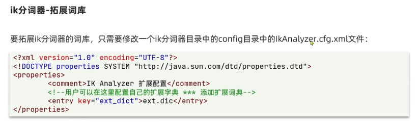
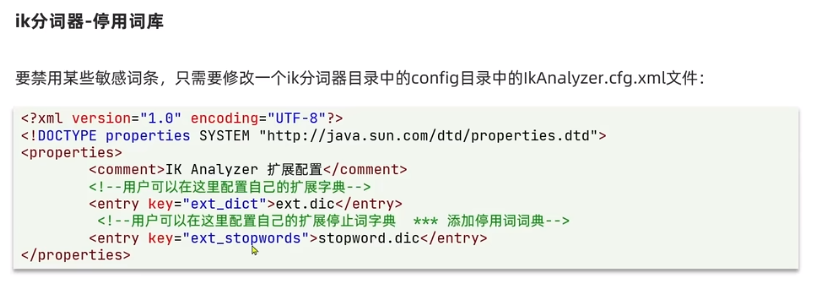
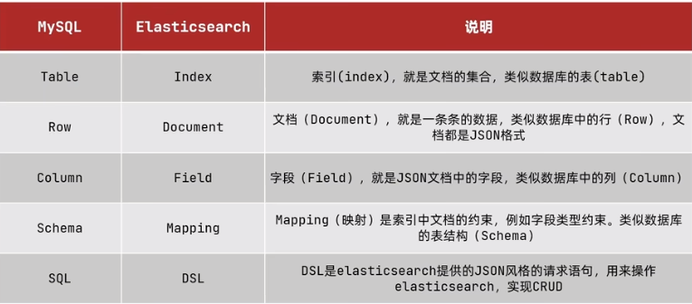
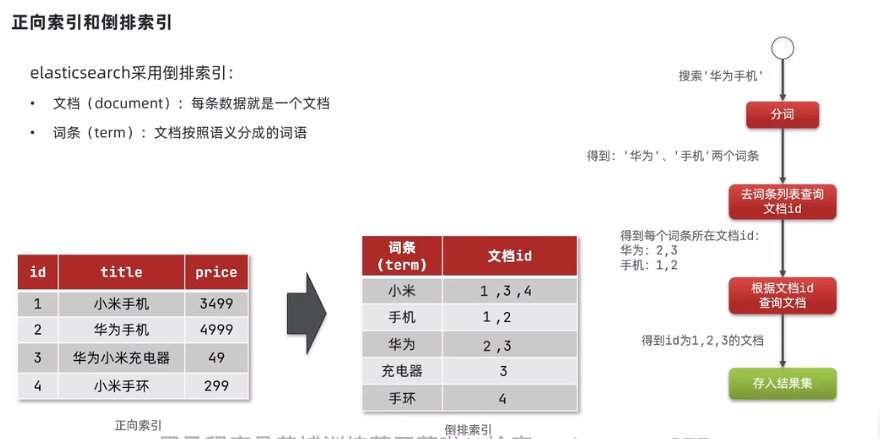

# ES
## 特点
海量数据的搜索,分析,计算
## docker 启动
### es
需要创建一个docker 网络
9200是外部访问接口
9300是集群通信接口

    -e "ES_JAVA_OPTS=-Xms512m -Xmx512m"
    -e "discovery.type=single-node"
    --network xxx
    -p 9200:9200
    -p 9300:9300
### es-head
拉取镜像
    
    docker pull mobz/elasticsearch-head:5

创建容器

    docker create --name elasticsearch-head -p 9100:9100 mobz/elasticsearch-head:5

启动容器
    
    docker start elasticsearch-head
### IK分词器
    针对es 7.7版本

    docker 内部安装
    /bin/elasticsearch-plugin  install https://github.com/medcl/elasticsearch-analysis-ik/releases/download/v7.7.0/elasticsearch-analysis-ik-7.7.0.zip

ik_max_word 最细粒度
ik_smart 最粗粒度


## 概念

文档:

    可以理解为一条数据(JSON)
索引:

    相同类型的文档集合
映射:

    索引中文档的字段约束信息,类似于表结构的约束



### 倒排索引


## 索引库的操作
### MAPPING
#### 类型
1.type 字段数据类型

    常见的类型有
    字符串:
        text
        keyword
    数值:
        long
        integer
        short
        byte
        double
        float
    布尔
        boolean
    日期
        date
    对象
        object
ES 没有数组类型,允许一个字段有多个值

2.index(针对该字段创建倒排索引)
    
    默认为True
3.analyzer使用哪种分词器
4.properties使用字段的子字段

    比如对象{
        "firstName": "xx",
        "lastName": "xxx"
    }
    可以指定使用哪个字段
5,copy_to字段,将当前的字段拷贝到某个字段,用于多个字段的联合搜索
如下,可以使用all字段搜索到email和personal_info的内容
```Json
{
    "all":{
        "type":"keyword",
        "analyzer":"ik_smart" 
        },
    "email":{
                "type":"keyword",
                "copy_to":"all",
            },
    "personal_info":{
                "type":"keyword",
                "copy_to":"all",
            }
}
```

#### 操作
##### 创建
```Json
put /info
{
    "mappings":{
        "properties":{
            "name":{
                "type":"object",
                "properties":{
                    "firstName":{
                        "type":"keyword",
                        "index":true
                    },
                    "lastName":{
                        "type":"keyword",
                        "index":true
                    }
                }
            },
            "email":{
                "type":"keyword",
                "index":false
            },
            "personal_info":{
                "type":"text",
                "analyzer":"ik_smart" 
            }
        }
    }
}
```
##### 修改

需要注意的是:

索引库和mapping一旦创建,就不能修改,但是能添加字段
```JSON
put /info/_mapping
{
    "properties":{
        "address":{
            "type":"text", 
        }
    }
}
```
###### 查询
get /info/_mapping
###### 删除
delete /info/_mapping
## 文档的操作
### 创建文档
post /索引库名/_mapping/_doc/文档ID

```JSON
post /info/_mapping/_doc/1
{
    "name":{
        "firstName":"Haryy",
        "lastName":"Porter"
   },
   "email":"xx@gmail.com",
   "personal_info":"he is the one"
}
```
### 查询文档
GET
### 删除文档
DELETE
### 修改文档
#### 全量修改
PUT /索引库名/_mapping/_doc/文档ID
文档ID数据存在,则会先删除,再新增
文档ID数据不存在,则新增
#### 局部修改
POST /索引库名/_update/文档ID