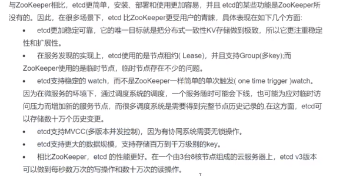
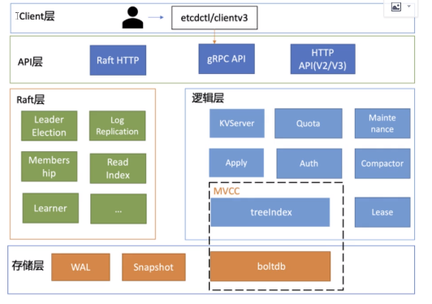
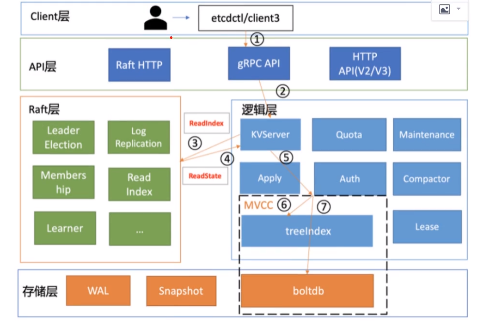
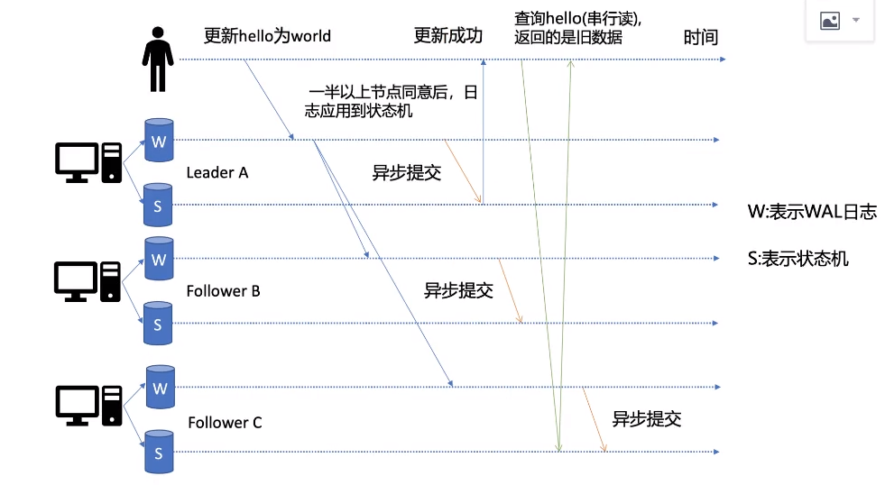
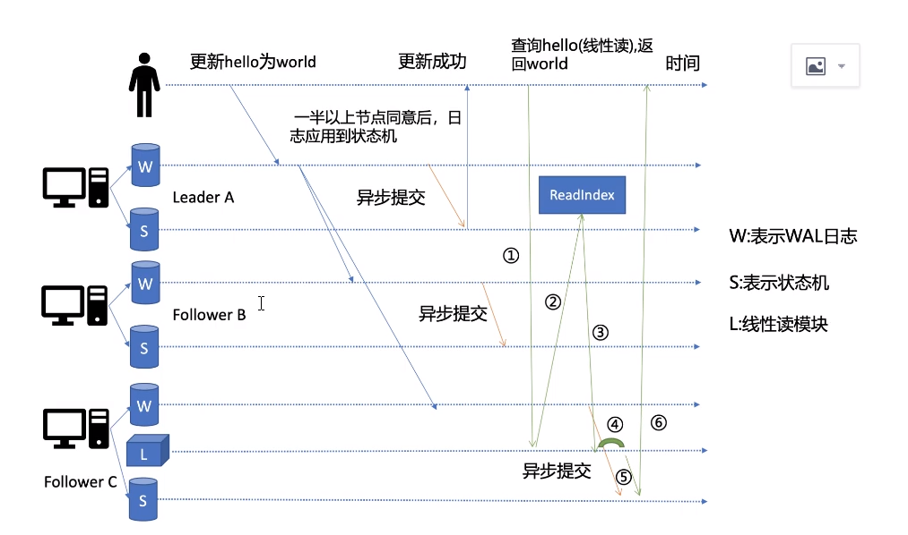
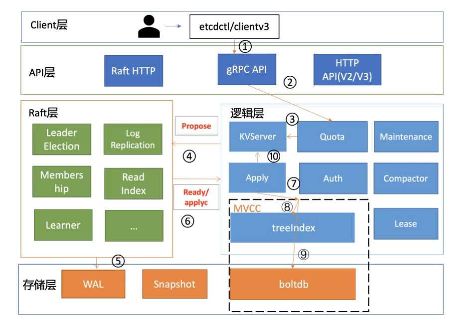
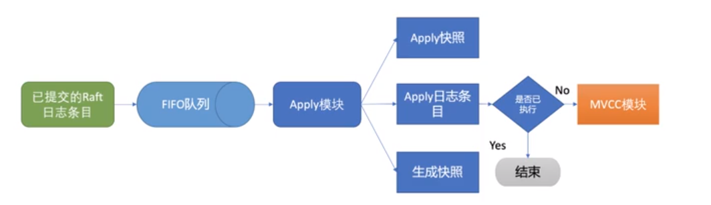
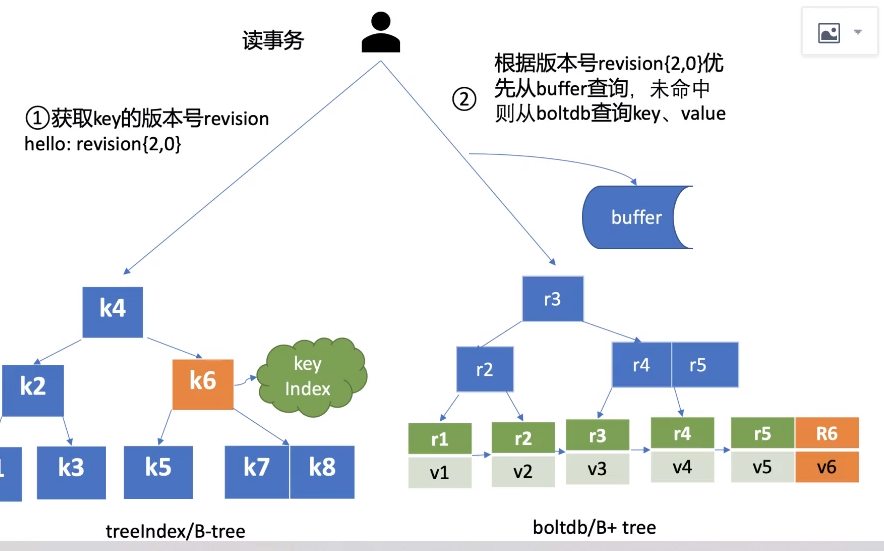
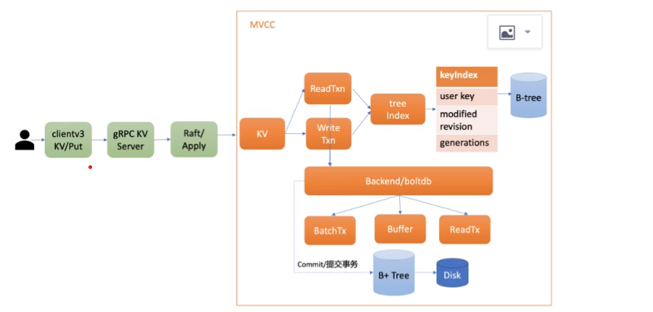
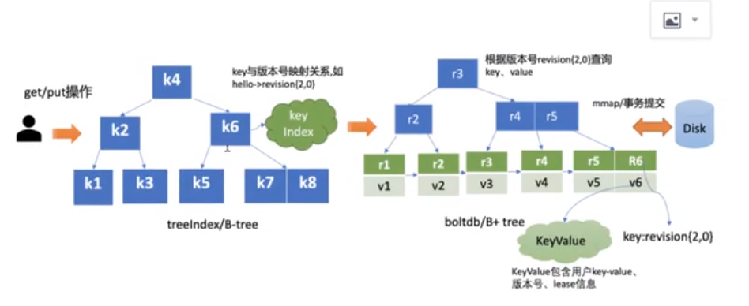

# ETCD
etcd 的底层是 Raft 算法，可以保证数据的强一致性
etcd是一个开源的、分布式的、强一致性的、可靠的键值存储系统。常用于存储分布式系统的关键数据。它可以在网络分区期间可以优雅地处理leader选举，并且可以容忍机器故障
## golang访问etcd
replace google.golang.org/grpc v1.60.1 => google.golang.org/grpc v1.26.0

replace github.com/coreos/bbolt v1.3.4 => go.etcd.io/bbolt v1.3.4

require (
	github.com/coreos/etcd v3.3.27+incompatible
	go.etcd.io/etcd v3.3.27+incompatible
)
## 应用场景
    1. 服务发现
    2. 分布式锁
    3. 分布式队列
    4. 分布式通知
    5. 主备选举

## 和zk的比较


## 架构


节点之间的通信(选举),通过RaftHTTP进行通信
v3API使用gRPC协议,通过etcd grpc-gateway组件支持HTTP/1.x协议, v2使用HTTP/1.x协议

## 环境搭建
### 参数说明

    --name	etcd节点名字
    --initial-cluster	etcd启动的时候，通过这个配置找到其他ectd节点的地址列表，格式：'节点名字1=http://节点ip1:2380,节点名字1=http://节点ip1:2380,.....'
    --initial-cluster-state	初始化的时候，集群的状态 "new" 或者 "existing"两种状态，new代表新建的集群，existing表示加入已经存在的集群。
    --listen-client-urls	监听客户端请求的地址列表，格式：'http://localhost:2379', 多个用逗号分隔。
    --advertise-client-urls	如果--listen-client-urls配置了，多个监听客户端请求的地址，这个参数可以给出，建议客户端使用什么地址访问etcd。
    --listen-peer-urls	服务端节点之间通讯的监听地址，格式：'http://localhost:2380'
    --initial-advertise-peer-urls 建议服务端之间通讯使用的地址列表。
默认使用2379端口监听客户端请求
默认使用2380端口作为节点之间进行通信
### docker
    docker run -d --name etcd-server \
    --publish 2379:2379 \
    --publish 2380:2380 \
    --env ALLOW_NONE_AUTHENTICATION=yes \
    --env ETCD_ADVERTISE_CLIENT_URLS=http://192.168.49.1:2379 \
    -e ETCD_LISTEN_CLIENT_URLS=http://0.0.0.0:2379 \
    bitnami/etcd:latest

### goreman创建3节点etcd集群
Goreman 是一个基于 Foreman 的 Go 版本，用于管理和运行多个进程。它提供了一种简单而高效的方式来管理进程，并能够从 Procfile 文件中读取进程定义。
#### 安装
go install  github.com/mattn/goreman@latest\
#### 相关参数
```
Tasks:
  goreman check                      # Show entries in Procfile
  goreman help [TASK]                # Show this help
  goreman export [FORMAT] [LOCATION] # Export the apps to another process
                                       (upstart)
  goreman run COMMAND [PROCESS...]   # Run a command
                                       start
                                       stop
                                       stop-all
                                       restart
                                       restart-all
                                       list
                                       status
  goreman start [PROCESS]            # Start the application
  goreman version                    # Display Goreman version

Options:
  -b uint
        base number of port (default 5000)
  -basedir string
        base directory
  -exit-on-error
        Exit goreman if a subprocess quits with a nonzero return code
  -exit-on-stop
        Exit goreman if all subprocesses stop (default true)
  -f string
        proc file (default "Procfile")
  -logtime
        show timestamp in log (default true)
  -p uint
        port (default 8555)
  -rpc-server
        Start an RPC server listening on 0.0.0.0 (default true)
  -set-ports
        False to avoid setting PORT env var for each subprocess (default true)
```

#### 配置文件
创建 Procfile 文件
在使用 Goreman 管理进程之前，你需要创建一个 Procfile 文件。Procfile 是一个文本文件，用于定义你要管理的进程及其启动命令。每一行定义了一个进程，包括进程名称和启动命令
```
etcd1: etcd --name infra1 --listen-client-urls http://127.0.0.1:12379 --advertise-client-urls http://127.0.0.1:12379 --listen-peer-urls  http://127.0.0.1:12380 --initial-advertise-peer-urls  http://127.0.0.1:12380 --initial-cluster-token etcd-cluster-1 --initial-cluster 'infra1=http://127.0.0.1:12380, infra2=http://127.0.0.1:22380, infra3=http://127.0.0.1:32380' --initial-cluster-state new

etcd2: etcd --name infra2 --listen-client-urls http://127.0.0.1:22379 --advertise-client-urls http://127.0.0.1:22379 --listen-peer-urls  http://127.0.0.1:22380 --initial-advertise-peer-urls  http://127.0.0.1:22380 --initial-cluster-token etcd-cluster-2 --initial-cluster 'infra1=http://127.0.0.1:12380, infra2=http://127.0.0.1:22380, infra3=http://127.0.0.1:32380' --initial-cluster-state new

etcd2: etcd --name infra3 --listen-client-urls http://127.0.0.1:32379 --advertise-client-urls http://127.0.0.1:32379 --listen-peer-urls  http://127.0.0.1:32380 --initial-advertise-peer-urls  http://127.0.0.1:32380 --initial-cluster-token etcd-cluster-3 --initial-cluster 'infra1=http://127.0.0.1:12380, infra2=http://127.0.0.1:22380, infra3=http://127.0.0.1:32380' --initial-cluster-state new
```
#### 启动
goreman -f xxx start
### 生产环境etcd多节点部署

## 常见的命令/CRUD

etcd的存储格式，仅支持键值（key-value）存储，etcd的键（key）以目录树结构方式组织，就是key的命名和存储类似我们的目录结构。

key的命名例子:/tizi365

常见的命令如下:
    
    etcdctl -h
    etcdctl get
      --endpoint //后端服务地址,会采用round-robin实现负载均衡
      --hex
      --count-only[=false]		    Get only the count
      --from-key[=false]		    Get keys that are greater than or equal to the given key using byte compare(大于等于)
      --keys-only[=false]		    Get only the keys
      --limit=0				        Maximum number of results
      --order=""			        Order of results; ASCEND or DESCEND (ASCEND by default)
      --prefix[=false]			    Get keys with matching prefix
      --print-value-only[=false]	Only write values when using the "simple" output format
      --rev=0				        Specify the kv revision(查询历史版本)
      --sort-by=""			        Sort target; CREATE, KEY, MODIFY, VALUE, or VERSION

```
etcdctl put /ws_server/webservice0 127.0.0.1
etcdctl put /ws_server/webservice1 127.0.0.2
etcdctl put /ws_server/webservice2 127.0.0.3

//批量读取,左闭右开
etcdctl get /ws_server/webservice1 /ws_server/webservice2           
    /ws_server/webservice1
    127.0.0.2


//--from-key
etcdctl get /ws_server/webservice2 --from-key
    /ws_server/webservice2
    127.0.0.3

```
    etcdctl put
        --ignore-lease[=false]	updates the key using its current lease
        --ignore-value[=false]	updates the key using its current value
        --lease="0"		lease ID (in hexadecimal) to attach to the key
        --prev-kv[=false]		return the previous key-value pair before modification(给出修改前的值)
        如果value是以横线-开始，将会被视为flag，如果不希望出现这种情况，可以使用两个横线代替–,如etcdctl put testName -- -hydra

    etcdctl del
        --from-key[=false]	    delete keys that are greater than or equal to the given key using byte compare
        --prefix[=false]		delete keys with matching prefix
        --prev-kv[=false]		return deleted key-value pairs
        --range[=false]		    delete range of keys

    etcdctl watch
        -i, --interactive[=false]	Interactive mode
        --prefix[=false]		Watch on a prefix if prefix is set
        --prev-kv[=false]		get the previous key-value pair before the event happens
        --progress-notify[=false]	get periodic watch progress notification from server
        --rev=0			Revision to start watching

```
etcdctl -i //交互式的监听(可以持续输入,可以输入多个)
watch name
watch age
```
    etcdctl lease 
    租约具有生命周期，需要为租约授予一个TTL(time to live)，将租约绑定到一个key上，则key的生命周期与租约一致，可续租，可撤销租约，类似于redis为键设置过期时间

**及时清理没有绑定key的租约!!!**

        grant		Creates leases
        keep-alive	Keeps leases alive (renew)
        list		List all active leases
        revoke		Revokes leases
        timetolive	Get lease information

```
etcdctl lease timetolive --keys //查询租约绑定了那些key
etcdctl lease keep-alive //自动续约
etcdctl lease keep-alive --once //续约一次
etcdctl lease revoke //删除租约以及租约和key的绑定,但是不会删除key,而是将TTL设置为不过期
```
## 权限控制

用户关联角色,角色控制权限
root用户具有全部权限
权限是针对KV的read和write来说的,是精确匹配而不是正则

    auth enable //开启权限后所有的操作要带--user 参数 --password 参数
    auth disable
    auth status

### 用户权限
    etcdctl user get 
    etcdctl user add
    etcdctl user del 
    etcdctl user passwd 
    etcdctl user list
    etcdctl user grant-role
    etcdctl user revoke-role

### 角色管理

    etcdctl role get
    etcdctl role add
    etcdctl role delete 
    etcdctl role list 
    etcdctl role grant-permission
    etcdctl role revoke-permission

### 集群权限
    操作带有--endpoints xxx, xxx, xxx后缀制定在那些集群节点操作

### 带有用户名和密码
    --user xxx --password xxx
    
## 读请求
### 读流程
    etcdctl 发起请求后,client通过round-robin负载均衡,选择一个节点,发起一个grpc到kvserver,线性读模块,MVCC的treeindex模块以及boltdb模块完成


### 串行读和线性读



   若某个节点(FollowerC)在已提交的日志尚未引用到状态机处理一个读请求,此时是会读取到旧数据的,称之为串行读
总结:

    1.直接读取状态机数据,无需通过raft协议和集群交互,延迟低,高吞吐,但是存在一致性不同的问题
    2.线性读(默认读取模式),经过raft协议,反映的是集体共识,一致性高
### readindex
在etcd3.1引入了readIndex,保证了串行读,也能读取到最新数据
    


    1.读请求首先会从leader获取集群最新的已提交的日志索引(commint index)
    2.leader收到readindex请求后,为防止脑裂等异常场景,会向follower发送心跳确认,一半以上的节点确认leader身份后,leader才会返回
    3.节点会等待状态机的已应用索引(applied index)大于等于leader返回的(commit index),然后再进行读取
## 写请求
写操作是leader节点负责
### 写流程

    
    1.client通过负载均衡,发起gRPC调用
    2.通过gRPC拦截器(类似于装饰器),quota模块,进入kvserver
    3.kvserver向raft提交提案
    4.提案通过raftHTTP网络模块转发,经过集群多数节点WAL日志u持久化,状态会变为已提交
    5.etcdserver从raft获取已提交WAL日志条目,转发给apply模块
    6.apply通过mvcc更新状态机
### 总结
    1. leader收到写请求后,会将请求日至持久化到WAL日志,广播给各个节点
    2. 若一半以上节点持久化WAL日志成功,则将WAL日志标记为已提交
    3. server会异步的从raft模块获取到状态为已提交的日志,应用到状态机(boltdb)

## QUOTA模块

    检查当前db大小加上写请求的kv大小之和是否超过配额
    超过配额,产生alarm(NO SPACE),通过raft同步给其他节点,并且将告警值持久化存储到db
    API层的gRPC模块或者将Raft侧已提交的的日志条目应用到状态机的Apply模块,都拒绝写入,集群只读

超过配额后的解决方法:
    
    db默认配额2G,可以调大,但是不建议禁用
    etcd是MVCC数据库,保存了key的历史版本,当未配置压缩策略时候,随着数据的不断写入,db也会不断的增加,因此要开启数据压缩
    调整后还需要一个取消告警的命令,不然持久化的告警仍然会导致集群无法写入

## 数据压缩

    压缩只会给就版本key打上空闲标签,后续的新数据写入可以复用这块空间,但是db大小不会变
    如果需要回收空间,需要使用碎片整理(defrag),会遍历旧DB文件并写入新DB文件,但是对性能有影响

## KVServer

功能:

    将写请求封装成提案,并发送给raft模块,等待响应,timeout时间为7S
    1.打包提案(Propose),会生成一个唯一的ID
    2.提案之前还有一些中间件的检查操作:
        2.1 限速 如果Rraft模块已经提交的日志索引(committed index)比已经应用到状态机的日志索引(applied index)超过5000,则会报"too many requests"
        2.2 鉴权
        2.3 大包检查 判断写入的包是否超过1.5M
总结:
    提案封装,交给RAFT

## WAL
    Leader收到提案后,通过raft模块,输出
        1. 待转发给Follow节点的消息
        2. 待持久化的日志条目(包含了提案的内容)
    etcdserver从raft模块获取到上述消息和日志条目后
        1. 将要转发的消息进行广播
        2. 将集群Leader的任期号,投票信息,已提交索引,提案内容持久化到一个WAL(Write Ahead Log),用户保证集群的一致性,可恢复性(未持久化的db的数据可从WAL中恢复)
    当一半以上的节点完成WAL日志的持久化后,Raft模块会告知etcdserver,put提案已经被集群多数节点确认,提案状态也会被更改为已经提交,可以进行执行了,此时etcdserver从channel中提取到提案内容,APPLY模块按照FIFO顺序,异步依次执行提案内容

总结:
    对提案内容进行封装成WAL日志

## Apply

    执行已经提交的提案(提案已经获得多数节点的确认与持久化),将其更新到状态机
    执行前会判断提案是否已经执行,如果执行了,则直接返回
    如果未执行且无quota告警,则进入MVCC模块,开始持久化
    执行过程中如果crush,etcd重启后,会从WAL中解析出Raft日志条目内容,重新将提案提交给Apply模块
    etcd 引入了一个consistent index字段,用来存储当前已经执行国的日志条目索引,来实现幂等性 
总结:
    FIFO处理WAL的channel返回的提案


## MVCC(Multiversion concurrency controll)

    实现了保存key的历史版本,支持多key事务
    由内存树形索引模块(treeindex)和嵌入式kv持久化存储数据库(boltdb)
    boltdb基于b+tree,支持事务



    1. 每次修改,生成一个新的版本号(revision),以版本号为key,value为用户信息组成的结构体进行存储在boltDB
    2. 读取时候先从treeindex获取key的版本号,再以版本号为key,从db读取
    3. treeindex 基于b-tree实现,实现了key的索引管理,保存了用户key与版本号(reversion)的映射关系
    4. 在获取到版本号信息后,首先会从一内存读事务buffer中查询,如果命中,则直接返回
    5. 若buffer未命中,则向db查询(B+tree)
    6. mysql通过table实现数据的隔离,而boltdb通过bucket
    7. 写入数据时候,不仅会向boltdb写入数据,也会写入buffer
    8. etcd通过合并多个写事务请求,通常情况下,是异步定时机制(100ms),将批量事务一次性提交,提高吞吐量,但是,也会引入一个新问题,事务未提交,导致读操作没法获取最新数据,为了解决,引入了bucket buffer来保存未提交事务,优先从buffer中读取
总结:
    treeindex key为用户的key,value为生成的reversion
    boltdb key 为生成的reversion,value为对应的各种信息的封装
    异步写入数据库,提高吞吐
    引入了buffer,解决异步写入的问题

### MVCC实现多版本控制

    通过引入treeindex实现多版本管理
### treeindex原理

### MVCC事务
    NVCC将请求划分为读事务(ReadTxn)和写事务(WriteTxn),读事务负责range请求,写事务负责put/delete
### MVCC 更新操作
    1. treeindex 获取版本号信息
    2. 写入buffer,异步提交到boltdb
    3. 更新treeindex
    4. 异步数据持久化
### MVCC 读取操作
    执行get命令时候,会创建一个读事务对象
    etcv3.4实现了并发读
    并发读的的核心原理是创建读事务对象时候,会全量拷贝当前写事务的未提交的buffer数据,使得读不再阻塞在一个buffer资源锁上
### MVCC 删除操作
    延期删除模式,和更新类似
    删除的具体做法
    
       1. 删除数据的boltdb key增加了删除标识
       2. 删除数据的boltdb value只保留含原始key的结构体,其他信息会抛弃
       3. treeindex会给此key增加一个空的generation对象,导致查询时候存在空的generation对象,且查询的版本号大于等于被删除的版本号,返回空
       4. 压缩的时候才会真正的删除
## RAFT算法

    共识算法
    领导者
    CAP
    脑裂

    三个问题:
        1.选举
        2.日志复制
