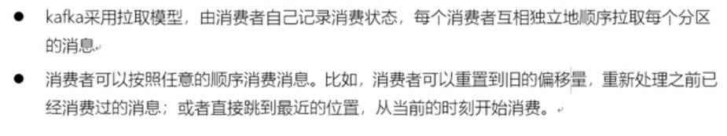

# KAFKA
## docker 安装

    docker pull bitnami/kafka
    docker pull zookeeper
    docker pull dushixiang/kafka-map

    docker network create kafka-network --subnet 172.18.0.0/16 --gateway=127.18.0.1 --ip-range=172.18.0.2/16 --driver bridge

    docker run -d --name zookeeper --network kafka-network -e ALLOW_ANONYMOUS_LOGIN=yes zookeeper:latest

    docker run -d --name kafka  --privileged=true  -e ALLOW_PLAINTEXT_LISTENER：yes --network kafka-network --ip=172.18.0.30 -p 9092:9092 -e ALLOW_PLAINTEXT_LISTENER=yes -e KAFKA_CFG_ZOOKEEPER_CONNECT=zookeeper:2181 -e KAFKA_CFG_LISTENERS=PLAINTEXT://:9092 -e KAFKA_CFG_ADVERTISED_LISTENERS=PLAINTEXT://172.18.0.30:9092 -e KAFKA_BROKER_ID=1 -e TZ="Asia/Shanghai" bitnami/kafka:latest

    docker run -d --name kafka-map --network kafka-network -p 9001:8080 -e DEFAULT_USERNAME=admin -e DEFAULT_PASSWORD=admin dushixiang/kafka-map:latest 

注意:

    docker对应的kafka路径:/opt/bitnami/kafka

    KAFKA_CFG_ADVERTISED_LISTENERS 指定的IP:PORT用于KAFKA-MAP连接KAFKA
## golang操作kafaka
https://www.lixueduan.com/posts/kafka/05-quick-start/
sarama/kafka  (github.com/Shopify/sarama)

kafka-go


## 概念

### 零拷贝
kafka使用了零拷贝技术
### 稀疏索引
kafaka使用了稀疏索引,每写4KB日志到log文件,会写入一条索引(offset+position)到index文件
### BROKER

    一个kafka集群通常由多个broker节点组成,实现负载均衡以及容错
    broker是无状态的,通过zk来维护状态
    单个broker每秒能处理10W+数据


如图:该KAFKA中有8个BROKER,对应的一个TOPIC一共有8个PARTITION,每个PARTITION有两个REPLICATION,以第一个BROKER为例,P1是P1分区的leader,而follower存在于第二个和第八个BROKER中,P1的读写请求是第一个BROKER完成的,而第一个BROKER只负责P0和P2的数据同步

### ZK

    用来管理和协调broker,保存kafka的元数据,如topic,partition
    可以通知生产者和消费者集群的节点的添加和或者故障

### PRODUCER
#### 同步生产者

#### 异步生产者
config.Producer.Return.Errors = true    // 设定是否需要返回错误信息
config.Producer.Return.Successes = true // 设定是否需要返回成功信息
异步建议开启ERROR
同步建议二者都开启
### CONSUMER

分区是最小的并行单位
一个消费者可以消费多个分区
一个分区可以被多个不同的消费者组的消费者消费
一个分区不能同时被同一个消费者组的不同消费者消费


### CONSUMER GROUP

    CONSUMER GROUP是kafka提供的可扩展的,具有容错性机制的消费者机制
    一个CONSUMER GROUP可以包含多个CONSUMER
    一个CONSUMER GROUP可以消费多个TOPIC
          对于每个TOPIC,CONSUMER GROUP内的CONSUMER一起消费该TOPIC的所有分区的数据 
    一个CONSUMER GROUP有唯一的一个ID(GROUP ID)
  
    不同的CONSUMER GROUP对同一个TOPIC的PARTITION消费互不影响
    对于一个PARTITION,对于同一个 CONSUMER GROUP,只能由 CONSUMER GROUP中的一个CONSUMER消费
    CONSUMER 实例的数量应该等于该GROUP订阅TOPIC的PARTITION总数
### REPLICATION


    REPLICATION可以保障某个broker故障时候,数据依然可用
    一般建议主分区+副本=3(replication-factor=3)
    ISR指同步的副本集
### TOPIC 


    TOPIC是一个逻辑概念,用于发布数据,消费数据(发布到哪个TOPIC,消费哪个TOPIC)
    一旦某个消息发布到TOPIC后就不能再更新
    一个TOPIC可以包含多个PARTITION

### PARTITION


不同的分布式系统对分区的叫法也不尽相同。比如在 Kafka 中叫分区，在 MongoDB 和 Elasticsearch 中就叫分片 Shard，而在 HBase 中则叫 Region，在 Cassandra 中又被称作 vnode。

    kafka集群中,TOPIC被分为多个分区
    通过PARTITION对同一个TOPIC的拆分,可以使得一个TOPIC的信息存放在多个broker,提高了扩展性
    分区的作用就是提供负载均衡的能力，或者说对数据进行分区的主要原因，就是为了实现系统的高伸缩性（Scalability）。

    不同的分区能够被放置到不同节点的机器上，而数据的读写操作也都是针对分区这个粒度而进行的，这样每个节点的机器都能独立地执行各自分区的读写请求处理。并且，我们还可以通过添加新的节点机器来增加整体系统的吞吐量。

#### 消息有序与分区的关系

Kafka 是不能保证全局消息顺序的，只能保证单个 Partition 下的顺序，所以在需要保证顺序的场景可以使用 Key-Ordering 策略将同一个用户的消息发送到同一分区，即可保证顺序。
#### 分区策略
轮询策略
随机策略
按消息键保序策略

    也称 Key-ordering 策略。
    Kafka 允许为每条消息定义消息键，简称为 Key。这个 Key 的作用非常大，它可以是一个有着明确业务含义的字符串，也可以用来表征消息元数据。
    一旦消息被定义了 Key，那么你就可以保证同一个 Key 的所有消息都进入到相同的分区里面，由于每个分区下的消息处理都是有顺序的，故这个策略被称为按消息键保序策略


### OFFSET


    OFFSET记录下一条将要发送给CONSUMER的消息的序号
    在一个PARTITION中,消息是顺序存储的,对应有一个增加的ID来标识,这个就是OFFSET
    OFFSET在某个PARTITION中才有意义,在PARTITION之间没有意义
### RECORD

    消息
    以KEY,VALUE形式存储
    写入消息的时候如果不指定KEY,消息会以轮询的方式写入当前TOPIC的分区
    如果是提供了不同的KEY,则KAFKA会将相同KEY的消息放入同分区

### LEADER/FOLLOWER
KAFKA会将LEADER均匀的分配到不同个的BROKER上
当LEADER崩溃后,FOLLOWER会选举出新的LEADER
### AR ISR OSR
AR 
    
    Assigned Replicas 分区的所有副本(包括LEADER本身)
ISR 
    
    所有与LEADER保持一定程度同步的副本+LEADER=ISR In Sync Replicas
OSR

    所有与LEADER相比,同步滞后过多的副本(不包括LEADER)=OSR Out Of Replicas

AR(包括LEADER)=ISR(包括LEADER)+OSR(不包括LEADER)

正常情况下 OSR为空
### CONTROLLER
KAFKA在启动后,会在所有的BROKER中选择一个CONTROLLER
CONTROLLER针对的是BROKER
TOPIC,PARTITION,REPLICATION的管理都是CONTROLLER完成的
LEADER的选举也是CONTROLLER完成的
CONTROLLER也是高可用的,一旦CONTROLLER崩溃,其他的BROKER会重新注册成新的CONTROLLER

KAFKA集群启动的时候,所有的BROKER都会尝试连接ZK,并注册自己为CONTROLLER,但是只有一个能成为CONTROLLER,其他的BROKER都会注册为CONTROLLER的监视节点


### REBALANCE
REBALANCE 本质上是一种协议，规定了一个 CONSUMER GROUP 下的所有 CONSUMER 如何达成一致，来分配订阅 TOPIC 的每个PARTITION。
    
    如:某个 Group 下有 20 个 Consumer 实例，它订阅了一个具有 100 个分区的 Topic。正常情况下，Kafka 平均会为每个 Consumer 分配 5 个分区。这个分配的过程就叫 Rebalance。

那么 Consumer Group 何时进行 Rebalance 呢？Rebalance 的触发条件有 3 个。

    1）CONSUMER成员数发生变更
        比如有新的 Consumer 实例加入组或者离开组，亦或是有 Consumer 实例崩溃被“踢出”组。
    2）订阅的TOPIC发生变化C
        onsumer Group 可以使用正则表达式的方式订阅主题，比如 consumer.subscribe(Pattern.compile(“t.*c”)) 就表明该 Group 订阅所有以字母 t 开头、字母 c 结尾的主题
        在 Consumer Group 的运行过程中，你新创建了一个满足这样条件的主题，那么该 Group 就会发生 Rebalance。
    3）订阅主题的分区数发生变更
        Kafka 当前只能允许增加一个主题的分区数。当分区数增加时，就会触发订阅该主题的所有 Group 开启 Rebalance。

缺点:
    
    1.被影响的CONSUMER GROUP下的CONSUMER共同会参与,首先会停止工作,等待REBALANCE完成
### 如何避免无效的REBANLANCE
Coordinator 即协调者，它专门为 Consumer Group 服务，负责为 Group 执行 Rebalance 以及提供位移管理和组成员管理等。
Consumer 实例可能会被 Coordinator 错误地认为“已停止”从而被“踢出”Group。如果是这个原因导致的 Rebalance,需要处理
当 Consumer Group 完成 Rebalance 之后，每个 Consumer 实例都会定期地向 Coordinator 发送心跳请求，表明它还存活着。如果某个 Consumer 实例不能及时地发送这些心跳请求，Coordinator 就会认为该 Consumer 已经“死”了，从而将其从 Group 中移除，然后开启新一轮 Rebalance。

Consumer 端有个参数，叫 session.timeout.ms，就是被用来表征此事的。该参数的默认值是 10 秒，即如果 Coordinator 在 10 秒之内没有收到 Group 下某 Consumer 实例的心跳，它就会认为这个 Consumer 实例已经挂了。可以这么说，session.timeout.ms 决定了 Consumer 存活性的时间间隔。

Consumer 还提供了一个允许你控制发送心跳请求频率的参数，就是 heartbeat.interval.ms。这个值设置得越小，Consumer 实例发送心跳请求的频率就越高。频繁地发送心跳请求会额外消耗带宽资源，但好处是能够更加快速地知晓当前是否开启 Rebalance，因为，目前 Coordinator 通知各个 Consumer 实例开启 Rebalance 的方法，就是将 REBALANCE_NEEDED 标志封装进心跳请求的响应体中。

    第一类非必要 Rebalance 是因为未能及时发送心跳，导致 Consumer 被“踢出”Group 而引发的。因此，你需要仔细地设置 session.timeout.ms 和 heartbeat.interval.ms 的值。
    推荐数值
        设置 session.timeout.ms = 6s。
        设置 heartbeat.interval.ms = 2s。
要保证 Consumer 实例在被判定为“dead”之前，能够发送至少 3 轮的心跳请求，即 session.timeout.ms >= 3 * heartbeat.interval.ms。

Consumer 端还有一个参数，用于控制 Consumer 实际消费能力对 Rebalance 的影响，即 max.poll.interval.ms 参数。它限定了 Consumer 端应用程序两次调用 poll 方法的最大时间间隔。它的默认值是 5 分钟，表示你的 Consumer 程序如果在 5 分钟之内无法消费完 poll 方法返回的消息，那么 Consumer 会主动发起“离开组”的请求，Coordinator 也会开启新一轮 Rebalance。


    第二类非必要 Rebalance 是 Consumer 消费时间过长导致的。max.poll.interval.ms 参数值的设置显得尤为关键。如果要避免非预期的 Rebalance，你最好将该参数值设置得大一点，比你的下游最大处理时间稍长一点。

最后 Consumer 端的因为 GC 设置不合理导致程序频发 Full GC 也可能引发非预期 Rebalance。

小结，调整以下 4 个参数以避免无效 Rebalance：

    session.timeout.ms
    heartbeat.interval.ms
    max.poll.interval.ms
    GC 参数
## KAFKA作用
异步处理,系统解耦,流量削峰,日志处理
## 和其他中间件的对比


## KAFKA事务
KAFKA的默认事务级别是read_uncommitted(脏读)
ISOLATION_LEVEL
## 序列化

## LEADER选举
当LEARDER故障后,KAFKA会快速选举出对应的LEADER
## LEADER的负载均衡
如果某个BROKER CRASH后恢复,可能导致PARTITION的LEARER分配不均的问题,即一个BROKER存在多个PARTITION的LEADER


通过

    ./kafka-leader-election.sh --bootstrap-server SERVER_IP:PORT --topic xxx -partition=x --election-type preffered
来将某个preffered-replica设置为LEADER解决leader分配不均的问题
## KAFKA的读写流程
ZK:
    /brokers/topics/xxx_topic/partitions/xxx_partition/state
    路径下存储的了xxx_partition的leader

注意:
    
    FOLLOWER是拉取LEADER的LOG



注意:
    
    消费者消费后会提交OFFSET
## KAFKA的物理存储


### __consumer_offsets
由于消费者在消费消息的时候可能会由于各种原因而断开消费，当重新启动消费者时我们需要让它接着上次消费的位置offset继续消费，因此消费者需要实时的记录自己以及消费的位置。
__consumer_offsets 是 kafka 自行创建的，和普通的 topic 相同。它存在的目的之一就是保存 consumer 提交的位移
每个consumer会定期将自己消费分区的offset提交给kafka内部topic：__consumer_offsets，提交过去的时候，key是consumerGroupId+topic+分区号，value就是当前offset的值
__consumer_offsets可能会接收高并发的请求，kafka默认给其分配50个分区,对每个 group.id 做哈希求模运算，从而将负载分散到不同的 __consumer_offsets 分区上

通過下列命令查看
```BASH
kafka-console-consumer.sh  --bootstrap-server 127.0.0.1:9092 --topic __consumer_offsets --partition 30 --from-beginning --formatter 'kafka.coordinator.group.GroupMetadataManager$OffsetsMessageFormatter'
```
## 生产者的写入策略
轮询分区策略(默认)
随机分区策略(key为NULL,不常用)
按KEY分区策略(key不为NUL,可能出现数据倾斜,但是可以保证局部有序)
自定义分区策略

## 消费者的分区策略
range分配策略(默认)

    可以保证每个消费者消费是均衡的
    n=分区数量/消费者数量
    m=分区数量%消费者数量
    前m个消费者各消费n+1个
    剩余的消费者消费n个
    7个分区,3个消费者
    n=2
    m=1
    因此是前1个消费者各消费3个
    后面的2个消费者小为2个

round-robin策略

    将消费者组内的所有消费者以及消费者订阅的TOPIC的PARTITION按照字典顺序(topic和partition的HASHCODE进行排序),然后通过轮询的方式分配


Stricky粘性分配策略

    分区尽可能均匀
    reblance后的分配尽量和分配前尽量接近


## 消息不丢失
### 生产者ACK

    ACK 0       不要求
    ACK 1       要求LEARER写入成功
    ACK -1/ALL  要求副本同步成功
### 消费者ACK
    可以使用sarama.NewOffsetManagerFromClient提供的OffSetManager来进行OFFSET管理,
    OFFSET和GROUP_ID强相关
### 消息积压

## 消息模型
### 点对点
实现了负载均衡

### 发布订阅

### 分区与消息顺序

M3和M4是无法保证消费顺序的

可以通过设置消息的KEY来保证在不同分区存在的情况下 同一KEY的消息保存在同一个分区,这样消费的顺序性就保证了
## 消息传递语义
生产者的消息传递:


注意:

    生产者最多一次可能导致消息的丢失
    生产者至少一次可能导致消息的重复生产
消费者的消息传递:
至少一次:

至多一次:


    消费者的至少一次可能导致消息的重复消费
    消费者的至少一次是提交消费位置失败,导致下次消费的消费位置不变从而重复消费
    消费者的至多一次是消费消息失败,但是提交消费位置成功,下次消费的消费位置发生改变,消费失败的消息不会被再次消费
    
    消费者通过对OFFSET和消息消费进行绑定,当消息消费成功,此时保存当前的OFFSET,下次消费从OFFSET+1处消费即可(使用MYSQL对消费成功的数据以及OFFSET的保存放在一个事务里面)
     
## 操作
### TOPIC
创建TOPIC
    
    kafka-topics.sh --create --bootstrap-server 172.18.0.3:9092 --topic kafka-topic-test
查询TOPIC
    
    kafka-topics.sh --list --bootstrap-server 172.18.0.3:9092
TOPIC 分区扩展

    kafka-topics.sh --bootstrap-server 172.18.0.3:9092 -alter --topic kafka-topic-test --partitions 2

### PRODUCER
生产消息
    
    kafka-console-producer.sh --broker-list 172.18.0.3:9092 --topic kafka-topic-test
### CONSUMER
消费消息
    
    kafka-console-consumer.sh --bootstrap-server 172.18.0.3:9092 --topic kafka-topic-test --from-beginning
## 集群
    需要配置ZK并启动ZK
    集群中每个sesrver的broker_id都是唯一的


## 运维

### 基准测试
### 日志清理


日志是一段(segment)为单位进行清理
### 数据积压
数据积压的产生原因:

    1.生产者速度大于消费者速度  
        [ 需要再进一步了解 ]
        增加partition数量
        消费者端使用线程池进行处理
        
    2.消费者代码异常,导致消费确认失败,  消费者OFFSET提交失败
        配置消费策略,对消费失败的数据写入死信队列
        
    3.消费超时    
        消费超时导致消费失败(增大超时时间)


## 消息避免丢失
### 概述
在使用 MQ 的时候最大的问题就是消息丢失，常见的丢失情况如下：

    1）Producer 端丢失
    2）Broker 端丢失
    3）Consumer 端丢失
一条消息从生产到消费一共要经过以下 3 个流程：

    1）Producer 发送到 Broker
    2）Broker 保存消息(持久化)
    3）Consumer 消费消息
3 个步骤分别对应了上述的 3 种消息丢失场景。

    1) Producer 发送到 Broker失败
        如:
            1）例如网络抖动，导致消息压根就没有发送到 Broker 端；
            2）或者消息本身不合格导致 Broker 拒绝接收（比如消息太大了，超过了 Broker 的承受能力
        处理方式:
            同步发送根据返回error信息
            异步发送根据Success,Error channel 的数据判断
            设置 retries 为一个较大的值,当出现网络的瞬时抖动时，消息发送可能会失败，此时配置了 retries > 0 的 Producer 能够自动重试消息发送，避免消息丢失。

    2）Broker 保存消息(持久化)
        处理方式:
            1.Broker 确认:
            	config.Producer.RequiredAcks
                const (
                        // NoResponse doesn't send any response, the TCP ACK is all you get.
                        NoResponse RequiredAcks = 0

                        // WaitForLocal waits for only the local commit to succeed before responding.
                        //如果 follower 还没有收到 leader 同步的消息 leader 就挂了，那么消息会丢失

                        WaitForLocal RequiredAcks = 1'

                        // WaitForAll waits for all in-sync replicas to commit before responding.
                        // The minimum number of in-sync replicas is configured on the broker via
                        // the `min.insync.replicas` configuration key.
                        //，如果 Leader 刚收到消息就断电，producer 可以知道消息没有被发送成功，将会重新发送。
                        //如果在 follower 收到数据以后，成功返回 ack，leader 断电，数据将存在于原来的 follower 中。在重新选举以后，新的leader 会持有该部分数据。
                        WaitForAll RequiredAcks = -1
                        )
            2.设置 unclean.leader.election.enable = false。这是 Broker 端的参数，它控制的是哪些 Broker 有资格竞选分区的 Leader。如果一个 Broker 落后原先的 Leader 太多，那么它一旦成为新的 Leader，必然会造成消息的丢失。故一般都要将该参数设置成 false，即不允许这种情况的发生。
            3.设置 replication.factor >= 3。这也是 Broker 端的参数。其实这里想表述的是，最好将消息多保存几份，毕竟目前防止消息丢失的主要机制就是冗余。 
            4.设置 min.insync.replicas > 1。这依然是 Broker 端参数，控制的是消息至少要被写入到多少个副本才算是“已提交”。设置成大于 1 可以提升消息持久性。在实际环境中千万不要使用默认值 1。
            5.确保 replication.factor > min.insync.replicas。如果两者相等，那么只要有一个副本挂机，整个分区就无法正常工作了。我们不仅要改善消息的持久性，防止数据丢失，还要在不降低可用性的基础上完成。推荐设置成 replication.factor = min.insync.replicas + 1。
    3）Consumer 消费消息
        如:
            场景1：获取到消息后直接提交位移了，然后再处理消息。
                这样在提交位移后，处理完消息前，如果程序挂掉，这部分消息就算是丢失了。
                !!! sarama开启自动提交,当消费者收到消息后,不论业务是否处理,都会自动提交

            场景2：多线程并发消费消息，且开启了自动提交，
                导致消费完成之前程序就自动提交了位移，如果程序挂掉也会出现消息丢失。
        处理方式:
            解决方案也很简单：确定消费完成后才提交消息，如果是多线程异步处理消费消息，Consumer 程序不要开启自动提交位移，而是要应用程序手动提交位移。


## kafka 消息可靠性
最多一次（at most once）：消息可能会丢失，但绝不会被重复发送。
至少一次（at least once）：消息不会丢失，但有可能被重复发送。
精确一次（exactly once）：消息不会丢失，也不会被重复发送。
目前，Kafka 默认提供的交付可靠性保障是第二种，即至少一次。
Kafka 分别通过 幂等性（Idempotence）和事务（Transaction）这两种机制实现了 精确一次（exactly once）语义。

## 幂等性
### 什么是幂等性
特点是其任意多次执行所产生的影响均与一次执行的影响相同。幂等函数，或幂等方法，是指可以使用相同参数重复执行，并能获得相同结果的函数。这些函数不会影响系统状态，也不用担心重复执行会对系统造成改变。
生产者的幂等性:
    就是为了保证消息有序且不重复
消费者的幂等性:
    就是为了保证消息不重复消费
   
### 幂等性可以的作用
生产者:
    在KAFKA中,如果发送消息成功,但是由于PRODUCER因为网络波动没有收到响应信号,此时PRODUCER认为发送消息失败,则会失败,如果此时没有幂等性保证,则消息会重复
    在KAFKA中,如果发送消息失败,如果没有幂等性保证,则消息丢失
消费者:
    如在业务处理完成后,offset提交前宕机,则broker认为该消息并没有消费成功,下次消费者依然会接收到该消息重新消费,因此在业务层面进行保证,如通过唯一ID来保证
### 生产者幂等性的实现原理


Kafka 为了实现幂等性，它在底层设计架构中引入了 ProducerID 和 SequenceNumber。

Producer 需要做的只有两件事：

    1）初始化时像向 Broker 申请一个 ProducerID
    2）为每条消息绑定一个 SequenceNumber

Kafka Broker 收到消息后会以 ProducerID 为单位存储 SequenceNumber，也就是说即时 Producer 重复发送了， Broker 端也会将其过滤掉。
Kafka 通过 Producer Id（生产者标识符）和 Sequence Number（序列号）来保证消息不会被重复发送。

Producer Id（PID）
    
    每个 Kafka 生产者在初始化时都会获得一个唯一的 Producer Id。Producer Id 是一个持久性标识符，通常与生产者的客户端实例相关联。Kafka 会跟踪每个生产者的 Producer Id。
Sequence Number（序列号）

    每个请求（消息）都包含一个单调递增的序列号。序列号从1开始，每次递增1。序列号用于标识请求的顺序。

Producer Id 和 Sequence Number 的存储

    Kafka 将 Producer Id 和 Sequence Number 存储在每个分区的分区日志中。这个存储允许 Kafka 跟踪每个分区的最新序列号。

消息发送过程： 
    
    当生产者发送一条消息到 Kafka 时，消息会携带生产者的 Producer Id 和序列号。Kafka 会根据 Producer Id 和序列号来验证消息的幂等性和顺序性。

Kafka 服务器的处理：

     Kafka 服务器会在接收到消息后，首先检查 Producer Id 和序列号是否已经在该分区的分区日志中出现过。如果这个 Producer Id 和序列号已经存在，说明消息已经被处理，Kafka 将丢弃重复的消息。如果 Producer Id 和序列号是新的，Kafka 会接受消息并更新分区的最新序列号。

重试机制： 
    
    如果生产者因某种原因未收到来自 Kafka 的确认（ACK）并怀疑消息未被成功发送，它会重新发送相同的消息。由于消息中包含了 Producer Id 和序列号，Kafka 可以识别重复的消息并再次将其过滤掉。

通过这个机制，Kafka 确保了消息不会被重复发送。每条消息都有唯一的 Producer Id 和序列号，这使得 Kafka 能够在接收消息时检查重复，并且保持消息的幂等性和顺序性。这对于确保数据的可靠性和一致性非常重要，尤其在分布式系统中。

缺点：

    只能保证单分区上的幂等性。即一个幂等性 Producer 能够保证某个主题的一个分区上不出现重复消息，它无法实现多个分区的幂等性。
        因为 SequenceNumber 是以 Topic + Partition 为单位单调递增的，如果一条消息被发送到了多个分区必然会分配到不同的 SequenceNumber ,导致重复问题。
    只能实现单会话上的幂等性。不能实现跨会话的幂等性。当你重启 Producer 进程之后，这种幂等性保证就丧失了。
        重启 Producer 后会分配一个新的 ProducerID，相当于之前保存的 SequenceNumber 就丢失了。

### sarama 幂等性配置
```GO
// 开启生产者幂等性配置
	config := sarama.NewConfig()
	config.Producer.Idempotent = true
    
//开启幂等性后, config的检查项会有以下要求:
func (c *Config) Validate() error {
...
	if c.Producer.Idempotent {
        //Idempotent 要求版本支持
		if !c.Version.IsAtLeast(V0_11_0_0) {
			return ConfigurationError("Idempotent producer requires Version >= V0_11_0_0")
		}
        //Idempotent 要求发送重试次数大于0
		if c.Producer.Retry.Max == 0 {
			return ConfigurationError("Idempotent producer requires Producer.Retry.Max >= 1")
		}
        //Idempotent 要求ACK为WaitForAll
		if c.Producer.RequiredAcks != WaitForAll {
			return ConfigurationError("Idempotent producer requires Producer.RequiredAcks to be WaitForAll")
		}
        //Idempotent 要求iMaxOpenRequests=1
        //不能并发请求
        //当MaxOpenRequests这个参数配置大于1的时候，代表了允许有多个请求发送了还没有收到回应。假设此时的重试次数也设置为了大于1，当同时发送了2个请求，如果第一个请求发送到broker中，broker写入失败了，但是第二个请求写入成功了，那么客户端将重新发送第一个消息的请求，这个时候会造成乱序。
        //消息的有序可以通过MaxOpenRequests设置为1来保证，这个时候每个消息必须收到了acks才能发送下一条，所以一定是有序的，但是不能够保证不重复。
        //而且当MaxOpenRequests设置为1的时候，吞吐量不高。
		if c.Net.MaxOpenRequests > 1 {
			return ConfigurationError("Idempotent producer requires Net.MaxOpenRequests to be 1")
		}
	}

	if c.Producer.Transaction.ID != "" && !c.Producer.Idempotent {
		return ConfigurationError("Transactional producer requires Idempotent to be true")
	}
...
}
```
### 幂等性代码逻辑
在创建 Producer 的时候会调用newTransactionManager创建一个TransactionManager,这个就是用于保证 幂等性的

```GO
func newAsyncProducer(client Client) (AsyncProducer, error) {
	
    ...

	txnmgr, err := newTransactionManager(client.Config(), client)
	if err != nil {
		return nil, err
	}
    ...
}
```
producerID+producerEpoch用于区分 Producer，sequenceNumbers则是用于消息去重。
```GO
type transactionManager struct {
	producerID         int64
	producerEpoch      int16
	sequenceNumbers    map[string]int32
	
    
    mutex              sync.Mutex
	transactionalID    string
	transactionTimeout time.Duration
	client             Client

	// when kafka cluster is at least 2.5.0.
	// used to recover when producer failed.
	coordinatorSupportsBumpingEpoch bool

	// When producer need to bump it's epoch.
	epochBumpRequired bool
	// Record last seen error.
	lastError error

	// Ensure that status is never accessed with a race-condition.
	statusLock sync.RWMutex
	status     ProducerTxnStatusFlag

	// Ensure that only one goroutine will update partitions in current transaction.
	partitionInTxnLock            sync.Mutex
	pendingPartitionsInCurrentTxn topicPartitionSet
	partitionsInCurrentTxn        topicPartitionSet

	// Offsets to add to transaction.
	offsetsInCurrentTxn map[string]topicPartitionOffsets
}
const (
	noProducerID    = -1
	noProducerEpoch = -1

	// see publishTxnPartitions comment.
	addPartitionsRetryBackoff = 20 * time.Millisecond
)

// Build a new transaction manager sharing producer client.
func newTransactionManager(conf *Config, client Client) (*transactionManager, error) {
	txnmgr := &transactionManager{
		producerID:                    noProducerID,
		producerEpoch:                 noProducerEpoch,
		client:                        client,
		pendingPartitionsInCurrentTxn: topicPartitionSet{},
		partitionsInCurrentTxn:        topicPartitionSet{},
		offsetsInCurrentTxn:           make(map[string]topicPartitionOffsets),
		status:                        ProducerTxnFlagUninitialized,
	}

	if conf.Producer.Idempotent {
        //默认配置参数
        //c.Producer.Transaction.Timeout = 1 * time.Minute
	    // c.Producer.Transaction.Retry.Max = 50
	    // c.Producer.Transaction.Retry.Backoff = 100 * time.Millisecond
		txnmgr.transactionalID = conf.Producer.Transaction.ID　//默认为０
		txnmgr.transactionTimeout = conf.Producer.Transaction.Timeout
		txnmgr.sequenceNumbers = make(map[string]int32)
		txnmgr.mutex = sync.Mutex{}

		var err error
		txnmgr.producerID, txnmgr.producerEpoch, err = txnmgr.initProducerId()
		if err != nil {
			return nil, err
		}
		Logger.Printf("txnmgr/init-producer-id [%s] obtained a ProducerId: %d and ProducerEpoch: %d\n",
			txnmgr.transactionalID, txnmgr.producerID, txnmgr.producerEpoch)
	}

	return txnmgr, nil
}
//在把消息交给 brokerProducer 之前给消息分配了一个 sequenceNumber,通过这个序号来保证了同一条消息只会发送一次，以实现 Exactly Once 语义。
func (t *transactionManager) getAndIncrementSequenceNumber(topic string, partition int32) (int32, int16) {
	key := fmt.Sprintf("%s-%d", topic, partition)
	t.mutex.Lock()
	defer t.mutex.Unlock()
	sequence := t.sequenceNumbers[key]
	t.sequenceNumbers[key] = sequence + 1
	return sequence, t.producerEpoch
}
func (pp *partitionProducer) dispatch() {
    ...
    	// msg.retries == 0 保证了每条消息只会生成一次序号
		if pp.parent.conf.Producer.Idempotent && msg.retries == 0 && msg.flags == 0 {
			msg.sequenceNumber, msg.producerEpoch = pp.parent.txnmgr.getAndIncrementSequenceNumber(msg.Topic, msg.Partition)
			msg.hasSequence = true
		}

		pp.brokerProducer.input <- msg
	}
    ...
}
```
## 事务

kafka 自 0.11 版本开始也提供了对事务的支持，目前主要是在 read committed 隔离级别上做事情。它能保证多条消息原子性地写入到目标分区，同时也能保证 Consumer 只能看到事务成功提交的消息。

事务型 Producer 能够保证将消息原子性地写入到多个分区中。这批消息要么全部写入成功，要么全部失败。另外，事务型 Producer 也不惧进程的重启。Producer 重启回来后，Kafka 依然保证它们发送消息的精确一次处理。

设置事务型 Producer 的方法也很简单，满足两个要求即可：

    和幂等性 Producer 一样，开启 enable.idempotence = true。
    设置 Producer 端参数 transactional.id。最好为其设置一个有意义的名字。
