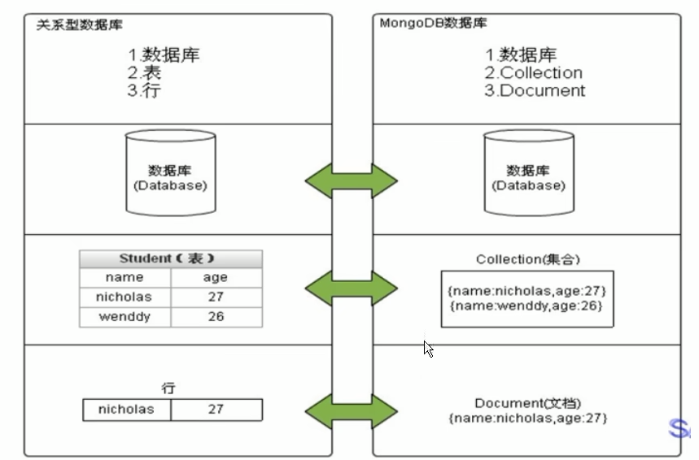
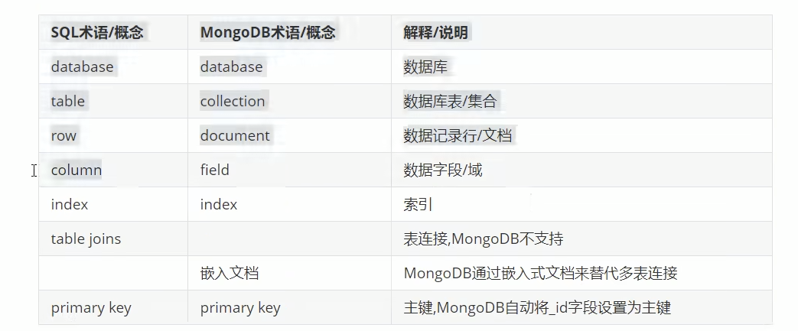
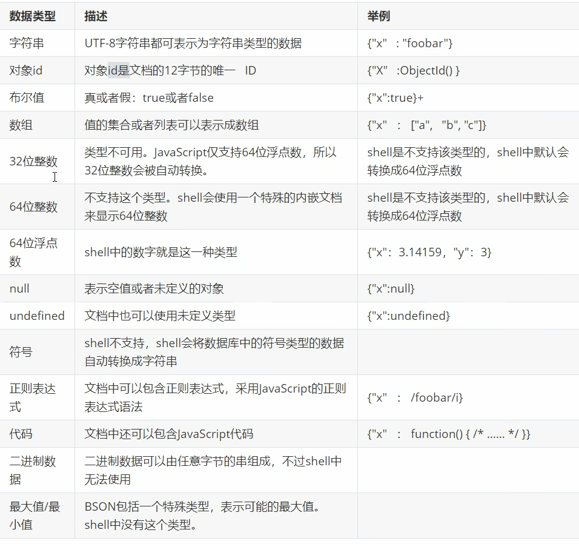
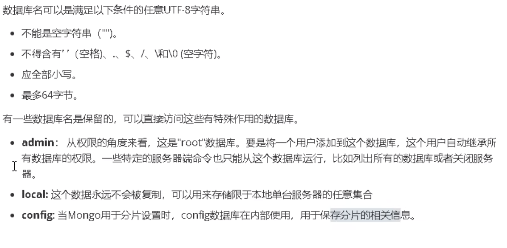
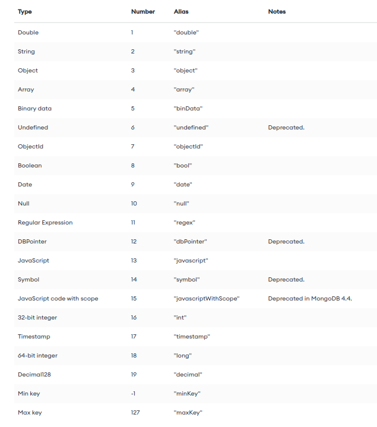

# MongoDB

## docker 
不进行存储映射
docker run -itd --name mongo -p 27017:27017 mongodb

## 第三方库
go get go.mongodb.org/mongo-driver/mongo
https://www.mongodb.com/docs/drivers/go/current/
## 概念



## 数据类型

## 数据库操作
    use xxx
    show dbs
    show databases
    db
    db.dropDatabase()

## 集合
显式创建
    
    db.createCollection(xx)
隐式创建
直接插入文档

    show collections
    db.xxx.drop()
## 文档

### 增加

    db.xxx.insert()
    db.xxx.insertOne()
    db.xxx.save()

    db.xxx.insertMany()

注意:

    数字的默认的类型是double,如果要存整型,需要使用NumberInt()
    插入当前日期使用new Date()
    批量插入遇到失败的会停止,但是已经插入的不会回滚
### 查询
基本

    db.xxx.find()
    db.xxx.findOne()
    db.xxx.find().pretty()
    db.xxx.find().forEach(printjson)

投影查询(就是查询特定字段,默认_id会显示)

聚合查询

分页查询

    db.xxx.find().limit().skip()

排序查询

    db.xxx.find().sort()

统计查询

    db.xxx.count()

正则查询


    i 忽略大小写，{<field>{$regex/pattern/i}}，设置i选项后，模式中的字母会进行大小写不敏感匹配。

    m 多行匹配模式，{<field>{$regex/pattern/,$options:'m'}}，m选项会更改^和$元字符的默认行为，分别使用与行的开头和结尾匹配，而不是与输入字符串的开头和结尾匹配

    x 忽略非转义的空白字符，{<field>:{$regex:/pattern/,$options:'m'}}，设置x选项后，正则表达式中的非转义的空白字符将被忽略，同时井号(#)被解释为注释的开头注，只能显式位于option选项中

    s 单行匹配模式{<field>:{$regex:/pattern/,$options:'s'}}，设置s选项后，会改变模式中的点号(.)元字符的默认行为，它会匹配所有字符，包括换行符(\n)，只能显式位于option选项中。


regex操作符:

    db.xxx.find({<field>:{$regex:/pattern/，$options:’<options>’}})
    db.xxx.find({<field>:{$regex:’pattern’，$options:’<options>’}})
    db.xxx.find({<field>:{$regex:/pattern/<options>}})

正则表达式对象:

    db.xxx.find({<field>: /pattern/<options>})
二者的区别:

    在$in操作符中只能使用正则表达式对象，例如:{name:{$in:[/^joe/i,/^jack/}}
    在使用隐式的$and操作符中，只能使用$regex，例如:{name:{$regex:/^jo/i, $nin:['john']}}
    当option选项中包含X或S选项时，只能使用$regex，例如:{name:{$regex:/m.*line/,$options:"si"}}

优化
    在设置索的字段上进行正则匹配可以提高查询速度，而且当正则表达式使用的是前缀表达式时，查询速度会进一步提高，例如:{name:{$regex: /^joe/}}


比较查询

    db.xxx.find({xxx:{$gt:yyy}})
    db.xxx.find({yyy:{$mod:[5,2]}}) //yyy除以5余2

    $gt
    $lt
    $gte
    $lte
    $not
    $mod

包含查询

    db.xxx.find({xxx:{$in:[yy1,yy2]}})

    $in
    $nin

逻辑查询

    db.xxx.find($and:[{},{},{}])

    $and
    $or
    $nor


元素查询
    元素查询运算符可以使用文档的字段来识别文档。元素运算符由$exist和$type组成。

    db.xxx.find(xxx:{$exist:true})
    匹配包含该字段的文档，包括字段值为空的文档

    db.xxx.find(xxx:{$type:"string"})
    此运算符根据指定的字段类型匹配文档,这些字段类型是指定的 BSON 类型，可以通过类型号或别名来定义

数组查询(针对文档中的数组字段)

    
### 更新
默认只修改第一条

覆盖修改
    
    db.xxx.update({},{})
局部修改

    db.xxx.update({},{$set{}})
    db.xxx.update({},{$inc{}})

批量修改

    db.xxx.update({},{$set{}},{multi:true})


### 删除

    db.xxx.remove()
## 索引
MongoBD 使用的是B-Tree


    db.xxx.getIndexes()

    db.xxx.dropIndexes()

单字段索引

针对内嵌的某个字段创建索引

    嵌入字段上的索引允许使用“点表示法”来内省嵌入的文档
针对内嵌文档整体创建索引

复合索引

    复合索引中列出的字段的顺序很重要
    复合索引除了支持在所有索引字段上都匹配的查询之外，复合索引还可以支持在索引字段的前缀上匹配的查询
地理空间索引

文本索引

哈希索引

## BSON
BSON是一种类json的一种二进制形式的存储格式，简称Binary JSON，它和JSON一样，支持内嵌的文档对象和数组对象，但是BSON有JSON没有的一些数据类型，如Date和BinData类型

做为网络数据交换的一种存储形式，这个有点类似于Google的Protocol Buffer，但是BSON是一种schema-less的存储形式，它的优点是灵活性高，但它的缺点是空间利用率不是很理想，BSON有三个特点：轻量性、可遍历性、高效性

go操作mongoDB数据库的时候经常使用bson键值对作为筛选条件

### bson.D
    D is an ordered representation of a BSON document. This type should be used when the order of the elements matters

    D should not be constructed with duplicate key names, as that can cause undefined server behavior.
    一个BSON文档，这种类型应该在表示顺序重要的情况下使用
    每一对键值对都包含一个大括号,如:
        bson.D{{key，value},{key，value}}
    中间用逗号连接key，value
```Go
bson.D{
    bson.E{Key: "Name", Value: "Hydra"},
    bson.E{Key: "Name", Value: "Hydra2"}
}
```
### bson.M

    M is an unordered representation of a BSON document. This type should be used when the order of the elements does not matter. 
    
    This type is handled as a regular map[string]interface{} when encoding and decoding. Elements will be serialized in an undefined, random order
    一个无序的map，它和D是一样的，只是它不保持顺序 
    每一对键值对不使用大括号
        bson.M{key:value}
    中间用冒号key:value 进行连接
```Go
bson.M{"Name:":"Hydra","Age":23,"Any":"true}
```
### bson.A

    A should not be constructed with duplicate key names, as that can cause undefined server behavior.
    一个BSON数组
    当使用“$and”,“$or”等要使用数组
```Go
bson.A{"first","second",bson.E{Name:"Hydra",Age:23,Any:true}}
```
### bson.E
    
    E represents a BSON element for a D. It is usually used inside a D.
    D里面的一个元素
```Go
qbson.E{Key: "Name", Value: "Hydra"}
```
## Bson Type

