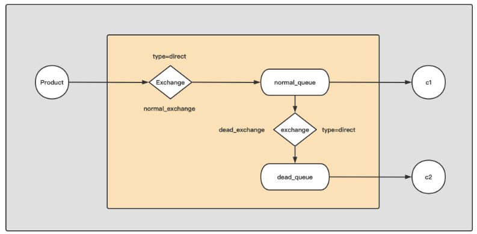

# RABBITMQ
## 事务

	txSelect()：将当前channel设置成transaction模式。
	txCommit()：提交事务。
	txRollback()：回滚事务。

Tx puts the channel into transaction mode on the server.  All publishings and
acknowledgments following this method will be atomically committed or rolled
back for a single queue.  Call either Channel.TxCommit or Channel.TxRollback to
leave a this transaction and immediately start a new transaction.

The atomicity across multiple queues is not defined as queue declarations and
bindings are not included in the transaction.

The behavior of publishings that are delivered as mandatory or immediate while
the channel is in a transaction is not defined.

Once a channel has been put into transaction mode, it cannot be taken out of
transaction mode.  Use a different channel for non-transactional semantics.

总结:

	不常用

## 各种队列
### 仲裁队列
仲裁队列是 3.8 版本以后才有的新功能，用来替代镜像队列，属于主从模式，支持基于 Raft 协议强一致的主从数据同步。虽然请求仍然都是由主节点进行操作，然后同步到从节点中。但是对于任何节点来说，既可能是某个仲裁队列的主节点，也可能是其它仲裁队列的从节点。因此也具有分散节点压力，提高并发访问的特点。另外如果主节点挂了，其中的某个从节点就会变成主节点，并在其它节点上尽可能创建出新的主节点，保障主从数量一致。

一个仲裁队列的默认数量是 5，即一个主节点，4个副本节点，如果集群中节点数量少于 5 ，比如我们搭建了 3 个节点的集群，那么创建的仲裁队列就是 1 主 2 副本。当然如果集群中的节点数大于 5 个的话，那么就只会在 5 个节点中创建出 1 主 4 副本。
### 优先级队列
RabbitMQ一开始并没有优先级队列，而是在3.5.0版本才实现的优先级队列。

RabbitMQ的优先级队列可以让优先级高的消息先被消费者消费，优先级低的消息后被消费者消费。优先级的最大值为255，最小值为0（默认值），值越大，优先级越高，优先级越高，越先被消费者消费。

注意：优先级设置的过多，会使用更多的Erlang进程来消耗更多的CPU资源，因此，推荐优先级的值介于1和10之间
RabbitMQ不支持通过策略的方式设置队列的优先级！因此，等到流量大了，再想设置优先级，已经晚了，除非停机，但这是不可能的。

可以使用队列参数x-max-priority设置队列的最大优先级。
设置消息的优先级 Priority 

### 备份队列
### 死信队列
定义:

	一般来说，Producer 将消息投递到 Broker 或者直接到 Queue 里了，Consumer 从 Queue 取出消息进行消费，但某些时候由于特定的原因导致 Queue 中的某些消息无法被消费，这样的消息如果没有后续的处理，就变成了死信，有死信自然就有了死信队列。

应用场景:

	为了保证订单业务的消息数据不丢失，需要使用到 RabbitMQ 的死信队列机制，当消息消费发生异常时，将消息投入到死信队列中。还有比如说：用户在商城下单成功并点击支付后再指定时间未支付时自动失效。

#### 产生原因

	消息 TTL 过期
		队列统一设置过期时间 x-message-ttl
		单独设置消息的过期时间 Expiration
		如果两者都设置了过期时间，以时间短的为准。
	队列达到最大长度（队列满了，无法再添加数据到 mq 中）
		队列长度设置 x-max-legth
	消息被拒绝（basic.reject 或 basic.nack）并且 requeue=false（不再重新入队）如果不设置死信队列,消息将会被丢弃

#### 死信对消息的影响

	交换机的名称会改变
		进入死信交换机的消息中exchangeName将会变为死信交换机的名称
	
	消息路由可能发生改变
		如果我们配置了 x-dead-letter-routing-key 指定死信路由键,那么消息的路由将变成x-dead-letter-routing-key,否则不变

	消息头发生改变
		一条消息变为死信消息之后，其Header中会有一些额外的参数。

			x-first-death-exchange
			第一次成为死信之前的交换机的名称。

			x-first-death-reason
			第一次成为死信的原因。

				rejected：由于default-requeue-rejected 参数被设置为false，消息在重新进入队列时被拒绝。

				expired ：消息的存活时间超过了设置的过期时间。

				maxlen ： 队列内消息数量超过队列最大容量。

				delivery_limit：消息返回的次数超过了限制（通过仲裁队列的策略参数delivery-limit设置）

			x-first-death-queue
			第一次成为死信之前的队列的名称。

			x-death
			历次被投入死信交换机的信息列表，同一个消息每次进入一个死信交换机，这个数组的信息就会被更新
				x-death是一个json串，其有以下几个属性：

				reason：该消息变为死信消息的原因

				count：该消息投递到死信队列中的次数

				exchange：该消息在投递到死信队列之前的交换机

				time：该消息被投递到死信队列的时间戳

				routing-keys：该消息在投递到死信队列之前的路由键

				queue：该消息在投递到死信队列之前所在的队列

				original-expiration：消息的原始过期属性。如果一个消息是因为超过存活时间而过期，会展示这个属性。另外，过期属性将从死信消息中删除，以防止其再次过期。

#### 架构

### 延时队列
方法1:

	通过DLX+TTL(死信队列+过期时间)
	发送信息给normal,normal不进行消费,并且配置死信队列,消息过期后,投递到死信队列,死信队列进行业务处理(完成延时)

	需要注意通过RabbitMDLX+TTL实现延迟队列，虽然一定程度上能解决问题，但是并不完美，尤其是对于消息的超时时间不固定的场景

	也就是说,设置过期时间有两种方式,第一种是为队列设置过期时间,这个时候如队的所有消息的过期时间都是一定的,如果有消息过期,则立刻进行处理(丢掉或者转发到死信队列)
	第二种方式是设置消息的过期时间,不设置队列的过期时间,此时该消息只有在消费时候才进行判断与处理

	当同时设置了消息过期时间与队列过期时间,则以时间短的设置模式为准
方法2:

	可以使用rabbitmq-delayed-message-exchange插件,安装成功后
	创建 类型为x-delayed-message交换机, 然后在创建交换机的时候指定x-delayed-type参数为direct,作为业务交换机,生产者发送消息时候不在指定过期时间,而是在消息的headers中添加x-delay参数指定延迟时间,这样不需要配置死信队列了,消费者接收到的消息顺序是按照x-delay参数的决定的,x-delay越短,则消息越先被接收
总结:
	推荐使用rabbitmq-delayed-message-exchange插件

## 公平性
在开启消费确认,RabbitMQ 提供了一种 qos （服务质量保证）功能，即在非自动确认消息的前提下，如果一定数目的消息（Channel.Qos）未被确认前，不进行消费新的消息。

	global参数:When global is true, these Qos settings apply to all existing and future consumers on all channels on the same connection. When false, the Channel.Qos settings will apply to all existing and future consumers on this channel.当次参数未ture,表示同一connection下生成的所有channel均会应用次配置,如果未false,只应用于当前channel产生的消费者
	
	To get round-robin behavior between consumers consuming from the same queue on different connections, set the prefetch count to 1, and the next available message on the server will be delivered to the next available consumer. 如果是不同的connection对同一queue的消费,配置 prefetch count=1来实现负载均衡(公平发送)

	prefetch_size 一般设置未0,表示对消息的大小不做设置(生产环境有可能产生OOM)

	prefetch_count 表所当前consumer在未ack之前,能够预先获取到几次消息,比如设置为2,表示该consumer能够先获取两次消息(消息的处理为异步处理,需要一定的处理时间才能够ack,能够同一时间接收大量消息)第三次获取消息时,由于前两次消息尚未ack,此时第三次消息是收不到的

Qos的原理:

	prefetch count指定了该信道上未确认传递的消息的最大数量
	原理是有一个未确认的传递标签（delivery tags，一个64位的long类型的数字，最大值是9223372036854775807）的滑动窗口。通过qos参数设置预取值（prefetch count），来限制这个滑动窗口的大小,该值设置为0，表示不限制prefetch count的大小，这有可能导致消费者端OOM
## 两种消费模式
	拉模式
	channel.Get 每次获取一条
	推模式
	channel.Consume 返回一个channel,消息通过channel发送过来,可以使用range channel实现对推送的消息处理
## 可靠性

### 生产者可靠性

	1.1生产者重连
	1.2生产者确认
		1.2.1 发送到Exchange
		1.2.2 由Exchange投递给queue 
	发送给exchange的失败由DefferedConfirmWithContext判断
	而由exchange发送到queue失败由NotifyReturn监听
	NotifyReturn registers a listener for basic.return methods.  These can be sent
	from the server when a publish is undeliverable either from the mandatory or
	immediate flags.(打开mandatory 或者immediate 才能监听NotifyReturn)

### 消费者可靠性
	消费者确认
		消费者获取消息后通过ack告诉queue该消息是否已经消费
## 队列的排他性说明
exclusive 参数

Exclusive queues are only accessible by the connection that declares them and
will be deleted when the connection closes.  Channels on other connections
will receive an error when attempting  to declare, bind, consume, purge or
delete a queue with the same name.
(为true时候,即使开启了durable,一旦connection 关闭,队列就会消失,且只能被该connection访问,其他的connetion在执行 declare,bind,consume,purege,delete 该queue都会报错)
## 消费排他性说明
When exclusive is true, the server will ensure that this is the sole consumer
from this queue. When exclusive is false, the server will fairly distribute
deliveries across multiple consumers.
(Consume时候如果申明了exclusive为true,其他的consumer时不能消费该queue的)
## queue持久化说明
和队列相关的参数有两个:durable,autodelete
建议配置 durable:ture auto_delete: false


Durable and Non-Auto-Deleted queues will survive server restarts and remain when there are no remaining consumers or bindings.  Persistent publishings will
be restored in this queue on server restart.  These queues are only able to be
bound to durable exchanges.
(持久化 不自动删除, 服务重启后队列依然存在,服务没有重启前没有consumer连接也会保持,只能和持久化的exchanger绑定)

Non-Durable and Auto-Deleted queues will not be redeclared on server restart
and will be deleted by the server after a short time when the last consumer is
canceled or the last consumer's channel is closed.  Queues with this lifetime
can also be deleted normally with QueueDelete.  These durable queues can only
be bound to non-durable exchanges.
(非持久化 自动删除,服务重启后队列消失,服务没有重启前,如果没有consumer会在短时间内删除队列,只能绑定非持久化的excchanger)
Non-Durable and Non-Auto-Deleted queues will remain declared as long as the
server is running regardless of how many consumers.  This lifetime is useful
for temporary topologies that may have long delays between consumer activity.
These queues can only be bound to non-durable exchanges.
(非持久化, 不自动删除,服务重启后队列消失,服务没有重启前没有consumer连接也会保持,只能和非持久化的exchanger绑定)
Durable and Auto-Deleted queues will be restored on server restart, but without active consumers will not survive and be removed.  This Lifetime is unlikely to be useful.
(持久化,自动删除 在重启后队列会恢复,但是如果没有消费者连接队列时,队列将会被删除,该种模式不常用)
## 交换机配置说明
Each exchange belongs to one of a set of exchange kinds/types implemented by
the server. The exchange types define the functionality of the exchange - i.e.
how messages are routed through it. Once an exchange is declared, its type
cannot be changed.  The common types are "direct", "fanout", "topic" and
"headers".
(一旦交换机的类型声明后就不能更改,常见的类型有 direct fanout topic headers)

Durable and Non-Auto-Deleted exchanges will survive server restarts and remain
declared when there are no remaining bindings.  This is the best lifetime for
long-lived exchange configurations like stable routes and default exchanges.
(持久化,非自动删除 重启服务后会依然存在,在没有绑定某个queue时候会依然存在)

Non-Durable and Auto-Deleted exchanges will be deleted when there are no
remaining bindings and not restored on server restart.  This lifetime is
useful for temporary topologies that should not pollute the virtual host on
failure or after the consumers have completed.
(非持久化,自动删除,重启服务后消失,没有绑定某个queue时会删除)

Non-Durable and Non-Auto-deleted exchanges will remain as long as the server is
running including when there are no remaining bindings.  This is useful for
temporary topologies that may have long delays between bindings.
(非持久化,非自动删除,重启服务后消失,没有绑定某个queue时会保持)
Durable and Auto-Deleted exchanges will survive server restarts and will be
removed before and after server restarts when there are no remaining bindings.
These exchanges are useful for robust temporary topologies or when you require
binding durable queues to auto-deleted exchanges.
(持久化,自动删除 重启服务后出现,但是一旦没有绑定某个queue,会自动删除,适合绑定持久化,自动删除的queue)

Note: RabbitMQ declares the default exchange types like 'amq.fanout' as
durable, so queues that bind to these pre-declared exchanges must also be
durable.
(rabbitmq 提供的一些默认交换机都是持久化的,因此和这些持久化交换机绑定的queue一定也要持久化的)

Exchanges declared as `internal` do not accept publishings. Internal
exchanges are useful when you wish to implement inter-exchange topologies
that should not be exposed to users of the broker.
(internal 表示该交换机不能接受生产者发送,死信队列可以采用)
## 队列的长度与溢出

### 队列长度限制

队列长度的最大限制分为两种情况：

		队列中消息的总量（max-length）
		队列中消息的总字节数（max-length-bytes）。

我们可以只设置其中一个，也可两个同时设置。
注意，只有处于ready状态（在RabbitMQ中，消息有2种状态：ready 和 unacked）的消息被计数，未被确认的消息不会受到limit的限制

### 队列长度配置
	
	x-max-length-bytes 设置队列中可以存储处于ready状态消息的数量。
	x-max-length 队列中可以存储处于ready状态消息占用内存的大小(只计算消息体的字节数，不计算消息头、消息属性占用的字节数)
### 队列的溢出

当设置了最大队列长度或大小并达到最大值时，x-overflow属性默认的处理策略是丢掉队列的头部的消息，或者将队列头部的消息投递到死信交换机
当然也可以通过x-overflow参数来指定处理逻辑。
x-overflow参数的可选值有

	drop-head
	丢弃队列头部的消息（默认的处理策略）。

	reject-publish
	丢弃队列尾部的消息。

	reject-publish-dlx
	丢弃队列尾部的消息，并拒绝发送消息到死信交换机。

另外，如果启用了发布确认功能，生产者将会收到一个nack响应
如果消息被路由到多个队列并被其中至少一个队列拒绝，则信道将通过basic.nack通知发布者。
## 交换机类型

在RabbitMQ中，常用的有4中Exchange，分别是direct、topic、fanout、headers,当然,mq提供了插件能力,可以通过安装插件的方式支持其他类型的交换机,如x-delayed-message交换机

默认的交换机，称为default exchange，其本质也是一个direct exchange

### direct 交换机
此种类型的交换机是通过routing key 和队列绑定在一起的。
通过一个routing key，交换机可以绑定一个队列，也可以同时绑定多个队列。
如果一个交换机绑定了多个队列，则交换机会将消息分别路由给每一个队列，也就是说每个队列都会得到一份全量的消息。
### topic 交换机
和direct exchange类似，topic exchange也是根据routing key，将exchange和queue绑定在一起。

区别在于，direct exchange的routing key 是精确匹配，而topic exchange的的routing key 是模式匹配，类似于正则表达式匹配。

routing key 可以是类似 *.orange.* 或者 lazy.# 的表达式。其中，* (星) 代表一个单词，# (hash) 代表0个或多个单词。
### fanout 交换机
和direct exchange、topic exchange不同，fanout exchange不使用routing key，它会将消息路由到所有与其绑定的队列。

fanout exchange是消息广播路由的理想选择。

和direct exchange的一个交换机绑定多个队列的情况一样，绑定了fanout exchange的队列，都会接收到一份全量的消息。
### header 交换机
headers exchange是根据Message的一些头部信息来分发过滤Message的，它会忽略routing key的属性，如果Header信息和message消息的头信息相匹配，那么这条消息就匹配上了。

有一个重要参数x-match：当“x-match”参数设置为“any”时，只要一个匹配的header 属性值就足够了；当“x-match”设置为“all”时，意味着所有值都必须匹配，才能将交换机和队列绑定上。
## 面试问题
### 如何保证消息的顺序性
	
	1. 一个queue,一个consumer
	2. 开启多个queue,每个queue对应一个consumer,需要顺序处理的数据依次发送给某个queue,这样这一批有序数据的消费也就有序了(也要保证消费者的顺序消费),处理这批有效数据过程中,如果出错,则对最后一条消息使用Nack(multi=ture),来对这批顺序消息都进行丢弃
	3. 事务?
### 如何保证消息不丢失
	生产者确认
	消费者确认
	高可用集群
### 如何保证消息的幂等性
	消费成功,但是消费ack丢失导致mq认为消息未被消费而重新入队,重新发送给消费者
	唯一主键


## github.com/rabbitmq/amqp091-go 记录
QueueDeclare:

	durable: 持久化,如果是false,表明在重启后queue消失
	auto_deleted: 如果没有消费者连接,会自动删除

Pubulish:

	immediate: ture消息发送到队列发现无消费者,那么就不会存入队列,与路由键匹配的所有队列都无消费者,则将返回给生产者,false将会丢弃
	mandatory: ture交换器无法根据自身类型和路由找到一个符合的队列,那么就会返回给生产者

Delivery:
```Go
//Delivery 表示接收到的消息

type Delivery struct {
	Acknowledger Acknowledger // the channel from which this delivery arrived

	Headers Table // Application or header exchange table

	// Properties
	ContentType     string    // MIME content type
	ContentEncoding string    // MIME content encoding
	DeliveryMode    uint8     // queue implementation use - non-persistent (1) or persistent (2)
	Priority        uint8     // queue implementation use - 0 to 9
	CorrelationId   string    // application use - correlation identifier
	ReplyTo         string    // application use - address to reply to (ex: RPC)
	Expiration      string    // implementation use - message expiration spec
	MessageId       string    // application use - message identifier
	Timestamp       time.Time // application use - message timestamp
	Type            string    // application use - message type name
	UserId          string    // application use - creating user - should be authenticated user
	AppId           string    // application use - creating application id

	// Valid only with Channel.Consume
	ConsumerTag string

	// Valid only with Channel.Get
	MessageCount uint32

	DeliveryTag uint64
	Redelivered bool
	Exchange    string // basic.publish exchange
	RoutingKey  string // basic.publish routing key

	Body []byte
}

func (d Delivery) Ack(multiple bool) error //若为true，则当前消息和同一通道上所有先前未确认的消息将被确认
func (d Delivery) Reject(requeue bool) error //若为true，server会将被消费端拒绝的消息重新入列，若为false，则会丢弃消息
func (d Delivery) Nack(multiple, requeue bool) error // requeue 若为true，server会将被消费端拒绝的消息重新入列，若为false，则会丢弃消息
                                                     // multiple若为true，则当前消息和同一通道上所有先前未确认的消息将不被确认,若为false,表示当前消息不被确认

```
DeferredConfirmation

```Go
//表示发布确认
type DeferredConfirmation struct {
	DeliveryTag uint64
	// contains filtered or unexported fields
}

func (d *DeferredConfirmation) Acked() bool //返回调用该函数时候的发布是否确认,如果没有受到确认或者收到拒绝的确认消息
func (d *DeferredConfirmation) Done() <-chan struct{}
func (d *DeferredConfirmation) Wait() bool //阻塞直至发布确认,返回值true表示发布确认
func (d *DeferredConfirmation) WaitContext(ctx context.Context) (bool, error)
````