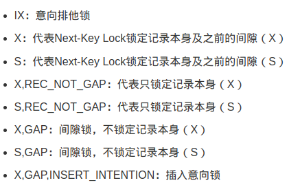

https://huyuyang.blog.csdn.net/article/details/123508245
## 含义

## 间隙锁规则
举例:
Next-Key Lock：相当于Record Lock+Gap Lock，对【某一个行记录】和【这条记录与它前一条记录之间的范围/间隙】都上锁，这里我们称它为邻键锁。假如一个索引有2、4、5、9、12 五个值，那该索引可能被邻键锁锁的范围为(-∞ , 2],(2 , 4],(4 , 5],(5 , 9],(9 , 12],(12 , +∞)

!!!需要注意的是4,5之间不存在整数,但是在MYSQL中理解是存在间隙的


在InnoDB中，加锁的基本单位是Next-Key Lock，只不过在某些特殊情况下会退化为 Record Lock 或者 Gap Lock


在RC隔离级别下加锁的情况跟在RR隔离级别下差不多，不同的是RC隔离级别下只会对记录加Record Lock，不会加Gap Lock 和 Next-Key Lock

## supremum pseudo-record
间隙锁

如果查询的值超过索引中最大值，锁类型变为X锁，被锁的最大行为supremum pseudo-record，它是索引中的伪记录，表示索引中可能存在的最大值。此时，锁的范围扩大到正无穷
## 注意事项
唯一索引上的范围查询会访问到不满足条件的第一个值为止
### 准备工作
```SQL
desc foreign_key_many_to_many_user;
```
```Bash
+--------------+-----------------+------+-----+---------+----------------+
| Field        | Type            | Null | Key | Default | Extra          |
+--------------+-----------------+------+-----+---------+----------------+
| id           | bigint          | NO   | PRI | NULL    | auto_increment |
| user_name    | varchar(191)    | YES  | UNI | NULL    |                |
| user_info    | longtext        | YES  |     | NULL    |                |
| deleted_flag | bigint unsigned | YES  | MUL | NULL    |                |
+--------------+-----------------+------+-----+---------+----------------+
```
```SQL
show index from foreign_key_many_to_many_user;
```
```BASH
+-------------------------------+------------+-----------+--------------+--------------+-----------+-------------+----------+--------+------+------------+---------+---------------+---------+------------+
| Table                         | Non_unique | Key_name  | Seq_in_index | Column_name  | Collation | Cardinality | Sub_part | Packed | Null | Index_type | Comment | Index_comment | Visible | Expression |
+-------------------------------+------------+-----------+--------------+--------------+-----------+-------------+----------+--------+------+------------+---------+---------------+---------+------------+
| foreign_key_many_to_many_user |          0 | PRIMARY   |            1 | id           | A         |           2 |     NULL |   NULL |      | BTREE      |         |               | YES     | NULL       |
| foreign_key_many_to_many_user |          0 | user_name |            1 | user_name    | A         |           2 |     NULL |   NULL | YES  | BTREE      |         |               | YES     | NULL       |
| foreign_key_many_to_many_user |          1 | u_flag    |            1 | deleted_flag | A         |           1 |     NULL |   NULL | YES  | BTREE      |         |               | YES     | NULL       |
+-------------------------------+------------+-----------+--------------+--------------+-----------+-------------+----------+--------+------+------------+---------+---------------+---------+------------+
```
```SQL
select * from foreign_key_many_to_many_user;
```
```BASH
+----+-----------+---------------+--------------+
| id | user_name | user_info     | deleted_flag |
+----+-----------+---------------+--------------+
|  1 | user1     | this is user1 |            1 |
|  2 | user2     | this is user2 |            2 |
|  3 | user3     | this is user3 |            3 |
+----+-----------+---------------+--------------+
```
!!!下列查询均在事务中执行
## 主键
### 等值查询,存在
查询条件为主键索引时，如果查询条件是等值查询且记录存在，只对符合条件的记录加记录锁(只锁符合条件的记录)
```SQL
select * from foreign_key_many_to_many_user where id=1 lock in share mode;
select * from foreign_key_many_to_many_user where id=1 for update;
```
```BASH
+---------------+-------------------------------+------------+-----------+---------------+-----------+
| object_schema | object_name                   | index_name | lock_type | lock_mode     | lock_data |
+---------------+-------------------------------+------------+-----------+---------------+-----------+
| gormDemo      | foreign_key_many_to_many_user | NULL       | TABLE     | IS            | NULL      |
| gormDemo      | foreign_key_many_to_many_user | PRIMARY    | RECORD    | S,REC_NOT_GAP | 1         |
+---------------+-------------------------------+------------+-----------+---------------+-----------+


+---------------+-------------------------------+------------+-----------+---------------+-----------+
| object_schema | object_name                   | index_name | lock_type | lock_mode     | lock_data |
+---------------+-------------------------------+------------+-----------+---------------+-----------+
| gormDemo      | foreign_key_many_to_many_user | NULL       | TABLE     | IX            | NULL      |
| gormDemo      | foreign_key_many_to_many_user | PRIMARY    | RECORD    | X,REC_NOT_GAP | 1         |
+---------------+-------------------------------+------------+-----------+---------------+-----------+
```

### 等值查询 不存在
查询条件为主键索引时，如果查询条件是等值查询且记录不存在，会对查询条件所在间隙的下一条记录加间隙锁（相当于锁的范围就是查询条件所在间隙）
```SQL
select * from foreign_key_many_to_many_user where id=0 for update;
```
```BASH
+---------------+-------------------------------+------------+-----------+-----------+-----------+
| object_schema | object_name                   | index_name | lock_type | lock_mode | lock_data |
+---------------+-------------------------------+------------+-----------+-----------+-----------+
| gormDemo      | foreign_key_many_to_many_user | NULL       | TABLE     | IX        | NULL      |
| gormDemo      | foreign_key_many_to_many_user | PRIMARY    | RECORD    | X,GAP     | 1         |
+---------------+-------------------------------+------------+-----------+-----------+-----------+
```
### 范围查询 不存在
查询条件为主键索引时，如果查询条件是范围查询且记录不存在，会对查询条件所在范围的下一条记录加间隙锁（相当于锁的范围还是查询条件对应的区间）
```SQL
select * from foreign_key_many_to_many_user where id<1 for update;
```
```BASH
+---------------+-------------------------------+------------+-----------+-----------+-----------+
| object_schema | object_name                   | index_name | lock_type | lock_mode | lock_data |
+---------------+-------------------------------+------------+-----------+-----------+-----------+
| gormDemo      | foreign_key_many_to_many_user | NULL       | TABLE     | IX        | NULL      |
| gormDemo      | foreign_key_many_to_many_user | PRIMARY    | RECORD    | X,GAP     | 1         |
+---------------+-------------------------------+------------+-----------+-----------+-----------+
```


### 范围查询 存在/不存在
查询条件为主键索引时，如果查询条件是范围查询且记录存在，会对符合条件的记录加邻键锁，对剩余未加锁的间隙的下一条记录加间隙锁（相当于锁的范围就是查询条件对应的区间）

举例
ID为主键,存在的值为
2,4,5,9,12
如果查询为
id>4 and id<=8
加锁范围是 5的邻键锁(4,5],9的间隙锁(5,9)
id>4 and id<=9
加锁范围是 5的邻键锁(4,5],9的邻键锁(5,9)
id>=4 and id<9
加锁范围是 4的邻键锁(2,4],5的邻键锁(4,5],9的间隙锁(5,9)

在<=8.0.13版本 <=5.7.24版本外
范围查询中,如果表中的最大值存在于查询范围内,会加supremum pseudo-record邻键锁
如
id>9
加锁范围是,12的邻键锁(9,12],supremum pseudo-record邻键锁

```SQL
select * from foreign_key_many_to_many_user where id>1 lock in share mode;
select * from foreign_key_many_to_many_user where id>1 for update;
```
```BASH
+---------------+-------------------------------+------------+-----------+-----------+------------------------+
| object_schema | object_name                   | index_name | lock_type | lock_mode | lock_data              |
+---------------+-------------------------------+------------+-----------+-----------+------------------------+
| gormDemo      | foreign_key_many_to_many_user | NULL       | TABLE     | IS        | NULL                   |
| gormDemo      | foreign_key_many_to_many_user | PRIMARY    | RECORD    | S         | supremum pseudo-record |
| gormDemo      | foreign_key_many_to_many_user | PRIMARY    | RECORD    | S         | 2                      |
| gormDemo      | foreign_key_many_to_many_user | PRIMARY    | RECORD    | S         | 3                      |
+---------------+-------------------------------+------------+-----------+-----------+------------------------+


+---------------+-------------------------------+------------+-----------+-----------+------------------------+
| object_schema | object_name                   | index_name | lock_type | lock_mode | lock_data              |
+---------------+-------------------------------+------------+-----------+-----------+------------------------+
| gormDemo      | foreign_key_many_to_many_user | NULL       | TABLE     | IX        | NULL                   |
| gormDemo      | foreign_key_many_to_many_user | PRIMARY    | RECORD    | X         | supremum pseudo-record |
| gormDemo      | foreign_key_many_to_many_user | PRIMARY    | RECORD    | X         | 2                      |
| gormDemo      | foreign_key_many_to_many_user | PRIMARY    | RECORD    | X         | 3                      |
+---------------+-------------------------------+------------+-----------+-----------+------------------------+
```

```SQL
select * from foreign_key_many_to_many_user where id=5 lock in share mode;
select * from foreign_key_many_to_many_user where id=5 for update;
```
```BASH
+---------------+-------------------------------+------------+-----------+-----------+------------------------+
| object_schema | object_name                   | index_name | lock_type | lock_mode | lock_data              |
+---------------+-------------------------------+------------+-----------+-----------+------------------------+
| gormDemo      | foreign_key_many_to_many_user | NULL       | TABLE     | IS        | NULL                   |
| gormDemo      | foreign_key_many_to_many_user | PRIMARY    | RECORD    | S         | supremum pseudo-record |
+---------------+-------------------------------+------------+-----------+-----------+------------------------+


+---------------+-------------------------------+------------+-----------+-----------+------------------------+
| object_schema | object_name                   | index_name | lock_type | lock_mode | lock_data              |
+---------------+-------------------------------+------------+-----------+-----------+------------------------+
| gormDemo      | foreign_key_many_to_many_user | NULL       | TABLE     | IX        | NULL                   |
| gormDemo      | foreign_key_many_to_many_user | PRIMARY    | RECORD    | X         | supremum pseudo-record |
+---------------+-------------------------------+------------+-----------+-----------+------------------------+
```


## 唯一索引
即使当修改数据的条件是非主键索引，最终也得查找主键索引（真正要修改的数据页都是主键索引的叶节点~,但是当修改数据的条件是主键索引，是不需要去查找其他索引的

需要注意的是如果索引的字段是varchar类型,但是查询语句是数值
如:
number varchar(10)
查询语句是
number=123而非number="123"
此时会做自动通过隐式转换将类型123转换为"123"
会"锁表"


### 等值查询,存在
查询条件是唯一索引时，如果查询条件是等值查询且记录存在，除了会在唯一索引上对查到的记录加记录锁，也会在主键索引上对那些记录的主键对应位置上加记录锁。
```SQL
select * from foreign_key_many_to_many_user where user_name="user1" lock in share mode;
select * from foreign_key_many_to_many_user where user_name="user1" for update;
```
```BASH
+---------------+-------------------------------+------------+-----------+---------------+------------+
| object_schema | object_name                   | index_name | lock_type | lock_mode     | lock_data  |
+---------------+-------------------------------+------------+-----------+---------------+------------+
| gormDemo      | foreign_key_many_to_many_user | NULL       | TABLE     | IS            | NULL       |
| gormDemo      | foreign_key_many_to_many_user | user_name  | RECORD    | S,REC_NOT_GAP | 'user1', 1 |
| gormDemo      | foreign_key_many_to_many_user | PRIMARY    | RECORD    | S,REC_NOT_GAP | 1          |
+---------------+-------------------------------+------------+-----------+---------------+------------+

+---------------+-------------------------------+------------+-----------+---------------+------------+
| object_schema | object_name                   | index_name | lock_type | lock_mode     | lock_data  |
+---------------+-------------------------------+------------+-----------+---------------+------------+
| gormDemo      | foreign_key_many_to_many_user | NULL       | TABLE     | IX            | NULL       |
| gormDemo      | foreign_key_many_to_many_user | user_name  | RECORD    | X,REC_NOT_GAP | 'user1', 1 |
| gormDemo      | foreign_key_many_to_many_user | PRIMARY    | RECORD    | X,REC_NOT_GAP | 1          |
+---------------+-------------------------------+------------+-----------+---------------+------------+
```


### 等值查询 不存在
查询条件是唯一索引时，如果查询条件是等值查询且记录不存在，在唯一索引上，只会在查询条件所在间隙的下一条记录加间隙锁(同主键索引),在主键索引上不加锁
```SQL
select * from foreign_key_many_to_many_user where user_name="user5" for update;

select * from foreign_key_many_to_many_user where user_name="user0" for update;
```
```BASH
+---------------+-------------------------------+------------+-----------+-----------+------------------------+
| object_schema | object_name                   | index_name | lock_type | lock_mode | lock_data              |
+---------------+-------------------------------+------------+-----------+-----------+------------------------+
| gormDemo      | foreign_key_many_to_many_user | NULL       | TABLE     | IX        | NULL                   |
| gormDemo      | foreign_key_many_to_many_user | user_name  | RECORD    | X         | supremum pseudo-record |
+---------------+-------------------------------+------------+-----------+-----------+------------------------+


+---------------+-------------------------------+------------+-----------+-----------+------------+
| object_schema | object_name                   | index_name | lock_type | lock_mode | lock_data  |
+---------------+-------------------------------+------------+-----------+-----------+------------+
| gormDemo      | foreign_key_many_to_many_user | NULL       | TABLE     | IX        | NULL       |
| gormDemo      | foreign_key_many_to_many_user | user_name  | RECORD    | X,GAP     | 'user1', 1 |
+---------------+-------------------------------+------------+-----------+-----------+------------+
```

### 范围查询 存在

查询条件是唯一索引时，如果查询条件是范围查询且记录存在，在唯一索引上，会对查询到的记录加邻键锁，对剩余未加锁的间隙的下一条记录加邻键锁（不同于主键索引的情况,不会加间隙锁,而是邻键锁）
在主键索引上，会对在查询范围内的记录在主键索引上对应的位置加记录锁。


```SQL
select * from foreign_key_many_to_many_user where user_name>"user1" lock in share mode;
select * from foreign_key_many_to_many_user where user_name>"user1" for update;
```
```BASH
+---------------+-------------------------------+------------+-----------+---------------+------------------------+
| object_schema | object_name                   | index_name | lock_type | lock_mode     | lock_data              |
+---------------+-------------------------------+------------+-----------+---------------+------------------------+
| gormDemo      | foreign_key_many_to_many_user | NULL       | TABLE     | IS            | NULL                   |
| gormDemo      | foreign_key_many_to_many_user | user_name  | RECORD    | S             | supremum pseudo-record |
| gormDemo      | foreign_key_many_to_many_user | user_name  | RECORD    | S             | 'user2', 2             |
| gormDemo      | foreign_key_many_to_many_user | user_name  | RECORD    | S             | 'user3', 3             |
| gormDemo      | foreign_key_many_to_many_user | PRIMARY    | RECORD    | S,REC_NOT_GAP | 2                      |
| gormDemo      | foreign_key_many_to_many_user | PRIMARY    | RECORD    | S,REC_NOT_GAP | 3                      |
+---------------+-------------------------------+------------+-----------+---------------+------------------------+

+---------------+-------------------------------+------------+-----------+---------------+------------------------+
| object_schema | object_name                   | index_name | lock_type | lock_mode     | lock_data              |
+---------------+-------------------------------+------------+-----------+---------------+------------------------+
| gormDemo      | foreign_key_many_to_many_user | NULL       | TABLE     | IX            | NULL                   |
| gormDemo      | foreign_key_many_to_many_user | user_name  | RECORD    | X             | supremum pseudo-record |
| gormDemo      | foreign_key_many_to_many_user | user_name  | RECORD    | X             | 'user2', 2             |
| gormDemo      | foreign_key_many_to_many_user | user_name  | RECORD    | X             | 'user3', 3             |
| gormDemo      | foreign_key_many_to_many_user | PRIMARY    | RECORD    | X,REC_NOT_GAP | 2                      |
| gormDemo      | foreign_key_many_to_many_user | PRIMARY    | RECORD    | X,REC_NOT_GAP | 3                      |
+---------------+-------------------------------+------------+-----------+---------------+------------------------+
```

### 范围查询 不存在
查询条件是唯一索引时，如果查询条件是范围查询且记录不存在，在唯一索引上，会对查询条件所在间隙的下一条记录加邻键锁
在主键索引上不加锁

```SQL
select * from foreign_key_many_to_many_user where user_name<"user1" lock in share mode;
select * from foreign_key_many_to_many_user where user_name<"user1" for update;
```
```BASH
+---------------+-------------------------------+------------+-----------+-----------+------------+
| object_schema | object_name                   | index_name | lock_type | lock_mode | lock_data  |
+---------------+-------------------------------+------------+-----------+-----------+------------+
| gormDemo      | foreign_key_many_to_many_user | NULL       | TABLE     | IS        | NULL       |
| gormDemo      | foreign_key_many_to_many_user | user_name  | RECORD    | S         | 'user1', 1 |
+---------------+-------------------------------+------------+-----------+-----------+------------+


+---------------+-------------------------------+------------+-----------+-----------+------------+
| object_schema | object_name                   | index_name | lock_type | lock_mode | lock_data  |
+---------------+-------------------------------+------------+-----------+-----------+------------+
| gormDemo      | foreign_key_many_to_many_user | NULL       | TABLE     | IX        | NULL       |
| gormDemo      | foreign_key_many_to_many_user | user_name  | RECORD    | X         | 'user1', 1 |
+---------------+-------------------------------+------------+-----------+-----------+------------+
```


## 普通索引


### 等直查询 存在
查询条件是非唯一索引时，如果查询条件是等值查询且记录存在，在非唯一索引上，会对符合查询条件的记录加邻键锁,对剩余未加锁的间隙的下一条记录加间隙锁
在主键索引上，对符合查询条件的记录在主键索引对应的位置上加记录锁。
```SQL
select * from foreign_key_many_to_many_user where deleted_flag=1 for update;
select * from foreign_key_many_to_many_user where deleted_flag=1 lock in share mode;
```
```BASH
+---------------+-------------------------------+------------+-----------+---------------+-----------+
| object_schema | object_name                   | index_name | lock_type | lock_mode     | lock_data |
+---------------+-------------------------------+------------+-----------+---------------+-----------+
| gormDemo      | foreign_key_many_to_many_user | NULL       | TABLE     | IX            | NULL      |
| gormDemo      | foreign_key_many_to_many_user | u_flag     | RECORD    | X             | 1, 1      |
| gormDemo      | foreign_key_many_to_many_user | PRIMARY    | RECORD    | X,REC_NOT_GAP | 1         |
| gormDemo      | foreign_key_many_to_many_user | u_flag     | RECORD    | X,GAP         | 2, 2      |
+---------------+-------------------------------+------------+-----------+---------------+-----------+


+---------------+-------------------------------+------------+-----------+---------------+-----------+
| object_schema | object_name                   | index_name | lock_type | lock_mode     | lock_data |
+---------------+-------------------------------+------------+-----------+---------------+-----------+
| gormDemo      | foreign_key_many_to_many_user | NULL       | TABLE     | IS            | NULL      |
| gormDemo      | foreign_key_many_to_many_user | u_flag     | RECORD    | S             | 1, 1      |
| gormDemo      | foreign_key_many_to_many_user | PRIMARY    | RECORD    | S,REC_NOT_GAP | 1         |
| gormDemo      | foreign_key_many_to_many_user | u_flag     | RECORD    | S,GAP         | 2, 2      |
+---------------+-------------------------------+------------+-----------+---------------+-----------+
```
### 等值查询 不存在
查询条件是非唯一索引时，如果查询条件是等值查询且记录不存在，在非唯一索引上，会对符合查询条件所在间隙的下一条记录加间隙锁；在主键索引上不加锁

```SQL
select * from foreign_key_many_to_many_user where deleted_flag=4 lock in share mode;
select * from foreign_key_many_to_many_user where deleted_flag=4 for update;
-- 此处为邻键锁
```
```BASH
+---------------+-------------------------------+------------+-----------+-----------+------------------------+
| object_schema | object_name                   | index_name | lock_type | lock_mode | lock_data              |
+---------------+-------------------------------+------------+-----------+-----------+------------------------+
| gormDemo      | foreign_key_many_to_many_user | NULL       | TABLE     | IS        | NULL                   |
| gormDemo      | foreign_key_many_to_many_user | u_flag     | RECORD    | S         | supremum pseudo-record |
+---------------+-------------------------------+------------+-----------+-----------+------------------------+


+---------------+-------------------------------+------------+-----------+-----------+------------------------+
| object_schema | object_name                   | index_name | lock_type | lock_mode | lock_data              |
+---------------+-------------------------------+------------+-----------+-----------+------------------------+
| gormDemo      | foreign_key_many_to_many_user | NULL       | TABLE     | IX        | NULL                   |
| gormDemo      | foreign_key_many_to_many_user | u_flag     | RECORD    | X         | supremum pseudo-record |
+---------------+-------------------------------+------------+-----------+-----------+------------------------+
```

```SQL
select * from foreign_key_many_to_many_user where deleted_flag=0 for update;
-- 此处为间隙锁
```
```BASH
+---------------+-------------------------------+------------+-----------+-----------+-----------+
| object_schema | object_name                   | index_name | lock_type | lock_mode | lock_data |
+---------------+-------------------------------+------------+-----------+-----------+-----------+
| gormDemo      | foreign_key_many_to_many_user | NULL       | TABLE     | IX        | NULL      |
| gormDemo      | foreign_key_many_to_many_user | u_flag     | RECORD    | X,GAP     | 1, 1      |
+---------------+-------------------------------+------------+-----------+-----------+-----------+
```
### 范围查询 不存在
查询条件是非唯一索引时，如果查询条件是范围查询且记录不存在，在非唯一索引上，会对查询条件所在间隙的下一条记录加邻键锁（实际上加间隙锁就可以了）；在主键索引上不加锁。
### 范围查询 存在
查询条件是非唯一索引时，如果查询条件是范围查询且记录存在，在非唯一索引上，会对符合查询条件的记录加邻键锁，对剩余未加锁的间隙的下一条记录加邻键锁（实际上加间隙锁就可以了）；在主键索引上，对符合查询条件的记录在主键索引对应的位置上加记录锁。


## 对不加索引字段进行过滤查询
当查询条件为非索引时，无论是等值查询还是范围查询，无论是否存在查询结果，都会对表中所有的记录加邻键锁，也就是我们常说的“锁表”。
```SQL
select * from foreign_key_many_to_many_user where user_info="this is user3" for update;
```
```BASH
+---------------+-------------------------------+------------+-----------+-----------+------------------------+
| object_schema | object_name                   | index_name | lock_type | lock_mode | lock_data              |
+---------------+-------------------------------+------------+-----------+-----------+------------------------+
| gormDemo      | foreign_key_many_to_many_user | NULL       | TABLE     | IX        | NULL                   |
| gormDemo      | foreign_key_many_to_many_user | PRIMARY    | RECORD    | X         | supremum pseudo-record |
| gormDemo      | foreign_key_many_to_many_user | PRIMARY    | RECORD    | X         | 1                      |
| gormDemo      | foreign_key_many_to_many_user | PRIMARY    | RECORD    | X         | 2                      |
| gormDemo      | foreign_key_many_to_many_user | PRIMARY    | RECORD    | X         | 3                      |
+---------------+-------------------------------+------------+-----------+-----------+------------------------+
```


