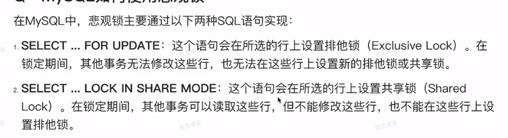
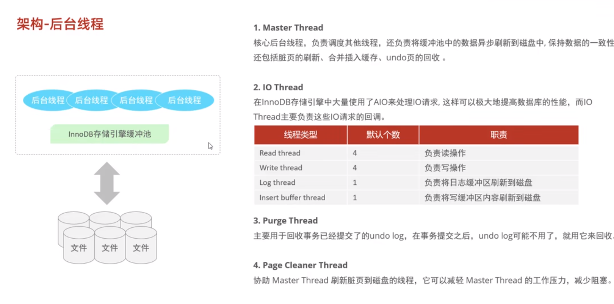

# MYSQL
MYSQL默认的delimeter是;,可以手动指定
## 数据库三范式

| 范式            | 描述                                                         |
| --------------- | ------------------------------------------------------------ |
| 第一范式（1NF） | 数据表中的每个字段都是原子性的，不可再分。每个字段只包含一个值，不允许多个值或者重复的值。 |
| 第二范式（2NF） | 数据表中的非主键字段必须完全依赖于主键，而不能依赖于主键的部分属性。换句话说，非主键字段必须与整个主键相关，而不是只与主键的一部分相关。 |
| 第三范式（3NF） | 数据表中的非主键字段不能传递依赖于其他非主键字段。换句话说，任何非主键字段应该直接依赖于主键，而不是依赖于其他非主键字段。 |

三范式总结:
    
    1 列的原子性
    2 消除部分依赖(非主键列不能只依赖主键(联合)的一部分)
    3 消除传递依赖(非主键列不能间接依赖于主键)
## sql语句类别

| 类别                                              | 说明                                                         |
| ------------------------------------------------- | ------------------------------------------------------------ |
| 数据查询语句（Data Query Language, DQL）          | 用于从数据库中检索数据的语句。常见的DQL语句包括SELECT、FROM、WHERE、GROUP BY、HAVING和ORDER BY等，用于查询和筛选数据。 |
| 数据操纵语句（Data Manipulation Language, DML）   | 用于对数据库中的数据进行增、删、改操作的语句。常见的DML语句包括INSERT、UPDATE和DELETE，用于插入、更新和删除数据。 |
| 数据定义语句（Data Definition Language, DDL）     | 用于定义数据库、表、列、索引等数据库对象的语句。常见的DDL语句包括CREATE、ALTER和DROP，用于创建、修改和删除数据库对象。 |
| 数据控制语句（Data Control Language, DCL）        | 用于授予或撤销用户对数据库对象的访问权限的语句。常见的DCL语句包括GRANT和REVOKE，用于授权和撤销权限。 |
| 事务控制语句（Transaction Control Language, TCL） | 用于管理数据库事务的语句。常见的TCL语句包括COMMIT、ROLLBACK和SAVEPOINT，用于提交、回滚和设置保存点。 |

这些不同类别的SQL语句用于执行不同的数据库操作。DQL语句用于查询和筛选数据，DML语句用于增、删、改数据，DDL语句用于定义数据库对象，DCL语句用于授权和撤销权限，TCL语句用于管理事务。通过使用不同类别的SQL语句，可以实现对数据库的各种操作和控制。
## 数据类型
### 字符类型
varchar 和 char的区别

### 日期类

    DATE        YYYY-MM-DD          1000-01-01 9999-12-31
    TIME        HH:MM:SS            -838:59:59  838:59:59
    YEAR        YYYY                1901 2155
    DATETIME    YYYY-MM-DD HH:MM:SS 1000-01-01 00:00:01 9999-12-31 23:59:59
    TIMESTAMP   YYYY-MM-DD HH:MM:SS 1970-01-01 00:00:01 2038-01-19 03:14:07

建议使用 DATE TIME DATETIME

### 数字类
float 浮点类型用于表示单精度浮点数值
double浮点类型用于表示双精度浮点数值
float 单精度浮点数在内存中占 4 个字节，并且用 32 位二进制进行描述
double双精度浮点数在内存中占 8 个字节，并且用 64 位二进制进行描述
根据IEEE二进制浮点数算术标准 来计算得出结论:

    float单精度小数部分只能精确到后面6位，加上小数点前的一位，即有效数字为7位
    double双精度小数部分能精确到小数点后的15位，加上小数点前的一位 有效位数为16位

decimal的使用语法是：decimal(M,D)，其中， M 的范围是1~65， D 的范围是0~30， 而且D不能大于M
decimal类型的数据存储形式是，将每9位十进制数存储为4个字节

小数的二进制保存方式:
将小数部分乘以2，取出结果整数部分作为二进制表示的第1位（从左向右）；再将结果的小数部分乘以2，将结果整数部分作为二进制表示的第2位；以此类推，直到小数部分为0
特殊情况： 小数部分出现循环，则用有限的二进制位无法完全表示一个小数，这也是在编程语言中表示小数会出现误差的原因

针对float情况，至少我们可以得出结论：
    1.如果一个float型数据转成二进制后的第32位之后都是0，那么数据是准的

    2.如果一个float型数据转成二进制后的第32位之后不全为0，则数据就会存在误差
## 函数

### 字符串函数

    CONCAT
    LOWER/UPPER
    LPAD/RPAD
    TRIM
    SUBSTRING(索引从0开始,左闭右闭)
    REVERSE
### 数值函数

    CEIL (向上取整数)
    FLOOR (向下取整)
    MOD (余数)
    RAND (0,1直接的随机数)
    ROUND  (求参数x的四舍五入,保留y位小数)

### 日期函数(xxxx-xx-xx xx:xx:xx)

    CURDATE
    CURTIME
    NOW
    YEAR
    MONTH
    DAY
    DATE_ADD (select date_add(now(),INTERVAL 8 HOUR))
    DATEDIFF

### 流程控制函数
    IF (VALUE,T,F)
    IFNULL (VALUE1,VALUE2)
    CASE WHEN [VALUE1] THEN [RESULT1] ELSE [DEFAULT] END
    CASE EXPR WHEN [VALUE1] THEN [RESULT1] ELSE [DEFAULT] END
```SQL
#如果第一个参数为True,则返回第二个值,否则返回第三个值
set @A=1;
SELECT IF(@A=1,"A=1","A!=1")

#如果第一个参数是NULL,则返回第一个值,否则返回第二个值
set @A=NULL;
SELECT IFNULL(@A IS NULL, "A IS NOT NULL")

set @A=3

select (CASE @A+1 WHEN 1 THEN "A=0" WHEN 2 THEN "A=1" ELSE "A!=1 AND A!=2" END) as "A RESULT"


set @A=3
select (CASE WHEN @A+1=2 THEN "A==1" WHEN @A+1=3 THEN "A==2" ELSE "A!=1 AND A!=2" END) as "A RESULT"

```
## 约束
作用于表中字段上的规则,限制表中的数据
### 分类
    
    非空约束
    唯一约束
    主键约束
    默认约束
    检查约束 CHECK
    外键约束 复合外键

外键删除/更新

ON UPDATE CASCADE 在主表更新外键关联的键时,从表的外键也会随着更新
ON UPDATE SET NULL 在主表更新外键关联的键时,从表的外键会SET NULL

```SQL
CREATE TABLE TEST(
    CODE INT CHECK(CODE>0 AND CODE <100)
)

ADD CONSTRAINT xxxForeignKeyName FOREIGN KEY (yyyColumn) REFERENCE xxxTAble(xxxColumn) ON UPDATE xxx ON DELETE xxx;

CREATE TABLE xxx(
    CONSTRAINT xxxForeignKeyName FOREIGN KEY (yyyColumn) REFERENCE xxxTAble(xxxColumn) ON UPDATE xxx ON DELETE xxx;
)
# 不会删除字段,只会删除约束关系
ALTER TABLE DROP  FOREIGN KEY xxxForeignKeyName
```


## 多表关系
### 一对一

    设置FOREIGN KEY 并设置其为 UNIQUE

### 多表查询
#### join的原理与join的索引优化
```SQL
select * from A join B on A.id=B.id;
```
对于上述的查询过程,称A为驱动表,B为被驱动表
在B的id字段设置索引的前提下,整个的查询逻辑是:
    
    1 从A表中读取一行数据 r
    2 从数据 r中取出字段 A.id到表B中进行匹配
    3 取出B表中符合条件的行，和A表中的查询结果组成一行(多行)作为结果集的一部分
    4 重复执行步骤 1-3，直到表A循环数据

该过程称之为 Index Nested-Loop Join
由于B的id字段设置了索引,因此在B表中的数据查询是高效的

在B的id字段没有设置索引的前提下,整个的查询逻辑是:
    
    1 从A表中查询出所有的查询数据放入JOIN_BUFFER中
    2 从B中循环查询数据,和JOIN_BUFFER中的数据一一对比,满足的数据再去做合并

默认大小的join_buffer_size大小为256K
```SQL
SHOW VARIABLES LIKE '%join_buffer_size%';
```
如果A表的数据很大,JOIN_BUFFER一次性放不下,此时会对A表的数据进行分块查询,执行逻辑和上述的B的id没有设置索引的前提下逻辑是一致的,但是由于A表的分块扫描,但是导致JOIN_BUFFER有多次的写入与清除,会影响速度(可以增大JOIN_BUFFER_SIZE做一定程度的缓解)

正确的做法:

    有索引的情况下,join语句执行过程中，驱动表是走全表扫描，而被驱动表是走树搜索,因此应该是小表作为驱动表

    没有索引的情况下,因为 join_buffer 因为存在限制，所以查询的过程可能存在多次加载 join_buffer,但是被驱动表的扫描次数是固定的(驱动表有多少条数据,被驱动表就要被重复扫描多少次),为了节省join_buffer的加载与清除的次数,所以应该选择小表驱动

#### 内连接
```SQL
select A.A1,B.B1 FROM A,B WHERE A.A1=B.A1
select A.A1,B.B1 INNER JOIN B ON A.A1=B.A1
select A.A1,B.B1 JOIN B ON A.A1=B.A1
```
#### 外连接
left join 和left outer join 相同
right join 和right outer join 相同
#### 自连接
同一张表,通过起别名看作两张表

#### 非等值连接
```SQL
SELECT e.emp_no,e.salary,s.salary_level_name 
FROM salaries as e 
inner join salary_level as s 
ON e.salary 
BETWEEN s.low and s.high
```

#### 联合查询 union union all
联合查询的条件:查询结果的列数保持一致,字段类型保持一致
union 会去重
union all 不会去重

```SQL
select ...
union
select ...
```

### 子查询
注意子查询中的变量由外部查询提供
```SQL
select salary,emp_no from salaries as s where salary<(select avg(salary) from salaries  where emp_no=s.emp_no);
```
上述查询中,子查询中的emp_no由外部的查询提供
#### 结果分类
根据查询结果分类:

    标量子查询
    列子查询
    行子查询
    表子查询
标量子查询

列子查询中常用的操作符

    IN
    NOT IN
    ANY/SOME
    ALL
```SQL
SELECT s.emp_no,s.salary 
FROM salaries as s 
WHERE s.salary>ALL
(
    SELECT salary 
    FROM salaries 
    WHERE emp_no>10001
)
```

行子查询
```SQL
# 一条数据
SELECT s.emp_no,s.salary
FROM salaries as s 
WHERE (s.salary,s.emp_no) = (
    SELECT salary,emp_no FROM salaries WHERE emp_no=10001 and salary=60117
)
```
表子查询
查询结果多行多列
in 只要满足就其中任意一个字段就可以
```SQL
SELECT s.emp_no,s.salary
FROM salaries as s 
WHERE (s.salary,s.emp_no) in (
    SELECT salary,emp_no FROM salaries WHERE emp_no=10001 and salary=60117
)
```
#### 查询位置分类
根据查询位置分类:

    WHERE 之后
    FROM 之后
    SELECT 之后
## 存储过程
事先编译并存储在数据库的一段SQL语句集合
理解为SQL语言层面的封装和重用
```SQL
create procedure xxx(parm)
begin
 statement
end;
select * from information_schema.routines where routine_shema="table_name";--此处查看的是table级别的
show create procedure  xxx;
drop procedure if exists xxx ;
call xxx(parm)
```
### 变量
#### 系统变量
全局变量
会话变量
```SQL
show global/session variables;
show global/session variables like 'xxx';
select @@global/@@session.xxx;
set global/session xxx=xxx;
set @@global/@@session.xxx=xxx;
```
如果没有指定级别,默认为session
服务重启后,手动设置的全局变量会失效,如果要不失效,需要在配置文件中进行配置

#### 用户自定义变量
作用域为当前连接
```SQL
SET @var_name=xxx;
SET @var_name:=xxx;
SET @var_name=xxx,@var_name2=xxx2;
SELECT @var_name=xxx;

SELECT cloumn_name INTO @var_name FROM table_name; --查询结果赋值给某个变量

SELECT @var_name;--没有申明的为NULL
```
#### 局部变量
作用范围在BEGIN...END范围内
访问之前需要申明
```SQL
DECLARE var_name var_type [default xxx];
SET var_name=xxx
SET var_name:=xxx

SELECT cloumn_name INTO var_name FROM table_name; --查询结果赋值给某个变量
```
### 入参/出参

```SQL
create procedure xxx(in input_1 int,out input_2 int,inout input_modify_out int)
begin
 statement
end;
```
### 逻辑
#### IF
```SQL
IF condition1 THEN
ELSEIF condition2 THEN
ELSE
END IF;
```
#### CASE
```SQL
CASE case_value
WHEN value1 then
WHEN value1 then
ELSE
END CASE;

CASE 
WHEN condition1 then
WHEN condition2 then
ELSE
END CASE;
```
#### WHILE
```SQL
WHILE CONDITION DO
    statement;
END WHILE;
```
#### REPEAT
#### LOOP
LOOP循环没有退出条件
LEAVE 退出循环(类似于BREAK)
ITERATE 立刻进行下一次循环(类似于CONTINUE)
```SQL
[begin label:] LOOP

    statement;
END LOOP [end_label];

create procedure(in n int)
BEGIN
declare sum int default 0;
calculate:LOOP
    IF n<=0 THEN
        LEAVE calculate;
    END IF;
    IF n%2=0 THEN
        ITERATE;
    ELSE
        set sum=sum+n;
        set n=n-1;
    END IF;
END LOOP calculate;
END;

call calculate(100);
```
#### 条件处理程序
定义在流程控制结构执行过程中出现问题的时候的对应的处理步骤
```SQL
DECLARE handle_action HANDLER FOR condition_value1,condition_value2 statement;
```
handle_action有 CONTINUE 和 EXIT
condition_value有
SQLSTATE 状态码
SQLWARNING 02开头的状态码
NOT FOUND 01开头的状态码
SQLEXECPTION 除了01,02开头的状态码 
```SQL
CREATE EXIT NO_ROW_FETCH_EXIT HANDLER FOR SQLSTATE "02000";
```
#### 游标
游标用于存储查询结果集的数据类型,可以使用游标来循环处理结果集
```SQL
DECLARE cursor_name CURSOR FOR QUERY_SQL_XXX;
OPEN cursor_name;--使用前必须打开
FETCH cursor_name INTO VARIABLE1,VARIABLE2,VARIABLE3....;
CLOSE cursor_name;--使用完成后必须关闭

create query()
BEGIN
DECLARE new_name varchar(30);
DECLARE new_age int;
-- 游标的申明必须在普通变量之后
DECLARE generate_update_table CURSOR FOR SELECT USER_NAME,USER_AGE FROM USER;
CREATE EXIT NO_ROW_FETCH_EXIT HANDLER FOR SQLSTATE "02000" CLOSE generate_update_table; 
DROP TABLE IF EXISTS NEW_USER;
CREATE TABLE  IF NOT EXISTS NEW_USER(
    ID INT PRIMARY KEY AUTOINCREMENT,
    NEW_NAME VARCHAR(30),
    NEW_AGE INT
)
OPEN generate_update_table;

WHILE true DO
    FETCH generate_update_table INTO new_name,new_age;
    SET new_age=new_age+1;
    INSERT INTO NEW_USER(NEW_NAME,NEW_AGE) VALUES(new_name,new_age);
END WHILE;
CLOSE generate_update_table;


call query();
```
#### 存储函数                       
存储函数的参数只能是IN类型
8.0版本二进制日志开启时候,characteristic必须是必填的
```SQL
CREATE FUNCTION FUNCTION_NAME(IN PARAM1 PARAM1_TYPE) RETURNS TYPE [characteristic1,characteristic2]                                                                                      
BEGIN;
STATEMENT;
RETURN xxx;
END;


CREATE FUNCTION CALCULATE_N(IN n int) RETURNS int DETERMINISTIC,NO SQL                                                                                      
BEGIN;
    DECLARE SUM INT
    WHILE n>=0 DO
        SET SUM=SUM+n;
        SET n=n-1;
    END WHILE;
    RETURN SUM;
END;

```
characteristic
DETERMINISTIC 相同输入对应相同结果
NO SQL 不包含SQL语句
READS SQL DATA 存在读取SQL,不存在写入SQL
## 触发器
只支持行级触发器
```SQL
create trigger xxx
before/after
INSERT/UPDATE/DELETE
ON tableName FOR EACH ROW
BEGIN

    statement;

END;

show triggers;

drop trigger [schame_name].xxx;

```


MySQL中常见的触发器类型及其作用：

| 触发器类型    | 作用                                                       |
| ------------- | ---------------------------------------------------------- |
| BEFORE INSERT | 在插入数据之前触发，可以进行数据验证、默认值设置等操作    |
| AFTER INSERT  | 在插入数据之后触发，可以进行数据衍生、自动化任务等操作    |
| BEFORE UPDATE | 在更新数据之前触发，可以进行数据验证、约束检查等操作      |
| AFTER UPDATE  | 在更新数据之后触发，可以进行数据同步、记录变更历史等操作。 |
| BEFORE DELETE | 在删除数据之前触发，可以进行数据验证、约束检查等操作      |
| AFTER DELETE  | 在删除数据之后触发，可以进行数据同步、记录删除日志等操作。 |
这些触发器类型在MySQL中可以用于实现数据的验证、约束、衍生、自动化任务、数据同步以及记录操作历史等功能。通过定义合适的触发器，可以在特定的数据操作前后执行自定义的逻辑，从而增强数据库的功能和数据的完整性。
## 索引
有序的数据结构


### 树到B+Tree的进化

https://blog.csdn.net/weixin_64084604/article/details/128606753

树
树的度数指的是一个节点下面子节点的个数
二叉树
    
    二叉树的结构与插入的数据大小有关,极端情况下会变成线性查找


AVL
    
    平衡二叉树 左子树和右子树的高度之差的绝对值不能大于1 

    为了平衡会进行大量的运算,一旦插入多于查询则不适合

红黑树
    自平衡二插查找树
    最长子树不超过最短子树的二倍即可
    为了解决AVL插入产生的过多旋转问题


!!!对于二插树来说,随着数据量的增大,树的深度会变得很大,因此也会影响查询效率 

### B树

    有序的多路(多个度)平衡查询树
    B树是所有节点的平衡因子均为0
    所有的叶子节点位于同一层,且不包含任何的键值信息,可以看作是外部存储的块
    


B数的查找

B树的增加

https://www.bilibili.com/video/BV1sj411b7XC/?spm_id_from=333.788.recommend_more_video.0&vd_source=6548a2ad9778ebd1d6e108ba60f41dad

    满了之后往上拆分,每个节点存放的数量关键字N满足ceil(m/2)-1<=n<=m-1


B树的删除

https://www.bilibili.com/video/BV1sj411b7XC/?spm_id_from=333.788.recommend_more_video.0&vd_source=6548a2ad9778ebd1d6e108ba60f41dad

    除根节点外,其他节点都包含N个关键字,其中ceil(m/2)-1<=n<=m-1
    待删除的关键字所在的节点如果删除该字段后,该节点的关键字长度仍满足大于等于ceil(m/2),则直接删除,不用调整形态
    否则调整形态


### B+树


    一棵m阶B+树
        每个分支至多有m棵子树
        根节点要么没有子树,要么至少有两棵子树
        除根节点外,其他每个分支节点至少有ceil(m/2)棵子数,多有m棵子树
        子树个数和该节点的关键字个数相同
        所有叶子节点包含全部关键字以及指向相应记录的指针,叶节点中的关键字按照大小顺序排列,且相邻叶子节点按照大小顺序链接
        所有分支节点(索引的索引)中仅包含各个子节点(下级索引)中最大的关键字以及指向子节点的指针


    在B+树中，向比于B树,非叶结点不含有该关键字对应记录的存储地址。
    这么做可以使一个磁盘块可以包含更多个关键字（磁盘块的大小是固定的），使得B+树的阶更大，树高更矮，读取磁盘的的次数更少，查找就会变得更快\


B+树中,所有的元素都会存在于叶子节点,但是不是所有的节点都存在于非叶子节点
https://www.bilibili.com/video/BV1Kr4y1i7ru/?p=69
Mysql的B+树索引增加了一个指向相邻的叶子节点的链表指针

### 哈希索引
哈希碰撞可以通过链表解决
哈希索引无法通过索引完成排序
哈希索引只能用于对等比较,不能用于范围查找

InnoDB具有自适应哈希功能,可以在指定的条件下根据B+树索引构建为哈希索引
### 索引的分类
索引是在存储引擎层实现的


如果一张表有主键,那么主键是聚集索引
如果不存在主键,则使用第一个唯一索引作为聚集索引
如果不存在主键,也没有唯一索引,则会创建一个隐藏的rowid作为聚集索引
创建聚集索引:
```sql
CREATE CLUSTERED INDEX index_name ON table_name (column_name);
```

创建非聚簇索引：
```sql
CREATE INDEX index_name ON table_name (column_name);
```
回表查询:
    
    对非聚集索引查询时候,首先在二级索引的B+树中找到对应的主键值,再去聚集索引中赵对应的主键值的数据,这个过程称为回表查询
    因此聚集索引查询效率高于二级索引查询


### 索引查询
```SQL
show index from xxx\G;
show index from xxx;
```

### SQL性能分析
1.查询执行频率
```SQL
show session/global status like 'Com_______';
```
2.慢查询日志

    默认没有开启
    执行时间超过的阈值默认为10S
```SQL
show variables like 'slow_query_log';
```
配置为
```Bash
show_query_log=1
long_query_time=2
```
配置慢查询后,会产生慢查询日志

3 profile
默认是关闭的
```SQL
show @@have_profiling;
SET profiling=1;
```
打开开关后,执行一系列的SQL后通过
```SQL
show profiles;
show profile for query query_id;
show profile cpu for query query_id;
```
4 explain 
| 字段             | 含义    |备注        |
|:------          |:-------:|:-------:  |
|id	              |select查询的序列号，是一组数字，表示的是查询中执行select子句或者是操作表的顺序| id相同,则查询顺序从上到下,id不同则值越大,查询优先级越高,id相同表示是同一条SQL中的多次查询(如子查询)|
|select_type	  |表示 SELECT 的类型，常见的取值有 SIMPLE（简单表，即不使用表连接或者子查询）、PRIMARY（主查询，即外层的查询）、UNION（UNION 中的第二个或者后面的查询语句）、SUBQUERY（子查询中的第一个 SELECT）等|
|table	          |输出结果集的表|
|partitions       |查询时匹配到的分区信息，对于非分区表值为NULL，当查询的是分区表时，partitions显示分区表命中的分区情况|
|type	          |表示表的连接类型，性能由好到差的连接类型为(NULL---> system ---> const -----> eq_ref ------> ref -------> ref_or_null----> index_merge ---> index_subquery -----> range -----> index ------> all )|NULL表示没有查询任何表,system表示查询系统表,ref查询的普通索引|
|possible_keys	  |表示查询时，可能使用的索引|该表上可用的索引字段|
|key	          |表示查询时，实际使用的索引|如果为NULL表示没有用到索引|
|key_len	      |索引字段的长度，可用来区分长短索引|索引字段最大可能长度,并非实际使用长度,在不损失精确性的前提下,该字段值越小越好
|rows	          |扫描行的数量|用索引 rows 就为1，无论是唯一索引还是非唯一索引,其他情况一般是全表扫描，rows等于表的行数|
|filtered	      |表里符合条件的记录数所占的百分比|越大越好|
|extra	          |**执行情况的说明和描述**|
|ref              |索引的哪一列被使用了，如果可能的话，是一个常数|当使用常量等值查询，显示const,当关联查询时，会显示相应关联表的关联字段,如果查询条件使用了表达式、函数，或者条件列发生内部隐式转换，可能显示为func 其他情况为null|
---

| SELECT_TYPE      | 含义|
|:------           |:-------:|
|SIMPLE	           |简单的select查询，查询中不包含子查询或者UNION|
|PRIMARY	       |查询中若包含任何复杂的子查询，最外层查询标记为该标识|
|SUBQUERY	       |在SELECT 或 WHERE 列表中包含了子查询|
|DERIVED	       |在FROM 列表中包含的子查询，被标记为 DERIVED（衍生） MYSQL会递归执行这些子查询，把结果放在临时表中|
|UNION	           |若第二个SELECT出现在UNION之后，则标记为UNION,若UNION包含在FROM子句的子查询中，外层SELECT将被标记为 ： DERIVED|
|UNION RESULT	   |从UNION表获取结果的SELECT|

| TYPE             | 含义|
|:------           |:-------:|
|NULL	           |MySQL不访问任何表，索引，直接返回结果|
|system	           |表只有一行记录(等于系统表)，这是const类型的特例，一般不会出现|
|const	           |表示通过索引一次就找到了，const 常用于primary key 或者 unique 索引(本质上都是唯一索引)。因为只匹配一行数据，所以很快。如将主键置于where列表中，MySQL 就能将该查询转换为一个常量。const于将 "主键" 或 "唯一" 索引的所有部分与常量值进行比较
|eq_ref	           |类似ref，关联查询出的记录只有一条,简单来说，就是多表连接中使用primary key或者 unique key作为关联条件|
|ref	           |非唯一性索引扫描，返回匹配某个单独值的所有行。本质上也是一种索引访问，返回所有匹配某个单独值的所有行(多个),使用了唯一联合索引的前部分也是ref|
|range	           |只检索给定返回的行，使用一个索引来选择行。 where 之后出现 between ， < , > , in 等操作|
|index	           |index 与 ALL的区别为 index 类型只是遍历了索引树， 通常比ALL 快， ALL 是遍历数据文件|
|all	           |将遍历全表以找到匹配的行|
注意:

    一般至少要达到range级别，最好达到ref 
    const
        唯一索引，非关联查询
    eq_ref 跟 const 的区别是：两者都利用唯一索引，但前者是关联查询，后者只是普通查询
    eq_ref 跟 ref 的区别：后者是非唯一索引
    index，all
    都是读全表，区别在于index是遍历索引树读取，而ALL是从硬盘中读取

```SQL
SELECT * FROM USER;
SELECT ID FROM USER;
```
前者则扫描所有的页
后者查询所有的聚集索引即可
| EXTRA            | 含义|
|:------           |:-------:|
|using filesort	   |说明mysql会对数据使用一个外部的索引排序，而不是按照表内的索引顺序进行读取，表示无法利用索引完成的排序操作， 称为 “文件排序”, 效率低|
|using temporary   |使用了临时表保存中间结果，MySQL在对查询结果排序时使用临时表。常见于 order by 和 group by； 效率低|
|using index	   |表示相应的select操作使用了覆盖索引， 直接从索引中过滤掉不需要的结果，无需回表， 效率不错|
|using index condition|	索引下推！！查找使用了索引，但是需要回表查询数据，此时就是因为索引列没有完全包含查询列|
|NULL|	回表查询|
## 索引
需要注意的是联合索引的查询SQL优化器会自动调整查询顺序
### 复合索引最左前缀法则
主要针对联合索引
查询从联合索引的最左列开始,但不能跳过,如果跳过会导致索引失效(和位置无关,SQL优化器会调整位置)
### 复合索引范围查询失效
https://blog.csdn.net/weixin_44146398/article/details/134657019
联合索引的最左匹配原则，在遇到范围查询（如 >、<;）的时候，就会停止匹配，也就是范围查询的字段可以用到联合索引，但是在范围查询字段后面的字段无法用到联合索引,但是，对于 >=、<=、BETWEEN、like 前缀匹配这四种范围查询，并不会停止匹配
### 索引使用原则
1. 不要在索引列中进行运算操作(运算会导致索引实效)
2. 字符串类型的字段如果配置索引,那么如果查询的时候不加单引号,会导致索引失效
```SQL
select * from user where name=123 //索引失效
select * from user where name='123'
```
3. 模糊匹配,如果是头部的模糊匹配,不会走索引,但是尾部的模糊匹配,会走索引
```SQL
-- 失效
select * from user where username like '%A'
select * from user where username like '%A%'

-- 不失效
select * from user where username like 'A%'
```
4. or连接查询条件,如果or查询条件中有任意一个查询字段没有索引,则索引失效
5. 如果查询结果包括了绝大多的数据,MYSQL的优化器会认为走全表扫描比扫描索引更加高效,此时不会走索引
6. IS NULL 或者IS NOT NULL走索引的情况要看当前数据的分布情况
### SQL 提示
use index 建议
ignore index 强制
force index 强制
如果一个字段同时具有单列索引以及联合索引,那么可以通过SQL提示指定/忽略/建议 索引的使用
```SQL
select * from user use index (user_name_and_age) where user_name="A";
```
### 覆盖索引
覆盖索引指的是查询使用索引,并且需要返回的列在该索引中能够全部找到,减少select *(避免回表查询)
### 前缀索引
对长文本varcha,text这些大容量的文本字段,可以只将字符串的一部分前缀建立索引,用来节省空间,从而提高查询效率
```SQL
-- n表示前缀字段长度
create index xxx on table(xxx(n))
```
前缀长度的预估计
```SQL
-- xxx为大容量字符列名,yy表示截取长度,1表示从第一个字符开始截取
select count(distinct substring(xxx,1,yy))/count(*)
```
该值越接近于1越好
### 索引设计原则


## 优化
### 插入优化
1.批量插入
2.批量插入,手动提交事务
3.主键顺序插入
4.超大量数据插入,避免使用insert,而是load
```BASH
mysql --local-infile -u root -p
set global local-infile =1
load data local infile `path/of/file` into table `xxx` fields terminated by ',' lines terminated by '\n';
```
### 主键优化
#### 设计原则
1 尽量降低主键的长度
2 尽量选择自增主键,顺序插入
3 尽量不要使用uuid
4 尽量避免对主键的修改
#### 页分裂
如果是主键乱序插入,导致页分裂


#### 页合并
MERGE_THREADHOLD 合并页的阈值


### order by 优化
可以通过show index from table_name; 字段中的Collation字段了解索引的排序方式 (A是升序,D是降序)
可以在创建索引指定排序方式
```SQL

create index index_name on table_name(column_name1 asc ,column_name2 dsec);
```
如果order by的条件不在索引列上，就会产生Using filesort
filesort只能应用在单个表上，如果有多个表的数据需要排序，那么MySQL会先使用using temporary保存临时数据，然后再在临时表上使用filesort进行排序，最后输出结果
| EXTRA            | 含义|
|:------           |:-------:|
|using filesort	   |通过表的索引或者全表扫描,读取满足要求的行,然后在排序缓冲区sort buffer中完成排序操作,所以不是通过索引直接返回的排序结果都是此类|
|using temporary   |使用了临时表保存中间结果，MySQL在对查询结果排序时使用临时表。常见于 order by 和 group by； 效率低|
|using index	   | 通过有序索引顺序描直接返回有序数据，不需要额外排序|

排序不走索引的情况:

    1.order by的字段顺序与索引字段顺序不一致
    2.order by的字段没有遵循最左前缀原则
    3.order by字段非连续(最左前缀法则中的跳过联合索引顺序中的某些字段)
    4.order by字段升序、降序混合(没有和建立的索引的升降序对应)
    5.如果排序字段的顺序和索引创建时候的顺序一致(或者完全相反,完全相反也是可以的,因为b+树的叶子节点是双向链表)且满足最左前缀,则仍是using index
    6.没有使用覆盖索引会导致using file sort
```SQL
show variables like 'sort_buffer_size';--默认排序缓冲区大小262144
```
### group by
使用覆盖索引
分组操作也要满足最左前缀法则
### limit 
建议覆盖索引+子查询的方式
limit在越往后越慢,如limit 1000000,2
```SQL
select * from user limit 100000,10;
select * from user order by id asc limit 100000,10;
select * from user where id in(select * from user order by id asc limit 100000,10);--不支持
select * from user as u join (select * from user order by id asc limit 100000,10) as b on a.id=b.id;
select * from user where id>(select * from user order by id asc limit 100000,1) limit 10;--?
```
### count
会排除NULL
count的字段最好显式的指定NOT NULL
count (*) 作了优化,不取值,按行累加
count (1) 遍历整个表,不取值,每行放进一个1,然后累加
count(PK)遍历整个表,取出主键,然后累加,不用判断是否为NULL
count(*)最好
### update
避免行锁升级为表锁
对非索引字段进行条件进行select/update/delete,会锁表
对索引字段进行select/update/delete,如果索引失效,也会锁表
## 事务
要么同时成功,要么同时失败
默认Mysql的事务是自动提交的,当一条DML语句执行后,会立即隐式的提交事务
```SQL
select @@autocommit;
SET @@autocommit=0;


start transaction;
begin;

commit;
rollback;
```
### 事务四大特性:
    
    ACID

ATOMICITY 原子性

    事务是不可分割的最小操作单元,要么全部成功,要么全部失败
    通过UNDO LOG实现

CONSISTENCY 一致性

    事务完成后,数据库的完整性限制未被破坏。一致性包括两方面的内容，分别是约束一致性和数据一致性
    最根本的目的,通过其他的特性保证

ISOLATION 隔离性

    事务不受外界并发操作的影响
    通过锁和MVCC


DURABILITY 持久性

    事务一旦提交或回滚,对数据的改变是永久的
    通过REDO LOG实现


### 并发事务问题:

脏读

    一个事务读取到另一个事务尚未提交的数据

不可重复读

    一个事务先后读取到的同一条数据结果不一致
    第二次读取的时候并发事务已经提交,导致第二次事务读取到了并发事务提交到的数据

幻读

    简单的说幻读指的的当用户读取某一范围的数据行时，另一个事务又在该范围插入了新行，当用户在读取该范围的数据时会发现有新的幻影行

### 事务的隔离级别(解决并发事务的问题)

#### READ UNCOMMITED 
读未提交  
安全性最差,性能最高

    会   脏读 
    会   不可重复读
    会   幻读

#### READ COMMITTED 
读已提交

    不   脏读 
    会   不可重复读
    会   幻读

#### REPEATEABLE READ 
可重复读(默认隔离级别)

    不   脏读 
    不   不可重复读
    (可能)会   幻读

在可重复读的隔离级别下,是通过MVCC实现避免幻读的,具体的实现方式是在事务开启后的第一条select 语句生成一张read review(快照),之后的每次都是读快照

但是如果在select ...in share mode, select ... for update,update,insert,delete 这些操作都是当前读,即读取的记录是最新版本,此时就会出现幻读的情况,此时如果有其他的事务完成commit,插入了新数据,是可以通过上述的操作读取到的

#### SERIALIZABLE 序列化
安全性最高,性能最差

    不  脏读 
    不  不可重复读
    不  幻读
```SQL
SELECT @@TRANSACTION_ISOLATION
SET [SESSION|GLOBAL] TRANSACTION ISOLATION LEVEL {READ UNCOMMITED|READ COMMITTED|REPEATEABLE READ|SERIALIZABLE}
```
## 锁
### 全局锁
可以读取,不能写入/更新
对整个数据库实例加锁
DDL DML语句,已经更新操作的事务提交语句都会阻塞
DQL不会阻塞
全库的逻辑备份
弊端:

    从库加全局锁后,从库不能够执行从主库同步过来的二进制日志(binlog),导致主从延迟
在innodb,我们在备份时通过--single-transcation完成不加锁的一致性数据备份(快照读的方式实现备份)
```SQL
flush tables with read lock;
unlock tables;
```

### 表级锁
操作会锁住整张表
alter table 
drop table
truncate table
全局锁也会对表加
对于MyISAM引擎来说,全表扫描或者大范围扫描,会触发表级锁(MyISAM只支持表级锁)
而对于InnoDB引擎来说,主要使用行级锁,并在一些情况下使用表级锁
分类:
    
    表锁
        表共享读锁(read lock)
            阻止当前客户端和其他客户端的写,不阻止读
            加锁的客户端在更新时候会报错,其他客户端更新时候会阻塞
        表排他写锁(write lock)
            阻止其他客户端的读和写,不阻止当前客户端的读和写
```SQL
lock tables table1 table2... read;
lock tables table1 table2... write;

unlock tables;
# disconnect will also unlock
```
### 元数据锁(MDL)

        系统自动控制,不需要显示的调用
        在访问一张表的时候会自动加锁
        主要作用是维护元数据(表结构)的一致性,在表上有活动事务时候,不能对元数据进行写入操作,规避DML和DDL语句的冲突
        5.5后版本,进行增删改查时候,会加MDL读锁(共享)
        5.5后版本,进行表结构变更时候,会加MDL写锁(排他)


可以通过当前所加的元数据锁的类型
```SQL

select object_type,object_schema,object_name,lock_type,lock_duration from performance_schema.metadata_locks;
```
仅仅通过begin开启事务是不会加元数据锁的,因此可以通过开启事务后进行操作观察

### 意向锁
是表锁,为了协调表锁和行锁之间的关系

    修改某条数据时候,会自动对该条数据加行锁
    如果说此时加表锁(共享读锁,独占写锁),需要依次遍历确定该表下面没有某行加了行锁,性能低
    因此InnoDB引入了意向锁,使得表锁不用检查每行数据是否加锁,减少检查,避免了行锁和表锁的冲突

分类:
    
    意向共享锁IS
    和表锁中的共享锁兼容,和排他锁互斥

```SQL
select ...lock in share mode
```
    意向排他锁IX
    和表锁中的共享锁互斥,和排他锁互斥
```SQL
insert update delete
select ... for update

```
意向锁之间不会互斥
可以通过当前所加的行锁/意向锁的类型
```SQL

select object_schema,object_name,index_name,lock_type,lock_mode,lock_data from performance_schema.data_locks;
```
### 行级锁
锁的粒度最小,发生锁冲突的概率最小,应用在InnoDB
InnoDB是基于索引组织的,行锁是通过对索引上的索引项加锁实现的,不是对记录加锁
行级锁只在事务中有效,也就说在事务的Begin后,commit/rollback之前才能对数据进行锁定,commit,rollback后会释放如果是非事务条件下,则在执行完SQL后会立刻释放
分类:

#### 行锁/记录锁 RecordLock
存在唯一索引中
在RC RR隔离级别都支持

行锁提供了以下两种类型的行锁

##### 共享锁S(读锁)

    允许一个事务去读某一行,阻止其他事务获取相同数据集的排它锁

##### 排他锁X(写锁)

    允许获取排他锁的事务更新数据,阻止其他事务获得相同数据集的共享锁和排他锁


注意:

    默认情况下,InnoDB在RR隔离级别运行,或使用next-key锁进行搜索和索引扫描,防止幻读
    针对唯一索引进行检索时,对已存在的记录进行等值匹配时,会自动优化为行锁

    innoDB的行锁是针对索引加的锁,不通过索引检索,那么innoDB会对表中的所有记录加锁,升级为表锁
风险:


#### 间隙锁 Gap Lock

    锁定索引记录的前后的间隙(不包含该记录),确保间隙不变
    防止其他事务在这个间隙进行insert,产生幻读
    在RR隔离级别下支持

#### 临键锁 Next-Key Lock

左开右闭

    可以理解为行锁和间隙锁的组合,同时锁住数据,并锁住数据后面的Gap
    解决幻读
    在RR隔离级别支持


### 模式上的区分

    乐观锁
    悲观锁

#### 乐观锁


#### 悲观锁





## INNODB
### 逻辑存储结构


### 架构




### 事务原理


#### redolog 保证了事务的持久性
重做日志,记录的是事务提交时候的数据页的物理修改,用来实现事务的持久性(D)
分为重做日志缓冲(redo log buffer)和重做日志文件(redo log file),前者是处于内存中,后者处于磁盘中
事务提交后,会将redo log buffer追加到redo log file,redo log file可用于数据恢复
#### undolog 保证了事务的原子性
回滚日志,用于记录数据修改前的信息,作用有两个,提供回滚和MVCC(多版本并发控制),保证了事务的原子性

undo log 记录的是物理信息,而redo log记录的是逻辑信息,如 delete 对应的日志记录是一个 insert

undo log在事务的执行时候产生,事务提交后,不会立刻删除,因为还用于MVCC
在insert操作,产生的undo log只在回滚时需要,在事务提交后,可以立刻删除
update/delete产生的undo log日志不仅在回滚时候需要,在快照读的时候也需要,不会立刻删除

#### MVCC和锁保证了事务的隔离性

### MVCC
multi version concurrency control
多版本并发控制
#### 概念
当前读

    读取最新的数据,读取时候其他事务不能修改,会加锁
    select ...lock in share mode
    select for update
    update
    insert
    delete

快照读

    普通的select语句
    RC级别:每次读取生成一个快照
    RR级别:开启事务后的第一个select语句生成快照
    Serializable:没有快照读,都是当前读

需要注意的是,一旦发生当前读(update),此时快照读的快照会重新生成,后续的快照读的信息和当前读发生前的快照读是不一样的


MVCC

    维护一个数据的多个版本
    MVCC的实现依赖于
        数据库记录中的三个隐藏字段
        undolog
        read review

MVCC的隐藏字段

    DB_TRX_ID
        最近事务修改ID
    DB_ROLL_PTR
        回滚指针,指向该记录的上一个版本,和undo log配合,指向上一个版本
    DB_ROW_ID
        隐藏主键,如果表中没有主键,则会生成该字段为主键

使用ibd2sdi指令查看表空间文件
#### UNDOLOG 和UNDOLOG 版本链

#### read review
read view 是快照读SQL执行时候MVCC提取数据的依据,记录并维护当前活跃的事务ID(未提交事务的ID)
包含了四个字段:

## 日志分类
### BIN LOG
binlog 是 MySQL Server 层的日志
用于记录 SQL 语句的逻辑修改，保证事务的一致性
binlog 是追加写入的
由一个 binlog 文件序列和一个索引文件组成
当事务提交时，会将 SQL 语句记录到 binlog 中
binlog 主要用于数据备份、恢复和主从复制
### RELAY LOG
中继日志
MASTER进行DML语句执行时,会在MASTER生成BIN LOG,然后通过IO THREAD发送到SLAVE,暂存为RELAY LOG,RELAY LOG会通过SLAVE的SQL THREAD进行数据同步
### SLOW LOG
慢日志
### ERROR LOG


### UNDO LOG
回滚日志,用于保证MVCC和原子性
属于INNODB 引擎
### REDO LOG
redo log 是 InnoDB 存储引擎特有的日志，用于记录数据页的物理修改，保证事务的持久性
redo log 是循环写入的，由两部分组成：一块固定大小的内存区域（redo log buffer）和一组固定大小的磁盘文件（redo log file）
当事务对数据进行修改时，会先将修改记录到 redo log buffer 中，然后在适当的时机将其刷新到 redo log file 中,然后 redo log file 在刷新脏页到磁盘的时候出错,可以使用该文件恢复
### REDO LOG和BIN LOG的写顺序
MySQL采用了如下的二阶段提交流程：

    在准备阶段，MySQL先将数据修改写入redo log，并将其标记为prepare状态，表示事务还未提交。然后将对应的SQL语句写入bin log。
    在提交阶段，MySQL将redo log标记为commit状态，表示事务已经提交。然后根据sync_binlog参数的设置，决定是否将bin log刷入磁盘。

MYSQL遇到异常情况重启后,会扫描REDO LOG,碰到PREPARE 状态的REDO LOG,就去BIN LOG中寻找,如果

    BIN LOG中没有找到PREPARE对应的数据,则回滚
    BIN LOG中找到PREPARE对应的数据,则提交


    DML-> PREPARE REDO LOG
            |
          BIN LOG
            |
          PREPARE REDO LOG -> REDO LOG
            |
          COMMIT

## 数据库优化
| 优化方向   | 描述                                                         |
| :--------- | :----------------------------------------------------------- |
| SQL优化    | 通过优化SQL语句的编写和结构，提高查询的效率和性能。          |
|            | - 使用合适的查询语句，避免不必要的关联和子查询。             |
|            | - 减少数据的读取量，只选择需要的列，并使用LIMIT限制返回的行数。 |
|            | - 避免使用通配符查询，尽量使用具体的条件进行过滤。           |
|            | - 使用优化的连接方式，如INNER JOIN、LEFT JOIN等。            |
| 索引优化   | 通过创建合适的索引来加速查询操作，提高数据库的检索效率。     |
|            | - 根据查询的字段和条件创建索引，以减少数据的扫描和匹配。     |
|            | - 避免过多的索引，索引的创建和维护都需要消耗资源。           |
|            | - 使用覆盖索引，即索引包含了查询所需的所有列，减少回表操作。 |
|            | - 定期更新统计信息，以保证查询优化器能够正确地选择索引。     |
| 性能调优   | 通过调整数据库和硬件配置等手段，提升系统的整体性能和响应速度。 |
|            | - 配置合适的缓存大小，减少磁盘IO操作。                       |
|            | - 优化数据库的参数设置，如内存分配、线程池大小等。           |
|            | - 分析和监控数据库的性能指标，如查询响应时间、锁等待情况。   |
|            | - 使用性能工具进行性能剖析，找出慢查询和瓶颈，并进行优化。   |
| 查询重写   | 通过重写复杂查询，优化查询计划和执行方式，提高查询效率。     |
|            | - 使用子查询替代关联查询，或者使用关联查询替代多个子查询。   |
|            | - 使用UNION ALL替代UNION，避免重复数据的去重操作。           |
|            | - 将复杂的表达式和函数移出WHERE子句，减少计算的复杂度。      |
|            | - 使用EXISTS替代IN，当子查询返回大量数据时，EXISTS通常更高效。 |
| 数据库分区 | 将大表按照某种规则进行分区，提高查询和维护的效率。           |
|            | - 分区可以根据时间、范围、列表等条件进行划分。               |
|            | - 分区可以提供更好的并发性能，加速数据的插入和查询操作。     |
|            | - 分区还可以简化数据的备份和恢复，提高系统的可用性。         |

## 索引失效和优化
### 索引失效

    1.数据问题:
        索引列上的数据分布不均匀
        索引列上存在大量重复值
    2.查询字段不满足最左前缀法则
    3.索引字段类型问题
        索引列上进行了类型转换(隐式类型转换)，这会影响索引的正确使用
            如:字符串类型的字段如果配置索引,那么如果查询的时候不加单引号,会导致索引失效
    4.索引字段的运算:
        索引列上使用了运算符+=,-=,*=,/=，特别是`<>`操作，导致索引失效
        索引列上进行了函数操作，这会导致索引无法被利用
    4.其他
        IS NOT NULL 不走索引, IS NULL 走索引
        ORDER BY 字段没有满足最左前缀法则
        GROUP BY 字段没有满足最左前缀法则
        OR运算一个使用了索引字段,一个没有使用索引字段
        IN条件包含大量的条件值
        表连接字段没有索引
        联合索引的最左匹配原则，在遇到范围查询（如 >、<;）的时候，就会停止匹配，也就是范围查询的字段可以用到联合索引，但是在范围查询字段后面的字段无法用到联合索引,但是，对于 >=、<=、BETWEEN、like 前缀匹配这四种范围查询，并不会停止匹配
        SQL优化器自动判断
