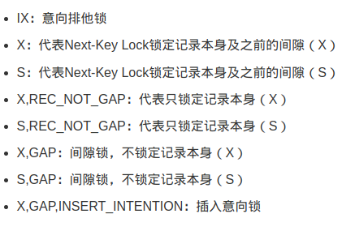
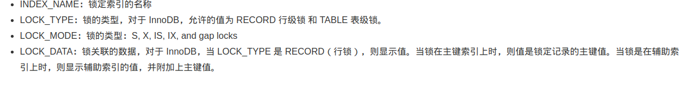

# Mysql锁实践
## 含义




对于InnoDB，如果LOCK_TYPE是RECORD，会显示一个值，否则该值为NULL。
在主键索引上放置锁时，显示被锁记录的主键值。
在次级索引上放置锁时，显示被锁记录的次级索引值，并附加上主键值。


## 间隙锁规则
举例:
Next-Key Lock：相当于Record Lock+Gap Lock，对【某一个行记录】和【这条记录与它前一条记录之间的范围/间隙】都上锁，这里我们称它为邻键锁。假如一个索引有2、4、5、9、12 五个值，那该索引可能被邻键锁锁的范围为(-∞ , 2],(2 , 4],(4 , 5],(5 , 9],(9 , 12],(12 , +∞)

```
需要注意的是4,5之间不存在整数,但是在MYSQL中理解是存在间隙的
```
## 加锁规则

    规则1：
        查询过程中访问到(扫描到)的对象才会加锁。


    规则2：
        加锁的基本单位（或者说默认）是 Next-Key lock， 左开右闭区间比如 (x,y]


    规则3：
        等值 查询时Mysql的优化
            第一条：如果是 唯一索引，且 目标值存在 则next-key lock会 退化为记录锁，不存在 则当 找到第一个大于该目标值的索引记录 y 后，将 y 这个索引记录 上的 Next-Key lock 退化为间隙锁(因为y不符合条件，所以无需锁y即间隙锁开区间就可以保证避免幻读现象) （如果第一个大于该目标值的索引记录是supernum则还是 Next-Key lock，不退化为间隙锁）。
    
            第二条：如果是 普通索引（非唯一）不管有没有目标记录，仍然需要 从左向右访问到第一个不满足条件的值，相应的 next-key lock 也会 退化为间隙锁。  

    规则4：
        范围 查询时Mysql的优化
            第一条：无论是否唯一索引，范围查询都需要从左向右访问，直到找到第一个不满足条件的值y为止（主键索引<=操作除外见第二条）。 在向右扫描过程中，如果索引是唯一索引，则第一个不满足条件的记录将会从Next-Key lock锁退化为间隙锁(因为唯一值y不符合条件，所以无需锁y即间隙锁开区间就可以保证幻读现象，如果第一个不满足条件的记录是实际记录的最大值，则不退化为间隙锁，仍旧是Next-Key lock锁。）； 在范围查询时，如果不是唯一索引，向右扫描到的第一个不符合条件的记录不会发生Next-key lock退化为间隙锁的操作

            第二条：注意： 由于主键索引的特殊性，当是范围查询且目标值匹配到某个已经存在的右边界时（比如 id<=4 且4存在 ），这种情况下则会停止扫描也不会给4后边的记录加锁，因为主键列是有序且唯一的，已经找到一个相等的值后，再向右扫描没有意义（这个现象在下边演示 id小于等于且右边界值存在时会看到）。

在RC隔离级别下加锁的情况跟在RR隔离级别下差不多，不同的是RC隔离级别下只会对记录加Record Lock，不会加Gap Lock 和 Next-Key Lock

## supremum pseudo-record
间隙锁

如果查询的值超过索引中最大值，锁类型变为X锁，被锁的最大行为supremum pseudo-record，它是索引中的伪记录，表示索引中可能存在的最大值。此时，锁的范围扩大到正无穷
