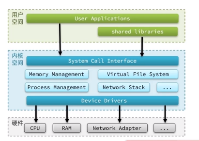
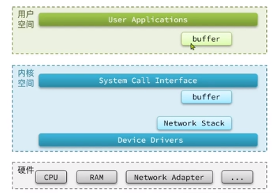
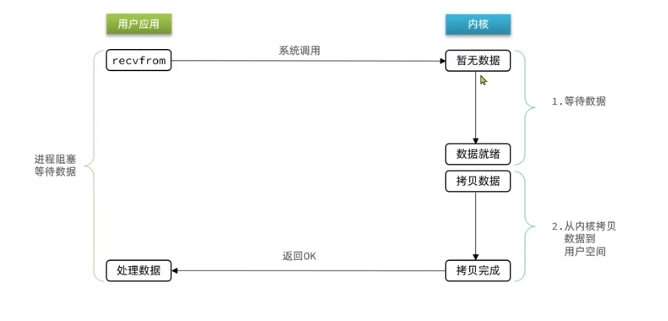
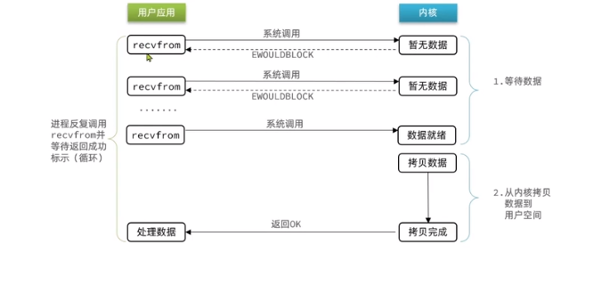
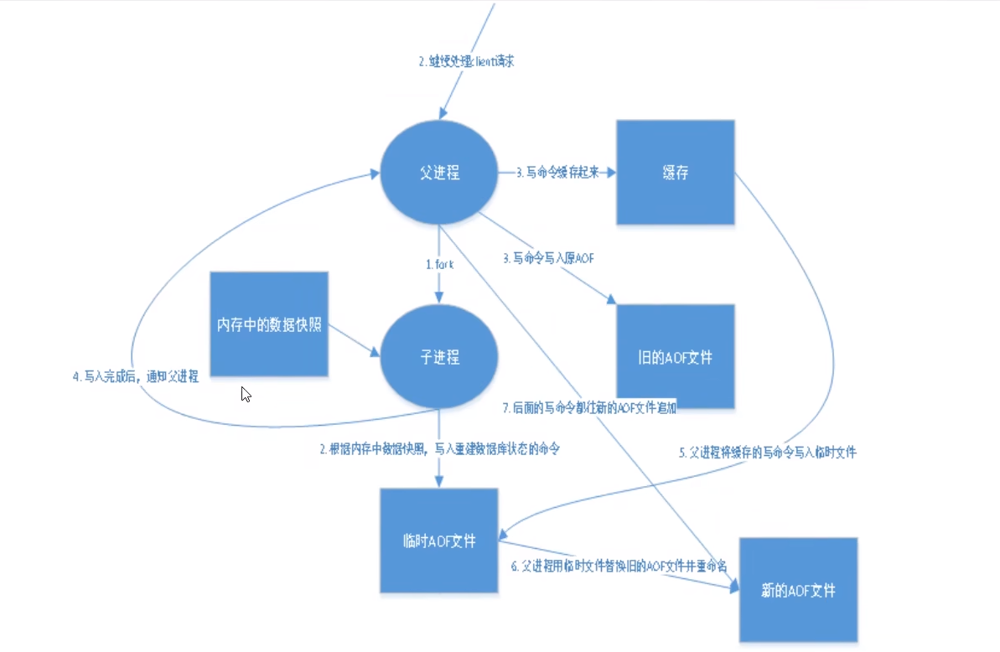
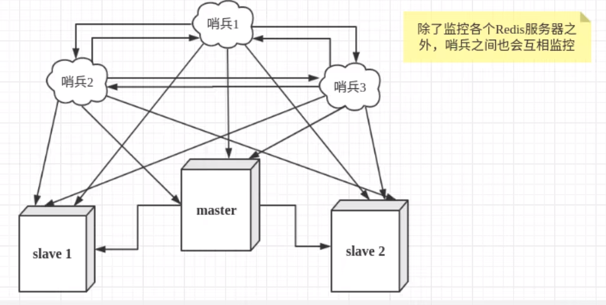

# REDIS
## docker 
## 配置文件
   可以通过命令 config get/set 查看,设置命令,重启后实效

## 网络模型
用户应用和内核应用的内存空间是分离的
进程的寻址空间会划分为两部分,内核空间和用户空间
用户空间只能执行受限命令,不能直接调用系统资源,需要通过内核的接口访问
内核空间可以执行特权命令,调用一切资源
运行在用户空间称为用户态
运行在内核空间称为内核态
Linux为增加效率,会在用户空间和内核空间增加缓冲区
写数据,先把用户缓冲区的数据读取到内核缓冲区,然后写入
读数据,先把内核缓冲区的数据读取到用户缓冲区,然后读取
读写网卡一致


### IO模型
#### 阻塞IO
数据等待和数据拷贝阶段都要等待

#### 非阻塞IO
数据等待阶段是非阻塞,但是数据拷贝状态是阻塞状态,但是没有性能提高,反而有所下降

#### IO多路复用
用户进程如何知道内核数据(所需要的数据已经加载到内核缓冲区)就绪
文件描述符(File Discriptor)
是一个从0开始递增的无符号整数,用来关联Linux的一个文件
Linux一切都是文件,包括Socket
IO多路复用指的是利用单线程监听多个FD,并在FD可读/可写(内核数据)的时候得到通知,避免无效等待
关键字:单线程,监听多个FD
监听类型:
SELECT
POLL
EPOLL
SELECT 和POLL只告诉用户进程有FD就绪,但不确定是哪个FD就绪,需要用户进程逐个遍历确认
EPOLL 则会在通知用户进程有FD就绪的时候,同时将该FD写入用户空间
## 工作原理
   * Redis 的底层是一个单线程模型，单线程指的是使用一个线程来处理所有的网络事件请求，这样就避免了多进程或者多线程切换导致的 CPU 消耗，而且也不用考虑各种锁的问题。

   * Redis 为了充分利用单线程，加快服务器的处理速度，它采用 IO 多路复用模型来处理客户端与服务端的连接，这种模型有三种实现方式，分别是 select、poll、epoll。Redis 正是采用 epoll 的方式来监控多个 IO 事件。当客户端空闲时，线程处于阻塞状态；当一个或多个 IO 事件触发时（客户端发起网路连接请求），线程就会从阻塞状态唤醒，并同时使用epoll来轮询触发事件，并依次提交给线程处理。
   * “多路”指的是多个网络连接，“复用”指的是复用同一个线程。多路 IO 复用技术可以让单个线程高效的处理多个连接请求。
## 数据结构
### STRING
   1. 扩容机制
      * string 采用了预先分配冗余空间的方式来减少内存的频繁分配
      * 当字符串所占空间小于 1MB 时，Redis 对字符串存储空间的扩容是以成倍的方式增加的；而当所占空间超过 1MB 时，每次扩容只增加 1MB。Redis 字符串允许的最大值字节数是 512 MB。

   2. 常用操作
      * SET key value	用于设定指定键的值。
      * GET key	用于检索指定键的值。
      * GETRANGE key start end	返回 key 中字符串值的子字符。
      * GETSET key value	将给定 key 的值设置为 value，并返回 key 的旧值。
      * GETBIT key offset	对 key 所存储的字符串值，获取其指定偏移量上的位（bit）。
      * MGET key1 [key2..]	批量获取一个或多个 key 所存储的值，减少网络耗时开销。
      * SETBIT key offset value	对 key 所储存的字符串值，设置或清除指定偏移量上的位(bit)。
      * SETEX key seconds value	将值 value 存储到 key中 ，并将 key 的过期时间设为 seconds (以秒为单位)。
      * SETNX key value	当 key 不存在时设置 key 的值。
      * SETRANGE key offset value	从偏移量 offset 开始，使用指定的 value 覆盖的 key 所存储的部分字符串值。
      * STRLEN key	返回 key 所储存的字符串值的长度。
      * MSET key value [key value ...]	该命令允许同时设置多个键值对。
      * MSETNX key value [key value ...]	当指定的 key 都不存在时，用于设置多个键值对。
      * PSETEX key milliseconds value	此命令用于设置 key 的值和有过期时间（以毫秒为单位）。
      * INCR key	将 key 所存储的整数值加 1。
      * INCRBY key increment	将 key 所储存的值加上给定的递增值（increment）。
      * INCRBYFLOAT key increment	将 key 所储存的值加上指定的浮点递增值（increment）。
      * DECR key	将 key 所存储的整数值减 1。
      * DECRBY key decrement	将 key 所储存的值减去给定的递减值（decrement）。
      * APPEND key value	该命令将 value 追加到 key 所存储值的末尾。
### BITMAP
   1. 类型
      * 类型还是string
      * 本质是byte数组,因为字符串最大可以存储512M,换算为字节,bitmap最大可以存储2^32位
   2. 操作
      * getbit key offset
      * setbit key offset value
      * bitcount key [start end]
   3. 应用
      * 存储签到信息等布尔值信息

### List列表
   1. 类型
      * 插入,删除的复杂度为o(1),查询复杂度为o(n),一个列表最多可以包含 2^32 - 1 个元素（约 40 亿个元素），当列表弹出最后一个元素时，该结构会被自动删除。
      * 当列表中存储的元素较少时，Redis 会使用一块连续的内存来存储这些元素，这个连续的结构被称为 ziplist（压缩列表），它将所有的元素紧挨着一起存储。
      * 而当数据量较大时，Redis 列表就会是用 quicklist（快速链表）存储元素。Redis 之所以采用两种方法相结合的方式来存储元素。这是因为单独使用普通链表存储元素时，所需的空间较大，会造成存储空间的浪费。因此采用了链表和压缩列表相结合的方式，也就是 quicklist + ziplist
      * 将多个 ziplist 使用双向指针串联起来，这样既能满足快速插入、删除的特性，又节省了一部分存储空间。
   2. 常用操作
      * LPUSH key value1 [value2]	在列表头部插入一个或者多个值。
      * LRANGE key start stop	获取列表指定范围内的元素。
      * RPUSH key value1 [value2]	在列表尾部添加一个或多个值。
      * LPUSHX key value	当储存列表的 key 存在时，用于将值插入到列表头部。
      * RPUSHX key value	当存储列表的 key 存在时，用于将值插入到列表的尾部。
      * LINDEX key index	通过索引获取列表中的元素。
      * LINSERT key before|after pivot value	指定列表中一个元素在它之前或之后插入另外一个元素。
      * LREM key count value	表示从列表中删除元素与 value 相等的元素。count 表示删除的数量，为 0 表示全部移除。
      * LSET key index value	表示通过其索引设置列表中元素的值。
      * LTRIM key start stop	保留列表中指定范围内的元素值。
      * LPOP key	从列表的头部弹出元素，默认为第一个元素。
      * RPOP key	从列表的尾部弹出元素，默认为最后一个元素。
      * LLEN key	用于获取列表的长度。
      * RPOPLPUSH source destination	用于删除列表中的最后一个元素，然后将该元素添加到另一个列表的头部，并返回该元素值。
      * BLPOP key1 [key2 ] timeout	用于删除并返回列表中的第一个元素（头部操作），如果列表中没有元素，就会发生阻塞，
      直到列表等待超时或发现可弹出元素为止。
      * BRPOP key1 [key2 ] timeout	用于删除并返回列表中的最后一个元素（尾部操作），如果列表中没有元素，就会发生阻塞， 直到列表等待超时或发现可弹出元素为止。
      * BRPOPLPUSH source destination timeout	从列表中取出最后一个元素，并插入到另一个列表的头部。如果列表中没有元素，就会发生
      阻塞，直到等待超时或发现可弹出元素时为止。

         `举例:
         BLPOP A B C 3 等待ABC 3个key第一个返回一个值,超时时间为3S,
         如果此时ABCkey都不存在,且超时时间内有另一个线程输入
         LPUSH C 22 则BLPOP执行成功,获取到的结果是["C","22"]
         `

### Hash哈希
   可以理解为key是一个对象,该对象中有多个field:value的键值对
   1. 类型
   底层存储结构有两种实现方式:
      * 第一种，当存储的数据量较少的时，hash 采用 ziplist 作为底层存储结构，此时要求符合以下两个条件：
         * 哈希对象保存的所有键值对（键和值）的字符串长度总和小于 64 个字节。
         * 哈希对象保存的键值对数量要小于 512 个。
      * 当无法满足上述条件时，hash 就会采用第二种方式来存储数据，也就是 dict（字典结构），该结构类似于 Java 的 HashMap，是一个无序的字典，并采用了数组和链表相结合的方式存储数据。在 Redis 中，dict 是基于哈希表算法实现的，因此其查找性能非常高效，其时间复杂度为 O(1)。
        * 有许多方法可以解决“哈希冲突”，比如开放地址法、链表地址法，再次散列法等，而 Redis 采用是链表地址法  
   2. 常用操作
      * HDEL key field2 [field2]	用于删除一个或多个哈希表字段。
      * HEXISTS key field 	用于确定哈希表字段是否存在。
      * HGET key field	获取 key 关联的哈希字段的值。
      * HGETALL key	获取 key 关联的所有哈希字段值。
      * HINCRBY key field increment	给 key 关联的哈希字段做整数增量运算 。
      * HINCRBYFLOAT key field increment 	给 key 关联的哈希字段做浮点数增量运算 。
      * HKEYS key	获取 key 关联的所有字段和值。
      * HLEN key	获取 key 中的哈希表的字段数量。
      * HMSET key field1 value1 [field2 value2 ]	在哈希表中同时设置多个 field-value(字段-值）
      * HMGET key field1 [field2]	用于同时获取多个给定哈希字段（field）对应的值。
      * HSET key field value	用于设置指定 key 的哈希表字段和值（field/value）。
      * HSETNX key field value	仅当字段 field 不存在时，设置哈希表字段的值。
      * HVALS key	用于获取哈希表中的所有值。
      * HSCAN key cursor 	迭代哈希表中的所有键值对，cursor 表示游标，默认为 0。
### SET
### ZSET
## 持久化

### RDB持久化(快照模式)
#### 配置   
      save 900 1
      save 300 10
      save 60 10000 


      stop-writes-on-bgsave-error yes #持久化失败后时候需要正常工作
      rdbcompression yes #需要消耗CPU进行rdb数据库压缩
      rdbchecksum yes  # rdb文件校验
#### 原理
  1. 它会将数据库的快照保存在 dump.rdb 这个二进制文件中。
  2. Redis 使用操作系统的多进程 COW(Copy On Write) 机制来实现快照持久化操作。
  3. RDB 实际上是 Redis 内部的一个定时器事件，它每隔一段固定时间就去检查当前数据发生改变的次数和改变的时间频率，看它们是否满足配置文件中规定的持久化触发条件。当满足条件时，Redis 就会通过操作系统调用 fork() 来创建一个子进程，该子进程与父进程享有相同的地址空间。
  4. Redis 通过子进程遍历整个内存空间来获取存储的数据，从而完成数据持久化操作,注意，此时的主进程则仍然可以对外提供服务，父子进程之间通过操作系统的 COW(写时复制) 机制实现了数据段分离，从而保证了父子进程之间互不影响。
  5. COW指redis主进程和子进程共享一组内存数据,当要实现修改某个值时,修改前的数据会复制一份,修改后的值归主进程,而修改前的值会由子进程处理
  6. 每次创建 RDB 文件之后，Redis 服务器为实现自动持久化而设置的时间计数和次数计数就会被清零，并重新开始计数，因此多个策略的效果不会叠加
  7. Redis保存的是某一时刻的全量数据，而不是某一时间段内的全量数据。

#### 触发机制
   1. 手动触发策略
      * 手动触发是通过SAVAE命令或者BGSAVE
      * SAVE 命令会阻塞 Redis 服务器进程，直到 dump.rdb 文件创建完毕为止，在这个过程中，服务器不能处理任何的命令请求。
      * BGSAVE命令是非阻塞式的， Redis 服务器会 fork() 一个子进程来进行持久化操作（比如创建新的 dunp.rdb 文件），而父进程则继续处理客户端请求。当子进程处理完后会向父进程发送一个信号，通知它已经处理完毕。此时，父进程会用新的 dump.rdb 文件覆盖掉原来的旧文件。
   2. 自动触发策略
      * save 900 1 表示在 900 秒内，至少更新了 1 条数据，Redis 自动触发 BGSAVE 命令，将数据保存到硬盘。
      * save 300 10 表示在 300 秒内，至少更新了 10 条数据，Redis 自动触 BGSAVE 命令，将数据保存到硬盘。
      * save 60 10000 表示 60 秒内，至少更新了 10000 条数据，Redis 自动触发 BGSAVE 命令，将数据保存到硬盘。

#### 优劣
   1. RDB 持久化的最大不足之处在于，最后一次持久化的数据可能会出现丢失的情况
   2. DB 数据持久化适合于大规模的数据恢复，并且还原速度快

### AOF持久化(日志模式/追加模式)
#### 原理
      总结为先存储后执行

   

   每当有一个修改数据库的命令被执行时，服务器就将命令写入到 appendonly.aof 文件中，该文件存储了服务器执行过的所有修改命令，因此，只要服务器重新执行一次 .aof 文件，就可以实现还原数据的目的，这个过程被形象地称之为“命令重演”。
   1. Redis 在收到客户端修改命令后，先进行相应的校验，如果没问题，就立即将该命令存追加到 .aof 文件中，也就是先存到磁盘中，然后服务器再执行命令。这样就算遇到了突发的宕机情况情况，也只需将存储到  .aof 文件中的命令，进行一次“命令重演”就可以恢复到宕机前的状态。
   2. 在上述执行过程中，有一个很重要的环节就是命令的写入，这是一个 IO 操作。Redis 为了提升写入效率，它不会将内容直接写入到磁盘中，而是将其放到一个内存缓存区（buffer）中，等到缓存区被填满时才真正将缓存区中的内容写入到磁盘里。
   3. Redis 在长期运行的过程中，aof 文件会越变越长。如果机器宕机重启，“重演”整个 aof 文件会非常耗时，导致长时间 Redis 无法对外提供服务。因此就需要对 aof 文件做一下“瘦身”运动。Redis 提供了 AOF 重写机制, AOF 重写期间，服务器不会被阻塞，它可以正常处理客户端发送的命令。
   4. 如果aof文件被修改,redis是无法启动的,可以通过redis-check-aof命令进行修复(redis-check-aof --fix xxx.aof)
#### 配置

      appendonly yes
      appendfilename "appendonly.aof"
#### AOF重写触发机制

   1. 手动触发,执行BGREWRITEAOF
   2. 自动触发
      ```
      #默认配置项
      auto-aof-rewrite-percentage 100#
      auto-aof-rewrite-min-size 64mb 
      ```
      1. auto-aof-rewrite-percentage参数解析:  触发重写所需要的 aof 文件体积百分比，只有当 aof 文件的增量大于 100% 时才进行重写，也就是大一倍。比如，第一次重写时文件大小为 64M，那么第二次触发重写的体积为 128M，第三次重写为 256M，以此类推。如果将百分比值设置为 0 就表示关闭 AOF 自动重写功能。
      2. auto-aof-rewrite-min-size参数解析:  表示触发AOF重写的最小文件体积,大于或等于64MB自动触发

#### AOF策略配置
   如果遇到宕机前，缓存内的数据未能写入到磁盘中，那么数据仍然会有丢失的风险。服务器宕机时，丢失命令的数量，取决于命令被写入磁盘的时间，越早地把命令写入到磁盘中，发生意外时丢失的数据就会越少，否则越多。

      appendfsync always
      appendfsync everysec
      appendfsync no

   1. Always：服务器每写入一个命令，就调用一次 fsync 函数，将缓冲区里面的命令写入到硬盘。这种模式下，服务器出现故障，也不会丢失任何已经成功执行的命令数据，但是 fsync 是磁盘 IO 操作，所以它很慢！如果 Redis 执行一条指令就要 fsync 一次（Always），那么 Redis 高性能将严重受到影响。
   2. Everysec（默认）：服务器每一秒调用一次 fsync 函数，将缓冲区里面的命令写入到硬盘。这种模式下，服务器出现故障，最多只丢失一秒钟内的执行的命令数据，通常都使用它作为 AOF 配置策略；
   3. No：服务器不主动调用 fsync 函数，由操作系统决定何时将缓冲区里面的命令写入到硬盘。这种模式下，服务器遭遇意外停机时，丢失命令的数量是不确定的，所以这种策略，不确定性较大，不安全。

### 两种持久化方案对比
在rdb和aof都存在的情况下,系统重启时会优先使用aof来实现数据恢复
建议只在slave节点做rdb,建议只保留save 900 1
建议减少AOF重写次数,将AOF重写的基础大小设置为5G以上
如果不使用AOF,使用主从复制也可以实现高可用,代价是如果主从节点都挂调,会丢失一部分数据,需要以最新的RDB文件进行恢复

| RDB持久化                                | AOF持久化 |
| ----------- | ----------- |
| 全量备份一次保存整个数据库                 | 增量备份，一次只保存一个修改数据库的命令    |
| 每次执行持久化操作的间隔时间较长            | 保存的间隔默认为一秒钟（Everysec）         | 
| 数据保存为二进制格式，其还原速度快          |使用文本格式还原数据，所以数据还原速度一般   |
|执行 SAVE 命令时会阻塞服务器，但手动或者自动触发的 BGSAVE 不会阻塞服务器	|AOF持久化无论何时都不会阻塞服务器。|

## 布隆过滤器
### 特性
相比于 Set 集合的去重功能而言，布隆过滤器在空间上能节省 90% 以上，但是它的不足之处是去重率大约在 99% 左右，也就是说有 1% 左右的误判率，这种误差是由布隆过滤器的自身结构决定的。俗话说“鱼与熊掌不可兼得”，如果想要节省空间，就需要牺牲 1% 的误判率，而且这种误判率，在处理海量数据时，几乎可以忽略。


      优点：节省空间：一个 bit 位标识一则数据的存在信息，且利用了 k 个散列函数进行映射后，bitmap 的长度 m 可以进一步降低查询高效：使用 k 个散列函数进行映射，由于 k 为常数，因此实际的时间复杂度为 O(1)
      缺点：存在假阳性误判问题：对于不存在的数据可能会被误判为存在，对于已存在的数据不可能发生误判
      缺点: 数据存在删除困难的问题
      缺点: 随着输入不停入布隆过滤器,其过滤误差会越来越大
### 误判率


      在输入 1 个元素，并通过 hash 函数进行 1 次映射时，1 个 bit 位因为这次操作被置为 1 的概率为 1/m；
      反之，这个 bit 位不会因为这次操作被置为 1 的概率为 1-1/m；
      进一步得到，这个 bit 位在经过 k 次 hash 映射后，仍然不被置为 1 的概率为 (1-1/m)^k；
      进一步得到，这个 bit 位在输入 n 个元素后，仍然不被置为 1 的概率为 (1-1/m)^(k·n)；
      反之，在输入 n 个元素后，1 个 bit 位被置为 1 的概率为 1-(1-1/m)^(k·n)；
      
      有了以上的结论后，我们知道我们每次输入一个元素时，发生误判的前提是，经过 hash 映射后，对应的 k 个 bit 位都在此前恰好被置为 1 了，因此我们可以得到误判发生的概率为——[1-(1-1/m)^(k·n)]^
      
      下面我们基于高等数学中等价无穷小的规则，对这个误判概率表达式进行简化.在高等数学中，我们知道当 x->0 时，有 (1+x)^(1/x)~e，其中 e 为自然常数，值约为 2.7182818.于是我们有，当 m->∞ 时，1/m -> 0，于是有 (1-1/m)^(-m)~e.于是有 (1-1/m)^(k·n)=(1-1/m)^[(-m)·(-k·n/m)]~e^(-k·n/m)最终我们得到，当 m->∞ 时，误判概率可以简化表示为
      
      ——[1-e^(-k·n/m)]^k.
### 参数调优
https://hur.st/bloomfilter/?n=9000000&p=&m=65000000&k=6


      首先初步设定 bitmap 长度 m 为一个足够大的值其次，我们预估这个布隆过滤器中可能存放的元素数量 n
      接下来我们根据 k·n/m=ln2，计算出合适的 hash 函数个数最后，
      我们通过误判概率表达式 [1-e^(-k·n/m)]^k，推算出可能发生误判的概率，看是否能够满足要求


### 原理
布隆过滤器（Bloom Filter）是一个高空间利用率的概率性数据结构，由二进制向量（即位数组）和一系列随机映射函数（即哈希函数）两部分组成。

### 代码实现
#### 单机/redis 代码实现
https://zhuanlan.zhihu.com/p/648260944
## 缓存问题

缓存穿透:
   
      问题描述: 高频访问一个不存在缓存中的值,导致请求会直接进行数据库查询,增加数据库压力
      解决方案:
         布隆过滤器
      

缓存雪崩:

      问题描述:在某一时刻 大量热点数据同时过期,高频的查询会立刻压在服务器上/服务器宕机
      解决方案:
         TTL 随机
         高可用的集群
缓存击穿:

      问题描述: 某一个高频访问的KEY过期,高频的查询会立刻压在服务器上
      解决方案:
         TTL 设置永不过期
         互斥访问: 在第一个请求访问时候加锁,此时其他请求进入后会等待,第一个请求查询不到缓存后,会访问数据库,返回数据并进行缓存,再解锁,这样其他的数据就能访问到缓存了


## 事务  
redis 事务的特点:

      顺序性
      排他性
      一次性

redis 单条命令具有原子性,但是事务不具有原子性!!!
redis 事务没有隔离级别
redis 事务的本质就是一组命令的集合,事务执行过程中会按照顺序依次执行
### 原子性
原子性是指一个操作在执行期间不会被中断，要么执行成功(不仅要执行还要执行成功)，要么完全不执行。换句话说，原子性是指一个操作是不可分割的、不可拆分的，要么!!!全部执行成功，要么全部不执行!!!。
### 锁
   1. 乐观锁和悲观锁
      1. 乐观锁
         * 乐观锁是一种实现并发控制的机制，它基于乐观的假设，即认为并发操作很少会发生冲突，因此不会阻塞其他操作。乐观锁的核心思想是，在进行数据操作之前，先检查数据是否发生了变化，如果变化了则放弃当前操作，否则继续执行。
         * 在实际应用中，乐观锁常常使用版本号或时间戳来实现。每个数据记录中都会包含一个版本号或时间戳字段，当执行更新操作时，会先读取当前的版本号或时间戳，如果在更新过程中发现版本号或时间戳已经变化，就意味着其他线程已经修改了数据，当前操作可以选择放弃或重试。
         * 乐观锁的优点是不会阻塞其他操作，适用于大多数并发较低的场景。然而，在高并发情况下，由于操作冲突的概率增加，导致可能需要多次重试，从而增加了系统的负载和延迟。
      2. 悲观锁
         * 悲观锁是一种并发控制机制，它基于"悲观"的思想，认为并发操作时会发生冲突，因此在操作之前会先锁定数据资源，确保其他操作无法同时进行。它的核心思想是在操作期间阻塞其他操作，以确保数据的一致性。
         * 悲观锁的使用场景通常是写多读少的情况，即对共享资源的修改频率较高。对于悲观锁，常见的操作包括：
         * 查询资源时，会以排他方式锁定资源，避免其他操作影响到当前查询的结果。
         * 修改资源时，会先检查是否被其他操作锁定，如果锁定则等待，直到获取到锁才能执行修改操作。
         * 悲观锁提供了较为简单的并发控制方式，但它存在以下缺点：
            * 阻塞导致等待时间较长，效率较低，特别是在并发高的情况下，可能会引发性能问题。
            * 锁的粒度较大，容易导致并发度低的情况，影响系统的性能。
   2. 如何使用redis实现乐观锁和悲观锁
         1. 实现乐观锁
            * 使用 WATCH 命令监听需要操作的键。 
            * 使用 MULTI 命令开启 Redis 事务。
            * 执行一系列 Redis 命令（例如 GET、SET）来获取和更新数据。
            * 使用 EXEC 命令提交事务，如果在事务执行过程中被其他客户端修改了被 WATCH 命令监听的键，那么这个事务将失败，执行结果为 NIL。
         2. 实现悲观锁
            * Redis并没有原生支持悲观锁，因为Redis是单线程的，不需要显式的锁机制来保持数据的一致性。然而，我们可以使用Redis的原子性操作和事务来实现类似的悲观锁机制。 
            * 使用 SETNX 命令设置一个唯一的锁键，如果锁键不存在，则表示获取到了锁，可以执行操作。如果锁键已经存在，则表示其他客户端已经持有锁，需要等待或进行其他处理。
            * 执行一系列 Redis 命令来获取和更新数据。
            * 使用 DEL 或者 EXPIRE 命令释放锁，确保锁在操作完成后及时释放
### 常用操作
   * MULTI	开启一个事务
   * EXEC	执行事务中的所有命令
   * WATCH key [key ...]	在开启事务之前用来监视一个或多个key 。如果事务执行时这些 key 被改动过，那么事务不会执行。
   * DISCARD	取消事务。
   * UNWATCH	取消 WATCH 命令对 key 的监控。
### 总结
   1. redis事务开启的过程中其他的client依然可以发送命令,甚至可以开启另一个事务
   2. redis的事务在开启后,命令将会被缓存,直到执行EXEC命令后,事务才是真正开始
   3. 事务在执行过程中,不会被其他请求打断
   4. redis的事务"回滚"的理解:
      1. 在执行MULTI命令后, 输入的命令出现格式错误,如输入一个不存在的命令,此时reids会马上停止该事务,即使后续执行了EXEC,该事务的所有命令都不会执行
      2. 在执行了MULTI命令后,没有语法错误的命令,如SET NAME HYDRA ,INCR NAME 1,不会报错,在执行EXEC后,INCR NAME 1命令会执行报错,但是后续的命令依然会执行.
      3. 使用WATCH,实现了乐观锁,检测到WATCH的KEY版本变化,从而不执行
      4. 使用DISCARD 在执行前就抛弃了事务
   5. Redis事务提供了一定程度的原子性保证，即一组命令作为一个整体要么全部执行(即使执行错误)，要么全部不执行(语法错误)
   6. 由于Redis是单线程的，事务在执行期间不会被打断，因此在事务执行(EXEC)期间，其他客户端发送的命令只能等待直到事务执行完成。这可能导致并发操作的延迟和性能问题。
## watch
和事务配合实现乐观锁
监视一个key的变动后再开启事务,如果事务提交前,有其他的线程修改了监视俄key,则本次事务会全部失败(只返回一个nil)
执行事务不论事务是否成功,都会自动unwatch,断开客户端连接也会自动unwatch
!!!实现秒杀!!!
## 管道
redis 服务器是以单线程的方式来处理客户端的网络 IO 请求的。如果每执行一次请求都要创建和断开一次连接，就会消耗过多的时间，导致执行效率降低。因此 Redis 提供了 Pipeline（管道技术），使用该技术可以一次性向服务器发送多条命令，并返回多个执行结果。这样就节省了发送命令和创建连接的时间，从而提高了执行效率。

### 执行过程
使用Redis管道时，客户端发送的命令不会立即执行，而是缓存在服务器端的输入缓冲区中。当客户端发送一条特殊的命令（如EXEC）时，服务器才会一次性执行所有缓存的命令，并将结果返回给客户端。
### 注意事项
   1. 原子性是指一个操作要么全部执行成功，要么全部失败，不会出现中间状态。在Redis的单线程模型下，单个命令的执行是原子性的，然而，对于管道操作来说，一组命令是批量发送给Redis服务器的，服务器会按顺序执行这组命令并返回结果。如果在执行过程中，其中某个命令失败了，后续的命令仍然会继续执行，而没有发生回滚操作，这就产生了部分执行的情况，不能保证原子性。
      1. 举例:命令顺序为 1.SET 2.SET NAME 23,则命令1是失败的,但是命令2是成功的
   2. 管道操作中的命令执行顺序是按照发送的顺序执行的，但返回结果的顺序并不一定与发送顺序完全一致。因此，在获取管道执行结果时，需要根据发送的命令顺序来匹配返回的结果。
   3. 使用管道时要注意控制发送的命令数量，过多的命令可能会导致服务器端的内存爆增。可以根据实际情况，合理划分命令的数量，以避免对服务器性能产生过大影响。
### 总结
总的来说，Redis管道是一种优化Redis操作的机制，可以减少网络开销和提高性能。但在使用时需要注意不保证原子性，注意控制命令数量，并注意匹配返回结果的顺序。


## 分布式锁
   直接使用 SET 命令实现，语法格式如下：SET key value [expiration EX seconds|PX milliseconds] [NX|XX]  
   1. EX second：设置键的过期时间为 second 秒
   2. PX millisecond：设置键的过期时间为毫秒
   3. NX：只在键不存在时，才对键进行设置操作
## lua脚本
```Go
package main

import (
	"fmt"

	"github.com/go-redis/redis"
)

type MyRedisClient struct {
	client *redis.Client
}

const CONST_DISTRIBUTED_KEY = "d_lock"
const CONST_DISTRIBUTED_VALUE = "locked"
const CONST_DISTRIBUTED_TIMEOUT = 10

func (c *MyRedisClient) getDistributedLock(key string, value string, timeout int) int {
	luaScript := `
			local result = 0
			if redis.call("GET", KEYS[1]) == ARGV[1] then
				result = -1
			else
				local res = qredis.call("SETEX", KEYS[1], ARGV[2], ARGV[1])
				for key,value in pairs(res) 
					do
						if key == "ok" then
							result = 1
						else
							result = -2
						end
				end
			end
			return result
		`
	result, err := c.client.Eval(luaScript, []string{key}, value, timeout).Int()
	if err != nil {
		fmt.Println(err)
		return 0
	}
	if result == 1 {
		return 1
	} else {
		return 0
	}
}
func main() {
	// 创建Redis客户端
	client := redis.NewClient(&redis.Options{
		Addr:     "139.198.9.163:6379", // Redis服务器地址和端口
		Password: "woshiwx@123",        // Redis密码，没有可以设置为空字符串
		DB:       0,                    // 使用的数据库，默认为0
	})
	defer func() {
		err := client.Close()
		if err != nil {
			panic(err)
		}
	}()
	_, err := client.Ping().Result()
	if err != nil {
		fmt.Printf("err connect")
		return
	}
	redisClient := &MyRedisClient{
		client: client,
	}
	res := redisClient.getDistributedLock(CONST_DISTRIBUTED_KEY, CONST_DISTRIBUTED_VALUE, CONST_DISTRIBUTED_TIMEOUT)
	if res == 1 {
		fmt.Println("locked")
	} else {
		fmt.Println("unlock")
	}
}

   ```
## 发布订阅
   1. 常用操作
      * PSUBSCRIBE pattern [pattern ...]	订阅一个或多个符合指定模式的频道。
      * PUBSUB subcommand [argument [argument ...]]	查看发布/订阅系统状态，可选参数
        1) channel 返回在线状态的频道。
        2) numpat 返回指定模式的订阅者数量。
        3) numsub 返回指定频道的订阅者数量。
      * PUBSUB subcommand [argument [argument ...]]	将信息发送到指定的频道。
      * PUNSUBSCRIBE [pattern [pattern ...]]	退订所有指定模式的频道。
      * SUBSCRIBE channel [channel ...]	订阅一个或者多个频道的消息。
      * UNSUBSCRIBE [channel [channel ...]]	退订指定的频道。
   2. 存在的问题
      * 丢失消息：Redis的发布订阅模式不保证消息的可靠性传输，即发布者发布的消息可能会丢失，订阅者无法接收到。这是因为Redis的发布订阅模式是一对多的模式，且没有持久化机制，如果订阅者在消息发布之前订阅，那么就无法接收到之前发布的消息。
      * 不保证顺序：Redis发布订阅的消息顺序并不是严格保证的，即消息的接收顺序可能与发送顺序不一致。这是因为Redis使用的是异步处理消息的方式，消息的接收顺序与订阅者的处理速度以及网络延迟等因素有关。
      * 高并发情况下的性能问题：在高并发情况下，Redis的发布订阅模式可能会给集群带来较大的压力，影响性能。这是因为Redis的发布订阅模式是全量广播的，即每个订阅者都会接收到发布者发布的消息，如果订阅者众多，消息的处理成本将会很高。
      * 订阅者离线问题：如果一个订阅者离线了，那么在其重新上线之前发布的消息仍然会丢失。这是因为Redis的发布订阅模式没有持久化机制，只有在订阅者在线的情况下才能接收到消息，如果订阅者离线了，消息将无法到达。
      * 容量限制问题：Redis发布订阅模式默认情况下，限制每个客户端每秒最多可以处理的消息数量。如果消息发布频率较高，可能会超过这个限制，导致部分消息丢失。


## 消息队列
   1. 如何保证消息队列的消息被重复消费或者消息丢失
      * 持久化消息：在发送消息时，将消息设置为持久化，这样即使消息队列服务重启，消息也不会丢失。
      * 确认机制：使用消息确认机制来确保消息被正确地消费。在消费者处理完消息后，发送确认信号给消息队列服务，以确保该消息被正确处理。
      * 幂等性处理：在消费者端进行幂等性处理，即无论消息被消费多少次，最终结果都应该是一样的。这样即使消息被重复消费，也不会产生错误结果。
      * 设置重试机制：当消息消费失败时，可以配置重试机制，使消息再次投递给消费者。你可以设置重试次数和重试间隔，确保消息被正确处理。
      * 监控和报警：监控消息队列的运行状态，及时发现和处理异常情况。设置报警机制，以便及时响应问题并采取措施修复。
      * 使用事务：如果消息的处理需要跨多个步骤，你可以使用事务功能来确保消息的原子性。如果任意一个步骤失败，可以回滚整个事务。

## 主从复制
作用:数据冗余,故障恢复,负载均衡(针对的是读操作的负载均衡),高可用的基石

### 原理
全量同步:
      
      从服务器连接主服务器，发送SYNC命令；
      主服务器接收到SYNC命名后，开始执行BGSAVE命令生成RDB文件并使用缓冲区记录此后执行的所有写命令；
      主服务器BGSAVE执行完后，向所有从服务器发送快照文件，并在发送期间继续记录被执行的写命令；
      从服务器收到快照文件后丢弃所有旧数据，载入收到的快照；
      主服务器快照发送完毕后开始向从服务器发送缓冲区中的写命令；
      从服务器完成对快照的载入，开始接收命令请求，并执行来自主服务器缓冲区的写命令；

增量同步:

      Redis增量复制是指Slave初始化后开始正常工作时主服务器发生的写操作同步到从服务器的过程。
      增量复制的过程主要是主服务器每执行一个写命令就会向从服务器发送相同的写命令，从服务器接收并执行收到的写命令。
 
Redis主从同步策略:

      主从刚刚连接的时候，进行全量同步；全同步结束后，进行增量同步。当然，如果有需要，slave 在任何时候都可以发起全量同步。redis 策略是，无论如何，首先会尝试进行增量同步，如不成功，要求从机进行全量同步。
### client 端配置
   1. REPLICAOF IP PORT配置 (slave 宕机后,需要重新配置master信息)
   2. Redis 5.0之后，replicaof已经替换slaveof，Redis已经对指令进行了兼容升级，目前slaveof还是可以使用的。
### 配置文件配置
   1. masterauth指定主节点密码
   2. REPLICAOF IP PORT
   3. 使用info replication 查询当前主从信息
### 运行时指定
   1. redis-server --slaveof IP PORT 
### 优/缺点
   0. 优点
      1. replica-read-only指定yes 表示从服务器只读,实现主服务写,从服务读取,实现读写分离
   1. 缺点
      1. Redis 主从模式不具备自动容错和恢复功能，如果主节点宕机，Redis从节点将继续保持为从节点,不可写,等待主节点恢复,主节点恢复后可以继续使用
      2. 主节点宕机后,需要人为干预将从节点提升为主节点。
      3. 如果主机宕机前有一部分数据未能及时同步到从机，即使切换主机后也会造成数据不一致的问题，从而降低了系统的可用性。
      4. 因为只有一个主节点，所以其写入能力和存储能力都受到一定程度地限制。
      5. 在进行数据全量同步时，若同步的数据量较大可能会造卡顿的现象。
### 注意事项

      可以将一个从节点B设置为另一个节点C的主节点,即A是B的主节点,B是C的主节点此时A的数据C依旧可以读取,B是无法写入数据的从节点
      
      虽然说主从复制过程中对于从redis是非阻塞的，但是当从redis从主redis同步过来最新的数据后还需要将新数据加载到内存中，在加载到内存的过程中是阻塞的，在这段时间内的请求将会被阻，但是即使对于大数据集，加载到内存的时间也是比较多的

      在进行主从复制设置时，强烈建议在主服务器上开启持久化

      如果考虑到减少主服务器的磁盘IO,有一种方案是master不做持久化,而是某一个slave做持久化,但是这种方案的缺点是如果主服务器宕机重启后,主服务器的数据会清空,由于主从同步的问题,会使得从服务器的数据很快被清空,因此如果使用这种方案,要避免主服务器节点的重启

## 哨兵模式
在 Redis 主从复制模式中，因为系统不具备自动恢复的功能，所以当主服务器（master）宕机后，需要手动把一台从服务器（slave）切换为主服务器。在这个过程中，不仅需要人为干预，而且还会造成一段时间内服务器处于不可用状态，同时数据安全性也得不到保障，因此主从模式的可用性较低，不适用于线上生产环境。
### 哨兵架构

### 作用

      节点发现和配置： 哨兵通过配置文件指定要监控的主节点和从节点。启动哨兵后，它会连接到指定的节点，并获取有关其他节点的信息，形成一个初始的监控拓扑。
      心跳检测： 哨兵会定期向监控的节点发送PING命令来检测节点是否存活。这些节点可以是主节点、从节点或其他哨兵节点。如果哨兵在一定时间内没有收到响应，它会认为节点不可用。
      节点状态变更： 当哨兵连续多次无法连接到一个节点时，它会将该节点标记为主观下线。当多个哨兵都将节点标记为主观下线时，这个节点会被认为是客观下线。
      故障判断和选举： 当主节点被标记为客观下线时，哨兵会执行故障判断。它会从剩余的健康主节点中选举一个作为新的主节点，并将该信息广播给其他哨兵和客户端。故障判断的逻辑考虑了多个因素，包括优先级、最近一次复制偏移量等。
      自动故障切换： 如果主节点被标记为客观下线，哨兵会通知从节点晋升为新的主节点。同时，哨兵会更新其他从节点的配置，使其复制新的主节点。这确保了即使主节点发生故障，集群仍然可以继续提供服务。
         哨兵会在所有没有下线的从节点（Slaves）中选择一个作为新主节点。哨兵会选择一个延迟最小、复制偏移量最大的从节点作为新主节点。这确保了新主节点是最接近原主节点的从节点。
         如果没有合适的从节点，哨兵会选择一个具备最高优先级的从节点，将其升级为主节点。如果优先级相同，那么哨兵会选择一个复制偏移量最大的从节点。
         哨兵节点之间通过发布订阅机制来互相发现和通信
      监控从节点： 哨兵还会监控从节点的状态，包括从节点是否与主节点保持同步，以及从节点的复制延迟情况。如果从节点无法同步或者复制延迟过高，哨兵会将其标记为不健康。
      节点恢复： 如果一个节点从客观下线状态恢复，哨兵会将其标记为健康，并将其重新纳入集群中。从节点恢复后，它会重新同步主节点的数据。
      配置更新： 如果集群的拓扑发生变化，例如添加或移除节点，哨兵会自动更新配置，以便客户端能够正确连接到集群。
      事件通知： 哨兵通过发布订阅机制向订阅者（通常是客户端）发送有关集群状态变化的消息。这使得应用程序能够根据实时的集群状态做出相应的决策。

持续监控： 哨兵会持续地监控集群中的节点，定期执行心跳检测、状态更新和故障判断，以确保集群的稳定运行。
### 配置
   1. 安装redis-sentinel
   2. 不需要再redis.conf中额外配置主从信息,只需要在sentinel.conf中配置
   3. 配置文件
      1. sentinel monitor master-name ip redis-port quorum让 sentinel 去监控一个地址为 ip:port 的主服务器，这里的 master-name 可以自定义；<quorum> 是一个数字，表示当有多少个 sentinel 认为主服务器宕机时，它才算真正的宕机掉，通常数量为半数或半数以上才会认为主机已经宕机，<quorum> 需要根据 sentinel 的数量设置。
      2. dir	文件目录	哨兵进程服务的文件存放目录，默认为 /tmp。
      3. port	端口号	启动哨兵的进程端口号，默认为 26379。
      4. sentinel down-after-milliseconds	<服务名称><毫秒数(整数)>	在指定的毫秒数内，若主节点没有应答哨兵的 PING 命令，此时哨兵认为服务器主观下线，默认时间为 30 秒。
      5. sentinel parallel-syncs	<服务名称><服务器数(整数)>	指定可以有多少个 Redis 服务同步新的主机，一般而言，这个数字越小同步时间越长，而越大，则对网络资源要求就越高。
      6. sentinel failover-timeout	<服务名称><毫秒数(整数)>	指定故障转移允许的毫秒数，若超过这个时间，就认为故障转移执行失败，默认为 3 分钟。
      7. sentinel notification-script	<服务名称><脚本路径>	脚本通知，配置当某一事件发生时所需要执行的脚本，可以通过脚本来通知管理员，例如当系统运行不正常时发邮件通知相关人员。
      8. sentinel auth-pass <master-name> <password>	<服务器名称><密码>	若主服务器设置了密码，则哨兵必须也配置密码，否则哨兵无法对主从服务器进行监控。该密码与主服务器密码相同。
   4. 在Redis 6.x版本中，启动哨兵节点的命令为redis-server /path/to/redis-sentinel.conf --sentinel
   5. sentinel master mymaster   # 查看主节点的信息
      sentinel slaves mymaster   # 查看从节点的信息
      sentinel sentinels mymaster   # 查看其他哨兵节点的信息
## 集群 


## 如何保证缓存和数据库数据的一致性问题
推荐双删操作:

      最先删除缓存,再更新数据库,再一次删除缓存

出现的数据不一致的问题:
      
      A 线程先删除缓存中的老数据,但是由于延迟等问题还未来得及更新数据库,此时B线程访问缓存发现没有此数据,因此进行了查询,且将老数据更新到缓存,此时A才完成数据库的更新,导致缓存的是老数据,而数据库中的是新数据

弱一致性解决方案: 延迟双删,保证最终一致性
      
      A更新完数据库后,再删除下对应的缓存,后续的线程查询的将是新数据
      
      A删除缓存要延迟一定时间后再进行操作,避免在A删除时B还未写入缓存,导致删除失效,最终还是旧数据

强一致性解决方案: 

      保证原子性的操作(加锁,影响性能)

需要注意删除缓存和更新数据都有可能存在失败问题

针对第二次删除的失败问题:

   1.引入MQ,进行重试
   2.引入canel组件,监听mysql的binlog,当监听到后,由canel组件进行执行缓存的异步删除

## 内存淘汰
   maxmemory-policy xxx #内存达到上限后的处理策略

策略分类:

      1、volatile-lru：只对设置了过期时间的key进行LRU算法进行删除(最近最少使用)
      2、allkeys-lru ： 对所有key执行LRU算法进行删除
      3、volatile-lfu：只对设置了过期时间的key进行LFU算法进行删除(最不常用)
      4、allkeys-lfu：对所有key执行LFU算法进行删除
      5、volatile-random：随机删除设置有过期时间的key
      6、allkeys-random：随机删除
      7、volatile-ttl ： 从设置了过期时间的key中,选出删除即将过期的进行删除
      8、noeviction ： 永不过期，返回错误

PS:
LRU（least recently used）最近最少使用
LFU（least frequently used ）最不经常使用

这里需要指出的是：LRU 算法或者 TTL 算法都是不是很精确算法，而是一个近似的算法。Redis 不会通过对全部的键值对进行比较来确定最精确的时间值，从而确定删除哪个键值对，因为这将消耗太多的时间，导致回收垃圾执行的时间太长，造成服务停顿。

使用一个EVICTION_POOL,通过随机样本来挑选待淘汰的KEY,而不是遍历(提高性能)

删除的KEY不是立刻删除的,而是通过惰性删除或者周期删除的方式
惰性删除:
   
      在重新访问的时候判断是否已经删除,如果删除,则真正的销毁数据
周期删除:

      通过一个定时任务,周期性的进行删除