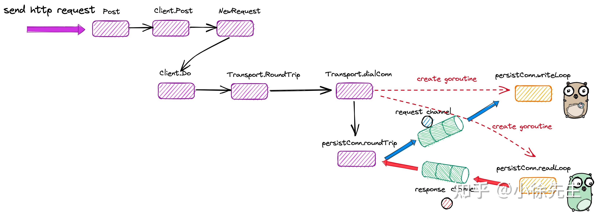
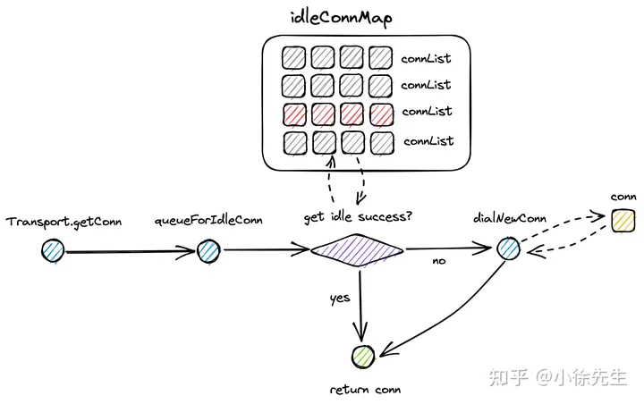

# HTTP
经典的CS架构
```Go
package main

import (
    "net/http"
)


func main() {
    http.HandleFunc("/ping", func(w http.ResponseWriter, r *http.Request) {
        w.Write([]byte("pong"))
    })


    http.ListenAndServe(":8091", nil)
}
```
## 服务端
### 路由注册
两种路由注册方式:
1. http.HandleFunc 传入一个处理函数,这个函数的可以是匿名函数,也可以是具名函数,但是入参一定是ResponseWriter, *Request
```Go
type HandlerFunc func(ResponseWriter, *Request) //!!!对传入函数进行同一类型的包装,为HandlerFunc!!!

func HandleFunc(pattern string, handler func(ResponseWriter, *Request)) {
	DefaultServeMux.HandleFunc(pattern, handler)
}

func (mux *ServeMux) HandleFunc(pattern string, handler func(ResponseWriter, *Request)) {
	if handler == nil {
		panic("http: nil handler")
	}
	mux.Handle(pattern, HandlerFunc(handler))
}

```
2. http.Handle 传入一个结构体指针,该结构体一定要实现ServeHTTP(ResponseWriter, *Request)方法
```Go
func Handle(pattern string, handler Handler) {
     DefaultServeMux.Handle(pattern, handler) 
}
```
    两者都是调用的DefaultServerMux,这个DefaultServerMux
```Go
var DefaultServeMux = &defaultServeMux
var defaultServeMux ServeMux
type ServeMux struct {
	mu    sync.RWMutex //读写锁,用于控制并发
	m     map[string]muxEntry//路由和对应的处理函数的映射
	es    []muxEntry // 处理路由糊匹配机制 对于以 '/' 结尾的 path根据 path长度将 muxEntry有序插入到数组
	hosts bool 
}
type muxEntry struct {
	h       Handler //处理函数,是一个接口类型,表示这个Handler一定要实现SereHTTP方法
	pattern string 
}
type Handler interface {
	ServeHTTP(ResponseWriter, *Request)
}
```
最终的路由保存函数为
```Go
func (mux *ServeMux) Handle(pattern string, handler Handler) {
	mux.mu.Lock()
	defer mux.mu.Unlock()

	if pattern == "" {
		panic("http: invalid pattern")
	}
	if handler == nil {
		panic("http: nil handler")
	}
	if _, exist := mux.m[pattern]; exist {
		panic("http: multiple registrations for " + pattern)
	}

	if mux.m == nil {
		mux.m = make(map[string]muxEntry)
	}
	e := muxEntry{h: handler, pattern: pattern}
	mux.m[pattern] = e
	if pattern[len(pattern)-1] == '/' {
		mux.es = appendSorted(mux.es, e) //有序排序
	}

	if pattern[0] != '/' {
		mux.hosts = true
	}
}
```

## 服务启动

```Go
func ListenAndServe(addr string, handler Handler) error {
	server := &Server{Addr: addr, Handler: handler}
	return server.ListenAndServe()
}
func (srv *Server) ListenAndServe() error {
	if srv.shuttingDown() {
		return ErrServerClosed
	}
	addr := srv.Addr
	if addr == "" {
		addr = ":http"
	}
	ln, err := net.Listen("tcp", addr)//底层调用net Listen方法来开始监听端口
	if err != nil {
		return err
	}
	return srv.Serve(ln)
}
func (srv *Server) Serve(l net.Listener) error {
	...
	for {//死循环,阻塞的接收到一个Accept后开启一个groutine处理对应的请求
		rw, err := l.Accept()
		...
		c := srv.newConn(rw)
		...
		go c.serve(connCtx)
	}
}
func (srv *Server) newConn(rwc net.Conn) *conn {
	c := &conn{
		server: srv,
		rwc:    rwc,
	}
	if debugServerConnections {
		c.rwc = newLoggingConn("server", c.rwc)
	}
	return c
}
func (c *conn) serve(ctx context.Context) {
		...
		serverHandler{c.server}.ServeHTTP(w, w.req)//包装c.server为serverHandler,包装的原因是再调用Serer的Handler的ServerHTTP方法前,还要有些其他的处理,所以才这样操作
		...
}

type serverHandler struct { //实现了ServeHTTP,通过serverHandler.ServerHTTP完成srv对请求的响应
	srv *Server
}

func (sh serverHandler) ServeHTTP(rw ResponseWriter, req *Request) {
	handler := sh.srv.Handler
	if handler == nil {
		handler = DefaultServeMux //如果没有注册handle,则使用全局的handler DefaultServeMux
	}
	if req.RequestURI == "*" && req.Method == "OPTIONS" {
		handler = globalOptionsHandler{}
	}

	if req.URL != nil && strings.Contains(req.URL.RawQuery, ";") {
		var allowQuerySemicolonsInUse int32
		req = req.WithContext(context.WithValue(req.Context(), silenceSemWarnContextKey, func() {
			atomic.StoreInt32(&allowQuerySemicolonsInUse, 1)
		}))
		defer func() {
			if atomic.LoadInt32(&allowQuerySemicolonsInUse) == 0 {
				sh.srv.logf("http: URL query contains semicolon, which is no longer a supported separator; parts of the query may be stripped when parsed; see golang.org/issue/25192")
			}
		}()
	}

	handler.ServeHTTP(rw, req) //调用的是Server的handler的ServerHTTP,这里假设使用的是DefaultServeMux
}
type Server struct {
	...
	Handler Handler 
	...
}
type Handler interface {
	ServeHTTP(ResponseWriter, *Request)
}


var DefaultServeMux = &defaultServeMux

var defaultServeMux ServeMux
func (mux *ServeMux) ServeHTTP(w ResponseWriter, r *Request) {
	...	
	h, _ := mux.Handler(r)
	h.ServeHTTP(w, r)
}


func (mux *ServeMux) Handler(r *Request) (h Handler, pattern string) {
	...
	return mux.handler(host, r.URL.Path)

//返回实际上注册的路由处理的handelr
func (mux *ServeMux) handler(host, path string) (h Handler, pattern string) {
	mux.mu.RLock()
	defer mux.mu.RUnlock()

	// Host-specific pattern takes precedence over generic ones
	if mux.hosts {
		h, pattern = mux.match(host + path)
	}
	if h == nil {
		h, pattern = mux.match(path)
	}
	if h == nil {
		h, pattern = NotFoundHandler(), ""
	}
	return
}
//通过路由查找对应的处理的handler
func (mux *ServeMux) match(path string) (h Handler, pattern string) {
	// Check for exact match first.
	v, ok := mux.m[path]
	if ok {
		return v.h, v.pattern
	}

	// Check for longest valid match.  mux.es contains all patterns
	// that end in / sorted from longest to shortest.
	for _, e := range mux.es {
		if strings.HasPrefix(path, e.pattern) {
			return e.h, e.pattern
		}
	}
	return nil, ""
}
```
## 客户端
客户端发起http请求的几个步骤:

	构造请求参数
	获取用于与服务端交互的tcp连接
	通过tcp发起请求
	通过tcp接收响应


### 客户端
golang创建请求中的传输层协议为tcp,要理解是一个具有生命周期的struct,每个tcp创建出都会产生两个守护的groutine,一个负责接受,一个负责响应(writeloop,readloop),通过对writeloop和readloop的解耦而并非串行的请求-等待响应,极大的提升了交互
```Go
type Client struct {
    // Transport：负责 http 通信的核心部分
    Transport RoundTripper
    // Jar：cookie 管理
    Jar CookieJar
    // Timeout：超时设置
    Timeout time.Duration
}
var DefaultClient = &Client{}
```
### 请求参数
```Go
type Request struct {
	Method string
	URL *url.URL
	Proto      string // "HTTP/1.0"
	ProtoMajor int    // 1
	ProtoMinor int    // 0
	Header Header
	Body io.ReadCloser
	GetBody func() (io.ReadCloser, error)
	ContentLength int64
	TransferEncoding []string
	Close bool
	Host string
	Form url.Values
	PostForm url.Values
	MultipartForm *multipart.Form
	Trailer Header
	RemoteAddr string
	RequestURI string
	TLS *tls.ConnectionState
	Cancel <-chan struct{}
	Response *Response
	ctx context.Context
}
```
### 请求流程
```Go
func Post(url, contentType string, body io.Reader) (resp *Response, err error) {
	return DefaultClient.Post(url, contentType, body)
}
func (c *Client) Post(url, contentType string, body io.Reader) (resp *Response, err error) {
	req, err := NewRequest("POST", url, body)
	if err != nil {
		return nil, err
	}
	req.Header.Set("Content-Type", contentType)
	return c.Do(req)
}
func (c *Client) Do(req *Request) (*Response, error) {
	return c.do(req)
}

func (c *Client) do(req *Request) (retres *Response, reterr error) {
	...
	for {
		...
		if resp, didTimeout, err = c.send(req, deadline); err != nil {
			// c.send() always closes req.Body
			...
			return nil, uerr(err)
		}
		...
		req.closeBody()
	}
}
func (c *Client) send(req *Request, deadline time.Time) (resp *Response, didTimeout func() bool, err error) {
	...
	//request设置cookie
	if c.Jar != nil {
		for _, cookie := range c.Jar.Cookies(req.URL) {
			req.AddCookie(cookie)
		}
	}
	...
	resp, didTimeout, err = send(req, c.transport(), deadline)
	if err != nil {
		return nil, didTimeout, err
	}
	//response设置cookie
	if c.Jar != nil {
		if rc := resp.Cookies(); len(rc) > 0 {
			c.Jar.SetCookies(req.URL, rc)
		}
	}
	...
	return resp, nil, nil
}

func send(ireq *Request, rt RoundTripper, deadline time.Time) (resp *Response, didTimeout func() bool, err error) {
	...
	resp, err = rt.RoundTrip(req)
	...
	return resp, nil, nil
}
```
	
send函数中的
```Go
resp, didTimeout, err = send(req, c.transport(), deadline)
//正常情况下,没有初始化c.Transport,因此使用的是DefaultTransport
func (c *Client) transport() RoundTripper {
	if c.Transport != nil {
		return c.Transport
	}
	return DefaultTransport
}
```
Tranport 是 RoundTripper接口的实现类，核心字段包括：

	idleConn：空闲连接 map，实现复用
	DialContext：新连接生成器

而RoundTripper 是通信模块的 interface，需要实现方法 Roundtrip，即通过传入请求 Request，与服务端交互后获得响应 Response.
```Go
type RoundTripper interface {
    RoundTrip(*Request) (*Response, error)
}
```
```Go
type Transport struct {
	idleMu       sync.Mutex
	closeIdle    bool                                // user has requested to close all idle conns
	idleConn     map[connectMethodKey][]*persistConn // most recently used at end
	idleConnWait map[connectMethodKey]wantConnQueue  // waiting getConns
	idleLRU      connLRU

	reqMu       sync.Mutex
	reqCanceler map[cancelKey]func(error)

	altMu    sync.Mutex   // guards changing altProto only
	altProto atomic.Value // of nil or map[string]RoundTripper, key is URI scheme

	connsPerHostMu   sync.Mutex
	connsPerHost     map[connectMethodKey]int
	connsPerHostWait map[connectMethodKey]wantConnQueue // 
	Proxy func(*Request) (*url.URL, error)
	DialContext func(ctx context.Context, network, addr string) (net.Conn, error)
	Dial func(network, addr string) (net.Conn, error)
	DialTLSContext func(ctx context.Context, network, addr string) (net.Conn, error)
	DialTLS func(network, addr string) (net.Conn, error)
	TLSClientConfig *tls.Config
	TLSHandshakeTimeout time.Duration
	DisableKeepAlives bool
	DisableCompression bool
	MaxIdleConns int
	MaxIdleConnsPerHost int
	MaxConnsPerHost int
	IdleConnTimeout time.Duration
	ResponseHeaderTimeout time.Duration
	ExpectContinueTimeout time.Duration
	TLSNextProto map[string]func(authority string, c *tls.Conn) RoundTripper
	ProxyConnectHeader Header
	GetProxyConnectHeader func(ctx context.Context, proxyURL *url.URL, target string) (Header, error)
	MaxResponseHeaderBytes int64
	WriteBufferSize int
	ReadBufferSize int
	nextProtoOnce      sync.Once
	h2transport        h2Transport // non-nil if http2 wired up
	tlsNextProtoWasNil bool        // whether TLSNextProto was 
	ForceAttemptHTTP2 bool
}

var DefaultTransport RoundTripper = &Transport{
	Proxy: ProxyFromEnvironment,
	DialContext: defaultTransportDialContext(&net.Dialer{
		Timeout:   30 * time.Second,
		KeepAlive: 30 * time.Second,
	}),
	ForceAttemptHTTP2:     true,
	MaxIdleConns:          100,
	IdleConnTimeout:       90 * time.Second,
	TLSHandshakeTimeout:   10 * time.Second,
	ExpectContinueTimeout: 1 * time.Second,
}


type RoundTripper interface {
	RoundTrip(*Request) (*Response, error)
}

func (t *Transport) RoundTrip(req *Request) (*Response, error) {
	// The Transport has a documented contract that states that if the DialContext or
	// DialTLSContext functions are set, they will be used to set up the connections.
	// If they aren't set then the documented contract is to use Dial or DialTLS, even
	// though they are deprecated. Therefore, if any of these are set, we should obey
	// the contract and dial using the regular round-trip instead. Otherwise, we'll try
	// to fall back on the Fetch API, unless it's not available.
	if t.Dial != nil || t.DialContext != nil || t.DialTLS != nil || t.DialTLSContext != nil || jsFetchMissing {
		return t.roundTrip(req)
	}
	...
}

// roundTrip implements a RoundTripper over HTTP.
func (t *Transport) roundTrip(req *Request) (*Response, error) {
	...
	for {
		select {
		case <-ctx.Done():
			req.closeBody()
			return nil, ctx.Err()
		default:
		}
		treq := &transportRequest{Request: req, trace: trace, cancelKey: cancelKey} //构造transport请求
		pconn, err := t.getConn(treq, cm)//获取可用的tcp链接
		...
			resp, err = pconn.roundTrip(treq) //交互,获取相应
		...
}

type persistConn struct {
	alt RoundTripper
	t         *Transport
	cacheKey  connectMethodKey
	conn      net.Conn
	tlsState  *tls.ConnectionState
	br        *bufio.Reader       // from conn
	bw        *bufio.Writer       // to conn
	nwrite    int64               // bytes written
	reqch     chan requestAndChan // written by roundTrip; read by readLoop
	writech   chan writeRequest   // written by roundTrip; read by writeLoop
	closech   chan struct{}       // closed when conn closed
	isProxy   bool
	sawEOF    bool  // whether we've seen EOF from conn; owned by readLoop
	readLimit int64 // bytes allowed to be read; owned by
	writeErrCh chan error
	writeLoopDone chan struct{} // closed when write loop ends
	idleAt    time.Time   // time it last become idle
	idleTimer *time.Timer // holding an AfterFunc to close it
	mu                   sync.Mutex // guards following fields
	numExpectedResponses int
	closed               error // set non-nil when conn is closed, before closech is closed
	canceledErr          error // set non-nil if conn is canceled
	broken               bool  // an error has happened on this connection; marked broken so it's not reused.
	reused               bool  // whether conn has had 
	mutateHeaderFunc func(Header)
}

func (pc *persistConn) roundTrip(req *transportRequest) (resp *Response, err error) {
	...

```
### *Transport getConn


#### 获取连接:

	1. 通过 queueForIdleConn 方法，尝试复用采用相同协议、访问相同服务端地址的空闲连接
	2. 倘若无可用连接，则通过 queueForDial 方法，异步创建一个新的连接，并通过接收 ready channel 信号的方式，确认构造连接的工作已经完成.
```Go
func (t *Transport) getConn(treq *transportRequest, cm connectMethod) (pc *persistConn, err error) {
	req := treq.Request
	trace := treq.trace
	ctx := req.Context()
	if trace != nil && trace.GetConn != nil {
		trace.GetConn(cm.addr())
	}

	w := &wantConn{
		cm:         cm,
		key:        cm.key(), // key 由 http 协议、服务端地址等信息组成
		ctx:        ctx,
		ready:      make(chan struct{}, 1),   // 标识连接构造成功的信号发射器
		beforeDial: testHookPrePendingDial,
		afterDial:  testHookPostPendingDial,
	}
	// 倘若连接获取失败，在 wantConn.cancel 方法中，会尝试将 tcp 连接放回队列中以供后续复用
	defer func() {
		if err != nil {
			w.cancel(t, err)
		}
	}()
 	// 尝试复用指向相同服务端地址的空闲连接
	if delivered := t.queueForIdleConn(w); delivered {
		pc := w.pc
		// Trace only for HTTP/1.
		// HTTP/2 calls trace.GotConn itself.
		if pc.alt == nil && trace != nil && trace.GotConn != nil {
			trace.GotConn(pc.gotIdleConnTrace(pc.idleAt))
		}
		// set request canceler to some non-nil function so we
		// can detect whether it was cleared between now and when
		// we enter roundTrip
		t.setReqCanceler(treq.cancelKey, func(error) {})
		return pc, nil
	}

	cancelc := make(chan error, 1)
	t.setReqCanceler(treq.cancelKey, func(err error) { cancelc <- err })

	// 异步构造新的连接
	t.queueForDial(w)

	// 通过阻塞等待信号的方式，等待连接获取完成
	select {
	case <-w.ready:
		// Trace success but only for HTTP/1.
		// HTTP/2 calls trace.GotConn itself.
		if w.pc != nil && w.pc.alt == nil && trace != nil && trace.GotConn != nil {
			trace.GotConn(httptrace.GotConnInfo{Conn: w.pc.conn, Reused: w.pc.isReused()})
		}
		if w.err != nil {
			// If the request has been canceled, that's probably
			// what caused w.err; if so, prefer to return the
			// cancellation error (see golang.org/issue/16049).
			select {
			case <-req.Cancel:
				return nil, errRequestCanceledConn
			case <-req.Context().Done():
				return nil, req.Context().Err()
			case err := <-cancelc:
				if err == errRequestCanceled {
					err = errRequestCanceledConn
				}
				return nil, err
			default:
				// return below
			}
		}
		return w.pc, w.err
	case <-req.Cancel:
		return nil, errRequestCanceledConn
	case <-req.Context().Done():
		return nil, req.Context().Err()
	case err := <-cancelc:
		if err == errRequestCanceled {
			err = errRequestCanceledConn
		}
		return nil, err
	}
}


type wantConn struct {
	cm    connectMethod
	key   connectMethodKey // cm.key()
	ctx   context.Context  // context for dial
	ready chan struct{}    // closed when pc, err pair is delivered

	// hooks for testing to know when dials are done
	// beforeDial is called in the getConn goroutine when the dial is queued.
	// afterDial is called when the dial is completed or canceled.
	beforeDial func()
	afterDial  func()

	mu  sync.Mutex // protects pc, err, close(ready)
	pc  *persistConn
	err error
}
```
##### 尝试复用连接

	1. 尝试从 Transport.idleConn 中获取指向同一服务端的空闲连接 persisConn
	2. 获取到连接后会调用 wantConn.tryDeliver 方法将连接绑定到 wantConn 请求参数上
    3. 绑定成功后，会关闭 wantConn.ready channel，以唤醒阻塞读取该 channel 的 goroutine
```Go
func (t *Transport) queueForIdleConn(w *wantConn) (delivered bool) {
    // 可见idleConn的key是一个类型为 map[connectMethodKey][]*persistConn
    if list, ok := t.idleConn[w.key]; ok {
        // ...
        for len(list) > 0 && !stop {
            pconn := list[len(list)-1]
            // ...
            delivered = w.tryDeliver(pconn, nil)
            if delivered {
                // ...
                list = list[:len(list)-1]               
            }
            stop = true
        }
        // ...
        if stop {
            return delivered
        }
    }
   
    // ...    
    return false
}
func (w *wantConn) tryDeliver(pc *persistConn, err error) bool {
    w.mu.Lock()
    defer w.mu.Unlock()
    // ...
    w.pc = pc
    w.err = err
    // ...
    close(w.ready)
    return true
}

```
##### 创建一个新的连接
在 queueForDial 方法会异步调用 Transport.dialConnFor 方法，创建新的 tcp 连接. 由于是异步操作，所以在上游会通过读 channel 的方式，等待创建操作完成.

这里之所以采用异步操作进行连接创建，有两部分原因：

	一个 tcp 连接并不是一个静态的数据结构，它是有生命周期的，创建过程中会为其创建负责读写的两个守护协程，伴随而生
	在上游 Transport.queueForIdleConn 方法中，当通过 select 多路复用的方式，接收到其他终止信号时，可以提前调用 wantConn.cancel 方法打断创建连接的 goroutine. 相比于串行化执行而言，这种异步交互的模式，具有更高的灵活度


```Go
//创建一个新的tcp连接
func (t *Transport) queueForDial(w *wantConn) {
	...
		//开启一个goroutine来创建连接
		go t.dialConnFor(w)
		return
	....
}

func (t *Transport) dialConnFor(w *wantConn) {
	defer w.afterDial()
	//创建连接
	pc, err := t.dialConn(w.ctx, w.cm)
	//将连接保存到wantConn
	delivered := w.tryDeliver(pc, err)
	if err == nil && (!delivered || pc.alt != nil) {
		// pconn was not passed to w,
		// or it is HTTP/2 and can be shared.
		// Add to the idle connection pool.
		t.putOrCloseIdleConn(pc)
	}
	if err != nil {
		t.decConnsPerHost(w.key)
	}
}

func (t *Transport) dialConn(ctx context.Context, cm connectMethod) (pconn *persistConn, err error) {
	//tcp连接实际上是persistConn
	pconn = &persistConn{
		t:             t,
		cacheKey:      cm.key(),
		reqch:         make(chan requestAndChan, 1),
		//writeloop持有的goroutine
		writech:       make(chan writeRequest, 1),
		closech:       make(chan struct{}),
		writeErrCh:    make(chan error, 1),
		writeLoopDone: make(chan struct{}),
	}
	...
		conn, err := t.dial(ctx, "tcp", cm.addr())
		if err != nil {
			return nil, wrapErr(err)
		}
		pconn.conn = conn
	...

	go pconn.readLoop()
	go pconn.writeLoop()
	return pconn, nil
} 

```
##### 请求的读写

	在伴生读协程 persisConn.readLoop 方法中，会读取来自服务端的响应，并添加到 persistConn.reqCh 中，供上游 persistConn.roundTrip 方法接收.(读取相应)
	在伴生写协程 persisConn.writeLoop方法中，会通过 persistConn.writech 读取到客户端提交的请求，然后将其发送到服务端.(读取请求,发送请求)
```Go
func (pc *persistConn) readLoop() { 
    // ...
    alive := true
    for alive {
        // 读取到用于给主groutine返回数据的chan
        rc := <-pc.reqch
        // ...
        var resp *Response
        // 接受服务端响应
        resp, err = pc.readResponse(rc, trace)
        // 将响应写入rc的chan中
        select{
            rc.ch <- responseAndError{res: resp}:
            // ...
        }
        // ...        
    }
}

type requestAndChan struct {
	_         incomparable
	req       *Request
	cancelKey cancelKey
	ch        chan responseAndError // unbuffered; always send in select on callerGone

	// whether the Transport (as opposed to the user client code)
	// added the Accept-Encoding gzip header. If the Transport
	// set it, only then do we transparently decode the gzip.
	addedGzip bool

	// Optional blocking chan for Expect: 100-continue (for send).
	// If the request has an "Expect: 100-continue" header and
	// the server responds 100 Continue, readLoop send a value
	// to writeLoop via this chan.
	continueCh chan<- struct{}

	
func (pc *persistConn) writeLoop() {    
    for {
        select {
			//wr为服务端发出请求
        case wr := <-pc.writech:
            //将请求写入
            err := wr.req.Request.write(pc.bw, pc.isProxy, wr.req.extra, pc.waitForContinue(wr.continueCh))
            // ...       
    }
}
```
##### 归还请求
首先，在构造新连接中途，倘若被打断，则可能会将连接放回队列以供复用
```Go
func (t *Transport) getConn(treq *transportRequest, cm connectMethod) (pc *persistConn, err error) {
    // ...
    // 倘若连接获取失败，在 wantConn.cancel 方法中，会尝试将 tcp 连接放回队列中以供后续复用
    defer func() {
        if err != nil {
            w.cancel(t, err)
        }
    }()
    // ...
}
func (w *wantConn) cancel(t *Transport, err error) {
   // ...
    if pc != nil {
        t.putOrCloseIdleConn(pc)
    }
}
func (t *Transport) tryPutIdleConn(pconn *persistConn) error {
    // ...
    key := pconn.cacheKey
    // ...
    t.idleConn[key] = append(idles, pconn)
    // ...
    return nil
}
```
倘若与服务端的一轮交互流程结束，也会将连接放回队列以供复用.
```Go
func (pc *persistConn) readLoop() {
    tryPutIdleConn := func(trace *httptrace.ClientTrace) bool {
        if err := pc.t.tryPutIdleConn(pc); err != nil {
            // ...
        }
        // ...
    }
    
    // ...
    alive := true
    for alive {
        // ...
        select {
        case bodyEOF := <-waitForBodyRead:
            // ...
            tryPutIdleConn(trace)
            // ...
        }           
    }
    
}
func (t *Transport) putOrCloseIdleConn(pconn *persistConn) {
    if err := t.tryPutIdleConn(pconn); err != nil {
        pconn.close(err)
    }
}
```

##### 主goroutine如何与clinet生成的两个半生的goroutine通信?

	首先将 http 请求通过 persistConn.writech 发送给连接的守护协程 writeLoop，并进一步传送到服务端
	其次通过读取 resc channel，接收由守护协程 readLoop 代理转发的客户端响应数据.

```Go
		pconn, err := t.getConn(treq, cm)//获取可用的tcp链接
		...
			resp, err = pconn.roundTrip(treq) //交互,获取相应
		...
```
```Go
func (pc *persistConn) roundTrip(req *transportRequest) (resp *Response, err error) {
	...
	//请求发送给pc.writech
	pc.writech <- writeRequest{req, writeErrCh, continueCh}
	//构造读取请求的channel
	resc := make(chan responseAndError)
	//先把读取请求的channel发送给pc.reqch
	pc.reqch <- requestAndChan{
		req:        req.Request,
		cancelKey:  req.cancelKey,
		ch:         resc,
		addedGzip:  requestedGzip,
		continueCh: continueCh,
		callerGone: gone,
	}

	for {
		testHookWaitResLoop()
		select {
		...
		//接受到相应
		case re := <-resc:
			if (re.res == nil) == (re.err == nil) {
				panic(fmt.Sprintf("internal error: exactly one of res or err should be set; nil=%v", re.res == nil))
			}
			if debugRoundTrip {
				req.logf("resc recv: %p, %T/%#v", re.res, re.err, re.err)
			}
			if re.err != nil {
				return nil, pc.mapRoundTripError(req, startBytesWritten, re.err)
			}
			//返回响应
			return re.res, nil
		case <-cancelChan:
			canceled = pc.t.cancelRequest(req.cancelKey, errRequestCanceled)
			cancelChan = nil
		...
		//接受context的控制
		case <-ctxDoneChan:
			canceled = pc.t.cancelRequest(req.cancelKey, req.Context().Err())
			cancelChan = nil
			ctxDoneChan = nil
		}
	}
}
```