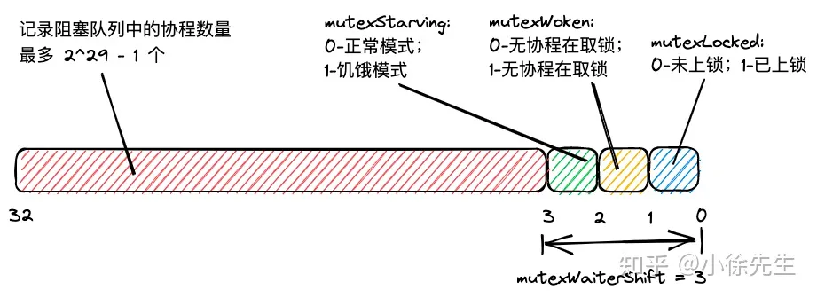

# 锁

## 数据结构
```Go
type Mutex struct {
	state int32
	sema  uint32
}
type Locker interface {
	Lock()
	Unlock()
}
```
    （1）state：锁中最核心的状态字段，不同 bit 位分别存储了 mutexLocked(是否上锁)、mutexWoken（是否有 goroutine 从阻塞队列中被唤醒）、mutexStarving（是否处于饥饿模式）的信息

    （2）sema：用于阻塞和唤醒 goroutine 的信号量.
```Go
const (
	mutexLocked = 1 << iota // mutex is locked
	mutexWoken
	mutexStarving
	mutexWaiterShift = iota
	starvationThresholdNs = 1e6
)
```

    （1）mutexLocked = 1：state 最右侧的一个 bit 位标志是否上锁，0-未上锁，1-已上锁；
    （2）mutexWoken = 2：state 右数第二个 bit 位标志是否有 goroutine 从阻塞中被唤醒，0-没有，1-有；
    （3）mutexStarving = 4：state 右数第三个 bit 位标志 Mutex 是否处于饥饿模式，0-非饥饿，1-饥饿；
    （4）mutexWaiterShift = 3：表示state 这个int32右侧存在 3 个 bit 位标识特殊信息
    （5）starvationThresholdNs = 1 ms：sync.Mutex 进入饥饿模式的等待时间阈值.


&^ 是一种较少见的位操作符，以 x &^ y 为例，假如 y = 1，结果为 0；假若 y = 0，结果为 x

    （1）state & mutexLocked：判断是否上锁；
    （2）state | mutexLocked：加锁；
    （2）state &^ mutexLocked：解锁；


    （3）state & mutexWoken：判断是否存在抢锁的协程；
    （4）state | mutexWoken：更新状态，标识存在抢锁的协程；
    （5）state &^ mutexWoken：更新状态，标识不存在抢锁的协程；

 
    （6）state & mutexStarving：判断是否处于饥饿模式；
    （7）state | mutexStarving：置为饥饿模式；
    （7）state &^ mutexStarving：置为正常模式；


    （8）state >> mutexWaiterShif：获取阻塞等待的协程数；
    （9）state += 1 << mutexWaiterShif：阻塞等待的协程数 + 1.