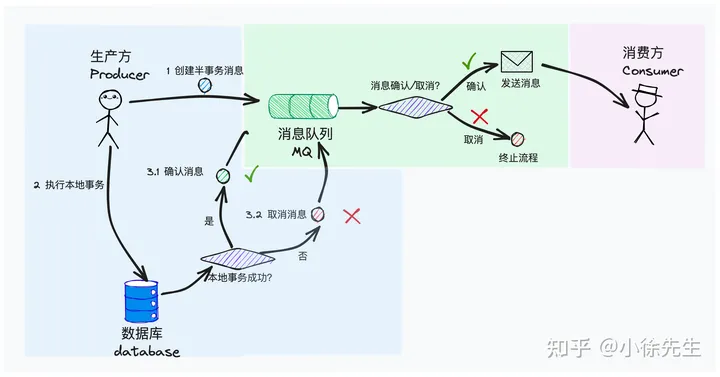
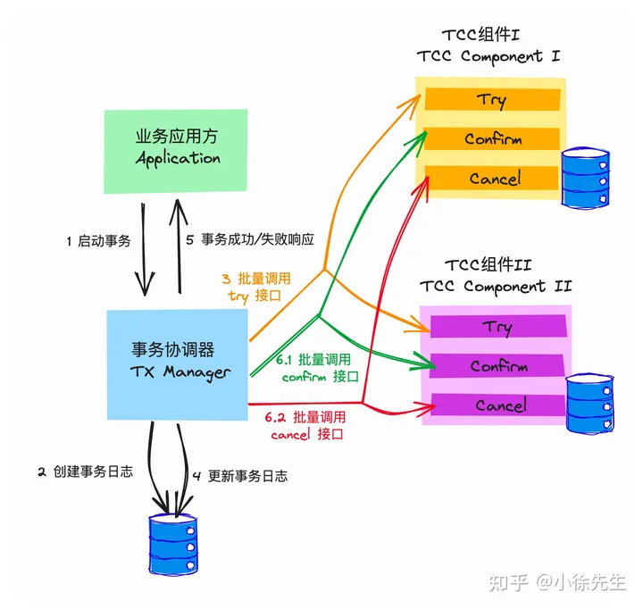

# 分布式事务
## 框架

http://github.com/xiaoxuxiansheng/gotcc

## 概念和背景

transaction

    A: 原子性 一系列操作要么全成功,要么全失败
    C: 一致性 宏观视角下全局的数据保持一致
    I: 隔离性 并发事务互不干扰
    D: 持久性 事务提交后,变更永久生效

分布式事务

    一致性指数据的最终一致性,而非即时一致性
    分布式事务能够保证100%的一致性,如网络IO,第三方系统的影响

## 可行方案探讨

使用MQ的优势:

    依赖于 MQ 中 at least once 的性质，我们简单认为，只要把一条消息成功投递到 MQ 组件中，它就一定被下游 consumer 端消费端，至少不会发生消息丢失的问题.而针对重复投递的问题, consumer可以通过幂等性保证 only once

一种可行的方案:

    首先 begin transaction，开启本地事务
    在事务中，执行本地状态数据的更新
    完成数据更新后，不立即 commit transaction
    执行消息投递操作
    倘若消息投递成功，则 commit transaction
    倘若消息投递失败，则 rollback transaction

该方案的缺点:

    在和数据库交互的本地事务中，夹杂了和第三方组件的 IO 操作，可能存在引发长事务的风险(MQ)
    执行消息投递时，可能因为超时或其他意外原因，导致出现消息在事实上已投递成功，但 producer 获得的投递响应发生异常的问题，这样就会导致本地事务被误回滚的问题(MQ)
    在执行事务提交操作时，可能发生失败. 此时事务内的数据库修改操作自然能够回滚，然而 MQ 消息一经发出，就已经无法回收了.(数据库)

## 事务消息原理

可以RocketMQ中的Tx Msg为例

https://rocketmq.apache.org/docs/4.x/producer/06message5/

1.为producer提供了一个主动的选择权,可以主动控制半事务消息是否真正的被发送
2.mq提供了轮询机制,主动帮助半事务消息的进度推进

存在的问题:

    不具备逆向回滚能力：倘若接收消息的下游 consumer 侧执行操作失败，此时至多只能依赖于 MQ 的重发机制通过重试动作的方式提高执行成功率，但是无法从根本上解决下游 consumer 操作失败后回滚上游 producer 的问题

## TCC (Try Confirm Cancel)

https://www.bytesoft.org/tcc-intro/
两阶段提交:

    第一个阶段是 Try，指的是先对资源进行锁定，资源处于中间态但不处于最终态
    第二个阶段分为 Confirm 和 Cancel，指的是在 Try 操作的基础上，真正提交这次修改操作还是回滚这次变更操作

组件分类:

    应用方 Application：指的是需要使用到分布式事务能力的应用方，即这套 TCC 框架服务的甲方

    TCC 组件 TCC Component：指的是需要完成分布式事务中某个特定步骤的子模块. 这个模块通常负责一些状态数据的维护和更新操作，需要对外暴露出 Try、Confirm 和 Cancel 三个 API：
        Try：锁定资源，通常以类似【冻结】的语义对资源的状态进行描述，保留后续变化的可能性
        Confirm：对 Try 操作进行二次确认，将记录中的【冻结】态改为【成功】态
        Cancel：对 Try 操作进行回滚，将记录中的【冻结】状消除或者改为【失败】态. 其底层对应的状态数据会进行回滚

    事务协调器 TX Manager：负责统筹分布式事务的执行：
        实现 TCC Component 的注册管理功能
        负责和 Application 交互，提供分布式事务的创建入口，给予 Application 事务执行结果的响应
        串联 Try -> Confirm/Cancel 的两阶段流程. 在第一阶段中批量调用 TCC Component 的 Try 接口，根据其结果，决定第二阶段是批量调用 TCC Component 的 Confirm 接口还是 Cancel 接口