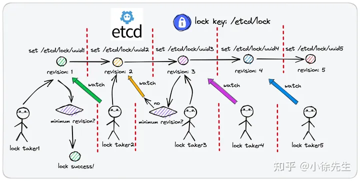
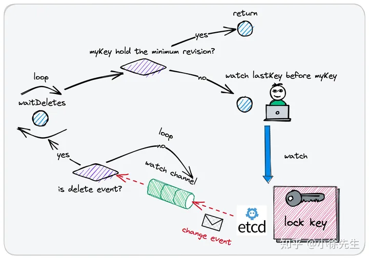

# 分布式锁

阻塞唤醒型

    不会浪费CPU时间
    需要挂起,进行上下文切换,操作较重
    适用于并发激烈的场景

自旋+CAS
    无阻塞,操作较轻
    长时间获取不到时候,会浪费CPU时间
    适用于并发较低的场景


## 主动轮询

    基于redis的setnx 原子操作
    基于redis的lua脚本实现 多个操作组成事务

### redis数据弱一致性问题

redis采用主从复制的方式实现数据异步延迟同步到从节点的,当主节点完成加锁后,加锁的数据还未同步到从节点时候宕机,此时哨兵会推选从节点充当主节点,此时从节点还未获取到之前主节点的锁信息,导致锁可能被多次持有
解决方式:redis 红锁(保证了数据的强一致性)

#### 红锁

红锁 Redlock 全称 redis distribution lock，是 redis 作者 antirez 提出的一种分布式锁实现方案.

在红锁的实现中：

    我们假定集群中有 2N+1个 redis 节点（通常将节点总数设置为奇数，有利于多数派原则的执行效率）
    这些 redis 节点彼此间是相互独立的，不存在从属关系
    每次客户端尝试进行加锁操作时，会同时对2N+1个节点发起加锁请求
    每次客户端向一个节点发起加锁请求时，会设定一个很小的请求处理超时阈值
    客户端依次对2N+1个节点发起加锁请求，只有在小于请求处理超时阈值的时间内完成了加锁操作，才视为一笔加锁成功的请求
    过完2N+1个节点后，统计加锁成功的请求数量
    倘若加锁请求成功数量大于等于N+1（多数派），则视为红锁加锁成功
    倘若加锁请求成功数量小于N+1，视为红锁加锁失败，此时会遍历2N+1个节点进行解锁操作，有利于资源回收，提供后续使用方的取锁效率

### 过期时间不精确的问题
expire 机制的使用会引入一个新的问题——过期时间不精准. 因为此处设置的过期时间只能是一个经验值（通常情况下偏于保守），既然是经验值，那就做不到百分之百的严谨性. 试想假如占有锁的使用方在业务处理流程中因为一些异常的耗时（如 IO、GC等），导致业务逻辑处理时间超过了预设的过期时间，就会导致锁被提前释放. 此时在原使用方的视角中，锁仍然持有在自己手中，但在实际情况下，锁数据已经被删除，其他取锁方可能取锁成功，于是就可能引起一把锁同时被多个使用方占用的问题，锁的基本性质——独占性遭到破坏.

### redis 分布式锁代码实现

    https://github.com/xiaoxuxiansheng/redis_lock

需要注意
    1. 阻塞型的锁在获取不到锁的时候要通过select实现超时控制,上下文控制,使用time.Ticker,time.After实现间隔获取

```Go
func (r *RedisLock) blockingLock(ctx context.Context) error {
    // 阻塞模式等锁时间上限
    timeoutCh := time.After(time.Duration(r.blockWaitingSeconds) * time.Second)
    // 轮询 ticker，每隔 50 ms 尝试取锁一次
    ticker := time.NewTicker(time.Duration(50) * time.Millisecond)
    defer ticker.Stop()

    for range ticker.C {
        select {
        // ctx 终止了
        case <-ctx.Done():
            return fmt.Errorf("lock failed, ctx timeout, err: %w", ctx.Err())
            // 阻塞等锁达到上限时间
        case <-timeoutCh:
            return fmt.Errorf("block waiting time out, err: %w", ErrLockAcquiredByOthers)
        // 放行
        default:
        }

        // 尝试取锁
        err := r.tryLock(ctx)
        if err == nil {
            // 加锁成功，返回结果
            return nil
        }

        // 不可重试类型的错误，直接返回
        if !IsRetryableErr(err) {
            return err
        }
    }

    return nil
}

```

    2. 在解锁时候,要通过lua脚本实现一系列的操作完成身份认证

```Go

// LuaCheckAndDeleteDistributionLock 判断是否拥有分布式锁的归属权，是则删除
const LuaCheckAndDeleteDistributionLock = `
  local lockerKey = KEYS[1]
  local targetToken = ARGV[1]
  local getToken = redis.call('get',lockerKey)
  if (not getToken or getToken ~= targetToken) then
    return 0
  else
    return redis.call('del',lockerKey)
  end
`

// Unlock 解锁. 基于 lua 脚本实现操作原子性.
func (r *RedisLock) Unlock(ctx context.Context) error {
    keysAndArgs := []interface{}{r.getLockKey(), r.token}
    reply, err := r.client.Eval(ctx, LuaCheckAndDeleteDistributionLock, 1, keysAndArgs)
    if err != nil {
        return err
    }

    if ret, _ := reply.(int64); ret != 1 {
        return errors.New("can not unlock without ownership of lock)
    }
    return nil
}
```
    3. 锁延期
```Go
const LuaCheckAndExpireDistributionLock = `
  local lockerKey = KEYS[1]
  local targetToken = ARGV[1]
  local duration = ARGV[2]
  local getToken = redis.call('get',lockerKey)
  if (not getToken or getToken ~= targetToken) then
    return 0
  else
    return redis.call('expire',lockerKey,duration)
  end
`
```
    4. 锁租约续约
通过看门狗实现租约的动态续约
```Go
// 基于 redis 实现的分布式锁，不可重入，但保证了对称性
type RedisLock struct {
    LockOptions
    key    string
    token  string
    client *Client


    // 看门狗运作标识
    runningDog int32
    // 停止看门狗
    stopDog context.CancelFunc
}

func (r *RedisLock) Lock(ctx context.Context) (err error) {
    // 通过defer函数保证只有在加锁成功的情况下(err==nil)，才会启动看门狗
    defer func() {
        if err != nil {
            return
        }
        // 关于该锁本身是不可重入的，所以不会出现同一把锁下看门狗重复启动的情况
        r.watchDog(ctx)
    }()
    // ...
}

// 启动看门狗
func (r *RedisLock) watchDog(ctx context.Context) {
    // 1. 非看门狗模式，不处理
    if !r.watchDogMode {
        return
    }


    // 2. 确保之前启动的看门狗已经正常回收

    for !atomic.CompareAndSwapInt32(&r.runningDog, 0, 1) {
    }


    // 3. 启动看门狗
    ctx, r.stopDog = context.WithCancel(ctx)
    go func() {
        defer func() {
            atomic.StoreInt32(&r.runningDog, 0)
        }()
        r.runWatchDog(ctx)
    }()
}
func (r *RedisLock) runWatchDog(ctx context.Context) {
    ticker := time.NewTicker(WatchDogWorkStepSeconds * time.Second)
    defer ticker.Stop()


    for range ticker.C {
        select {
        case <-ctx.Done():
            return
        default:
        }


        // 看门狗负责在用户未显式解锁时，持续为分布式锁进行续期
        // 通过 lua 脚本，延期之前会确保保证锁仍然属于自己
        _ = r.DelayExpire(ctx, WatchDogWorkStepSeconds)
    
    }
}
// Unlock 解锁. 基于 lua 脚本实现操作原子性.
func (r *RedisLock) Unlock(ctx context.Context) (err error) {
    defer func() {
        if err != nil {
            return
        }


        // 停止看门狗
        if r.stopDog != nil {
            r.stopDog()
        }
    }()


    // ...
}
```

## watch回调
基于etcd的watch操作

针对于同一把分布式锁，使用一条相同的数据进行标识（唯一、明确的 key）
倘若在存储介质内成功插入该条数据（要求 key 对应的数据不存在），则这一行为被认定为加锁成功
把从存储介质中删除该条数据这行为理解为解锁操作
与主动轮询型分布式锁不同的是，在取锁失败时，watch 回调型分布式锁不会持续轮询，而是会 watch 监听锁的删除事件：

    倘若在插入数据时，发现该条记录已经存在，说明锁已被他人持有，此时选择监听这条数据记录的删除事件，当对应事件发生时说明锁被释放了，此时才继续尝试取锁


etcd 是一款适合用于共享配置和服务发现的分布式 kv 存储组件，底层基于分布式共识算法 raft 协议保证了存储服务的强一致和高可用.

在 etcd 中提供了watch 监听器的功能，即针对于指定范围的数据，通过与 etcd 服务端节点创建 grpc 长连接的方式持续监听变更事件

此外，etcd 中写入数据时，还支持通过版本 revision 机制进行取锁秩序的统筹协调，是一款很适合用于实现分布式锁的组件.


### watch中的过期时间思路
为避免死锁问题的产生，etcd 中提供了租约 lease 机制. 租约，顾名思义，是一份具有时效性的协议，一旦达到租约上规定的截止时间，租约就会失去效力. 同时，etcd 中还提供了续约机制（keepAlive），用户可以通过续约操作来延迟租约的过期时间.

实现思路如下：

    用户可以先申请一份租约，设定好租约的截止时间
    异步启动一个续约协程，负责在业务逻辑处理完成前，按照一定的时间节奏持续进行续约操作
    在执行取锁动作，将对应于锁的 kv 数据和租约进行关联绑定，使得锁数据和租约拥有相同的过期时间属性
### watch中惊群效应以及解决
在 watch 回调型分布式锁的实现过程中，可能也会存在类似于惊群效应的问题. 这里指的是：倘若一把分布式锁的竞争比较激烈，那么锁的释放事件可能同时被多个的取锁方所监听，一旦锁真的被释放了，所有的取锁方都会一拥而上尝试取锁，然而我们知道，一个轮次中真正能够取锁成功的只会有一名角色，因此这个过程中会存在大量无意义的性能损耗，且释放锁时刻瞬间激增的请求流量也可能会对系统稳定性产生负面效应.

为规避惊群效应，etcd 中提供了前缀 prefix 机制以及版本 revision 机制:

    对于同一把分布式锁，锁记录数据的 key 拥有共同的前缀 prefix，作为锁的标识
    每个取锁方取锁时，会以锁前缀 prefix 拼接上自身的身份标识（租约 id），生成完整的 lock key. 因此各取锁方完整的 lock key 都是互不相同的（只是有着相同的前缀），理论上所有取锁方都能成功把锁记录数据插入到 etcd 中
    每个取锁方插入锁记录数据时，会获得自身 lock key 处在锁前缀 prefix 范围下唯一且递增的版本号 revision
    取锁方插入加锁记录数据不意味着加锁成功，而是需要在插入数据后查询一次锁前缀 prefix 下的记录列表，判定自身 lock key 对应的 revision 是不是其中最小的，如果是的话，才表示加锁成功
    如果锁被他人占用，取锁方会 watch 监听 revision 小于自己但最接近自己的那个 lock key 的删除事件.
    这样所有的取锁方就会在 revision 机制的协调下，根据取锁序号（revision）的先后顺序排成一条队列，每当锁被释放，只会惊动到下一顺位的取锁方，惊群问题得以避免.



### etcd 分布式锁代码实现
etcd 作者在 etcd 的 concurrency 包下，基于 watch 机制结合 revision 机制实现了一款通用的 etcd 分布式锁

```Go

// Mutex implements the sync Locker interface with etcd
type Mutex struct {
	s *Session

	pfx   string
	myKey string
	myRev int64
	hdr   *pb.ResponseHeader
}

func NewMutex(s *Session, pfx string) *Mutex {
	return &Mutex{s, pfx + "/", "", -1, nil}
}

// Lock locks the mutex with a cancelable context. If the context is canceled
// while trying to acquire the lock, the mutex tries to clean its stale lock entry.
func (m *Mutex) Lock(ctx context.Context) error {
	s := m.s
	client := m.s.Client()

	m.myKey = fmt.Sprintf("%s%x", m.pfx, s.Lease())
	cmp := v3.Compare(v3.CreateRevision(m.myKey), "=", 0)
	// put self in lock waiters via myKey; oldest waiter holds lock
	put := v3.OpPut(m.myKey, "", v3.WithLease(s.Lease()))
	// reuse key in case this session already holds the lock
	get := v3.OpGet(m.myKey)
	// fetch current holder to complete uncontended path with only one RPC
    //通过锁的公共前缀进行匹配,获取到一系列的插入结果,通过revsion的最小值找到当前锁的占有者
	getOwner := v3.OpGet(m.pfx, v3.WithFirstCreate()...)
    //如果没有插入,则插入,如果插入,则获取当前锁的拥有者
	resp, err := client.Txn(ctx).If(cmp).Then(put, getOwner).Else(get, getOwner).Commit()
	if err != nil {
		return err
	}
	m.myRev = resp.Header.Revision
	if !resp.Succeeded {
		m.myRev = resp.Responses[0].GetResponseRange().Kvs[0].CreateRevision
	}
	// if no key on prefix / the minimum rev is key, already hold the lock
    // 如果没有key,获取自己是revison最小的一个,表示已经获取到了锁
	ownerKey := resp.Responses[1].GetResponseRange().Kvs
	if len(ownerKey) == 0 || ownerKey[0].CreateRevision == m.myRev {
		m.hdr = resp.Header
		return nil
	}

	// wait for deletion revisions prior to myKey

    //如果没有获取到锁,则监听自己revesion-1的数据的变化
	hdr, werr := waitDeletes(ctx, client, m.pfx, m.myRev-1)
	// release lock key if wait failed
	if werr != nil {
		m.Unlock(client.Ctx())
	} else {
		m.hdr = hdr
	}
	return werr
}

func (m *Mutex) Unlock(ctx context.Context) error {
	client := m.s.Client()
	if _, err := client.Delete(ctx, m.myKey); err != nil {
		return err
	}
	m.myKey = "\x00"
	m.myRev = -1
	return nil
}

func (m *Mutex) IsOwner() v3.Cmp {
	return v3.Compare(v3.CreateRevision(m.myKey), "=", m.myRev)
}

func (m *Mutex) Key() string { return m.myKey }

// Header is the response header received from etcd on acquiring the lock.
func (m *Mutex) Header() *pb.ResponseHeader { return m.hdr }

type lockerMutex struct{ *Mutex }

func (lm *lockerMutex) Lock() {
	client := lm.s.Client()
	if err := lm.Mutex.Lock(client.Ctx()); err != nil {
		panic(err)
	}
}
func (lm *lockerMutex) Unlock() {
	client := lm.s.Client()
	if err := lm.Mutex.Unlock(client.Ctx()); err != nil {
		panic(err)
	}
}

// NewLocker creates a sync.Locker backed by an etcd mutex.
func NewLocker(s *Session, pfx string) sync.Locker {
	return &lockerMutex{NewMutex(s, pfx)}
}

```

```Go
func waitDelete(ctx context.Context, client *v3.Client, key string, rev int64) error {
	cctx, cancel := context.WithCancel(ctx)
	defer cancel()

	var wr v3.WatchResponse
	wch := client.Watch(cctx, key, v3.WithRev(rev))
	for wr = range wch {
		for _, ev := range wr.Events {
			if ev.Type == mvccpb.DELETE {
				return nil
			}
		}
	}
	if err := wr.Err(); err != nil {
		return err
	}
	if err := ctx.Err(); err != nil {
		return err
	}
	return fmt.Errorf("lost watcher waiting for delete")
}

// waitDeletes efficiently waits until all keys matching the prefix and no greater
// than the create revision.
func waitDeletes(ctx context.Context, client *v3.Client, pfx string, maxCreateRev int64) (*pb.ResponseHeader, error) {
    //拿到比自己的reversion小的,但是最接近的一个key
	getOpts := append(v3.WithLastCreate(), v3.WithMaxCreateRev(maxCreateRev))
	for {
		resp, err := client.Get(ctx, pfx, getOpts...)
		if err != nil {
			return nil, err
		}
        //自己是锁的持有者
		if len(resp.Kvs) == 0 {
			return resp.Header, nil
		}
		lastKey := string(resp.Kvs[0].Key)
        //阻塞监听
		if err = waitDelete(ctx, client, lastKey, resp.Header.Revision); err != nil {
			return nil, err
		}
	}
}

```