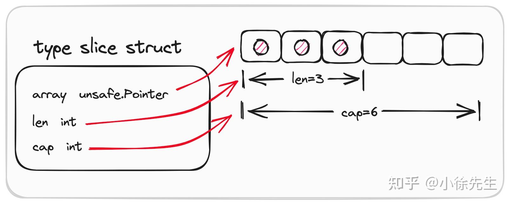
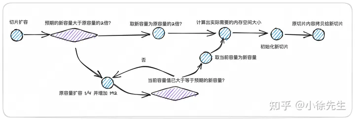

# SLICE
## 数据结构
```Go
type slice struct {
    // 指向起点的地址
    array unsafe.Pointer
    // 切片长度
    len   int
    // 切片容量
    cap   int
}
```


## 拷贝性质
切片的类型定义如上，我们称之为 slice header，对应于每个 slice 实例
    
    在传递切片的时候，相当于是对 slice header 进行了一次值拷贝，但内部存放的地址是相同的，因此对于 slice 本身属于引用传递操作
## len与cap
访问>len且<cap的的索引会panic
## 申明方式

```Go
var a []int
```
未分配内存空间,但是依然支持append操作
## 初始化

方法入口位于 golang 标准库文件 runtime/slice.go 文件的 makeslice 方法中
```Go
func makeslice(et *_type, len, cap int) unsafe.Pointer {
    // 根据 cap 结合每个元素的大小，计算出消耗的总容量
    mem, overflow := math.MulUintptr(et.size, uintptr(cap))
    if overflow || mem > maxAlloc || len < 0 || len > cap {
        // 倘若容量超限，len 取负值或者 len 超过 cap，直接 panic
        mem, overflow := math.MulUintptr(et.size, uintptr(len))
        if overflow || mem > maxAlloc || len < 0 {
            panicmakeslicelen()
        }
        panicmakeslicecap()
    }
    // 走 mallocgc 进行内存分配以及切片初始化
    return mallocgc(mem, et, true)
}
```
## 截取
slice 执行截取操作时，本质上是一次引用传递操作(slice header的值拷贝)，因为不论如何截取，底层复用的都是同一块内存空间中的数据，只不过，截取动作会创建出一个新的 slice header 实例


cap也会变化

## append
!!! 如果cap的剩余不足以支持此次append,则会导致扩容,而扩容会导致切片的地址发生变化,如果切片作为参数传入某个函数,但函数外部的切片一旦通过append操作导致地址发生变化,函数内部是感受不到变化的
```GO
func review14() {
	var wg sync.WaitGroup

	var b []int = make([]int, 5)
	getSliceInfoFunc := func(b []int) {
		defer wg.Done()
		fmt.Printf("g The b is %v,the address of the b is %p,the cap b is %d,the len b is %d\n", b, b, cap(b), len(b))
		time.Sleep(time.Second * 3)
		fmt.Printf("g The b is %v,the address of the b is %p,the cap b is %d,the len b is %d\n", b, b, cap(b), len(b))
	}
	wg.Add(1)
	go getSliceInfoFunc(b)
	b = append(b, 1)
	fmt.Printf("The b is %v,the address of the b is %p,the cap b is %d,the len b is %d\n", b, b, cap(b), len(b))
	wg.Wait()
}
```
## 扩容
扩容会导致实际指向的地址发生变化

扩容的时候预期的新cap为老的cap+待append元素的个数
如:
```Go
    var a []int = make([]int,4,4)
    a=append(a,[]int{1,2,3}...)
```
    则扩容的预期新cap为4+3=7


    倘若扩容后预期的新容量小于原切片的容量，则 panic
    倘若切片元素大小为 0（元素类型为 struct{}），则直接复用一个全局的 zerobase 实例，直接返回
    倘若预期的新容量超过老容量的两倍,直接扩容,否则进入下面的判断
    倘若老容量小于 256，则直接采用老容量的2倍作为新容量
    倘若老容量已经大于等于 256，则在老容量的基础上扩容 1/4 的比例并且累加上 192 的数值，持续这样处理，直到得到的新容量已经大于等于预期的新容量为止
    结合 mallocgc 流程中，对内存分配单元 mspan 的等级制度，推算得到实际需要申请的内存空间大小
    调用 mallocgc，对新切片进行内存初始化
    调用 memmove 方法，将老切片中的内容拷贝到新切片中
    返回扩容后的新切片

```Go
func growslice(et *_type, old slice, cap int) slice {
    //... 
    if cap < old.cap {
        panic(errorString("growslice: cap out of range"))
    }


    if et.size == 0 {
        // 倘若元素大小为 0，则无需分配空间直接返回
        return slice{unsafe.Pointer(&zerobase), old.len, cap}
    }


    // 计算扩容后数组的容量
    newcap := old.cap
    // 取原容量两倍的容量数值
    doublecap := newcap + newcap
    // 倘若新的容量大于原容量的两倍，直接取新容量作为数组扩容后的容量
    if cap > doublecap {
        newcap = cap
    } else {
        const threshold = 256
        // 倘若原容量小于 256，则扩容后新容量为原容量的两倍
        if old.cap < threshold {
            newcap = doublecap
        } else {
            // 在原容量的基础上，对原容量 * 5/4 并且加上 192
            // 循环执行上述操作，直到扩容后的容量已经大于等于预期的新容量为止
            for 0 < newcap && newcap < cap {             
                newcap += (newcap + 3*threshold) / 4
            }
            // 倘若数值越界了，则取预期的新容量 cap 封顶
            if newcap <= 0 {
                newcap = cap
            }
        }
    }


    var overflow bool
    var lenmem, newlenmem, capmem uintptr
    // 基于容量，确定新数组容器所需要的内存空间大小 capmem
    switch {
    // 倘若数组元素的大小为 1，则新容量大小为 1 * newcap.
    // 同时会针对 span class 进行取整
    case et.size == 1:
        lenmem = uintptr(old.len)
        newlenmem = uintptr(cap)
        capmem = roundupsize(uintptr(newcap))
        overflow = uintptr(newcap) > maxAlloc
        newcap = int(capmem)
    // 倘若数组元素为指针类型，则根据指针占用空间结合元素个数计算空间大小
    // 并会针对 span class 进行取整
    case et.size == goarch.PtrSize:
        lenmem = uintptr(old.len) * goarch.PtrSize
        newlenmem = uintptr(cap) * goarch.PtrSize
        capmem = roundupsize(uintptr(newcap) * goarch.PtrSize)
        overflow = uintptr(newcap) > maxAlloc/goarch.PtrSize
        newcap = int(capmem / goarch.PtrSize)
    // 倘若元素大小为 2 的指数，则直接通过位运算进行空间大小的计算   
    case isPowerOfTwo(et.size):
        var shift uintptr
        if goarch.PtrSize == 8 {
            // Mask shift for better code generation.
            shift = uintptr(sys.Ctz64(uint64(et.size))) & 63
        } else {
            shift = uintptr(sys.Ctz32(uint32(et.size))) & 31
        }
        lenmem = uintptr(old.len) << shift
        newlenmem = uintptr(cap) << shift
        capmem = roundupsize(uintptr(newcap) << shift)
        overflow = uintptr(newcap) > (maxAlloc >> shift)
        newcap = int(capmem >> shift)
    // 兜底分支：根据元素大小乘以元素个数
    // 再针对 span class 进行取整     
    default:
        lenmem = uintptr(old.len) * et.size
        newlenmem = uintptr(cap) * et.size
        capmem, overflow = math.MulUintptr(et.size, uintptr(newcap))
        capmem = roundupsize(capmem)
        newcap = int(capmem / et.size)
    }


    // 进行实际的切片初始化操作
    var p unsafe.Pointer
    // 非指针类型
    if et.ptrdata == 0 {
        p = mallocgc(capmem, nil, false)
        // ...
    } else {
        // 指针类型
        p = mallocgc(capmem, et, true)
        // ...
    }
    // 将切片的内容拷贝到扩容后的位置 p 
    memmove(p, old.array, lenmem)
    return slice{p, old.len, newcap}
}
```

## 删除
## 拷贝
浅拷贝，我们只需要对切片的字面量进行赋值传递即可，这样相当于创建出了一个新的 slice header 实例，但是其中的指针 array、容量 cap 和长度 len 仍和老的 slice header 实例相同
切片的截取操作也属于是浅拷贝
深拷贝指的是会创建出一个和 slice 容量大小相等的独立的内存区域，并将原 slice 中的元素一一拷贝到新空间中,可以调用系统方法 copy
## 数组的切片
数组切片的len是截取的长度
数组切片的cap是截取的第一个元素在数组中位置到数组的最后一个元素的位置之间的距离
数组切片实际上是对数组的引用,只不过在初始化的时候规定了slice header 结构体中的 len和cap
一旦通过索引修改数组中切片截取的范围中的元素,切片中的数据会发生变化
同样,一旦通过索引修改数组切片中的元素,数组中的数据亦然会发生变化

但是通过对数组切片的扩容操作一旦超过了初始的cap,则会重新分配切片的底层数组,此时就不再和原数组有任何关系了
如果扩容操作没有超过cap,则append的元素相当于覆盖了原有数组中的元素

## 切片的切片
同数组的切片

## 切片作为参数传入函数
通过索引会影响原来的值
而其他的操作(初始化,append,append导致的内存重新分配)都不会影响原来的数组
```Go
func review15() {
	var a [10]int = [10]int{0, 1, 2, 3, 4, 5, 6, 7, 8, 9}
	var b []int = a[1:2]
	getSliceInfoFunc := func(b []int) {
		fmt.Printf("The b is %v,the address of the b is %p,the cap b is %d,the len b is %d\n", b, b, cap(b), len(b))
		b = append(b, 1, 1)
	}
	getSliceInfoFunc(b)
	fmt.Printf("The b is %v,the address of the b is %p,the cap b is %d,the len b is %d\n", b, b, cap(b), len(b))
	fmt.Printf("The a is %v\n", a)
}
```
```BASH
The b is [1],the address of the b is 0xc00012e008,the cap b is 9,the len b is 1
The b is [1],the address of the b is 0xc00012e008,the cap b is 9,the len b is 1
The a is [0 1 1 1 4 5 6 7 8 9]
```
影响了底层数组,但是原slice的cap,len不变
```Go
func review15() {
	var a [10]int = [10]int{0, 1, 2, 3, 4, 5, 6, 7, 8, 9}
	var b []int = a[1:2]
	getSliceInfoFunc := func(b []int) {
		fmt.Printf("The b is %v,the address of the b is %p,the cap b is %d,the len b is %d\n", b, b, cap(b), len(b))
		b = append(b, 1, 1, 1, 1, 1, 1, 1, 1, 1, 1, 1, 1, 1, 1, 1, 1)
		fmt.Printf("The b is %v,the address of the b is %p,the cap b is %d,the len b is %d\n", b, b, cap(b), len(b))
	}
	getSliceInfoFunc(b)
	fmt.Printf("The b is %v,the address of the b is %p,the cap b is %d,the len b is %d\n", b, b, cap(b), len(b))
	fmt.Printf("The a is %v\n", a)
}
```
```BASH
The b is [1],the address of the b is 0xc0000260a8,the cap b is 9,the len b is 1
The b is [1 1 1 1 1 1 1 1 1 1 1 1 1 1 1 1 1],the address of the b is 0xc00010e000,the cap b is 18,the len b is 17
The b is [1],the address of the b is 0xc0000260a8,the cap b is 9,the len b is 1
The a is [0 1 2 3 4 5 6 7 8 9]
```
于超过了默认的cap,局部变量中的cap进行了扩容,改变了地址,但是不影响原来的数组与原来的数组切片
```Go
func review16() {
	var b []int
	getSliceInfoFunc := func(b []int) {
		fmt.Printf("The b is %v,the address of the b is %p,the cap b is %d,the len b is %d\n", b, b, cap(b), len(b))
		b = make([]int, 3, 4)
		fmt.Printf("The b is %v,the address of the b is %p,the cap b is %d,the len b is %d\n", b, b, cap(b), len(b))
	}
	getSliceInfoFunc(b)
	fmt.Printf("The b is %v,the address of the b is %p,the cap b is %d,the len b is %d\n", b, b, cap(b), len(b))
}
```

```Bash
The b is [],the address of the b is 0x0,the cap b is 0,the len b is 0
The b is [0 0 0],the address of the b is 0xc000022220,the cap b is 4,the len b is 3
The b is [],the address of the b is 0x0,the cap b is 0,the len b is 0
```
初始化不会影响外部的slice


## 面试
```Go
func Test_slice(t *testing.T){
    s := make([]int,512)  
    s = append(s,1)
    t.Logf("len of s: %d, cap of s: %d",len(s),cap(s))
}
```
答案：

len: 513, cap: 848

切片 s 原有容量为 512，已经超过了阈值 256，因此对其进行扩容操作会采用的计算共识为 512 * (512 + 3*256)/4 = 832

其次，在真正申请内存空间时，我们会根据切片元素大小乘以容量计算出所需的总空间大小，得出所需的空间为 8byte * 832 = 6656 byte

再进一步，结合分配内存的 mallocgc 流程，为了更好地进行内存空间对其，golang 允许产生一些有限的内部碎片，对拟申请空间的 object 进行大小补齐，最终 6656 byte 会被补齐到 6784 byte 的这一档次. （内存分配时，对象分档以及与 mspan 映射细节可以参考 golang 标准库 runtime/sizeclasses.go 文件，也可以阅读我的文章了解更多细节——golang 内存模型与分配机制）

// class  bytes/obj  bytes/span  objects  tail waste  max waste  min align
//     1          8        8192     1024           0     87.50%          8
//     2         16        8192      512           0     43.75%         16
//     3         24        8192      341           8     29.24%          
// ...
//    48       6528       32768        5         128      6.23%        128
//    49       6784       40960        6         256      4.36%        128

再终，在 mallocgc 流程中，我们为扩容后的新切片分配到了 6784 byte 的空间，于是扩容后实际的新容量为 cap = 6784/8 = 848.

```Go
func review17() {
	var a []int = []int{1, 2, 3, 4, 5, 6, 7, 8, 9, 10}
	b := append(a[0:3], a[5:]...)
	fmt.Printf("The b is %v,the address of the b is %p,the cap b is %d,the len b is %d\n", b, b, cap(b), len(b))
}
```
b的容量确定:
根据append的第一个元素a[0:3],可以知道，a[0：3]的len为3 cap为10，那么如果追加的元素小于10-3个，则会修改底层数组
```BASH
```
```GO
func review18() {
	var a []int = []int{1, 2, 3, 4, 5, 6, 7, 8, 9, 10}
	for range a { //此处的a是拷贝
		//访问的是外部的a变量
		a = append(a, 1)
	}
	fmt.Println(a)
}
```
```BASH
[1 2 3 4 5 6 7 8 9 10 1 1 1 1 1 1 1 1 1 1]
```