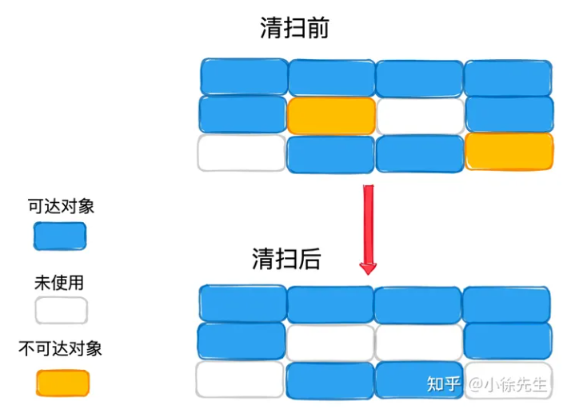
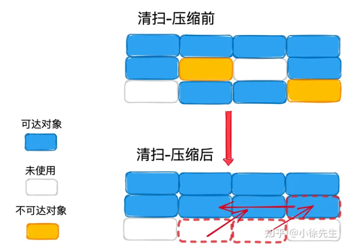
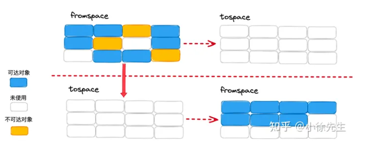
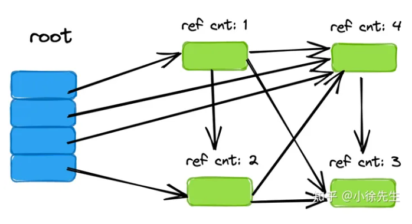

# Garbage Collection
## 内存逃逸机制
内存逃逸分析是编译器在编译优化时，用来决定变量应该分配在堆上还是栈上的工具
```BASH
go build -gcflags="-m"
```

逃逸变量和非逃逸变量的区别在于它们的分配位置和生命周期。

    逃逸变量分配在堆上，生命周期可能会比函数的执行时间长,会增加垃圾回收的压力，并且会导致额外的堆分配和内存拷贝操作

    而非逃逸变量分配在栈上，生命周期与函数的执行时间一致,更加高效，因为它们的生命周期受限于函数的执行时间
### 逃逸的原因
内存逃逸的主要原因是在函数返回后，局部变量仍然被外部引用。以下是一些可能导致内存逃逸的情况：

    变量的生命周期超出了其作用域，当一个变量在函数外部被引用，比如被赋值给一个包级别的变量或者作为返回值，这个变量就会发生逃逸。
    大对象的分配，对于大型的数据结构，Go 有时会选择在堆上分配内存，即使它们没有在函数外部被引用。
    闭包引用，如果一个函数返回一个闭包，并且该闭包引用了函数的局部变量，那么这些变量也会逃逸到堆上。
    接口动态分配，当一个具体类型的变量被赋值给接口类型时，由于接口的动态特性，具体的值可能会发生逃逸。
    切片和 map 操作，如果对切片进行操作可能导致其重新分配内存，或者向 map 中插入数据，这些操作可能导致逃逸。
### 原生类型
1）变量分配在栈上的情况
当原生类型被取地址且地址被赋值给了一个指针变量，当这个指针变量只是在函数内部使用，则这个原生类型会被分配在栈上（即使是通过new方法分配的）

2）变量逃逸到堆上的情况
如果这个指针变量被以某种形式作为了函数返回值（例如，指针变量是struct中的变量，struct是函数返回值），则这个原生类型被分配在堆上（原因很简单，如果分配在栈上，函数返回后栈中的数据失效，这个指针指向的地址就是无效的）
```Go
// 指向i的指针被存储到foo结构体中返回了，i逃逸到堆上
func escapePointer() FooHasPointer {
    var foo FooHasPointer
    i := 10 //moved to heap: i
    foo.A = &i
    foo.B = "a"
    return foo
}
// 没有指针，都分配到栈上
func noescapeValue() Foo {
    var foo Foo
    i := 10
    foo.A = i
    foo.B = "a"
    return foo
}
```

## 常用GC算法分类

### 标记清扫

标记清扫（Mark-Sweep）算法，分为两步走：

    标记：标记出当前还存活的对象
    清扫：清扫掉未被标记到的垃圾对象

这是一种类似于排除法的间接处理思路，不直接查找垃圾对象，而是标记存活对象，从而取补集推断出垃圾对象.
缺点

    会产生内存碎片. 经过几轮标记清扫之后，空闲的内存块可能零星碎片化分布，此时倘若有大对象需要分配内存，可能会因为内存空间无法化零为整从而导致分配失败

### 标记压缩

标记压缩（Mark-Compact）算法，是在标记清扫算法的基础上做了升级，在第二步”清扫“的同时还会对存活对象进行压缩整合，使得整体空间更为紧凑，从而解决内存碎片问题

缺点

    实现时会有很高的复杂度
### 半空间复制

半空间复制（Semispace Copy）算法

    分配两片相等大小的空间，称为 fromspace 和 tospace
    每轮只使用 fromspace 空间，以GC作为分水岭划分轮次
    GC时，将fromspace存活对象转移到tospace中，并以此为契机对空间进行压缩整合
    GC后，交换fromspace和tospace，开启新的轮次
优点

    以空间换取时间的优化策略，解决了内存碎片的问题，也在一定程度上降低了压缩空间的复杂度.
缺点

    比较浪费空间

### 引用计数

引用计数（Reference Counting）算法

    对象每被引用一次，计数器加1
    对象每被删除引用一次，计数器减1
    GC时，把计数器等于 0 的对象删除
优点

    实现简单
缺点

    无法解决循环引用或者自引用问题.

## golang的GC
    
    并发三色标记法+混合写屏障机制
### 并发
自1.5版本以来，Golang引入了并发垃圾回收机制，允许用户协程和后台的GC协程并发运行，大大地提高了用户体验. 但“并发”可能导致用户协程运行时可能对对象间的引用关系进行调整，这会严重打乱GC三色标记时的标记秩序.
### 三色标记法

https://blog.csdn.net/weixin_47382783/article/details/126454225
    对象分为三种颜色标记：黑、灰、白
    黑对象代表，对象自身存活(被访问到)，且其引用的对象都已标记完成(没有被访问到)
    灰对象代表，对象自身存(被访问到)，但其引用的对象还未标记完成(没有被访问到)
    白对象代表，对象尙未被标记到(没有被访问到)，可能是垃圾对象

    标记开始前，将根对象（全局对象、栈上局部变量等）置黑，将其所指向的对象置灰
    标记规则是，从灰对象出发，将其所指向的对象都置灰. 所有指向对象都置灰后，当前灰对象置黑
    标记结束后，白色对象就是不可达的垃圾对象，需要进行清扫

    在可达性分析的初始阶段，所有对象都是白色，一旦访问了这个对象，那么就变成灰色，一旦这个对象所有直接引用的对象都访问过（或者没有引用其它对象），那么就变成黑色
    初始标记之后，GC Root节点变为黑色（GC Root不会是垃圾），GC Root直接引用的对象变为灰色

    正常情况下，一个对象如果是黑色，那么其直接引用的对象要么是黑色，要么是灰色，不可能是白色（如果出现了黑色对象直接引用白色对象的情况，就说明漏标了，就会导致对象误删），这个特性也可以说是三色标记算法正确性保障的前提条件。
举例:

    A只引用了B，B引用了C、D，那么只要A和B都被访问过，A就是黑色，即使B所引用的C或D还没有被访问到，此时B就是灰色

缺点:

    GC线程在非运行时间片的休眠过程中,引用关系可能发生变化而导致出现问题

    1. 垃圾浮动
        被标记为黑色的对象在下一个GC运行时间之前引用计数变成了0,但是此时已经被标记为了黑色,不能够及时清除
    2. 非垃圾标记为垃圾(非垃圾为白色)
        在对某个对象的引用对象检查之前,GC运行时间到,进入了休眠,此时业务线程刚好对该对象的引用对象做了变更,使它的引用对象变成了其他已经完成他分析对象的引用对象,那么下次GC时间片运行时候,该对象不会被检测到,当整轮GC完成后,该引用对象实际上是被引用的,但是由于上述的原因逃过了检查(白色),因此会被删除导致错误
    
#### Go标记清扫导致的内存碎片如何处理?
标记清扫算法会存在产生“内存碎片”的缺陷,而Golang采用 TCMalloc 机制，依据对象的大小将其归属为到事先划分好的spanClass当中，这样能够消解外部碎片的问题，将问题限制在相对可控的内部碎片当中
#### Go为什么不选择分代垃圾回收机制
分代算法指的是，将对象分为年轻代和老年代两部分（或者更多），采用不同的GC策略进行分类管理. 分代GC算法有效的前提是，绝大多数年轻代对象都是朝生夕死，拥有更高的GC回收率，因此适合采用特别的策略进行处理.

然而Golang中存在内存逃逸机制，会在编译过程中将生命周期更长的对象转移到堆中，将生命周期短的对象分配在栈上，并以栈为单位对这部分对象进行回收.

综上，内存逃逸机制减弱了分代算法对Golang GC所带来的优势，考虑分代算法需要产生额外的成本（如不同年代的规则映射、状态管理以及额外的写屏障），Golang 选择不采用分代GC算法.


### 混合写屏障(解决漏标)

漏标问题(非垃圾标记为垃圾)的本质就是，一个已经扫描完成的黑对象指向了一个被灰\白对象删除引用的白色对象. 构成这一场景的要素拆分如下：

    （1）黑色对象指向了白色对象

    （2）灰、白对象删除了白色对象

    （3）（1）、（2）步中谈及的白色对象是同一个对象

    （4）（1）发生在（2）之前

一套用于解决漏标问题的方法论称之为强弱三色不变式：

    强三色不变式：白色对象不能被黑色对象直接引用（直接破坏（1））
    弱三色不变式：白色对象可以被黑色对象引用，但要从某个灰对象出发仍然可达该白对象（间接破坏了（1）、（2）的联动）