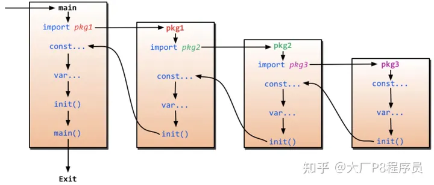

# 包的命名规则
	包名要小写
	包名和所在的目录名一致(建议)
	
# 包管理

包初始化程序从 main 函数引用的包开始，逐级查找包的引用，直到找到没有引用其他包的包，最终生成一个包引用的有向无环图。
Go 编译器会将有向无环图转换为一棵树，然后从树的叶子节点开始逐层向上对包进行初始化。
单个包的初始化过程如上图所示，先初始化常量，然后是全局变量，最后执行包的 init 函数（如果有）。

## 包管理总结

1. 对导入的包进行加载的顺序是 常量 全局变量 init函数
2. 一个package 可以存在多个init 函数，但并不能保证执行顺序，所以不建议在一个包中放入多个 init 函数，将需要初始化的逻辑放到一个 init 函数里面。多个init函数块之间不能共享各自函数内的局部变量
3. 导入包最好使用绝对路经
4. 包的绝对路径就是 `$GOROOT/src` 或 `$GOPATH/src`后面包的源码的全路径
5. 相对路径只能用于引用 `$GOPATH` 下的包，标准包的引用只能使用全路径引用
6. 标准包的源码位于 `$GOROOT/src/` 下面
7. 包名可以与其目录不同名。但是建议包名和目录名同名,否则在导入包后需要对其进行重命名
8. 同一个包中的多个 init() 函数的调用顺序不可预期。
init() 函数不能被其他函数调用。
9. 调用顺序为 main() 中引用的包，以深度优先顺序初始化。假设有这样的包引用关系：main→A→B→C，那么这些包的 init() 函数调用顺序为：C.init→B.init→A.init→main,也就是在运行时，被最后导入的包会最先初始化并调用 init() 函数。


## main包
main包下面可以有多个源文件,但是编译器无法识别main函数对main包中其他源文件中函数的引用,并且要正常运行,应该在main包目录下执行go run *.go
```Go
//demo.go
package main

import "fmt"

func Demo() {
	fmt.Println("123")
}

//main.go
package main

func main() {
	Demo()
}
```
上述代码在vscode中会出现引用错误,但是可以通过go run *.go 运行
建议main包中只有一个文件

## golang 执行顺序
同一个文件的init函数按照编写顺序执行
对同一个package中不同文件是按文件名字符串比较“从小到大”顺序调用各文件中的init()函数。


## 包导入规则
    1. 如果包名不是以 . 或 / 开头，如 "fmt" 或者 "container/list"，则 Go 会在全局文件进行查找
    2. 如果包名以 ./ 开头，则 Go 会在相对目录中查找
    3. 如果包名以 / 开头（在 Windows 下也可以这样使用），则会在系统的绝对路径中查找。
    4. 以相对路径在GOPATH下导入包会产生报错信息


## 包管理

Go语言是使用包来组织源代码的，并实现命名空间的管理。任何源代码文件必须属于某个包。源码文件的第一行有效代码必须是 package pacakgeName 语句，通过该语句声明自己所在的包。

Go语言的包借助了目录树的组织形式，一般包的名称就是其源文件所在目录的名称，虽然 Go 没有强制包名必须和其所在的目录名同名，但还是建议包名和所在目录同名，这样结构更清晰。

包的习惯用法：
包名一般是小写的，使用一个简短的命名。
包名一般要和所在的目录同名。
包一般放到公司的域名目录下，这样能保证包名的唯一性，便于共享代码。比如个人的 GitHub 项目的包一般放到 GOPATH/src/github.com/userName/projectName 目录下

>>标准包的源码位于 $GOROOT/src/ 下面，标准包可以直接引用。自定义的包和第三方包的源码必须放到 $GOPATH/src 目录下才能被引用

包引用路径
包的引用路径有两种写法，一种是全路径，另一种是相对路径。

全路径引用
包的绝对路径就是“$GOROOT/src 或 $GOPATH/src”后面包的源码的全路径

相对路径引用
相对路径只能用于引用 $GOPATH 下的包，标准包的引用只能使用全路径引用## 自定义包

## 包引用的注意事项

我们通过import语句将自定义包加入到我们项目main函数中，import语句后面的参数应该是文件夹的名称，和自定义包的package的名称或者自定义包里面的文件名称没有关系

包的路径应该从$GOPATH/src/后面的路径开始写，末尾不能带"/"

如定义文件为$GOPATH/src/PK1/PK2_1/PK3_1/demo.go
demo.go的内容为
package mydemo

func TestDemo(){
 ...
}
那么要导入这个包
应该是
>> import "PK1/PK2_1/PK3_1"
>>由于包名为mydemo,而文件名为demo.go,故建议改为
>> import mydemo "PK1/PK2_1/PK3_1"
>>不进行重命名也没有影响
>>调用函数为 mydemo.TestDemo()

## init 函数

go的init函数是自动调用的,对于同一模块的多次引用,编译器会自动保障该模块的init函数只被调用一次
<http://code.ibookba.com/go/461.html>

    1.init函数可以在所有程序执行开始前被调用，并且每个包下可以有多个init函数
    2.init函数先于main函数自动执行
    3.每个包中可以有多个init函数，每个包中的源文件中也可以有多个init函数
    4.init函数没有输入参数、返回值，也未声明，所以无法引用
    5.不同包的init函数按照包导入的依赖关系决定执行顺序
    6.无论包被导入多少次，init函数只会被调用一次，也就是只执行一次
    7.init函数在代码中不能被显示的调用，不能被引用（赋值给函数变量），否则会出现编译错误
    8.导入包不要出现循环依赖，这样会导致程序编译失败
    9.Go程序仅仅想要用一个package的init执行，我们可以这样使用：import _ “test_xxxx”，导入包的时候加上下划线就ok了
    10.包级别的变量初始化、init函数执行，这两个操作都是在同一个goroutine中调用的，按顺序调用，一次一个包
    11.init函数不应该依赖任何在main函数里创建的变量，因为init函数的执行是在main函数之前的
    12.在init函数中也可以启动goroutine，也就是在初始化的同时启动新的goroutine，这并不会影响初始化顺序
    13.复杂逻辑不建议使用init函数，会增加代码的复杂性，可读性也会下降
    14.一个源文件下可以有多个init函数，代码比较长时可以考虑分多个init函数
    15.编程时不要依赖init的顺序

## 包的初始化

Go 包的初始化有如下特点：
包初始化程序从 main 函数引用的包开始，逐级查找包的引用，直到找到没有引用其他包的包，最终生成一个包引用的有向无环图。
Go 编译器会将有向无环图转换为一棵树，然后从树的叶子节点开始逐层向上对包进行初始化。
单个包的初始化过程如上图所示，先初始化常量，然后是全局变量，最后执行包的 init 函数（如果有）。
Go 编译器保证 d 的 init 函数只会执行一次
