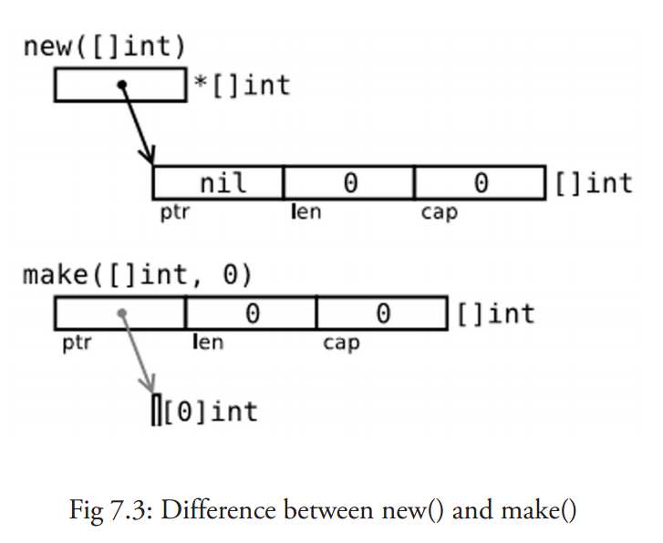
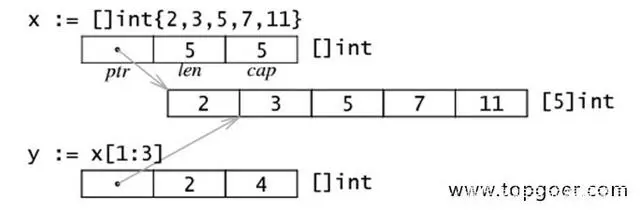
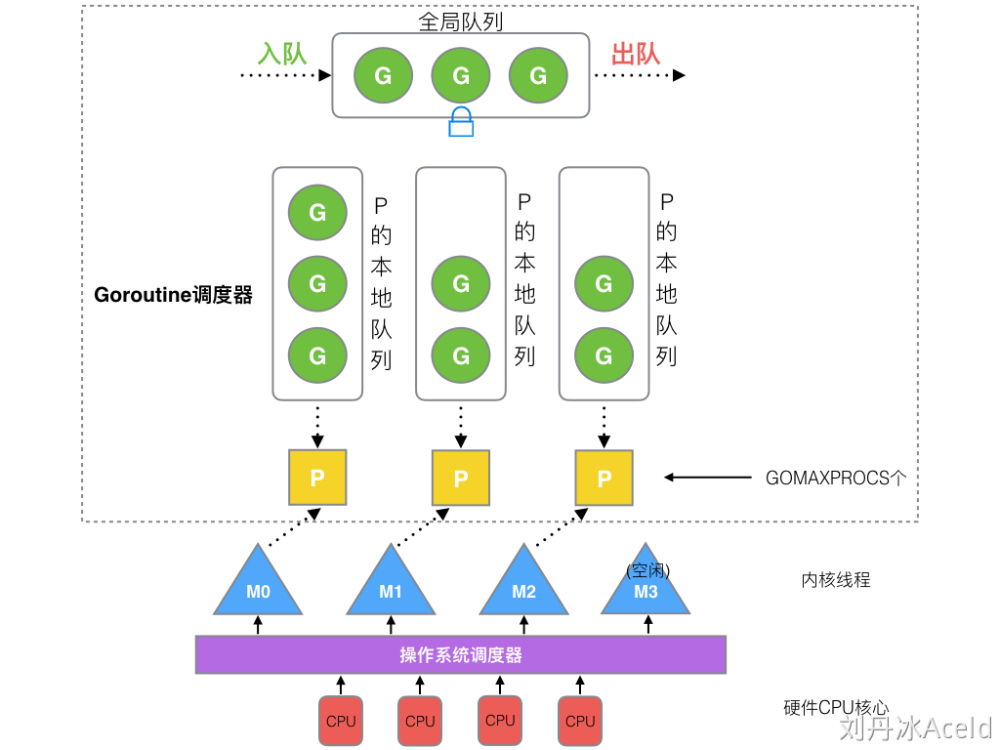
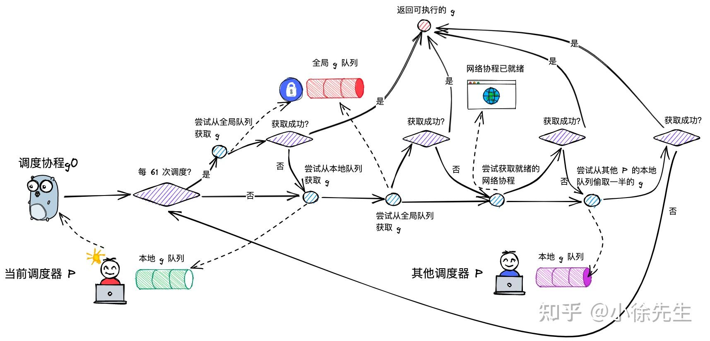

# Golang总结

## 标识符
标识符的命名需要遵守以下规则

    不能以数字开头，例如 var 1num int 是错误的
    Go语言中严格区分大小写
    标识符不能包含空格
    不能以系统保留关键字作为标识符，比如 break，if 等等
    有效的标识符必须以字母（可以使用任何 UTF-8 编码的字符或 _）开头，然后紧跟着 0 个或多个字符或 Unicode 数字，如：X56、group1、_x23、i、өԑ12

命名标识符时还需要注意以下几点

    标识符的命名要尽量采取简短且有意义
    不能和标准库中的包名重复
    为变量、函数、常量命名时采用驼峰命名法，例如 stuName、getVal

在Go语言中还存在着一些特殊的标识符，叫做预定义标识符，如下表所示：

    append
    bool
    byte
    cap
    close
    complex
    complex64
    complex128
    uint16
    copy
    false
    float32
    float64
    imag
    int
    int8
    int16
    uint32
    int32
    int64
    iota
    len
    make
    new
    nil
    panic
    uint64
    print
    println
    real
    recover
    string
    true
    uint
    uint8
    uintptr

预定义标识符一共有 36 个，主要包含Go语言中的基础数据类型和内置函数，这些预定义标识符也不可以当做标识符来使用。


以下是无效的标识符：

    1ab（以数字开头）
    case（Go 语言的关键字）
    a+b（运算符是不允许的）

### 关键字

Go语言中的关键字一共有 25 个

    break
    default
    func
    interface
    select
    case
    defer
    go
    map
    struct
    chan
    else
    goto
    package
    switch
    const
    fallthrough
    if
    range
    type
    continue
    for
    import
    return
    var


## 变量/常量

### 常量声明

常量的值必须是能够在编译时就能够确定

在其赋值表达式中可以涉及计算过程，但是所有用于计算的值必须在编译期间就能获得

自定义函数无法用于函数的赋值,但是内置函数可以使用

    正确的做法：const c1 = 2/3
    错误的做法：const c2 = getNumber() // 引发构建错误: getNumber() 用做值

常量间的所有算术运算、逻辑运算和比较运算的结果也是常量,对常量的类型转换操作或以下函数调用都是返回常量结果：len、cap、real、imag、complex 和 unsafe.Sizeof

常量定义可以不声明类型,也可以声明类型

一个没有指定类型的常量被使用时，会根据其使用环境而推断出它所需要具备的类型。换句话说，未定义类型的常量会在必要时刻根据上下文来获得相关类型

数字型的常量是没有大小和符号的，并且可以使用任何精度而不会导致溢出

需要注意的是
**当常量赋值给一个精度过小的数字型变量时，可能会因为无法正确表达常量所代表的数值而导致溢出，这会在编译期间就引发错误**

```Go
//都会报错
const a=1.11111111
var b int=a
var c int =int(a)
```
### 变量声明

在Go语言中，你可以省略类型说明符 [type]，因为编译器可以根据变量的值来推断其类型。

    显式类型定义： const b string = "abc"
    隐式类型定义： const b = "abc"

#### 短变量申明

短变量申明只能用在函数内部,且变量名不能是已经声明过.对于多个短变量的声明中,只要保证至少有一个未声明的变量即可

```Go
conn, err := net.Dial("tcp", "127.0.0.1:8080")
conn2, err := net.Dial("tcp", "127.0.0.1:8080")
```

#### 其他变量声明方式

也可以通过 var xxx=yyy 不需要声明变量类型的方式进行声明,编译器会自动推导变量类型
需要注意的是,变量类型的自动推断是在编译期间就已经完成的,而不是向python那样在运行期间推断

## 整型和浮点型
https://zhuanlan.zhihu.com/p/455201834

GO有基于架构的数据类型:

    1.int uint uintptr
        int 和 uint 在 32 位操作系统上，它们均使用 32 位（4 个字节），在 64 位操作系统上，它们均使用 64 位（8 个字节）。
        uintptr 的长度被设定为足够存放一个指针即可。

    2.GO 没有float 和double,只有float32,float64

    3.float32 精确到小数点后 6 位，float64 精确到小数点后 15 位，通常应该优先使用 float64 类型，因为 float32 类型的累计计算误差很容易扩散，并且 float32 能精确表示的正整数并不是很大。

    4.float32类型的浮点数和float64类型的浮点数两者区别在于前者为单精度浮点数，可以提供约6个十进制数的精度，在内存中占用32个bits，而后者为双精度浮点数，可以提供约15个十进制数的精度，在内存中占用64个bits。

与操作系统无关的数据类型都有固定的大小，并在类型的名称中就可以看出来：

    1.整数：

    int8（-128 -> 127）
    int16（-32768 -> 32767）
    int32（-2,147,483,648 -> 2,147,483,647）
    int64（-9,223,372,036,854,775,808 -> 9,223,372,036,854,775,807）

    2.无符号整数：

    uint8（0 -> 255）
    uint16（0 -> 65,535）
    uint32（0 -> 4,294,967,295）
    uint64（0 -> 18,446,744,073,709,551,615）

    3.浮点型（IEEE-754 标准）：
    e 来表示 10 的连乘（如： 1e3 = 1000，或者 6.022e23 = 6.022 x 1e23）
    float32（+- 1e-45 -> +- 3.4 * 1e38）
    float64（+- 5 * 1e-324 -> 107 * 1e308）

```Go
package main

import "fmt"

func main() {
	var f1 float32 = 16777218
	fmt.Println(f1)//观察此处结果
	fmt.Println(f1 == f1+1)
	var f2 float64 = 16777216
	fmt.Println(f2 == f2+1)
}
```
## 数据类型
### 布尔值

布尔值并不会隐式转换为数字值 0 或 1，反之亦然，必须使用 if 语句显式的进行转换
Go语言中不允许将整型强制转换为布尔型

### 字符串/字符

#### 字符

Go语言的字符有以下两种：

一种是 uint8 类型，或者叫 byte 型，代表了 ASCII 码的一个字符(不论是32位机器或者64位机器,占用8位,一个字节)。

另一种是 rune 类型，代表一个 UTF-8 字符，当需要处理中文、日文或者其他复合字符时，则需要用到 rune 类型。rune 类型等价于 int32 类型(不论是32位机器或者64位机器,占用32个位,四个字节)

byte 类型是 uint8 的别名，对于只占用 1 个字节的传统 ASCII 编码的字符来说，完全没有问题

##### Unicode和UTF-8的区别

    unicode是字符集
    广义的 Unicode 指的是一个标准，它定义了字符集及编码规则，即 Unicode 字符集和 UTF-8、UTF-16 编码等。

    UTF-8是编码规则
    UTF-8 是编码规则，将 Unicode 中字符的 ID 以某种方式进行编码
    字符集:为每一个字符分配一个唯一的ID(码位)
    编码规则:将"码位"转换为字节序列的规则(所谓的编码解码相当于加密解密)
    对于任何一个字符,由于计算机的存储只能是二进制的0和1,因此为了存储一个字符,会为该字符生成一个唯一的二进制数
    与其对应,也就是Unicode,如s在计算机中存储为00000000 01110011,占用了2个byte(1byte=8bit),为了节省空间,则使用UTF8对其进行"压缩",因此在UTF8编码转换为01110011

    \u 则总是紧跟着长度为 4 的 16 进制数，前缀 \U 紧跟着长度为 8 的 16 进制数。
```Go
package main

import (
	"fmt"
	"unsafe"
)

func main() {
	var ch0 byte = 'A'
	var ch1 byte = 65
	var ch2 byte = '\x41'
	var ch3 byte = '\101'
	var ch4 rune = 'A'
	var ch5 rune = 65
	var ch6 rune = '\x41'
	var ch7 rune = '\101'
	var ch8 rune = '\u0041'
	var ch9 rune = '\U00000041'
	fmt.Printf("the size of the ch0 is %d,charactor is %c\n", unsafe.Sizeof(ch0), ch0)
	fmt.Printf("the size of the ch1 is %d,charactor is %c\n", unsafe.Sizeof(ch1), ch1)
	fmt.Printf("the size of the ch2 is %d,charactor is %c\n", unsafe.Sizeof(ch2), ch2)
	fmt.Printf("the size of the ch3 is %d,charactor is %c\n", unsafe.Sizeof(ch3), ch3)
	fmt.Printf("the size of the ch4 is %d,charactor is %c\n", unsafe.Sizeof(ch4), ch4)
	fmt.Printf("the size of the ch5 is %d,charactor is %c\n", unsafe.Sizeof(ch5), ch5)
	fmt.Printf("the size of the ch6 is %d,charactor is %c\n", unsafe.Sizeof(ch6), ch6)
	fmt.Printf("the size of the ch7 is %d,charactor is %c\n", unsafe.Sizeof(ch7), ch7)
	fmt.Printf("the size of the ch8 is %d,charactor is %c\n", unsafe.Sizeof(ch8), ch8)
	fmt.Printf("the size of the ch9 is %d,charactor is %c\n", unsafe.Sizeof(ch9), ch9)
}
```
#### 字符串
字符串是 UTF-8 字符的一个序列(当字符为 ASCII 码时则占用 1 个字节，其它字符根据需要占用 2-4 个字节)

字符串是一种值类型，且值不可变，即创建某个文本后将无法再次修改这个文本的内容，更深入地讲，字符串是字节的定长数组。

字符串不可变有很多好处，如天生线程安全，大家使用的都是只读对象，无须加锁；再者，方便内存共享，而不必使用写时复制（Copy On Write）等技术；字符串 hash 值也只需要制作一份

也就是说:
Go 语言的字符串无法直接修改每一个字符元素，只能通过重新构造新的字符串并赋值给原来的字符串变量实现

    常见的转义字符:
    \n：换行符
    \r：回车符
    \t：tab 键
    \u 或 \U：Unicode 字符
    \\：反斜杠自身

一般的比较运算符（==、!=、<、<=、>=、>）是通过在内存中按字节比较来实现字符串比较的，因此比较的结果是字符串自然编码的顺序。字符串所占的字节长度可以通过函数 len() 来获取，例如 len(str)。

```Go
package main

import "fmt"

func main() {
	a := "A"
	b := "中"
	fmt.Printf("len a is %d,the first character is %c \n", len(a), a[0])
	fmt.Printf("len b is %d,the first character is %c \n", len(b), b[0])
}
```
```Go
package main

import "fmt"

func main() {
	a := "中"
	fmt.Printf("the len of the a is %d\n", len(a))
	fmt.Printf("the len of the []rune(a) is %d\n", len([]rune(a)))
}
```
    注意事项:
    1. 取字符串中某个字节的地址属于非法行为，例如 &str[i]
    2. str[i]只适合ASCII编码字符
    3. 对于ASCII编码的字符串来说,可以通过len函数来获取其长度
    4. len函数实际上是获取字符串的字节数量
    5. 对于Unicode字符集的字符串来说,可以u通过utf8.RuneCountInString 来获取字符个数,也可以将字符串类型转换为[]rune类型,再通过len函数获取个数
    6. 遍历字符串使用for range
    7. 两个字符串 s1 和 s2 可以通过 s := s1 + s2 拼接在一起。
    8. 字符串拼接最好的方法是
        1. 使用函数 strings.Join()
        2. 用字节缓冲（bytes.Buffer）拼接


如果想要在源码中嵌入一个多行字符串时，就必须使用`反引号在这种方式下，反引号间换行将被作为字符串中的换行，但是所有的转义字符均无效，文本将会原样输出。

### 指针

golang不允许获取一个文字或常量的地址

变量逃逸（Escape Analysis）——自动决定变量分配方式，提高运行效率

堆和栈各有优缺点，该怎么在编程中处理这个问题呢？在 C/C++ 语言中，需要开发者自己学习如何进行内存分配，选用怎样的内存分配方式来适应不同的算法需求。比如，函数局部变量尽量使用栈；全局变量、结构体成员使用堆分配等。程序员不得不花费很多年的时间在不同的项目中学习、记忆这些概念并加以实践和使用。

Go 语言将这个过程整合到编译器中，命名为“变量逃逸分析”。这个技术由编译器分析代码的特征和代码生命期，决定应该如何堆还是栈进行内存分配，即使程序员使用 Go 语言完成了整个工程后也不会感受到这个过程。

编译器觉得变量应该分配在堆和栈上的原则是：
变量是否被取地址。
变量是否发生逃逸。

栈和堆的区别在于：
堆（heap）：堆是用于存放进程执行中被动态分配的内存段。它的大小并不固定，可动态扩张或缩减。当进程调用 malloc 等函数分配内存时，新分配的内存就被动态加入到堆上（堆被扩张）。当利用 free 等函数释放内存时，被释放的内存从堆中被剔除（堆被缩减）；
栈(stack)：栈又称堆栈， 用来存放程序暂时创建的局部变量，也就是我们函数的大括号{ }中定义的局部变量。


## 类型转换

Go语言不存在隐式类型转换，因此所有的类型转换都必须显式的声明valueOfTypeB = typeB(valueOfTypeA)

类型转换只能在定义正确的情况下转换成功，例如从一个取值范围较小的类型转换到一个取值范围较大的类型（将 int16 转换为 int32）。当从一个取值范围较大的类型转换到取值范围较小的类型时（将 int32 转换为 int16 或将 float32 转换为 int），会发生精度丢失（截断）的情况。

只有相同底层类型的变量之间可以进行相互转换（如将 int16 类型转换成 int32 类型），不同底层类型的变量相互转换时会引发编译错误（如将 bool 类型转换为 int 类型）


## iota

    0.如果CONST某一个变量没有被赋值,则该变量和上一个变量保持一致
    1.IOTA在const出现的时候初始化为0,简单地讲，每遇到一次 const 关键字，iota 就重置为 0
    2.const每新增一行,则IOTA增加1,即使IOTA没有被使用,也就是说,如果IOTA在第一行没有出现,但是在第二行出现,那么IOTA值是1,而不是2
    3.IOTA在每一行出现多次,每次的值都是固定值
    4.转换函数分别为strconv.Atoi(Array to integer)和strconv.Itoa(Integer to array)

```Go
fmt.Println(iota)  //编译错误： undefined: iota
```

每次 const 出现时，都会让 iota 初始化为0.

```
const a = iota // a=0
const (
  b = iota     //b=0
  c            //c=1   相当于c=iota 赋值一个常量时，之后没赋值的常量都会应用上一行的赋值表达式
  d=100        //iota虽然没有被使用,但是计数会加1
  e            //和上一行保持一致,即e=100,且iota虽然没有被使用,但是计数会加1
  f=iota       //4

```

自增长常量经常包含一个自定义枚举类型，允许你依靠编译器完成自增设置。

```Go
type Stereotype int

const (
    TypicalNoob Stereotype = iota // 0
    TypicalHipster                // 1  TypicalHipster = iota
    TypicalUnixWizard             // 2  TypicalUnixWizard = iota
    TypicalStartupFounder         // 3  TypicalStartupFounder = iota
)
```

//如果两个const的赋值语句的表达式是一样的，那么可以省略后一个赋值表达式。

```Go
type AudioOutput int

const (
    OutMute AudioOutput = iota // 0
    OutMono                    // 1
    OutStereo                  // 2
    _
    _
    OutSurround                // 5
)
```

位掩码表达式

```Go
package main

import "fmt"

func demo() {
 const (
  a = 2 << iota
  b
  c
 )
 fmt.Println(a, b, c)
}

func main() {
 demo()
}

```

```Go
type ByteSize float64

const (
    _           = iota                   // ignore first value by assigning to blank identifier
    KB ByteSize = 1 << (10 * iota) // 1 << (10*1)
    MB                                   // 1 << (10*2)
    GB                                   // 1 << (10*3)
    TB                                   // 1 << (10*4)
    PB                                   // 1 << (10*5)
    EB                                   // 1 << (10*6)
    ZB                                   // 1 << (10*7)
    YB                                   // 1 << (10*8)
)
```

中间插队

```Go
const (
    i = iota
    j = 3.14
    k = iota
    l
)
//那么打印出来的结果是 i=0,j=3.14,k=2,l=3
```

定义在一行
iota 在下一行增长，而不是立即取得它的引用。

```Go
const (
    Apple, Banana = iota + 1, iota + 2
    Cherimoya, Durian   // = iota + 1, iota + 2
    Elderberry, Fig     //= iota + 1, iota + 2
)
// Apple:1
// Banana: 2
// Cherimoya: 2
// Durian: 3
// Elderberry: 3
// Fig: 4
```


## 运算
### 逻辑运算

布尔值可以和 &&（AND）和 ||（OR）操作符结合，并且有短路行为，如果运算符左边的值已经可以确定整个布尔表达式的值，那么运算符右边的值将不再被求值，因此下面的表达式总是安全的

```Go
s:=""
s != "" && s[1] == 'x'
```

&&的优先级比||高（&& 对应逻辑乘法，|| 对应逻辑加法，乘法比加法优先级要高）

### 位运算

### 注意事项
    1.取余运算符只能作用于整数
    2.浮点数除以 0.0 会返回一个无穷尽的结果
    3.整数除以 0 可能导致程序崩溃
    4.在运算时 溢出 不会产生错误，Go 会简单地将超出位数抛弃。
```Go
package main
func main() {
var a float64 = 23.9
fmt.Println(a / 0.00)//结果为+Inf
}
```
### 运算符优先级

    优先级  分类    运算符    结合性
    1   逗号运算符  ,     从左到右
    2   赋值运算符 =、+=、-=、*=、/=、
        %=、 >=、 <<=、&=、^=、
        |=      从右到左
    3   逻辑或  ||      从左到右
    4   逻辑与  &&      从左到右
    5   按位或  |      从左到右
    6   按位异或  ^      从左到右
    7   按位与  &      从左到右
    8   相等/不等 ==、!=     从左到右
    9   关系运算符 <、<=、>、>=    从左到右
    10   位移运算符 <<、>>     从左到右
    11   加法/减法 +、-      从左到右
    12   乘法/除法/取余*（乘号）、/、%  从左到右
    13   单目运算符 !、*（指针）、& 、++、
        --、+（正号）、-（负号） 从右到左
    14   后缀运算符 ( )、[ ]、-> 从左到右
## 控制结构
### switch
switch的三种用法

    1.switch后面跟一个变量
    2.switch后面不跟变量,在case中进行判断
    3.switch后面根一个初始化语句

一旦成功地匹配到某个分支，在执行完相应代码后就会退出整个 switch 代码块，也就是说不需要特别使用 break 语句来表示结束。

因此，程序也不会自动地去执行下一个分支的代码。如果在执行完每个分支的代码后，还希望继续执行后续分支的代码，可以使用 fallthrough 关键字来达到目的。加了fallthrough后，会直接运行【紧跟的后一个】case或default语句，不论条件是否满足都会执行,执行完成后如果没有fallthrough,则不会继续执行
```Go
s := "agcd"
    switch s[1] {
    default:
        fmt.Println("default case")//即使default写在前面,也不会最先执行
        fallthrough//语法不报错,但是最后执行也报错
    case 'a':
        fmt.Println("The integer was a")
        fallthrough
    case 'b':
        fmt.Println("The integer was b")
        fallthrough
    case 'c':
        fmt.Println("The integer was c")//最后一个case不能使用fallthrough
    }
```
结果为
    cannot fallthrough final case in switch
```Go
s := "abcd"
    switch s[1] {
    default:
        fmt.Println("default case")//即使default写在前面,也不会最先执行
    case 'a':
        fmt.Println("The integer was a")
        fallthrough
    case 'b':
        fmt.Println("The integer was b")
        fallthrough
    case 'c':
        fmt.Println("The integer was c")//最后一个case不能使用fallthrough
    }
```
结果为

    b
    c

### for语句
    1.需要注意使用for进行批量启动groutine的时候,如果要传参,需要指定groutine的如参,而不是groutine直接访问for中的循环变量
    2. for-range中,value始终是拷贝

### if else 中的局部变量

    1.只允许简短方式 := 声明
    2.变量的作用域只存在于 if else结构中
    3.如果变量在 if 结构之前就已经存在，那么在 if 结构中，该变量原来的值会被隐藏

```Go
func main() {
    a := 1
    if a := a; a == 1 {
        fmt.Printf("The a is 1")
    } else {
        fmt.Printf("The a is not 1,is %d\n", a)
    }
}
```

### for range
    1. 在for range的时候，go会创建两个临时变量把k,v的值赋值到这两个临时变量中，因而，k、v两个变量的地址在遍历的时候永远不会发生变化。同样, range的变量也是拷贝

```Go
package main

import "fmt"

func main() {
	var a []int = make([]int, 5)
	for _, v := range a {
		v += 100 //value是拷贝
	}
	fmt.Println(a)
	for k := range a {
		a[k] = 111 //通过索引修改影响到外部
	}
	fmt.Println(a)
	for _ = range a {
		a = []int{1, 2, 3, 4, 5} //赋值影响到外部变量
	}
	for _ = range a {
		a = append(a, 1111) //影响到外部变量
	}
	fmt.Println(a)
}
```

## 作用域

golang的作用域主要分为局部和全局,但是需要注意:内部访问外部变量是指针访问
```Go
package main

import "fmt"

func add(some []int) {
	some = append(some, 1000)
}

func main() {
	var a []int = make([]int, 5)
	fmt.Println(a)
	{
		a = append(a, 10)//引用
	}
	add(a)
	fmt.Println(a)
}
```
```GO
package main

import "fmt"

func demo() {
	{
		a := 1
		fmt.Println(a)
	}
	//fmt.Println(a)//访问不到内部的变量
}
func main() {
	demo()
}

```
```Go
package main

func main() {
	for i := 1; i < 10; i++ {
	}//for 循环执行完成后,i会销毁
	//fmt.Println(i)
}
```


## 变长参数

    1.变长参数,放在函数申明形参的最后
    2.variable ...type
    3.如果接收的参数是一个slice,要使用[]type{}...形式对slice 进行解包
    4.不能接收数组的解包操作,只能接收slice的解包操作
    5.本质上不是一个slice,但是在函数内部,该参数的表现形式就是一个slice
    6.对于变长参数来说,实参为slice的解包和变长的实际参数作用的结果是完全不一样的
```Go
package main

import "fmt"

func recv(a ...int) {
	a[0] = 111
    a=append(a, 1000)
}
func main() {
	var a []int = []int{1, 2, 3}
	recv(a...)//虽然是解包,但是实际上是a的底层的slice结构体的拷贝
	fmt.Println(a)
	b := 0
	c := 1
	d := 2
	recv(b, c, d)
	fmt.Println(b, c, d)
}
```
    [111 2 3]
    0 1 2


## defer

defer中执行语句中的变量在defer语句定义的时候就已经确定了

    defer 执行时机
    1.包裹着defer语句的函数返回时
    2.包裹着defer语句的函数执行到最后时
    3.当前goroutine发生Panic时
        1.但defer的本质依然是函数调用。当执行到defer定义时，首先会对参数进行求值，然后参数被压入函数调用栈，此时不会进入defer函数体，而是直到函数返回时才调用defer函数体。
        2. 参数被压入函数调用栈时，如果参数是值类型，那么将复制值，如果参数是指针，那么将复制指针而不是复制指针指向的值。
        3.defer函数体内的变量是在return后执行因此不受影响。
    所以如果defer接收参数,则参数在当前位置已经被确定好
```Go
//实现代码追踪
package main

import (
	"fmt"
)

func trace(functionName string) string {
	fmt.Printf("enter %s\n", functionName)
	return functionName
}
func untrace(functionName string) {
	fmt.Printf("leave %s\n", functionName)
}
func b() {
	functionName := "func_b"
	defer untrace(trace(functionName))
}
func a() {
	functionName := "func_a"
	defer untrace(trace(functionName))
	b()
}
func main() {
	a()
}

```

```Go
func test4() error {
    f, err := os.Open("A.txt")
    if err != nil {
        return err
    }
    defer func() { f.Close() }()//错误: 关闭是B文件,f引用被重新赋值
    f, err = os.Open("B.txt")
    if err != nil {
        return err
    }
    defer func() { f.Close() }() //关闭是B文件
    list := []int{1, 2}
    for _, i := range list {
        defer fmt.Println(i) //输出 2 1 //i为值类型参数被复制
        defer func() { fmt.Println(i) }() //错误: 输出 2 2 //函数体内对i引用,留最终值
    }
    return nil
}
```

```Go
func deferTest() int {
    var a int = 1
    fmt.Printf("1.The address of the a is %p, the value is %d\n", &a, a)
    defer func() {
        a++
        fmt.Printf("3.The address of the a is %p, the value is %d\n", &a, a)
    }()
    fmt.Printf("2.The address of the a is %p, the value is %d\n", &a, a)
    return a
}

func demo1() {
    var a int = deferTest()
    fmt.Printf("4.The address of the a is %p, the value is %d\n", &a, a)
}

func deferTest2() *int {
    var a *int
    var b int = 1
    a = &b
    fmt.Printf("1.The address of the a is %p, the value is %d\n", a, *a)
    defer func() {
        *a++
        fmt.Printf("3.The address of the a is %p, the value is %d\n", a, *a)
    }()
    fmt.Printf("2.The address of the a is %p, the value is %d\n", a, *a)
    return a
}

func demo2() {
    var a *int = deferTest2()
    fmt.Printf("4.The address of the a is %p, the value is %d\n", a, *a)
}

```
分析:

    1.demo1 中的返回参数在函数申明时候设置为匿名返回值,该返回值在return 处才被申明,在defer申明时候是访问不到该匿名变量的,因此defer的修改不影响返回值

    2.defer结合指针


defer对返回值的影响总结:
    
    1. return不是一个原子操作,实际上只是代理汇编指令ret,即跳转程序执行,return i执行分两步执行,即将i存入栈中作为返回值,然后执行跳转
    2. 主函数拥有匿名返回值,返回字面量 defer是无法引用该字面量,无法操作返回值
    3. 主函数拥有匿名返回值,返回变量,defer可以引用到返回值,但是无法操作返回值
    4. 主函数拥有具名返回值,defer有可能影响(只有在defer中修改了具名返回值,才会影响,参考下面demo的demo2,demo3,demo4,demo5)
    5.在golang的官方文档里面介绍了，return，defer，返回值的执行顺序：
    if the surrounding function returns through an explicit return statement, deferred functions are executed after any result parameters are set by that return statement but before the function returns to its caller.
```Go
package main

import "fmt"

// 匿名返回值,无法修改
func demo() int {
	a := 1
	defer func() {
		a++
	}()
	return a
}

// 匿名返回值,无法修改
func demo1() int {
	b := 1
	defer func() {
		b++
	}()
	return 1
}

// 具名返回值,修改了具名返回值,可以修改
func demo2() (a int) {
	defer func() {
		a++ //<-修改具名返回值
	}()
	return 1
}

// 具名返回值,修改了具名返回值,可以修改
func demo3() (a int) {
	a = 1
	defer func() {
		a++ //<-修改具名返回值
	}()
	return
}

// 具名返回值,没有修改具名返回值,不可以修改
func demo4() (a int) {
	b := 1
	defer func() {
		b++ //<-没有修改具名返回值
	}()
	return b
}

// 具名返回值,修改具名返回值,可以修改
func demo5() (a int) {
	b := 1
	defer func() {
		a++ //<-修改具名返回值
	}()
	return b
}
func demo6() (a [3]int) {
	b := [3]int{1, 2, 3}
	defer func() {
		a[2] = 99
	}()
	return b
}
func demo7() (a []int) {
	b := []int{1, 2, 3}
	defer func() {
		a[2] = 99
	}()
	return b
}
func main() {
	fmt.Printf("demo result %v\n", demo())
	fmt.Printf("demo1 result %v\n", demo1())
	fmt.Printf("demo2 result %v\n", demo2())
	fmt.Printf("demo3 result %v\n", demo3())
	fmt.Printf("demo4 result %v\n", demo4())
	fmt.Printf("demo5 result %v\n", demo5())
	fmt.Printf("demo6 result %v\n", demo6())
	fmt.Printf("demo7 result %v\n", demo7())
}

```
```Go
       
func f3() {
    defer fmt.Println("panic前")
    panic("panic中")
    defer fmt.Println("panic后")
}
//输出结果：panic前  第一个defer在Panic发生时执行，第二个defer在Panic之后声明，不能执行到
```

defer 注意事项

    1.defer对性能还是有一些影响
    2.除了需要异常捕获时，必须使用defer；其它资源回收类defer，可以判断失败后，使用goto跳转到资源回收的代码区。对于竞争资源，可以在使用完之后，立马释放资源，这样才能最优的使用竞争资源。
## 匿名函数/闭包

    1. 在for_range中的使用匿名函数启动groutine,不能直接引用外部变量,而应该通过传参的方式赋值循环变量
    2. 常见的闭包创建方式就是在一个函数内部创建另一个函数，通过另一个函数访问这个函数的局部变量。
```Go
package main

import "fmt"
//闭包对外部变量的访问
func counter() func() int {
	count := 0
	return func() int {
		count += 1
		return count
	}
}
func main() {
	counterFunc := counter()
	fmt.Printf("the counterFunc is %#v\n", counterFunc)
	counterFunc()
	counterFunc()
	res := counterFunc()
	fmt.Printf("counter is %v\n", res)
}
```

## make和new的区别

new

    1.new 用于分配内存,针对值类型和用户定义的类型，如自定义结构
    2.new(T)分配类型 T 的零值并返回其地址，也就是指向类型 T 的指针(它也可以被用于基本类型：v := new(int))
```Go
package main

import "fmt"

func main() {
	var a *int
	fmt.Printf("the a is %#v\n", a)
	a := new(int)//分配了内存来存储一个int型变量,不过返回的是指向这个变量的指针而已
	fmt.Printf("the a is %#v\n", a)
	fmt.Printf("the *a is %#v\n", *a)
}
```
    the a is (*int)(nil)
    the a is (*int)(0xc00001c120)
    the *a is 0

## 递归

递归方式1
   
    当一个函数在其函数体内调用自身，则称之为递归。
递归方式2
    
    Go 语言中也可以使用相互调用的递归函数：多个函数之间相互调用形成闭环。


## Slice
### slice底层数据结构
```Go
type slice struct {
 array unsafe.Pointer
 len   int
 cap   int
}
```
    slice 并不是数组或数组指针。它通过内部指针和相关属性引用数组片段，以实现变长方案。
    slice 仅声明是没有分配内存空间的,为nil,此时len和cap都为0,但是也可以声明一个长度和cap都为0的slice,如var a []int=[]int{} 或者 var a []int=make([]int,0,0)
### slice创建
    1.new和make的区别:make只适用于3中内建类型(slice,map,chan),new分配内存
    2.使用new和make创建slice的区别
        new为slice的结构体分配内存,并初始化len为0,cap为0,并返回了该slice的指针
        make不仅初始化了slice的结构体,并且初始化了底层的数组

### slice复制
    形参,赋值操作实际上是拷贝
    1.深拷贝
    值类型的数据，默认全部都是深拷贝，如Array、Int、String、Struct、Float，Bool
    2.浅拷贝
    引用类型的数据，默认全部都是浅拷贝
    3.深浅拷贝的区别在于是否真正获取（复制）对象实体，而不是引用
    4.slice的拷贝是浅拷贝,但是需要注意拷贝的内容和底层数组的关系,由于slice是一个struct结构,其中的Data是指向底层数组的指针,因此通过索引修改的时候,是能够修改到原底层数组的

copy的注意事项
    
    res:=copy(dst,src)
    1 如果 dst 长度小于 src 的长度，则拷贝src中的部分内容；
    2 如果大于，则将src全部拷贝过来，其余的空间填充该类型的默认值；
    3 如果相等，刚好不多不少 copy 过来，所以，通常dst在初始化时即指定其为src的长度
    4 copy返回结果为一个 int 型值，表示 copy 从原切片src复制到目的切片的长度。\
    5 由于copy 函数，拷贝的是切片中的元素，所以如果切片元素的类型是引用类型，那么 copy 的也将是个引用

### slice切片/数组切片/字符串切片

1 数组的切片会生成一个slice,该slice的底层数组为原数组    

    2.需要注意切片的含义
```Go
package main

import "fmt"

func main() {
	a := [10]int{0, 1, 2, 3, 4, 5, 6, 7, 8, 9}
	//b := a[2:7:11]               //报错,cap长度不能超过原数组的长度,第三个元素表示的并不是cap,而是计算cap的一个值
	b := a[2:7:8]                  //cap计算规则为第三个数减去切片第一个元素在原数组的索引
	c := a[3:7:10]                 //cap计算规则为第三个数减去切片第一个元素在原数组的索引
    d := a[2:7]                    //cap计算规则为切片的"cap"减去切片第一个元素在原属组的索引
	fmt.Println(b, len(b), cap(b)) //len取截取的元素个数,cap取
	fmt.Println(c, len(c), cap(c))
}
```
    [2 3 4 5 6] 5 6
    [3 4 5 6] 4 7

2 同一个数组的切片共享的底层数组均是原切片,对其中的任何一个变量的通过索引修改会影响其他的变量
```Go
package main

import "fmt"

func main() {
	a := [10]int{0, 1, 2, 3, 4, 5, 6, 7, 8, 9}
	b := a[1:5]
	c := a[2:6]
	d := c[:8]//虽然c只有4个元素,但是c,d公用一个底层数组,d截取是从底层数组进行操作的
	fmt.Println(b, len(b), cap(b)) //len取截取的元素个数,cap取
	fmt.Println(c, len(c), cap(c))
	fmt.Println(d, len(d), cap(d))

	a[2] = 99
	fmt.Println(b, len(b), cap(b))
	fmt.Println(c, len(c), cap(c))
	fmt.Println(d, len(d), cap(d))
}

```
    [1 2 3 4] 4 9
    [2 3 4 5] 4 8
    [2 3 4 5 6 7 8 9] 8 8
    [1 99 3 4] 4 9
    [99 3 4 5] 4 8
    [99 3 4 5 6 7 8 9] 8 8

3 对同一个数组/切片进行切片,公用一个底层的数组,当对这些切片进行扩容
    
    1. 如果扩容后没有超过cap,则会影响底层数组,相当与修改了底层数组的元素,会影响生成的其他切片
    2. 如果超过了cap,则对应的底层数组相当于复制一份原来的数据再进行扩容,不会影响原来的底层数组,不会影响生成的其他切片
```Go
func main() {
	a := [10]int{0, 1, 2, 3, 4, 5, 6, 7, 8, 9}
	b := a[2:9]
	c := a[2:4]
	fmt.Println(a)
	fmt.Println(b, len(b), cap(b))
	fmt.Println(c, len(c), cap(c))
	b = append(b, 100) //扩容后未超过cap,底层仍然保持对原数组的引用
	fmt.Println(a)
	fmt.Println(b, len(b), cap(b))
	fmt.Println(c, len(c), cap(c))
	c[0] = 999 //由于底层数组相同,修改会影响到共用该底层数组的切片
	fmt.Println(a)
	fmt.Println(b, len(b), cap(b))
	fmt.Println(c, len(c), cap(c))
	b = append(b, 200) //扩容后超过cap,底层数组不再引用之前的数组a
	fmt.Println(a)
	fmt.Println(b, len(b), cap(b))
	fmt.Println(c, len(c), cap(c))
	b[1] = 9999 //由于底层数组相同,修改会影响到共用该底层数组的切片
	fmt.Println(a)
	fmt.Println(b, len(b), cap(b))
	fmt.Println(c, len(c), cap(c))
}
```
    [0 1 2 3 4 5 6 7 8 9]
    [2 3 4 5 6 7 8] 7 8
    [2 3] 2 8
    [0 1 2 3 4 5 6 7 8 100]
    [2 3 4 5 6 7 8 100] 8 8
    [2 3] 2 8
    [0 1 999 3 4 5 6 7 8 100]
    [999 3 4 5 6 7 8 100] 8 8
    [999 3] 2 8
    [0 1 999 3 4 5 6 7 8 100]
    [999 3 4 5 6 7 8 100 200] 9 16
    [999 3] 2 8
    [0 1 999 3 4 5 6 7 8 100]
    [999 9999 4 5 6 7 8 100 200] 9 16
    [999 3] 2 8
4 slice的重组(reslice)
```Go
package main

import "fmt"

func main() {
	a := [10]int{0, 1, 2, 3, 4, 5, 6, 7, 8, 9}
	b := a[1:3]
	fmt.Printf("the b is %v,the len(b) is %d, the cap(b) is %d\n", b, len(b), cap(b))
	b = b[:5]
	fmt.Printf("the b is %v,the len(b) is %d, the cap(b) is %d\n", b, len(b), cap(b))
}
```
    the b is [1 2],the len(b) is 2, the cap(b) is 9
    the b is [1 2 3 4 5],the len(b) is 5, the cap(b) is 9


### slice扩容规律
    
   通过 append 操作，可以在 slice 末尾，额外新增一个元素. 需要注意，这里的末尾指的是针对 slice 的长度 len 而言. 这个过程中倘若发现 slice 的剩余容量已经不足了，则会对 slice 进行扩容(当 slice 当前的长度 len 与容量 cap 相等时，下一次 append 操作就会引发一次切片扩容)
   切片的扩容流程源码位于 runtime/slice.go 文件的 growslice 方法当中(1.17版本之前)
   
    1.当所需容量 cap 大于原先容量 cap 的 2 倍，则最终申请 cap 容量为当前所需容量
    2.当所需要容量 cap 没有大于原先容量 cap 2 倍时，且若原切片长度 len 小于 1024 时候，最终申请容量 cap 为原先容量 2 倍，否则最终申请容量 cap 的计算方式为：cap 每次增加 1/4 的容量，直到大于新容量大小时为止，最后判定新容量是否溢出，若溢出最终申请的容量即为最终容量
    3.最终容量会再进行一次对齐
    4.如果发生扩容,则扩容后会重新分配内存和拷贝数据,底层的地址会发生变化
```Go
// src/runtime/slice.go
func growslice(et *_type, old slice, cap int) slice {
// ...省略部分
    newcap := old.cap
    doublecap := newcap + newcap
    if cap > doublecap {
        newcap = cap
    } else {
        if old.len < 1024 {
            newcap = doublecap
        } else {
            // Check 0 < newcap to detect overflow
            // and prevent an infinite loop.
            for 0 < newcap && newcap < cap {
                newcap += newcap / 4
            }
            // Set newcap to the requested cap when
            // the newcap calculation overflowed.
            if newcap <= 0 {
                newcap = cap
            }
        }
    }
// ...省略部分
}
```
### 大坑1 silce作为形参进行append

Slice本身是一个结构体,定义为

```Go
type slice struct {
 array unsafe.Pointer
 len   int
 cap   int
}
```

如上所示,因为包含了array unsafe.Pointer这个参数,指向其实际的数据,因此,如果作为参数传入函数,在函数内部对其进行修改元素,如temp[0]=2,是会影响到函数外部的slice的
但是,如果在函数内部进行append操作,其结果不会影响到外部的slice的,原因是append实际会修改slice的len和cap,而实际传入的是这个结构体的拷贝,因此,函数内部的append对len和cap的操作影响不到外部的slice
我们如果打印一个slice,实际打印的是他的array unsafe.Pointer,即slice的首个元素的地址

```Go
package main

import (
	"fmt"
	"reflect"
	"unsafe"
)

func demo1() {
	a := make([]int, 3, 5)
	fmt.Printf("the a is %v, len(a) is %d, cap(a) is %d, address is %p\n", a, len(a), cap(a), a)
	a = append(a, 1000)
	fmt.Printf("the a is %v, len(a) is %d, cap(a) is %d, address is %p\n", a, len(a), cap(a), a)
}
func demo2() {
	a := make([]int, 3, 5)
	fmt.Printf("the a is %v, len(a) is %d, cap(a) is %d, address is %p\n", a, len(a), cap(a), a)
	customAppend(a) //值传递,修改的是底层的共享数组,但是没有改变外部的slice的len,因此没有表现出来
	fmt.Printf("the a is %v, len(a) is %d, cap(a) is %d, address is %p\n", a, len(a), cap(a), a)
	fmt.Printf("%#v\n", (*[5]int)((unsafe.Pointer)((*reflect.SliceHeader)(unsafe.Pointer(&a)).Data)))
}
func demo3() {
	var myMap map[string][]int = make(map[string][]int, 3)
	var mySlice []int = make([]int, 3, 5)
	myMap["key"] = mySlice
	fmt.Printf("The address of the myMap[\"key\"] is %p\n", myMap["key"])
	temp := myMap["key"] //temp和myMap["key"]共用底层数组
	fmt.Printf("The address of the temp is %p\n", temp)
	temp = append(temp, 100)
	temp[1] = 1000
	fmt.Printf("The address of the temp is %p\n", temp)
	fmt.Printf("The temp is %v\n", temp)
	fmt.Printf("The myMap[\"key\"] is %v\n", myMap["key"])
}

func customAppend(a []int) {
	fmt.Println("in customAppend")
	fmt.Printf("the a is %v, len(a) is %d, cap(a) is %d, address is %p\n", a, len(a), cap(a), a)
	a = append(a, 1000)
	fmt.Printf("the a is %v, len(a) is %d, cap(a) is %d, address is %p\n", a, len(a), cap(a), a)
	fmt.Println("out customAppend")
}
func main() {
	demo1()
	demo2()
	demo3()
}

```
### 大坑2 slice 进行append操作对底层数组的影响
    1. 对于公用底层数组的slice的修改会影响到底层数组,也会影响到其他的slice
    2. append对底层数组的影响类似于"替换"元素
    3. append一旦扩容后,会先对底层数组进行复制,再进行修改,之前的底层数组不会发生改变
    4. 要保证一致性, 形参应该使用slice的指针
```Go
func customAppend(a *[]int) {
	fmt.Println("in customAppend")
	fmt.Printf("the a is %v, len(a) is %d, cap(a) is %d, address is %p\n", *a, len(*a), cap(*a), *a)
	*a = append(*a, 1000)
	fmt.Printf("the a is %v, len(a) is %d, cap(a) is %d, address is %p\n", *a, len(*a), cap(*a), *a)
	fmt.Println("out customAppend")
}
```
## 可比较类型/不可比较类型
    可比较类型:可以使用==或者!=进行比较的类型
    可比较的类型:
            布尔类型
            数字类型     浮点数的比较需要注意精度问题
            字符串类型
            指针类型     指针的类型必须相同, 且指针指向的类型是可比较的类型
            通道类型     chan T 比较的两个必须是同类型,如果两个引用的是相同的对象,则比较为真
            接口类型
            数组类型     [n]T (T可比较,n相同)
            结构体类型   struct{...}(结构体中的所有字段都是可比较的类型)
            接口类型     只有具体类型相同,且具体类型的比较的结果相同的时候才能为true
                        相互比较的两个变量的底层数据类型都是不可比较的话,运行的时候会报错
    不可比较的类型:
            slice slice只能和nil比较
            map   map只能和nil比较
            nil   nil和nil之间不能比较
            slice、map比较需要使用reflect.DeepEqual()
            function function 只能和nil比较

```Go
package main

import "fmt"

func main() {
	var chanVar1 chan []int = make(chan []int)
	var chanVar2 chan []int = make(chan []int, 1)
	var chanVar3 chan [3]int = make(chan [3]int)
	var chanVar4 chan [3]int = make(chan [3]int)
	var chanVar5 chan [3]int = chanVar4
	fmt.Println(chanVar1 == chanVar2) //chan元素slice是不可比较的,但是chan本身可以比较
	//fmt.Println(chanVar1 == chanVar3)//chan元素类型不同不可以比较
	fmt.Println(chanVar3 == chanVar4)
	fmt.Println(chanVar4 == chanVar5) //是同一个chan才为true
}
```
    false
    false
    true
```Go
package main

import "fmt"

func main() {
	var interfaceVar1 interface{} = 1
	var interfaceVar2 interface{} = int64(1)
	fmt.Println(interfaceVar1 == interfaceVar2) //不同类型,同直可以比较,但是为false
	var interfaceVar3 interface{} = true
	fmt.Println(interfaceVar1 == interfaceVar3) //不同类型,但是为false
	var interfaceVar4 interface{} = []int{1, 2, 3, 4}
	fmt.Println(interfaceVar1 == interfaceVar4) //底层数据类型即使是不可比较类型,但有一个是可比较的类型,为false
	var interfaceVar5 interface{} = []int{1, 2, 3, 4}
	fmt.Println(interfaceVar5 == interfaceVar4) //!!!底层数据类型都是不可比较类型,不能比较
}
```
    false
    false
    false
```Go
package main

import "fmt"

func main() {
	var a *[]int
	*a = []int{2, 3, 4}
	var b *[]int
	*b = []int{1, 2, 3}
	//fmt.Println(a == b)//指针指向的类型不能够比较,报错
	var c *int
	*c = 1
	//fmt.Println(c == a)//指针类型不同,不能比较
}

```
## Map
### 实现
Golang 中 map 是一个指针，占用 8 个字节。当使用 make 创建 map 时，底层调用的是 makemap() 函数，makemap() 函数返回的是一个指针，因为返回的是指针，所以 map 作为参数的时候，函数内部能修改map。
### 底层结构
    源码位于 src\runtime\map.go 中
    golang 中 map 底层使用的是哈希查找表，用链表来解决哈希冲突。每个 map 的底层结构是 hmap，是由若干个结构为 bmap 的 bucket 组成的数组，每个 bucket 底层都采用链表结构。
```Go
type hmap struct {
	count     int  // 存储的键值对数目
	flags     uint8
	B         uint8  // 桶的数目 2^B
	noverflow uint16 // 溢出桶的数量
	hash0     uint32 // hash seed

	buckets    unsafe.Pointer // bucket数组指针，数组的大小为2^B（桶），如果count=0则为nil
	oldbuckets unsafe.Pointer // 扩容阶段用于记录旧桶用到的那些溢出桶的地址
	nevacuate  uintptr        //  记录渐进式扩容阶段下一个要迁移的旧桶编号

	extra *mapextra // 指向mapextra结构体里边记录的都是溢出桶相关的信息
}
```
    https://blog.csdn.net/lp15929801907/article/details/130229409
    处理哈希冲突的两种办法
    1.开放寻址法
    按照一定的次序,不断重复,从哈希表中寻找一个空闲的单元来存放
        1.1 线性探测法
        1.2 平方探测法
        1.3 随即探测法
        1.4 双重哈希法
    2.链地址法

### key的类型
    key是可以使用==与!=进行比较的类型(可比较类型)
### map的操作
    1. 对于不存在key,直接获取对应的value不会报错,建议使用value,ok:=map[key],若不存在,value为对应类型的默认值
    2. 删除某个key,使用delete(map,key),如果key不存在,不会报错,且delete没有返回值 
    3. 使用for...range遍历,遍历顺序是无序的,遍历过程中的value是拷贝
    4. 对于[]mype[keyType],value和map[key][]sliceType slice和map混用的,注意初始化的时候的内存分佩
### 特别注意
    map添加key会自动扩容，但删除key不会自动缩容（小心OOM）
    对map进行迭代时，如果在迭代过程中删除了还未迭代到的键值对，则该键值对不会被迭代到；如果在迭代过程中新增键值对，那么该键值对有可能被迭代，也有可能不被迭代
### 坑
    由map底层数据结构可知,map作为参数传递时候,传递的是结构体的拷贝,即为值传递

```Go
package main

import "fmt"

func demo1() {
	var myMap map[int][]int = make(map[int][]int, 3)
	fmt.Println(myMap)
	var mySlice = []int{0, 1, 2, 3}
	myMap[0] = mySlice
	for _, v := range myMap {
		v = append(v, 100)
	}
	fmt.Println(myMap)
}
func demo2() {
	var mySliceMap []map[int]int = make([]map[int]int, 3)
	fmt.Printf("%#v\n", mySliceMap)
	for key, value := range mySliceMap {
		fmt.Println(value)

		mySliceMap[key] = make(map[int]int, 3) //对元素map再次分配内存
		fmt.Println(value)
		// value[0] = 100 //!!!虽然上面分配的内存,但是此处的value是原始的拷贝,是nil
	}
	fmt.Printf("%#v\n", mySliceMap)

}

func main() {
	demo1()
	demo2()
}
```
## 深浅拷贝

深拷贝

    拷贝的是数据本身，创造同类型的新对象，新创建的对象与原对象不共享内存，新创建的对象在内存中开辟一个新的内存地址，新对象值修改时不会影响原对象值。既然内存地址不同，释放内存地址时，可分别释放

    值类型的数据，默认全部都是深拷贝，Array、Int、String、Struct、Float，Bool

浅拷贝

    拷贝的是数据地址，只复制指向的对象的指针，此时新对象和老对象指向的内存地址是一样的，新对象值修改时老对象也会变化,释放内存地址时，同时释放内存地址

    引用类型的数据，默认全部都是浅拷贝，Slice，Map


举例

    如数据类型为[][3]int的切片,因为其本身的数据类型是切片,因此在采用a:=b的方式进行拷贝的时候,a,b实际上是共享内存的,对一个的修改会影响到另外一个

    如数据类型为map[string]struct{Name string},因为其本身的数据类型是map,因此采用a:=b的方式进行拷贝的时候,a,b实际上是共享内存的,对一个的修改会影响到另外一个

    如果数据类型是[3][]int,因为其本身是array,因此在采用a:=b的方式进行拷贝的时候,a,b实际上是不共享内存的,但是又因为元素是slice,可以理解为array的元素是slice的指针,拷贝的值是指针,指向的是同一个slice,因此,如果对数组元素中slice的修改,则会影响到另一个,但是如果仅仅是对数组的元素的修改,不会影响到另一个
```Go
func main() {
	var a [2][]int = [2][]int{{1, 2, 3}, {4, 5, 6}}
	b := a
	b[0] = []int{1, 1, 1}
	fmt.Println(a)
	fmt.Println(b)
	b[1][1] = 111
	fmt.Println(a)
	fmt.Println(b)
}
```
```Bash
[[1 2 3] [4 5 6]]
[[1 1 1] [4 5 6]]
[[1 2 3] [4 111 6]]
[[1 1 1] [4 111 6]]
```
举例2

    对于数据结构为map[string]struct{Name string}的数据结构来说,本身是引用类型,是深拷贝,但是value是sturct,需要注意的一点是,如果通过key取value来说,实际上是发生了一次浅拷贝,因此对浅拷贝的修改不会影响到原来的

    还要注意的是在对map赋值的时候,value也是一次浅拷贝
```GO
func demo9() {
	type people struct {
		Name string
	}
	p := people{
		Name: "name1",
	}
	fmt.Printf("%p\n", &p)
	var a map[string]people = make(map[string]people)
	a["first"] = p
	b := a
	fmt.Println(b)
    //p1是p的拷贝
	p1 := a["first"]
	fmt.Printf("%p\n", &p1)
	p1.Name = "name2"
	fmt.Println(a)
	fmt.Println(b)
	p.Name = "name3"
	fmt.Println(a)
	fmt.Println(b)
	a["first"] = p1
	fmt.Println(a)
	fmt.Println(b)
}
```
```BASH
0xc000016250
map[first:{name1}]
0xc000016280
map[first:{name1}]
map[first:{name1}]
map[first:{name1}]
map[first:{name1}]
map[first:{name2}]
map[first:{name2}]
```
## 值传递和引用传递

### map和slice
    slice:值传递,如果slice作为形参,函数内只根据索引操作,是可以影响原slice的,但是涉及到内存分配(make),是不会影响到原slice,且for..range中value是拷贝
    map: 值传递,如果map作为形参,函数内只根据key操作,是可以影响原map的,但是涉及到内存分配(make),是不会影响到原map,且for..range中value是拷贝
```Go
package main

import "fmt"

func initSlice(any []int) {
	fmt.Printf("%p,%#v\n", any, any)
	any = make([]int, 10)
	fmt.Printf("%p,%#v\n", any, any)
}
func actualInitSlice(any *[]int) {
	fmt.Printf("%p,%#v\n", *any, *any)
	*any = make([]int, 10)
	fmt.Printf("%p,%#v\n", *any, *any)
}

func initMap(any map[int]string) {
	fmt.Printf("%p,%#v\n", any, any)
	any = make(map[int]string, 10)
	fmt.Printf("%p,%#v\n", any, any)
}
func actualInitMap(any *map[int]string) {
	fmt.Printf("%p,%#v\n", any, any)
	*any = make(map[int]string, 10)
	fmt.Printf("%p,%#v\n", any, any)
}
func initSliceDemo() {
	var intSlice []int
	fmt.Printf("%p,%#v\n", intSlice, intSlice)
	initSlice(intSlice)
	fmt.Printf("%p,%#v\n", intSlice, intSlice)
	fmt.Println("begin actual initialization")
	actualInitSlice(&intSlice)
	fmt.Printf("%p,%#v\n", intSlice, intSlice)
}
func initMapDemo() {
	var intStringMap map[int]string
	fmt.Printf("%p,%#v\n", intStringMap, intStringMap)
	initMap(intStringMap)
	fmt.Printf("%p,%#v\n", intStringMap, intStringMap)
	fmt.Println("begin actual initialization")
	actualInitMap(&intStringMap)
	fmt.Printf("%p,%#v\n", intStringMap, intStringMap)
}
func main() {
	initSliceDemo()
	initMapDemo()
}

```
### chan
## 自定义类型和类型别名

定义类型别名的写法为：

type TypeAlias = Type

类型别名规定：TypeAlias 只是 Type 的别名，本质上 TypeAlias 与 Type 是同一个类型

```Go
package main
import (
    "fmt"
)
// 将NewInt定义为int类型
type NewInt int
// 将int取一个别名叫IntAlias
type IntAlias = int
func main() {
    // 将a声明为NewInt类型
    var a NewInt
    // 查看a的类型名
    fmt.Printf("a type: %T\n", a)
    // 将a2声明为IntAlias类型
    var a2 IntAlias
    // 查看a2的类型名
    fmt.Printf("a2 type: %T\n", a2)
}
a type: main.NewInt
a2 type: int
```

结果显示 a 的类型是 main.NewInt，表示 main 包下定义的 NewInt 类型，a2 类型是 int，IntAlias 类型只会在代码中存在，编译完成时，不会有 IntAlias 类型。


总结:

    1. Go是强类型语言，通过关键字type创建的自定义类型无法和它对应的原始类型直接作比较，或者转换
    2. Golang的基础类型不能在除了源代码之外的地方自定义方法,会报"cannot define new methods on non-local type string"错误,但是自定义类型是可以的 
    3. 类型别名在编译过程中会被替换为原始的类型,在反射中是不存在的
```Go
package main

import (
	"fmt"
	"reflect"
)

func main() {
	type stringType string
	var customString stringType = "hello"
	fmt.Printf("the type of the customString is %v\n", reflect.TypeOf(customString))
	var originalString string = string(customString) //自定义类型不能直接赋值给原始类型
	// fmt.Println(customString==originalString)//自定义类型和原始类型直接比较
	fmt.Printf("the type of the originalString is %v\n", reflect.TypeOf(originalString))
}
```
```Go
package main

import (
	"fmt"
	"reflect"
)

func main() {
	type stringAlias = string
	var customString stringAlias = "hello"
	var originalString string
	fmt.Printf("the type of the customString is %v\n", reflect.TypeOf(customString))
	originalString = customString
	fmt.Printf("the type of the originalString is %v\n", reflect.TypeOf(originalString))
}
```
## 结构体
    1.无论变量是一个结构体类型还是一个结构体类型指针，都使用同样的 选择器符 (selector-notation) 来引用结构体的字段
    2.Go 语言中，结构体和它所包含的数据在内存中是以连续块的形式存在的，即使结构体中嵌套有其他的结构体，这在性能上带来了很大的优势
    3.可以通过小写包名,大写工厂函数的方法强制使得调用方不能够直接调用结构体的初始化函数而是只能通过工厂函数进行初始化
    4.结构体的同级别字段中,某种类型的匿名字段只能有一个
    5. 如果结构体有多层嵌入结构体，结构体实例访问任意一级的嵌入结构体成员时都只用给出字段名，而无须像传统结构体字段一样，通过一层层的结构体字段访问到最终的字段。例如，ins.a.b.c的访问可以简化为ins.c,如果是外层和内层的重名,则默认是访问的外层的变量,外层名字会覆盖内层名字（但是两者的内存空间都保留）
    6. 如果相同的名字在同一级别出现了两次，如果这个名字被程序使用了，将会引发一个错误（不使用没关系）。没有办法来解决这种问题引起的二义性，必须由程序员自己修正。
    7.内嵌结构体的字段名是它的类型名
    8.内置类型是没有办法创建方法的,同样的,也是没有办法为接口创建接口(类型和作用在它上面定义的方法必须在同一个包里定义，这就是为什么不能在 int、float32(64) 或类似这些的类型上定义方法)
    9.Golang会为我们自动调用所定义的方法,无论接受者的类型是类型的指针还是类型本身,但是需要注意的是如果是类型,则是拷贝,指针的调用不会改变原来的值
    10.结构体的成员变量,匿名成员变量可以是接口!!! 
### 结构体的声明方式
```Go
type MyStruct struct {
	Name, Sex string //一种不常见的结构体字段声明方式
}
```
### 内存布局
Go 语言中，结构体和它所包含的数据在内存中是以连续块的形式存在的，即使结构体中嵌套有其他的结构体，这在性能上带来了很大的优势。
### 结构体的实例化
    1.使用new分配内存,获取到指向结构体的指针
    2.声明结构体变量后,已经完成内存的分配
        2.1 通过键值对的方式实例化,没有给出的字段为该类型的默认值
        2.2 按照键的顺序,只给出值
        2.3 对于匿名内嵌结构体,不可以在初始化的时候直接对内嵌的字段赋值
```Go
package main

import (
	"fmt"
)

type MyStruct2 struct {
	InnerName string
}
type MyStruct struct {
	int
	MyStruct2
}

func main() {
	var a MyStruct
	fmt.Printf("%#v\n", a)
	a = MyStruct{
		MyStruct2: MyStruct2{
			InnerName: "Hydra",
		},
	}
	a = MyStruct{
		1,
		MyStruct2{
			"Hydra",
		},
	}
	a = MyStruct{
		1,
		MyStruct2{
			InnerName: "Hydra",
		},
	}
	a = MyStruct{
		int: 1,
		// InnerName: "Hydra",//不可以直接赋值
	}
	fmt.Println(a)
}
```
### 结构体中的匿名字段
    结构体可以包含一个或多个匿名（或内嵌）字段，即这些字段没有显式的名字，只有字段的类型是必须的，此时类型也就是字段的名字。
    匿名字段本身可以是一个结构体类型，即结构体可以包含内嵌结构体。
    匿名字段的访问通过".类型名"直接访问

### 结构体的嵌套结构体
    1.具名字段嵌套
    2.匿名字段嵌套
    3.嵌套结构体的同名字段的覆盖性 (优先外部)
    4.通过匿名嵌套结构体实现的继承后,外部的结构体可以直接访问匿名结构体的方法,否则要显式调用
```Go
package main

import (
	"fmt"
)

type MyStruct2 struct {
	InnerName string
}
type MyStruct struct {
	InnerName string
	MyStruct2
}

func main() {
	var a MyStruct = MyStruct{
		InnerName: "Hydra",
		MyStruct2: MyStruct2{
			InnerName: "Hydra2",
		},
	}
	fmt.Println(a.InnerName) //优先访问外部
	fmt.Println(a.MyStruct2.InnerName)
}
```
```Go
package main

import "fmt"

type inner struct {
}
type outer struct {
	Inner inner
}
type outer2 struct {
	inner
}

func (i inner) String() {
	fmt.Println("inners")
}
func main() {
	var s outer = outer{}
	var s2 outer2 = outer2{}
	s.Inner.String()
	// s.String()//会报错
	s2.inner.String()
	s2.String()
}

```
### 结构体的标签
### 结构体的字段的可见性
    不论是嵌套结构体,或是匿名字段,如果是包内,均可访问
    但是如果在包外,首字母小写一律包外不可直接访问
    如果是嵌套结构体的类型名称小写,但是其内的字段名词大写,仍然是不可访问的
    通过结构体的小写配合工厂函数可以强制使用工厂方法初始化结构体
## 方法
方法的声明和函数极为类似，区别在于在函数名称前指定了一个类型，意思就是把这个函数绑定到了这个类型上，这就是方法,而被绑定的类型就称为接受者

在Go语言中，类型的代码和绑定在它上面的方法的代码可以不放置在一起，它们可以存在不同的源文件中，唯一的要求是它们必须是同一个包的。

因为方法是函数，所以同样的，不允许方法重载，即对于一个类型只能有一个给定名称的方法，但是如果基于接收器类型，是有重载的(就是不同的接受器,可以有同样名称的方法)：具有同样名字的方法可以在 2 个或多个不同的接收器类型上存在，比如在同一个包里这么做是允许的。

    1. 值接收者是拷贝，指针接收者是引用
    2. 编译器可以自动完成引用与解引用，也就是指针方法和值方法都可以在指针或非指针上被调用
    3. 方法的首字母大小写配合结构体的字段的大小写可以实现getter，setter
    4. 和内嵌类型方法具有同样名字的外层类型的方法会覆写内嵌类型对应的方法。
    5. 当一个匿名类型被内嵌在结构体中时，匿名类型的可见方法也同样被内嵌，这在效果上等同于外层类型 继承 了这些方法
```Go
package main

import "fmt"

type outer struct {
	Name string
}

func (o outer) vRecv() {
	o.Name = "123" //ineffective assignment to field
}
func (o *outer) pRecv() {
	o.Name = "345"
}
func main() {
	var vo outer = outer{}
	var po *outer = &outer{}
	vo.pRecv()
	vo.vRecv()
	fmt.Println(vo)
	po.pRecv()
	po.vRecv()
	fmt.Println(po)
}

```

在go语言中，每个类型都有与之关联的方法，把这个类型的所有方法称为类型的方法集
```Go
package main

type Student struct{

}

func (s Student)ShowName(){

}
func (s *Student)SetName(){
	
}
```
类型Student方法集包含了showName()方法
类型*Student方法集包含了showName()方法和setName()方法
理由如下：

    • 类型 T 方法集包含全部 receiver T 方法。
    • 类型 *T 方法集包含全部 receiver T + *T 方法。
    • 如类型 S 包含匿名字段 T，则 S 和 *S 方法集包含 T 方法。 
    • 如类型 S 包含匿名字段 *T，则 S 和 *S 方法集包含 T + *T 方法。 
    • 不管嵌入 T 或 *T，*S 方法集总是包含 T + *T 方法。
当类型调用自己申明的方法的时候，不需要考虑方法集,编译器可以完成自动转换，是语法糖
```Go
package main

type Student struct {
}

func (s Student) ShowName() {

}
func (s *Student) SetName() {

}
func main() {
	var s Student = Student{}
	sp := &s
	s.ShowName()
	sp.ShowName()
	s.SetName()
	sp.SetName()
}
```
    若以实体类型（T）实现接口，不管是T类型的值，还是T类型的指针，都实现了该接口
    若以指针类型（*T）实现接口，只有T类型的指针，才实现了该接口
    指针方法可以通过指针调用
    值方法可以通过值调用
    接收者是值的方法可以通过指针调用，因为指针会首先被解引用
    接收者是指针的方法不可以通过值调用，因为存储在接口中的值没有地址

```Go
package main

type Student struct {
	Name string
}
type Seter interface {
	SetName()
}
type Showner interface {
	ShowName()
}

func (s Student) ShowName() {
}
func (s *Student) SetName() {

}
func main() {
	var s Student = Student{}
	sp := &s
	var seter Seter
	var showner Showner

	showner = s
	showner.ShowName()
	showner = sp
	showner.ShowName()

	seter = sp
	seter.SetName()
	//seter=s//Student does not implement Seter (SetName method has pointer receiver)
	//seter.SetName()
}
```
匿名嵌套了T或者*T的结构体FatherT，其实现的接口逻辑同上
```Go
package main

type People struct {
	Student
}
type PPeople struct {
	*Student
}
type Student struct {
	Name string
}
type Seter interface {
	SetName()
}
type Showner interface {
	ShowName()
}

func (s Student) ShowName() {
}
func (s *Student) SetName() {

}
func main() {
	var seter Seter
	var showner Showner
	p := People{}
	pp := &p
	showner = p
	showner.ShowName()
	showner = pp
	showner.ShowName()
	seter = pp //
	seter.SetName()
	// seter = p//People does not implement Seter (SetName method has pointer receiver)
	// seter.SetName()
}
```
## 接口
    1.接口提供了一种方式来 说明 对象的行为：如果谁能搞定这件事，它就可以用在这儿。
    2.按照约定，只包含一个方法的）接口的名字由方法名加 er 后缀组成，例如 Printer、Reader、Writer、Logger、Converter 等等。
    3.还有一些不常用的方式（当后缀 er 不合适时），比如 Recoverable，此时接口名以 able 结尾
    4.类型不需要显式声明它实现了某个接口：接口被隐式地实现。多个类型可以实现同一个接口。
    5.实现某个接口的类型（除了实现接口方法外）可以有其他的方法。
    6.一个类型可以实现多个接口。
    7.接口类型可以包含一个实例的引用， 该实例的类型实现了此接口（接口是动态类型）。
    8.即使接口在类型之后才定义，二者处于不同的包中，被单独编译：只要类型实现了接口中的方法，它就实现了此接口。

### 接口的底层数据结构
    位于/src/runtime/runtime2.go

    1. 类型元数据可以找到该类型所定义的方法
    2. 类型元数据可以理解为某种类型的底层结构,每种类型都有这样一个元数据,可以通过类型元数据找到该类型定义的方法
```Go
//非空接口
type iface struct {
	tab  *itab//接口的方法列表以及接口动态类型信息存储在这里
	data unsafe.Pointer//指向了动态数据值
}
//空接口
type eface struct {
	_type *_type //指向了动态类型元数据
	data  unsafe.Pointer//指向了动态数据值 
}

type itab struct {
	inter *interfacetype //这个接口类型的元数据
	_type *_type //接口的动态类型元数据
	hash  uint32 // copy of _type.hash. Used for type switches.
	_     [4]byte
	fun   [1]uintptr // variable sized. fun[0]==0 means _type does not implement inter. 动态类型实现的接口的方法地址
}
type interfacetype struct {
	typ     _type
	pkgpath name
	mhdr    []imethod //接口方法列表
}
//类型元数据,用来记录某种类型的信息,不管是内置类型或者是自定义类型,底层都有这样一个类型元数据记录相关的信息
//_type可以认为是Go语言中所有类型的公共描述，Go语言中几乎所有的数据结构都可以抽象成_type，是所有类型的表现，可以说是万能类型。
type _type struct {
	size       uintptr
	ptrdata    uintptr // size of memory prefix holding all pointers
	hash       uint32
	tflag      tflag //和反射相关
	align      uint8 //和内存对齐相关
	fieldAlign uint8//和内存对齐相关
	kind       uint8
	// function for comparing objects of this type
	// (ptr to object A, ptr to object B) -> ==?
	equal func(unsafe.Pointer, unsafe.Pointer) bool
	// gcdata stores the GC type data for the garbage collector.
	// If the KindGCProg bit is set in kind, gcdata is a GC program.
	// Otherwise it is a ptrmask bitmap. See mbitmap.go for details.
	gcdata    *byte
	str       nameOff
	ptrToThis typeOff
}
```
### 类型断言
    方法1:
        v,ok:=varI.(T),其中varI是接口类型变量,T是具体类型
    方法2:
        type-switch,不允许fallthrough
        switch t := varI.(type) {
            case Type1:
                ...
            case Type2:
                ...
            default:
                ...
        }
    方法3:
        测试某个值(接口类型)是否实现了某接口
        v,ok:=varI.(T),其中varI是接口类型变量,T是接口类型

```Go
package main

import "fmt"

type sayner interface {
	say()
	say2()
}

type people struct {
}

func (p people) say() {

}
func (p people) say2() {

}
func main() {
	var any interface{}

	p := people{}
	any = p
	some, ok := any.(sayner)
	if ok {
		some.say()
		some.say2()
	} else {
		fmt.Println("not sayner")
	}
    some2, ok :=any.(people)
    if ok{
        some.say()
        some.say2()
    } else {
		fmt.Println("not people")
	}
}

```
### 接口在面向对象中的使用
    
    1. 多态
       1. 多态的定义: 多态（英语：polymorphism）指为不同数据类型的实体提供统一的接口
       2. 如果有多种类型实现了同一个接口,即为多态的实现
    2. 接口的组合
    3. 拥有相同方法的接口
```Go
package main

import (
	"fmt"
	"reflect"
)

type sayner interface {
	say()
}
type sayner2 interface {
	say()
}
type people struct {
}

func (p people) say() {

}
func main() {
	var s sayner
	var s2 sayner2
	var b people = people{}
	s = b
	s2 = b
	s.say()
	s2.say()
	s2 = s
	s2.say()
	res, ok := s2.(sayner)
	if ok {
		fmt.Printf("the type of the res is %v\n", reflect.TypeOf(res))
	}
}
```
### 接口与结构体在ctx上的设计思路学习
```Go

package main

import "fmt"

//定义一个接口,作为暴露
type CustomContext interface {
	A()
	B()
}

//父类.父类实现了接口的所有方法
type emptyContext struct{}

func (e *emptyContext) A() {
	fmt.Println("e A")

}
func (e *emptyContext) B() {
	fmt.Println("e B")

}
//子类通过内嵌接口变量,可以认为实现了接口的所有的方法(调用的都是内嵌的接口变量的方法)
type cancelContext struct {
	CustomContext
	Something string
}
//重写了接口的A方法,实现了覆盖,即使不实现接口的B方法,也是可以的,而且调用A方法会调用重写的方法而不是内嵌的接口变量的方法
func (c *cancelContext) A() {
	fmt.Println("c A")
}
//通过构造函数,返回接口类型变量,可以屏蔽原本的实现类的细节
func GetCancelContext(parent CustomContext) CustomContext {
	return &cancelContext{CustomContext: parent}//由于cancelContext内嵌了结构体CustomContext,因此可以以此中类型返回
}
func main() {
	p := emptyContext{}
	c := getCancelContext(&p)
	var ct CustomContext
	ct = c
	ct.A()
	ct.B()
	// fmt.Println(ct.CustomContext) 访问被禁止
	fmt.Println(reflect.TypeOf(ct))
}
```
通过继承,实现接口,实现了方法的重写
通过工厂函数配合返回接口,实现了抽象,避免除了接口定义的方法外的参数的访问
### 接口变量的比较
### 接口变量和nil的比较
    以空接口为例,由底层数据结构可知,空接口的数据结构保存了指向数据的指针以及动态数据类型,如果把给空接口赋值一个还未初始化的为nil的某种类型的变量,此时空接口变量不再是nil
```Go
package main

import "fmt"
func main() {
	var a []int
	var b any
	fmt.Println(b == nil) //true
	b = a
	fmt.Println(b == nil) //false
}
```

### 注意事项
    对于一个非空接口,可以将实现了该非空接口方法的变量赋值给该非空接口类型变量,然后可以通过该接口完成调用
    需要注意,需要人为检查接口变量在调用时候是否已经赋值
    对于一个空接口,可以接受任何类型的参数,但是对于这些参数来说,再使用前一定要显式的通过type switch 来判断是某种类型(某种接口)
### 依赖注入

## 反射
    https://zhuanlan.zhihu.com/p/411313885
    反射是运行时的自省
    获取运行时的变量的信息
    调用方法
    修改变量
### 反射的底层数据结构
    1）reflect.TypeOf(变量名)，获取变量的类型，返回reflect.Type类型。
    2）reflect.ValueOf(变量名)，获取变量的值，返回reflect.Value类型。reflect.Value是一个结构体类型。通过reflect.Value可以获取到关于该变量的很多信息。
```Go
type Type interface {
	Align() int
	FieldAlign() int
	Method(int) Method
	MethodByName(string) (Method, bool)
	NumMethod() int
	Name() string
	PkgPath() string
	Size() uintptr
	String() string
	Kind() Kind
	Implements(u Type) bool
	AssignableTo(u Type) bool
	ConvertibleTo(u Type) bool
	Comparable() bool
	Bits() int
	ChanDir() ChanDir
	IsVariadic() bool
	// Elem returns a type's element type.
	// It panics if the type's Kind is not Array, Chan, Map, Pointer, or Slice.
	Elem() Type
	Field(i int) StructField	
	FieldByIndex(index []int) StructField
	FieldByName(name string) (StructField, bool)
	FieldByNameFunc(match func(string) bool) (StructField, bool)
	In(i int) Typ
	Key() Type
	Len() int
	NumField() int
	NumIn() int
	NumOut() int
	Out(i int) Type
	common() *rtype
	uncommon() *uncommonType
}
```
### 反射三定律

    1. 反射从接口值(interface{})转变为反射对象
    2. 反射从反射对象转变为接口值
    3. 要修改反射对象的值,其值必须可以设置(Public,且是指针)
### 常见的操作
    
    1.获取接口的反射信息
        reflect.TypeOf((*interface)(nil)).Elem()
        采用nil强转为接口类型指针,再通过反射获取Type,进一步获取Elem
    2.判断一个类型是否实现了某个接口/继承
        采用Implement方法,参数是接口的反射值
        reflect.TypeOf().Implements(reflect.TypeOf((*interface)(nil)).Elem()))
    3.方法的可见性
        对于指针类型变量的反射,可以获取到值类型的成员方法,反之不可以
    4.成员变量的修改(内嵌类型的修改)
        修改成员变量,通过反射获取的类型应该是指针类型,常见的操作是reflect.ValueOf(*type).Elem().Fileld(x).Set()
        如果是内嵌成员变量,应该调用Addr获取地址,再进行下一步操作reflect.ValueOf(*type).Elem().Field(X).Addr().Elem().Field(X).Set()
        私有成员变量不能修改
    5.reflect.Value转换为reflect.Type
        reflect.ValueOf().Type()
    6.指针和值的转换
        Addr和Elem//指针和非指针的转换
    7.reflect.Value转换为某类型
        reflect.ValueOf().Interface().(XXXType)
    8.IsValid 和Isnil
        IsValid用来判断接口是否指向了某个类型的值
        IsNil用来判断已经指向了某个变量的接口值,指向的变量是否为nil
        IsNil要在IsValid为true时才能调用
    9.反射创建
        reflect.New返回指针类型
        reflect.MakeSlice
        reflect.MakeMap
        reflect.MakeChain
    10. slice,map,chain的反射操作
```Go
package main

import "fmt"

func main() {
	var a []int
	var b any
	fmt.Println(b == nil) //true
	valid := reflect.ValueOf(b).IsValid()
	fmt.Printf("before assign Isvalid is %v\n", valid)
	if valid {
		isNil := reflect.ValueOf(b).IsNil()
		fmt.Printf("before assign IsNil is %v\n", isNil)

	}
	b = a
	valid = reflect.ValueOf(b).IsValid()
	fmt.Printf("after assign Isvalid is %v\n", valid)
	if valid {
		isNil := reflect.ValueOf(b).IsNil()
		fmt.Printf("after assign IsNil is %v\n", isNil)

	}
	fmt.Println(b == nil) //false
	a = make([]int, 3)
	b = a
	valid = reflect.ValueOf(b).IsValid()
	fmt.Printf("after allocate  Isvalid is %v\n", valid)
	if valid {
		isNil := reflect.ValueOf(b).IsNil()
		fmt.Printf("after allocate IsNil is %v\n", isNil)
	}
}
```
## 错误处理
### error

```Go
type error interface {
    Error() string
}
```

由源码可知道,自定义error只需要实现Error()方法,且该方法返回一个string

```Go
type MyError struct{
 errorMessage string
 errorCode int
}
func (myError MyError)Error()string{
 return myError.errorMessage
}
```
其他定义error的方式

```Go
error := errors.New("hello,error")//使用errors必须import "errors"包

if error != nil {
    fmt.Print(error)
}
```

```Go
err := fmt.Errorf("hello error")

if err != nil {
    fmt.Print(err)
}
```
### panic的一些最佳实践

    1. 包内部，总是应该从 panic 中 recover：不允许显式的超出包范围的 panic ()
    2. 向包的调用者返回错误值（而不是 panic）。

### Panic与recover的底层原理
当前执行的groutine中有defer的头指针_defer与panic的头指针_panic,这两个头指针均指向的是对应的defer链表(defer结构体)和panic链表(panic结构体)
发生新的panic时候会在链表的头部插入新的panic结构体

_defer结构体为
```Go
type _defer struct{
    size int32
    started bool
    sp uintptr
    pc uintptr
    fn *funcval
    _panic *panic
    link *_defer
}
```
_panic结构体为
```Go
type _panic struct{
    argp unsafe.Pointer //当前要执行的defer的函数参数地址
    arg interface{} //panic自己的参数
    link *_panic //连接到之前发生的panic
    recovered bool //标识是否被恢复
    aborted bool //表示是否终止
}
```

### 注意
panic 的丢失问题
```Go
package main 

import "fmt"

func main() {
	defer func() {
		err := recover()
		if err != nil {
			fmt.Printf("A recover %s\n", err) //只会处理defer中产生的panic
		}
	}()

	defer func() {
		panic("B panic")

	}()

	panic("main panic")
}

```
实践
```Go
package main

import "fmt"

type HandlerFunc func(string) string

type AbsctractServiceForActualService struct {
	Handler HandlerFunc
}

func (s *AbsctractServiceForActualService) Handle(input string) (output string) {
	defer func() {
		if err := recover(); err != nil {
			fmt.Printf("runtime error: %s\n", err)
		}
	}()
	return s.Handler(input)
}
func main() {
	var funcList []AbsctractServiceForActualService = make([]AbsctractServiceForActualService, 2)
	funcList[0] = AbsctractServiceForActualService{Handler: actualServiceA}
	funcList[1] = AbsctractServiceForActualService{Handler: actualServiceB}
	input := "hello,world"
	for _, v := range funcList {
		fmt.Println(v.Handle(input))
	}
}
```
## 单元测试

_test 程序不会被普通的 Go 编译器编译，所以当放应用部署到生产环境时它们不会被部署；只有 gotest 会编译所有的程序：普通程序和测试程序。

测试文件中必须导入 "testing" 包，并写一些名字以 TestZzz 打头的全局函数，这里的 Zzz 是被测试函数的字母描述，如 TestFmtInterface，TestPayEmployees 等。

testing 软件包提供了三种测试模式：常规测试 (testing.T)、基准测试 (testing.B) 和模糊测试 (testing.F)。 任何类型测试的设置都非常简单。 testing 软件包还提供了许多辅助函数，它们有助于编写更好、更干净的测试。 在开始测试之前，先探索一下这个库。


### 参考文档
https://zhuanlan.zhihu.com/p/656105651
https://zhuanlan.zhihu.com/p/598754914
### 测试代码自动化生成

    gotests 生成基于表驱动的测试代码
### 测试框架
    testify
    https://pkg.go.dev/github.com/stretchr/testify

    goconvey
    https://github.com/smartystreets/goconvey
### 网络测试工具
    标准库httptest可以在不启动具体web服务的情况下去测试web接口
    https://pkg.go.dev/net/http/httptest
    网络mock工具 gock
    https://pkg.go.dev/gopkg.in/h2non/gock.v1
    sqlmock工具
    redismock工具
    接口mock工具 gomock (后面研究)
## 打桩
    gomonkey
    https://github.com/bouk/monkey

### 测试常用命令
    go test -short 用于指定flag,配合 testing.Short()代码块用于跳过某些用例
    go test -v 查看每一个函数的执行情况
    go test -run "xxx" 正则匹配函数或方法xxx的测试用例
    go test xxx.go 测试某个文件下的测试用例
    go test xxx.go -run "xxx"测试某个文件下的正则xxx测试用例
    go test -cover 查看覆盖率
    go test -cover -coverprofile=funcCover.out
    go tool cover -html=funcCover.out(可以生成html查看覆盖的代码)

    go test . 运行所有的基准测试函数
    go test -bench "xxx" 正则匹配基准测试函数
    go test -benchmem 显示内存分配情况
    go test -timeout 指定超时时间


### 并行测试
测试默认按顺序运行，Parallel() 方法则指示测试应并行运行。

所有调用此函数的测试都将并行执行。 

go test 通过以下方式处理并行测试：暂停各个调用 t.Parallel() 的测试，然后在所有非并行测试完成后将其并行恢复。 

GOMAXPROCS 环境定义一次可以并行运行多少个测试，这个数字默认等于 CPU 的数量。
### 基准测试(*testing.B)

    测试函数需要位于 *_test 文件中。
    函数名称必须以 Benchmark 开头。
    函数必须接受 *testing.B 作为唯一形参。
    测试函数必须包含一个 for 循环（以 b.N 为其上限）
    编写测试代码：b.N是基准测试框架提供的，表示循环的次数，因为需要反复调用测试代码来评估性能。b.N 的值会以1, 2, 5, 10, 20, 50, …这样的规律递增下去直到运行时间大于1秒钟，由于程序判断运行时间稳定才会停止运行，所以千万不要在loop循环里面使用一个变化的值作为函数的参数。

```
goos: linux
goarch: amd64
pkg: funcTest
cpu: Intel(R) Core(TM) i5-8250U CPU @ 1.60GHz
Benchmark_insertElementAtIndexThird-8            1696840               613.5 ns/op
PASS
ok      funcTest        1.763s


xxx-8 表示8核心 执行1696840次,每次操作占用613.5ns
```
### 模糊测试(*testing.F)
## golang性能分析

untime/pprof 对于只跑一次的程序，例如每天只跑一次的离线预处理程序，调用 
pprof 包提供的函数，手动开启性能数据采集。

net/http/pprof 对于在线服务，对于一个 HTTP Server，访问 pprof 提供的 HTTP 接口，获得性能数据。当然，实际上这里底层也是调用的 runtime/pprof 提供的函数，封装成接口对外提供网络访问。
### 需要的插件
    apt install graphviz
### 自动采集
    import _ "net/http/pprof"
    runtime.SetMutexProfileFraction(1)//开启对锁的分析
	runtime.SetBlockProfileRate(1)//开启阻塞分析

    代码中通过groutine开启一个http服务
    服务启动后,通过http://host:port/debug/pprof来访问
    go tool pprof url 来进入交互式访问


    topN 命令可以查出程序最耗 memory 的调用
    flat、flat% 表示函数在 CPU 上运行的时间以及百分比
    sum% 表示当前函数累加使用 CPU 的比例
    cum、cum%表示该函数以及子函数运行所占用的时间和比例，应该大于等于前两列的值

    使用第三方pprof生成火焰图
    go install  github.com/google/pprof@latest
    pprof -http http://host:port url (url为原pprof获取到的分析路由)


### benchmark采集
## GMP
https://www.yuque.com/aceld/golang/srxd6d
https://zhuanlan.zhihu.com/p/598960558
源代码位于runtime/runtime2.go
### GMP模型简介

线程:
    
    操作系统最小调度单元
    创建,销毁,调度均由内核完成,cpu要完成用户态和内核态的切换
    可充分利用多核,实现并行 
协程:

    与线程的映射关系是M:1(依附于线程)
    创建,销毁,调度由用户态完成
    从属于一个内核线程,不能并行,一个协程的阻塞将导致该内核线程中的所有协程阻塞
Goroutine:

    和线程的映射关系是M:N(不在强依赖与线程)
    创建,销毁,调度由用户态完成
    可以利用多线程,实现并行
    通过调度器P可以灵活调度
    占用栈空间大小可调,占用空间小

    G goroutine
    P processor 处理器
    M thread 内核线程




    全局G队列:存放等待运行的G
    P的本地G队列: 存放当前P即将运行的G(不超过256个)
    新创建的G会优先放在某个P的本地G队列中,如果放不下才会放到全局G队列
    P列表: 程序启动时创建,最多有runtime.GOMAXPROCS控制,每个P与M绑定
    M列表: 当前操作系统分配的内核线程数,可通过runtime.SetMaxThreads设置最大值,如果有M阻塞,会创建新的,如果M空闲,则回收
### 调度器策略
名词解释:

    复用线程
        work stealing机制
            当M无可运行的G时，尝试从其他M绑定的P偷取G，而不是销毁线程
        hand off机制
            当本M因为G进行系统调用阻塞时,M释放绑定的P,唤醒休眠的M,并绑定该P(没有唤醒的就创建新的M再去绑定)执行。需要注意,不会去操作自旋M,是因为自旋的M已经绑定了P
    利用并行
            GOMAXPROCS设置P的数量，最多有GOMAXPROCS个线程分布在多个CPU上同时运行
    抢占    
            coroutine的切换在于coroutine的主动释放,而goroutine最多占用CPU 10ms，防止其他goroutine被饿死
    全局G队列   
            在新的调度器中依然有全局G队列，当P的本地队列为空时，优先从全局队列获取，如果全局队列为空时则通过work stealing机制从其他P的本地队列偷取G
    
    自旋线程
            一个P和M绑定,P的本地G队列为空,且M正在调用G0,称该M为自旋线程

    MO
        启动进程后的,编号为0的主线程,保存再全局runtime.m0中,不需要再heap上分配,负责初始化和启动第一个G,启动后就和其他的M一样了
    GO
        每次启动一个M,都会创建一个G,称为G0(线程唯一),仅仅负责调度G,不指向任何执行函数,在调度或者系统调用的时候,会切换到G0,通过G0来调度
        MO的GO放在全局空间
调度策略具体说明:

    1.当前运行的G如果创建新的G,为实现局部优先,会优先存放在该G所在的P的本地G队列里面
    2.当前P的本地G队列一旦满了后,如果有新的G加入,则会对本地G队列做负载均衡,即将本地G队列的前一半连同新创建的G(shaffel)加入全局G队列
    3.在创建G时，运行的G会尝试唤醒其他空闲的P和M组合(创建的G不会被新的P和M执行)
    4.自旋M从全局G队列取min(len(GQ)/GOMAXPROCS+1, len(GQ)/2),称为全局G队列到P的本地G队列的负载均衡
    5.working stealing 会从其他 的P的本地G队列中取后一半G
    6.自旋M+执行M<=GOMAXPROCES
    7.G的阻塞完成后,会优先寻找之前绑定的P,如果P已经重新绑定了,再去空闲的P队列中寻找,如果还是没有,则将G加入全局的G队列中,对应的M也会休眠

### GMP 可视化调试
    1.使用网页
        使用trace包与go tool trace来调试
    2.使用终端
        go build
        GODEBUG=schedtrace=1000 ./xxx

        参数
            1. SCHED：调试信息输出标志字符串，代表本行是goroutine调度器的输出；
            2. xxxms：即从程序启动到输出这行日志的时间；
            3. gomaxprocs: P的数量，因为默认的P的属性是和cpu核心数量默认一致，当然也可以通过GOMAXPROCS来设置；
            4. idleprocs: 处于idle状态的P的数量；通过gomaxprocs和idleprocs的差值，我们就可知道执行go代码的P的数量；
            5. threads: M个数,包含debug线程,以及M0
            6. spinningthreads: 处于自旋状态的os thread数量；
            7. idlethread: 处于idle状态的os thread的数量；
            8. runqueue=0： 全局队列中G的数量；
            9. [0 0]: 表所每个P的本地G队列中的G的数量。
### 重要的函数

    running->waiting func gopark()
    waiting->running func goready()
    go->g func gogo()
    g->go func m_call()
### 调度类型

    1.主动调度: 用户可以通过runtime.Gosched()让当前执行的g让出执行权
    2.被动调度: 因当前不满足某种执行条件，g 可能会陷入阻塞态无法被调度，直到关注的条件达成后，g才从阻塞中被唤醒，重新进入可执行队列等待被调度,常见的被动调度触发方式为因 channel 操作或互斥锁操作陷入阻塞等操作
    3.正常调度: 正常执行完成,g0 会将当前 g 置为死亡状态，发起新一轮调度.
    4.抢占调度: 倘若 g 执行系统调用超过指定的时长，且全局的 p 资源比较紧缺，此时将 p 和 g 解绑，抢占出来用于其他 g 的调度. 等 g 完成系统调用后，会重新进入可执行队列中等待被调度.值得一提的是，前 3 种调度方式都由 m 下的 g0 完成，唯独抢占调度不同.因为发起系统调用时需要打破用户态的边界进入内核态，此时 m 也会因系统调用而陷入僵直，无法主动完成抢占调度的行为
## context
context主要在异步场景中用于实现并发协调以及对 goroutine 的生命周期控制. 除此之外，context 还兼有一定的数据存储能力.

Context是一个接口类型的变量
```Go
type Context interface {
	Deadline() (deadline time.Time, ok bool)
	Done() <-chan struct{} //空struct表示该chan不提供有效数据
	Err() error
	Value(key any) any
}

var Canceled = errors.New("context canceled")//Canceled：context 被 cancel 时会报此错误；
var DeadlineExceeded error = deadlineExceededError{}//DeadlineExceeded：context 超时时会报此错误.
type deadlineExceededError struct{}
func (deadlineExceededError) Error() string   { return "context deadline exceeded" }
func (deadlineExceededError) Timeout() bool   { return true }
func (deadlineExceededError) Temporary() bool { return true}
```
### emptyCtx/background/todo
```Go
// An emptyCtx is never canceled, has no values, and has no deadline. It is not struct{}, since vars of this type must have distinct addresses.
type emptyCtx int //是一个int

func (*emptyCtx) Deadline() (deadline time.Time, ok bool) {
	return //Deadline 方法会返回一个公元元年时间以及 false 的 flag，标识当前 context 不存在过期时间；
}

func (*emptyCtx) Done() <-chan struct{} {
	return nil //一个nil的只读chan,读取会导致阻塞
}

func (*emptyCtx) Err() error {
	return nil
}

func (*emptyCtx) Value(key any) any {
	return nil
}

func (e *emptyCtx) String() string {
	switch e {
	case background:
		return "context.Background"
	case todo:
		return "context.TODO"
	}
	return "unknown empty Context"
}

var (
	background = new(emptyCtx)
	todo       = new(emptyCtx)
)
func Background() Context {
    return background
}

func TODO() Context {
    return todo
```
### CancelCtx
```Go
type cancelCtx struct {
	Context

	mu       sync.Mutex            // 互斥锁,保护临界资源
	done     atomic.Value          // of chan struct{}, created lazily, closed by first cancel call
	children map[canceler]struct{} // 用于保存子cancelerContext,接口类型
	err      error                 // set to non-nil by the first cancel call
}
//子cancelerContext已经实现了Done()方法,只需要再实现一个cancel()方法
type canceler interface {
	cancel(removeFromParent bool, err error)
	Done() <-chan struct{}
}
```
### timerCtx
```Go
type timerCtx struct {
	cancelCtx
	timer *time.Timer // Under cancelCtx.mu.
	deadline time.Time
}
```
### valueCtx
```Go
type valueCtx struct {
	Context
    key,value any
}
```

## 通道channel

声明后需要初始化得以分配内存

### go的多线程数据交换的设计范式
在诸多比较合适的范式中，Go 更倾向于Communicating Sequential Processes（顺序通信处理）（CSP, C. Hoare 发明的）还有一个叫做 message passing-model（消息传递）（已经运用在了其他语言中，比如 Erlang）。
### 底层原理
### 注意事项

    1. 没有初始化的channel在输入/输出会导致永久的block,提示chan send (nil chan)
    2. channel只能被关闭一次,如果重复关闭会导致panic
    3. nil channel 关闭也会panic
    4. 死锁指的是所有的协程都在等待（可以读取或者写入某个通道），意味着程序无法处理
    5. channel 可以利用阻塞充当信号量
    6. channel 可以利用关闭后可以无限读取默认值充当信号量
    7. 可以使用len,cap函数获取channel当前的元素个数与缓冲区长度
```Go
package main

import (
    "fmt"
)

func f1(in chan int) {
    fmt.Println(<-in)
}

func main() {
    out := make(chan int)
    out <- 2 //由于主函数是顺序执行的,在此处无缓冲channel还未有goroutine进行读取,因此会阻塞在此
    go f1(out)
}
```
```Go
package main

import "fmt"

func main() {
	var myChan chan int
	go func() {
		for i := 0; i <= 30; i++ {
			fmt.Printf("num %v\n", i)
		}
	}()
	myChan <- 1
}
```
最终会导致fatal error: all goroutines are asleep - deadlock!
    
    1. <- ch 可以单独调用获取通道的（下一个）值，当前值会被丢弃，但是可以用来验证
```Go
if <- ch != 1000{
    ...
}
```

### 一种常见的消费者模板

```Go
package main

import (
	"fmt"
	"sync"
	"time"
)

var (
	myChan chan int
	myOnce sync.Once
	wg     sync.WaitGroup
)

func read() {
TAG:
	for {
		select {
		case number, status := <-myChan:
			if !status {
				break TAG
			} else {
				fmt.Println(number, status)
				time.Sleep(time.Second)
			}
		default:
			myOnce.Do(func() { close(myChan) })
			break TAG
		}
	}
	defer wg.Done()
}
func demo() {
	myChan = make(chan int, 5)
	for i := 0; i < 5; i++ {
		myChan <- i
	}
	wg.Add(2)
	go read()
	go read()
	wg.Wait()
}
func main() {
	demo()
}
```
## IO操作

### 事件系统实现解耦

```Go
package main

import "fmt"

type Student struct {
 name string
}

func (stu *Student) DoSomthing(work string) {
 fmt.Printf("the %s' s method %s is done\n", stu.name, work)
}
func DoSomething(work string) {
 fmt.Printf("the function %s is done\n", work)
}
func main() {
 studentInstance := Student{}
 var myfunc func(string)
 myfunc = func(work string) {
  fmt.Printf("The myfunc %s is done\n", work)
 }
 myfunc("HomeWork")
 myfunc = studentInstance.DoSomthing
 myfunc("HomeWork")
 myfunc = DoSomething
 myfunc("HomeWork")
}
```

无论是普通函数还是结构体的方法，只要它们的签名一致，与它们签名一致的函数变量就可以保存普通函数或是结构体方法。
>>但是需要注意 fmt.Printf("the %s' s method %s is done\n", stu.name, work)该行函数在使用签名一致的函数变量去保存结构体方法时候,由于要访问结构体变量的内容而导致该函数变量可以执行但是得不到结果!!!
>>>the ' s method HomeWork is done


