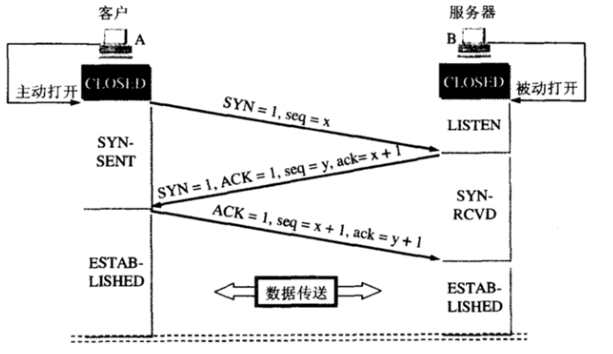
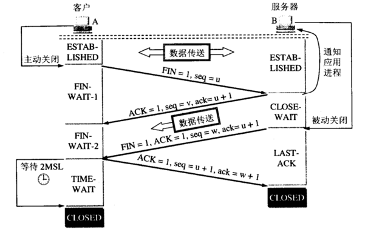
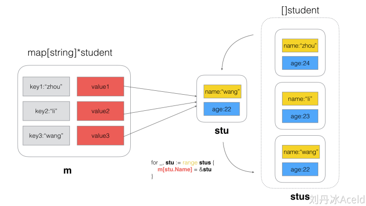

# OSI七层模型

	物理层 (Physical Layer)：负责通过网络通信媒介（如电缆、光纤、无线电波等）传输比特流。这一层的主要设备包括中继器和集线器。

	数据链路层 (Data Link Layer)：在物理层之上，负责将比特数据打包成数据帧，并管理物理寻址方案，如以太网的MAC地址。数据链路层通常分为媒体访问控制子层和逻辑链路控制子层。

	网络层 (Network Layer)：在数据链路层之上，增加了路由的概念。网络层的主要功能是选择合适的路径，进行阻塞控制，并维护逻辑地址与物理地址之间的映射。

	传输层 (Transport Layer)：负责提供端到端的通信服务，屏蔽下层数据通信的细节。传输层的协议包括TCP和UDP。

	会话层 (Session Layer)：管理和维护连接，确保数据的可靠传输。

	表示层 (Presentation Layer)：负责数据的格式化和转换，以适应不同的应用需求。

	应用层 (Application Layer)：直接为用户应用程序提供服务，如文件传输、电子邮件等。
# HTTP和HTTPS
HTTP是一个应用层协议
HTTP 请求

对称加密

	密钥，它可以加密一段信息，也可以对加密后的信息进行解密
	最大的问题就是这个密钥怎么让传输的双方知晓，同时不被别人知道
非对称加密

	一把叫做公钥、一把叫私钥，用公钥加密的内容必须用私钥才能解开，同样，私钥加密的内容只有公钥能解开

HTTP加密方式

对称加密+不对称加密

	某网站拥有用于非对称加密的公钥A、私钥A’。
	浏览器向网站服务器请求，服务器把公钥A明文给传输浏览器。
	浏览器随机生成一个用于对称加密的密钥X，用公钥A加密后传给服务器。
	服务器拿到后用私钥A’解密得到密钥X。
	这样双方就都拥有密钥X了，且别人无法知道它。之后双方所有数据都通过密钥X加密解密即可。
中间人攻击

通过一套“狸猫换太子”的操作，掉包了服务器传来的公钥，进而得到了密钥X
根本原因是浏览器无法确认收到的公钥是不是网站自己的

	某网站有用于非对称加密的公钥A、私钥A’。
	浏览器向网站服务器请求，服务器把公钥A明文给传输浏览器。
	中间人劫持到公钥A，保存下来，把数据包中的公钥A替换成自己伪造的公钥B（它当然也拥有公钥B对应的私钥B’）。
	浏览器生成一个用于对称加密的密钥X，用公钥B（浏览器无法得知公钥被替换了）加密后传给服务器。
	中间人劫持后用私钥B’解密得到密钥X，再用公钥A加密后传给服务器。
	服务器拿到后用私钥A’解密得到密钥X。

CA证书

# CSRF
跨站请求伪造（Cross-site request forgery）
检查Referer字段
	HTTP头中有一个Referer字段，这个字段用以标明请求来源于哪个地址。在处理敏感数据请求时，通常来说，Referer字段应和请求的地址位于同一域名下

添加校验token
	服务端在收到路由请求时，生成一个随机数，在渲染请求页面时把随机数埋入页面（一般埋入 form 表单内，<input type="hidden" name="_csrf_token" value="xxxx">）
	服务端设置setCookie，把该随机数作为cookie或者session种入用户浏览器
	当用户发送 GET 或者 POST 请求时带上_csrf_token参数（对于 Form 表单直接提交即可，因为会自动把当前表单内所有的 input 提交给后台，包括_csrf_token）
	后台在接受到请求后解析请求的cookie获取_csrf_token的值，然后和用户请求提交的_csrf_token做个比较，如果相等表示请求是合法的。
# XSS
跨站脚本攻击（XSS）
用户的输入没有校验,包含原生的JS代码

# CORS
跨域资源共享 (跨域资源共享)
是一种基于 HTTP 头的机制，该机制通过允许服务器标示除了它自己以外的其他源（域、协议或端口），使得浏览器允许这些源访问加载自己的资源
出于安全性，浏览器限制脚本内发起的跨源 HTTP 请求
# RESTFUL
RESOURCE REPRESENTATIONAL STATE TRANSFER
资源表现层状态转移
一种规范


每个资源对应一个URI(UNIFORM RESOURCE IDENTIFIER)
表现层 即资源的外在表现形式,如txt,xml,json,通过请求头中的Accept 和Content-Type字段指定类型
状态转移
是用 HTTP协议中的四个动词GET,POST(新建/更新),PUT(更新),DELETE(删除)

HEAD方法跟GET方法相同，只不过服务器响应时不会返回消息体。一个HEAD请求的响应中，HTTP头中包含的元信息应该和一个GET请求的响应消息相同。这种方法可以用来获取请求中隐含的元信息，而不用传输实体本身。也经常用来测试超链接的有效性、可用性和最近的修改
# 粘包问题

# 三次握手四次挥手

三次握手建立tcp连接：

    1.客户端发送syn报文给服务端 syn seq=x

    2.服务端收到客户端端syn报文，返回syn+ack应答报文，告诉客户端可以建立连接了 syn seq=y ack=x+1

    3.客户端收到服务端的应答报文后，发送一个ack报文，告诉服务端我收到服务端的响应报文了，并且进入established状态 ack=y+1
   


      三次握手的最后一次连接保证服务端确认客户端已经准备好,避免长时间等待


四次挥手释放连接：

　　1.客户端发送fin报文给服务端，客户端不会再发送数据请求给服务端了，从established状态进入fin-wait-1状态

   2.服务端收到fin请求后，返回ack应答报文

   3.服务端数据处理完后，发送fin报文给客户端，不再发送数据请求给客户端了，可以断开连接了

   4.客户端发送ack报文给服务端。



服务端在第二次到第三次的挥手过程用于服务端的收尾处理
第二次是ACK
第三次是FIN

# KEEP-ALIVE
客户端断开后服务端是感知不到的,为了避免长时间的死连接问题,引入了KEEP-ALIVE机制,默认的执行时间为7200S,但是不常用,一般都是应用层的心跳检测


# 常见的负载均衡的算法

轮询 Round Robin
随机 Random
最少连接 Least Connections 使用redis,创建一个IP KEY,每次来一个请求就加一,释放一个请求就减一
加权轮询 Weighted Round Robin 随机数的区间大小代表了权重(0-6,7-10代表了两个不同的权重)
IP散列 对IP地址进行HASH计算,原地址不变,访问的节点不变

# 限流

# MYSQL
## JOIN 优化
驱动表:第一个被处理的表
使用驱动表区关联其他表,优先选择结果集小的作为驱动表
JOIN 的字段在被驱动的表中建立了索引,可以提高效率
增大JOIN BUFFER SIZE
减少不必要的字段查询(字段越少,join buffer利用率越高)
## SQL执行语句

语句->解析器->解析树->预处理器(语法检查,存在性)->新解析树->查询优化器->最优执行计划->引擎->数据

## 主从复制
读写分离
主要依赖于BINLOG,记录了DML语句
## REDO LOG 和BIN LOG
REDO  LOG 为物理日志,循环写
BIN LOG 为逻辑日志 SQL 追加写
二次确认提交


# defer

defer对未命名返回值的修改不会影响return之后
```Go
package main

import "fmt"

func demo() int {
	a := 1
	defer func() {
		a += 1
	}()
	return a
}
func main() {
	fmt.Println(demo())
}

func test() error {
   var err error
   defer func() {
      if r := recover(); r != nil {
         err = errors.New(fmt.Sprintf("%s", r))
      }
   }()
   raisePanic()
   return err
}

func raisePanic() {
   panic("发生了错误")
}
```
# channel编程
3个函数分别打印cat、dog、fish，要求每个函数都要起一个goroutine，按照cat、dog、fish顺序打印在屏幕上100次
```Go
package main

import (
	"fmt"
	"sync"
)

func dog(wg *sync.WaitGroup, waitChan chan int, notifyChan chan int) {
	defer wg.Done()
	for i := 0; i < 100; i++ {
		<-waitChan //
		fmt.Println("dog")[text](面试的问题.md)
		notifyChan <- 1
	}
	return
}

func cat(wg *sync.WaitGroup, waitChan chan int, notifyChan chan int) {
	defer wg.Done()
	for i := 0; i < 100; i++ {
		<-waitChan //
		fmt.Println("cat")
		notifyChan <- 1
	}
	return
}

func man(wg *sync.WaitGroup, waitChan chan int, notifyChan chan int) {
	defer wg.Done()
	for i := 0; i < 100; i++ {
		<-waitChan //
		fmt.Println("man")
		notifyChan <- 1
	}
	return
}

func main() {
	var wg *sync.WaitGroup = &sync.WaitGroup{}
	ch1 := make(chan int, 1)
	ch2 := make(chan int, 1)
	ch3 := make(chan int, 1)

	wg.Add(1)
	go dog(wg, ch1, ch2)
	wg.Add(1)
	go cat(wg, ch2, ch3)
	wg.Add(1)
	go man(wg, ch3, ch1)
	ch1 <- 1

	wg.Wait()
}

```
# MAP
https://studygolang.com/articles/31024?fr=sidebar
golang 结构体作为map的元素时，不能够直接赋值给结构体的某个字段
```Go
package main

import "fmt"

type Student struct {
	Name string
}

var list map[string]Student

func main() {

	list = make(map[string]Student)

	student := Student{"Aceld"}

	list["student"] = student
	list["student"].Name = "LDB" //报错

	fmt.Println(list["student"])
}
```
# FOR RANGE
对于FOR RANGE 的VALUE来说,会开辟一个内存空间用来依次存放遍历的值,这个时候的取地址是取的开辟的临时变量的值而非原本的
```Go
package main

import (
    "fmt"
)

type student struct {
    Name string
    Age  int
}

func main() {
    //定义map
    m := make(map[string]*student)

    //定义student数组
    stus := []student{
        {Name: "zhou", Age: 24},
        {Name: "li", Age: 23},
        {Name: "wang", Age: 22},
    }

    //将数组依次添加到map中
    for _, stu := range stus {
        m[stu.Name] = &stu
    }

    //打印map
    for k,v := range m {
        fmt.Println(k ,"=>", v.Name)
    }
}
```



range value 的遍历是将对象的遍历元素拷贝一份,而对象本身不会拷贝
对于SLICE来说,拷贝的是SLICE HEADER结构体,通过索引修改会影响原变量

对于数组来说,拷贝的是数组底层,key,value访问的拷贝的数组而不是元素组

```GO


func main() {
   a := [3]int{1, 2, 3}  // 数组 (深拷贝)
   for k, v := range a { //k,v实际上是遍历的一个拷贝的数组,因此k,v不会发生变化
      if k == 0 {
         a[0], a[1] = 100, 200
         fmt.Print(&a)
      }
      a[k] = 100 + v
   }
   fmt.Print(&a)
}
func main() {
   a := []int{1, 2, 3}  // 切片 (浅拷贝)
   for k, v := range a {//k,v实际上是遍历的是底层的数组
      if k == 0 {
         a[0], a[1] = 100, 200
         fmt.Print(a)
      }
      a[k] = 100 + v
   }
   fmt.Print(a)
}
```

```GO
func main() {// map (浅拷贝)
	a := map[int]string{1: "v1", 2: "v2"}
	for key, value := range a {
		a[key+3] = value
	}
	fmt.Println(a)
}
```
遍历结果是随机的,会影响长度
# defer的顺序性
```Go
func demo6() {
	for i := 0; i < 4; i++ {
		defer fmt.Println(i)
	}
}
```
结果是:
```Bash
3
2
1
0
```
# 实现SET
```Go
package main

import (
	"errors"
	"fmt"
	"sync"
)

type Set struct {
	rwx  sync.RWMutex //
	data map[string]int
}

func (s *Set) Set(key string, value int) {
	s.rwx.Lock()
	defer s.rwx.Unlock()
	s.data[key] = value
}
func (s *Set) Get(key string) (int, error) {
	s.rwx.RLock()
	defer s.rwx.RUnlock()
	data, ok := s.data[key]
	if ok {
		return data, nil
	} else {
		return -1, errors.New("Not Found")
	}
}
func InitSet() *Set {
	return &Set{
		rwx:  sync.RWMutex{},
		data: make(map[string]int),
	}
}
func main() {
	a := InitSet()
	fmt.Println(a.Get("123"))
	a.Set("a", 1)
	fmt.Println(a.Get("a"))
}
```

```GO
//golang 实现循环队列
//golang 实现LRU算法

package main

import (
	"errors"
	"fmt"
)

type LoopQueue struct {
	lenght int
	data   []interface{}
	flag   int
	head   int
	rear   int
}

func Init(length int) *LoopQueue {
	return &LoopQueue{
		lenght: length + 1,
		data:   make([]interface{}, length+1),
		flag:   0,
		head:   0,
		rear:   0,
	}
}

func (l *LoopQueue) Push(data interface{}) error {
	if l.Full() {
		return errors.New("full")
	} else {
		l.rear = (l.rear + 1) % l.lenght
		l.data[l.rear] = data
		return nil
	}
}

func (l *LoopQueue) Pop() (interface{}, error) {
	if l.Empty() {
		return nil, errors.New("empty")
	} else {
		l.head = (l.head + 1) % l.lenght
		data := l.data[l.head]
		return data, nil
	}
}
func (l *LoopQueue) Full() bool {
	if (l.rear+1)%l.lenght == l.head {
		return true
	} else {
		return false
	}
}
func (l *LoopQueue) Empty() bool {
	if l.rear == l.head {
		return true
	} else {
		return false
	}
}
func main() {
	a := Init(3)
	fmt.Println(a.Push(1))
	fmt.Println(a.Push(2))
	fmt.Println(a.Push(3))
	fmt.Println(a.Push(4))
	fmt.Println(a.Pop())
	fmt.Println(a.Pop())
	fmt.Println(a.Pop())
	fmt.Println(a.Pop())
}

```